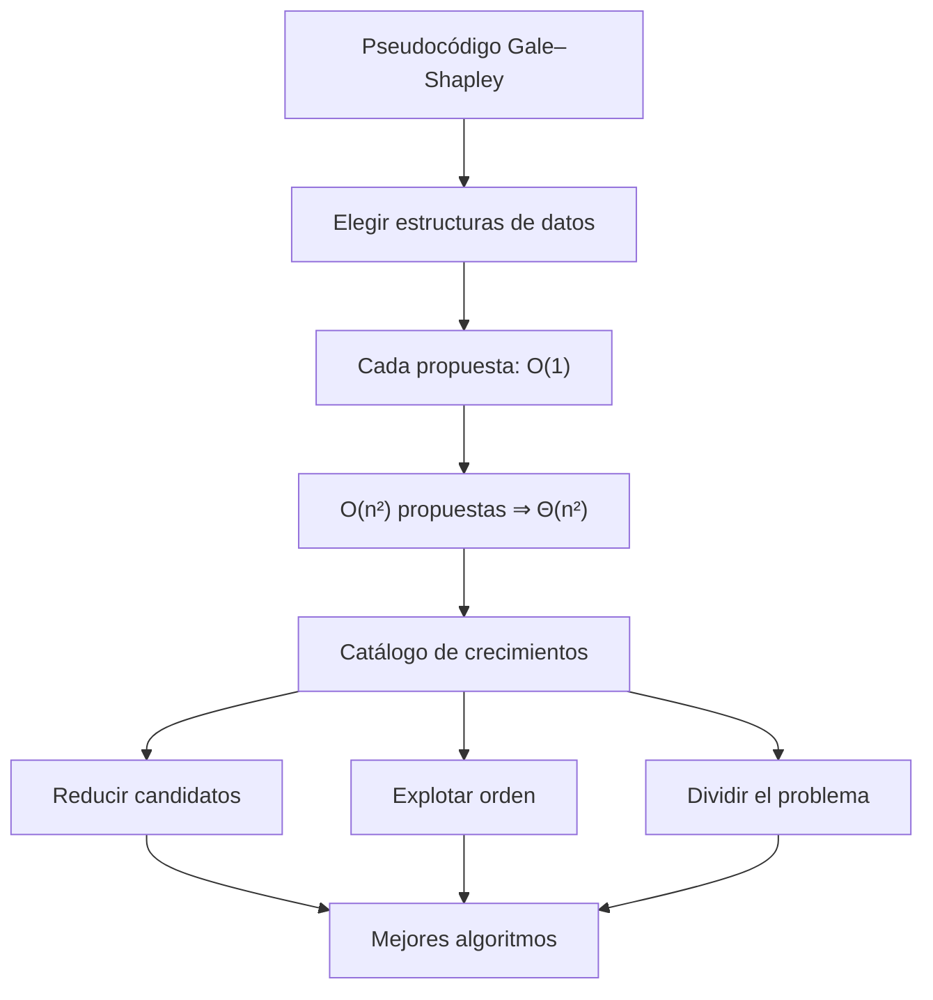
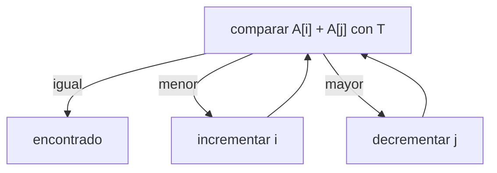
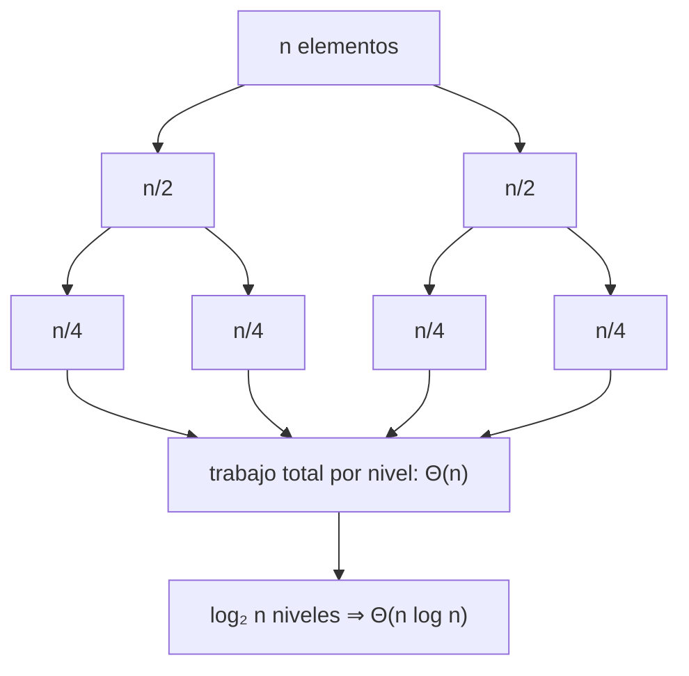
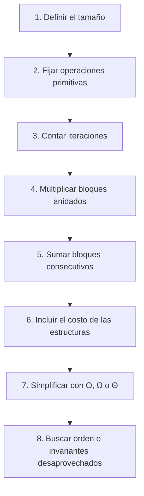

![[02AlgorithmAnalysis.pdf#page=25]]

← [[2026-08-25 ADA - notacion_asintotica|Martes 25 — Análisis y notación asintótica]]

## Pregunta central

¿Cómo convierte una buena representación de datos el pseudocódigo de Gale–Shapley en un algoritmo $\Theta(n^2)$ y qué patrones producen los tiempos $O(1)$, $O(\log n)$, $O(n)$, $O(n\log n)$, $O(n^2)$ y exponencial?

> [!summary] Respuesta corta
> El número de iteraciones no basta: hay que controlar el costo de cada operación. En Gale–Shapley, arreglos de parejas, una cola de hospitales libres, apuntadores `next` y tablas inversas `rank` hacen que cada propuesta cueste $O(1)$. Como hay $O(n^2)$ propuestas y el preprocesamiento cuesta $\Theta(n^2)$, el total es $\Theta(n^2)$. Los demás ejemplos muestran que explotar orden, invariantes y descomposición reduce drásticamente el espacio de búsqueda.

## Mapa de la clase



---

## 1. Implementación eficiente de Gale–Shapley

La versión conceptual es:

```text
GALE–SHAPLEY(preferencias de n hospitales y n estudiantes)
    M ← ∅
    mientras exista un hospital h libre:
        s ← estudiante favorita de h a quien aún no propone

        si s está libre:
            agregar (h, s) a M
        si no, si s prefiere h sobre su pareja h':
            reemplazar (h', s) por (h, s)
        en otro caso:
            s rechaza a h

    devolver M
```

De la clase anterior sabemos que ninguna pareja hospital–estudiante recibe dos propuestas. Por eso hay a lo sumo $n^2$. Pero esto solo prueba un total $O(n^2)$ si **encontrar y procesar cada propuesta cuesta $O(1)$**.

### Paso 1: representar el emparejamiento

Se indexan hospitales y estudiantes de $1$ a $n$ y se guardan las parejas en dos arreglos:

- `student[h] = s`: estudiante emparejada con $h$;
- `hospital[s] = h`: hospital emparejado con $s$;
- el valor `0` significa “libre”.

Así, consultar, agregar, quitar o reemplazar una pareja modifica un número constante de celdas:

$$
\text{costo de actualizar }M=O(1).
$$

### Paso 2: encontrar un hospital libre

Mantener los hospitales libres en una **cola** o **pila** evita recorrer el arreglo completo en cada iteración.

$$
\text{extraer o reinsertar un hospital libre}=O(1).
$$

### Paso 3: encontrar la siguiente propuesta

Para cada hospital $h$ se guarda:

- `prefH[h]`: su lista ordenada de estudiantes;
- `next[h]`: índice de la siguiente estudiante a quien no ha propuesto.

La siguiente candidata es

```text
s ← prefH[h][next[h]]
next[h] ← next[h] + 1
```

El apuntador solo avanza; nunca vuelve a examinar una propuesta anterior.

$$
\text{obtener la siguiente candidata}=O(1).
$$

### Paso 4: comparar preferencias con una tabla inversa

Supongamos que una estudiante guarda esta lista:

| Posición $i$ | 1 | 2 | 3 | 4 | 5 | 6 | 7 | 8 |
|---:|---:|---:|---:|---:|---:|---:|---:|---:|
| `pref[i]` | 8 | 3 | 7 | 1 | 4 | 5 | 6 | 2 |

Buscar linealmente la posición de un hospital costaría $O(n)$ por comparación. Se construye una lista inversa:

```text
para i ← 1 hasta n:
    rank[pref[i]] ← i
```

El resultado es:

| Hospital $h$ | 1 | 2 | 3 | 4 | 5 | 6 | 7 | 8 |
|---:|---:|---:|---:|---:|---:|---:|---:|---:|
| `rank[h]` | 4 | 8 | 2 | 5 | 6 | 7 | 3 | 1 |

Ahora una comparación se vuelve una desigualdad entre dos accesos directos:

$$
s\text{ prefiere }h\text{ sobre }h'
\iff
\operatorname{rankS}[s][h]<\operatorname{rankS}[s][h'].
$$

Por ejemplo, `rank[4] = 5 < rank[6] = 7`, así que la estudiante prefiere el hospital 4 sobre el 6.

### La cuenta completa, paso a paso

<iframe src="gale-shapley-coste-paso-a-paso.htm" style="width:100%;height:600px;border:1px solid var(--lightgray);border-radius:4px;" loading="lazy"></iframe>

| Necesidad | Representación | Costo |
|---|---|---:|
| Encontrar hospital libre | Cola o pila | $O(1)$ |
| Consultar pareja de $h$ | `student[h]` | $O(1)$ |
| Consultar pareja de $s$ | `hospital[s]` | $O(1)$ |
| Obtener siguiente propuesta | `prefH[h]` + `next[h]` | $O(1)$ |
| Comparar dos hospitales para $s$ | `rankS[s][h]` | $O(1)$ |
| Cambiar una pareja | Actualizar ambos arreglos | $O(1)$ |

### Análisis total

1. Construir $n$ tablas `rank` de longitud $n$ cuesta $\Theta(n^2)$.
2. Hay a lo sumo $n^2$ propuestas.
3. Procesar una propuesta cuesta $O(1)$.

Por tanto,

$$
T(n)=\Theta(n^2)+O(n^2)\cdot O(1)=O(n^2).
$$

La presentación también afirma una cota inferior: en el peor caso, cualquier algoritmo que encuentre un emparejamiento estable debe consultar $\Omega(n^2)$ posiciones de las preferencias. Junto con la implementación:

$$
\boxed{T(n)=\Theta(n^2)}.
$$

> [!important] Idea transferible
> Una tabla de preprocesamiento puede pagar $\Theta(n^2)$ una sola vez para convertir hasta $n^2$ consultas de costo $O(n)$ en consultas de costo $O(1)$. Sin `rank`, el análisis ingenuo podría subir hasta $O(n^3)$.

---

## 2. Familias comunes de tiempos de ejecución

Mueve $n$ para observar por qué las familias polinomiales y las exponenciales terminan separándose enormemente. Selecciona una fila para ver el patrón algorítmico que produce ese crecimiento.

<iframe src="familias-complejidad-interactivas.htm" style="width:100%;height:600px;border:1px solid var(--lightgray);border-radius:4px;" loading="lazy"></iframe>

| Orden | Ejemplo de las diapositivas | Patrón principal |
|---:|---|---|
| $O(1)$ | Acceder a `A[i]` | Una cantidad fija de operaciones |
| $O(\log n)$ | Búsqueda binaria | Eliminar una fracción constante |
| $O(n)$ | Mezcla; TARGET-SUM | Recorrer cada elemento pocas veces |
| $O(n\log n)$ | Mergesort; mayor intervalo vacío | $\log n$ niveles con trabajo lineal |
| $O(n^2)$ | Enumerar pares; 3-SUM mejorado | Dos decisiones de tamaño $n$ |
| $O(n^3)$ | 3-SUM directo | Enumerar ternas |
| $O(n^k)$ | Conjunto independiente de tamaño fijo $k$ | Enumerar subconjuntos de tamaño constante |
| Exponencial | Conjunto independiente máximo; TSP exhaustivo | Enumerar subconjuntos o permutaciones |

### $O(1)$: tiempo constante

El número de operaciones está acotado por una constante que no depende de $n$. En word RAM, ejemplos habituales son:

- una rama condicional;
- una operación aritmética/lógica sobre una palabra;
- declarar o inicializar una variable;
- seguir un enlace;
- acceder a `A[i]`;
- comparar o intercambiar dos posiciones.

> [!note] Constante no significa instantáneo
> Una operación puede tardar 1 o 10 000 unidades y seguir siendo $O(1)$ si esa cantidad no crece con $n$.

---

## 3. Tiempo lineal: $O(n)$

### Mezclar dos listas ordenadas

Sean $A=a_1,\ldots,a_n$ y $B=b_1,\ldots,b_n$ dos listas ordenadas. Se comparan sus primeros elementos pendientes y se extrae el menor.

```text
i ← 1; j ← 1
mientras ambas listas tengan elementos:
    si A[i] ≤ B[j]: anexar A[i]; i ← i + 1
    en otro caso: anexar B[j]; j ← j + 1
anexar el resto de la lista no vacía
```

Cada iteración consume definitivamente un elemento. Con $2n$ elementos, se hacen a lo sumo $2n-1$ comparaciones:

$$
T(n)=O(n).
$$

### TARGET-SUM con dos apuntadores

Dado un arreglo ordenado de enteros distintos y un objetivo $T$, queremos dos valores cuya suma sea $T$.

```text
i ← 1
j ← n
mientras i < j:
    s ← A[i] + A[j]
    si s = T: devolver (A[i], A[j])
    si s < T: i ← i + 1
    si s > T: j ← j - 1
devolver "no existe"
```



**Invariante:** si existe una solución, ninguna usa una posición que ya quedó a la izquierda de $i$ o a la derecha de $j$.

Por qué es seguro mover un apuntador:

- Si $A[i]+A[j]<T$, emparejar $A[i]$ con cualquier elemento entre $i$ y $j$ solo produce una suma menor o igual; $A[i]$ se descarta.
- Si $A[i]+A[j]>T$, emparejar $A[j]$ con cualquier elemento entre $i$ y $j$ solo produce una suma mayor o igual; $A[j]$ se descarta.

Cada paso reduce el intervalo en una posición, así que hay $O(n)$ pasos. Probar todos los pares habría costado $O(n^2)$.

---

## 4. Tiempo logarítmico: $O(\log n)$

### Búsqueda binaria

```text
lo ← 1; hi ← n
mientras lo ≤ hi:
    mid ← ⌊(lo + hi) / 2⌋
    si x < A[mid]: hi ← mid - 1
    si x > A[mid]: lo ← mid + 1
    en otro caso: devolver mid
devolver -1
```

**Invariante:** si $x$ está en el arreglo, entonces está dentro de $A[lo..hi]$.

Después de $k$ iteraciones quedan a lo sumo

$$
\frac{n}{2^k}
$$

candidatos. Para llegar a uno:

$$
\frac{n}{2^k}\leq1
\iff
k\geq\log_2n.
$$

Por tanto, $T(n)=O(\log n)$.

### Arreglo ordenado y rotado

Ejemplo:

```text
[80, 85, 90, 95, 20, 30, 35, 50, 60, 65, 67, 75]
```

La diapositiva propone:

1. Encontrar en $O(\log n)$ el índice $k$ del elemento más pequeño.
2. Aplicar búsqueda binaria en $A[1..k-1]$ o $A[k..n]$.

Para localizar el mínimo se mantiene el invariante $A[lo]>A[hi]$ mientras el intervalo contiene la ruptura. Comparar `A[mid]` con `A[hi]` determina qué mitad la contiene.

La suma sigue siendo logarítmica:

$$
O(\log n)+O(\log n)=O(\log n).
$$

---

## 5. Tiempo lineal-logarítmico: $O(n\log n)$

### Mergesort

Mergesort divide el arreglo por la mitad hasta llegar a subarreglos unitarios y luego mezcla resultados ordenados.



La profundidad es $\log_2 n$ porque el tamaño se divide entre dos en cada nivel; la mezcla procesa $\Theta(n)$ elementos por nivel.

### Mayor intervalo vacío

Dadas marcas de tiempo $x_1,\ldots,x_n$, se busca el intervalo más largo sin llegadas.

1. Ordenar las marcas: $O(n\log n)$.
2. Recorrer diferencias consecutivas: $O(n)$.
3. Conservar la máxima diferencia: $O(1)$ por elemento.

Por la regla de sumas,

$$
O(n\log n)+O(n)=O(n\log n).
$$

---

## 6. Tiempo cuadrático y cúbico

### Par de puntos más cercano

Enumerar todos los pares $(i,j)$ con $i<j$ examina

$$
\binom n2=\frac{n(n-1)}2\in\Theta(n^2)
$$

candidatos. La diapositiva advierte que esta aparente necesidad es una ilusión: existe un algoritmo $O(n\log n)$ mediante divide y vencerás. Una estrategia obvia no demuestra una cota inferior del problema.

### 3-SUM directo: $O(n^3)$

```text
para i ← 1 hasta n:
    para j ← i + 1 hasta n:
        para k ← j + 1 hasta n:
            si A[i] + A[j] + A[k] = 0:
                devolver la terna
```

Se enumeran $\binom n3\in\Theta(n^3)$ ternas.

### 3-SUM mejorado: $O(n^2)$

1. Ordenar $A$ en $O(n\log n)$.
2. Para cada $A[i]$, resolver TARGET-SUM con objetivo $-A[i]$ sin reutilizar $A[i]$.
3. Cada ejecución de dos apuntadores cuesta $O(n)$ y se repite $n$ veces.

$$
T(n)=O(n\log n)+n\cdot O(n)=O(n^2).
$$

> [!tip] Patrón de mejora
> Cambiar “tres elecciones independientes” por “una elección + un subproblema lineal” elimina un factor $n$.

La diapositiva menciona una mejora teórica subcuadrática por factores logarítmicos y la conjetura de que no existe un algoritmo $O(n^{2-\varepsilon})$ para ninguna constante $\varepsilon>0$.

---

## 7. Polinomial frente a exponencial

### Conjunto independiente de tamaño fijo

Si $k$ es una **constante**, se pueden enumerar todos los subconjuntos de $k$ vértices y verificar cada uno:

$$
\binom nk\cdot O(k^2)=O(n^k).
$$

Para $k=17$ esto es polinomial, aunque probablemente no sea práctico.

### Conjunto independiente máximo

Si el tamaño ya no está fijado, hay que considerar todos los subconjuntos del conjunto de $n$ vértices:

$$
\sum_{k=0}^{n}\binom nk=2^n.
$$

Verificar cada subconjunto de manera directa lleva al algoritmo $O(n^2 2^n)$ de la diapositiva.

### TSP euclidiano por fuerza bruta

Enumerar los $n!$ órdenes de visita y calcular la longitud de cada recorrido cuesta

$$
O(n\cdot n!).
$$

Como

$$
n!=2^{\Theta(n\log n)},
$$

el crecimiento queda muy lejos del tiempo polinomial.

### Convención de las diapositivas

Las diapositivas usan **tiempo exponencial** en el sentido amplio

$$
O\!\left(2^{n^k}\right)
\quad\text{para alguna constante }k>0.
$$

Con esta convención, $2^n$, $3^n$ y $n!$ quedan incluidos, pero ninguna de estas opciones es equivalente por sí sola:

- $O(2^n)$ excluye, por ejemplo, $3^n$;
- $O(2^{cn})$ para alguna constante $c>0$ incluye $3^n$, pero excluye $n!=2^{\Theta(n\log n)}$.

Por eso la respuesta del **quiz 4 es D: ninguna**.

---

## Método práctico para analizar pseudocódigo



Atajos que deben justificarse:

- ciclo que avanza de uno en uno hasta $n$: $O(n)$;
- ciclo que duplica o divide el índice: $O(\log n)$;
- dos ciclos independientes de longitud $n$: usualmente $O(n^2)$;
- enumerar subconjuntos: $2^n$;
- enumerar permutaciones: $n!$;
- ordenar y luego recorrer: $O(n\log n)+O(n)=O(n\log n)$.

No todos los ciclos anidados son automáticamente cuadráticos. Por ejemplo,

```text
para i ← 1 hasta n:
    j ← 1
    mientras j ≤ n:
        j ← 2j
```

realiza $n$ veces un ciclo de $\Theta(\log n)$, por lo que cuesta $\Theta(n\log n)$.

## Errores frecuentes

- Concluir $O(n^2)$ para Gale–Shapley solo porque hay $n^2$ propuestas, sin analizar el costo de encontrarlas y procesarlas.
- Recorrer la lista de preferencias para cada comparación en vez de construir `rank`.
- Suponer que dos ciclos visualmente anidados siempre producen $n^2$ iteraciones.
- Olvidar el costo de ordenar antes de aplicar dos apuntadores.
- Confundir una cota de un algoritmo ingenuo con una cota inferior del problema.
- Creer que $O(n^k)$ es polinomial cuando $k$ crece como parte de la entrada; la definición exige $k$ constante.
- Llamar a $n!$ simplemente $O(2^n)$; crece más rápido.

## Autoevaluación

- [ ] Puedo explicar el propósito de `student`, `hospital`, `next` y `rank`.
- [ ] Puedo derivar $\Theta(n^2)$ para Gale–Shapley, incluyendo el preprocesamiento.
- [ ] Puedo demostrar el invariante de TARGET-SUM y su costo lineal.
- [ ] Puedo explicar por qué búsqueda binaria tarda $O(\log n)$.
- [ ] Puedo derivar $O(n\log n)$ para mergesort por niveles.
- [ ] Puedo transformar 3-SUM de $O(n^3)$ a $O(n^2)$.
- [ ] Puedo distinguir enumerar subconjuntos de tamaño fijo, todos los subconjuntos y todas las permutaciones.

## Resumen después de clase

La eficiencia de una implementación depende tanto del algoritmo como de la representación. Gale–Shapley alcanza $\Theta(n^2)$ porque preprocesa las preferencias y convierte cada propuesta en una secuencia de accesos directos. El catálogo de tiempos muestra patrones reutilizables: dos apuntadores explotan orden para lograr tiempo lineal; la búsqueda binaria reduce candidatos a la mitad; mergesort combina $\log n$ niveles con trabajo lineal; y la fuerza bruta sobre pares, ternas, subconjuntos o permutaciones produce crecimiento cuadrático, cúbico o exponencial. El principio general es buscar estructura antes de enumerar posibilidades.

## Referencias

- Kevin Wayne, *Algorithm Analysis*, diapositivas 25–49, actualización del 16 de diciembre de 2021.
- Jon Kleinberg y Éva Tardos, *Algorithm Design*, capítulo 2.
- Conexión previa: [[2026-08-20 ADA - GaleShapley-continuacion|Gale–Shapley: corrección y optimalidad]].
