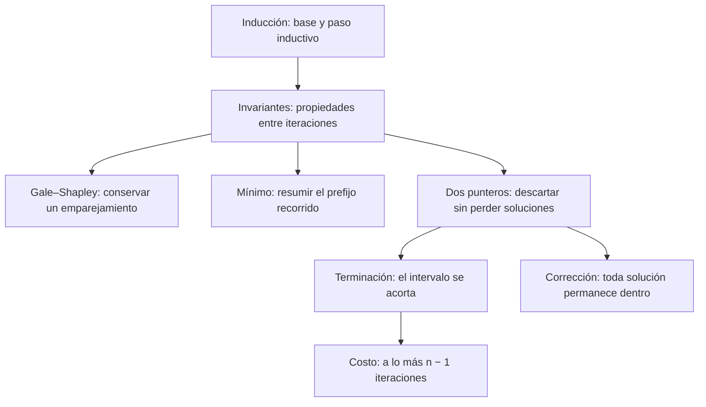
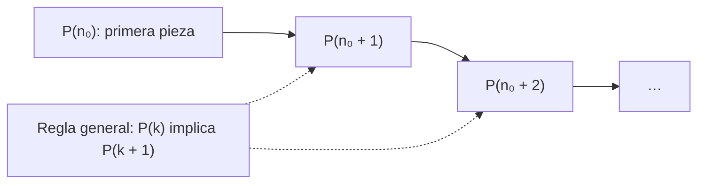
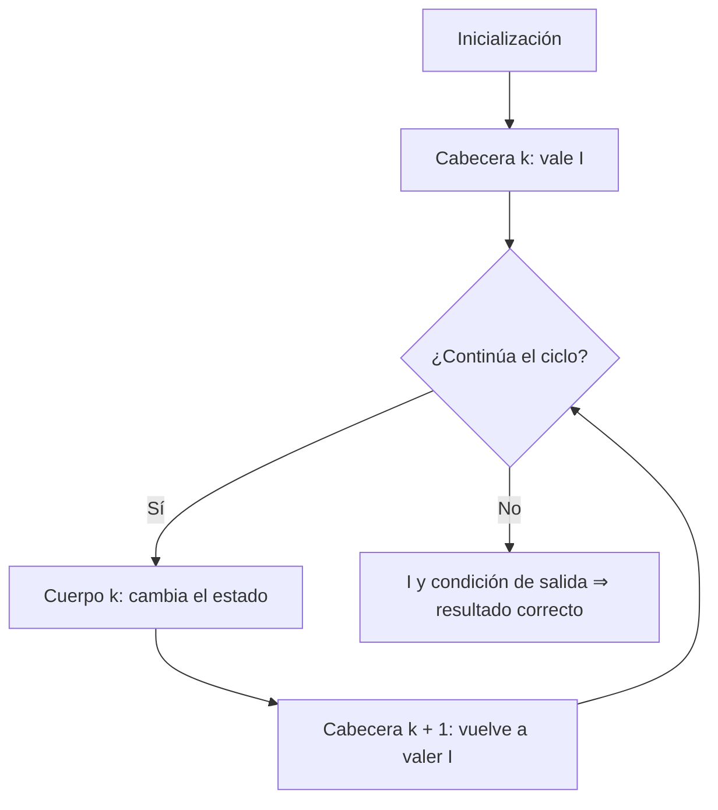
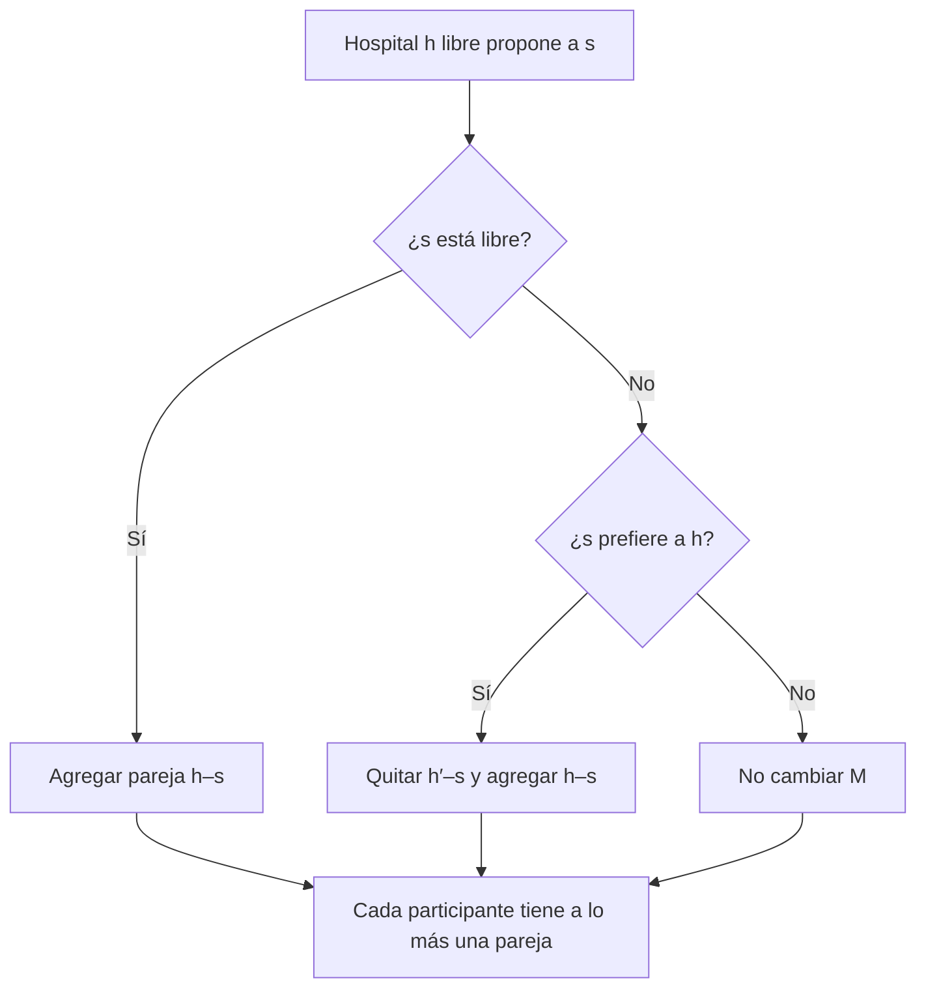
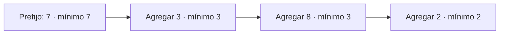
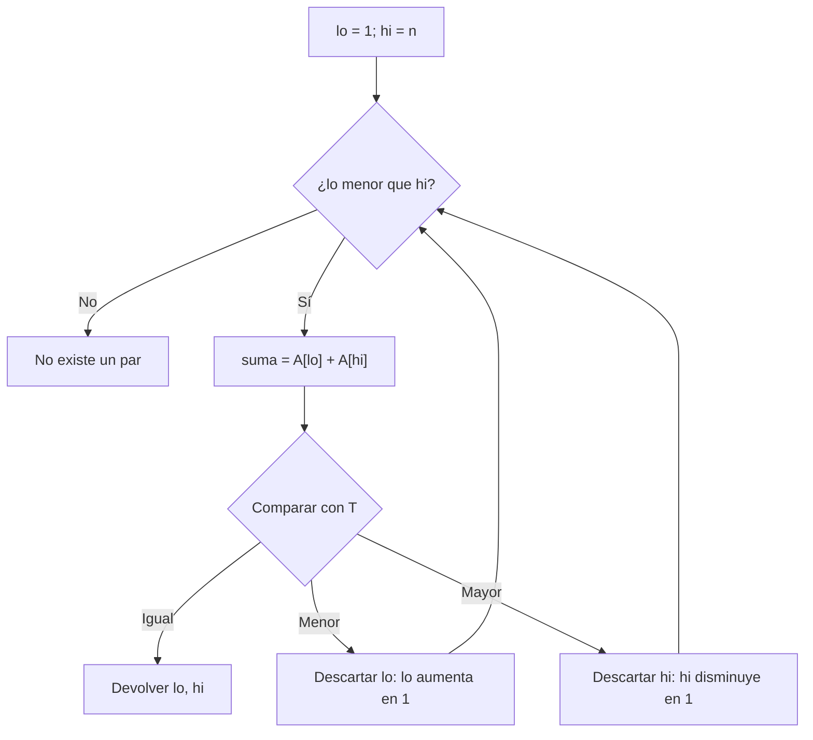

## Pregunta central

¿Cómo demostramos que un algoritmo funciona para **todas** sus entradas válidas y que siempre termina?

> [!summary] Idea central
> La inducción permite pasar de un caso inicial a todos los siguientes. En un ciclo, demostramos que una propiedad útil —la **invariante**— se cumple antes de empezar y se conserva después de cada iteración. Al combinarla con la condición de salida obtenemos la corrección; para garantizar terminación, identificamos además una cantidad que disminuye y no puede disminuir indefinidamente.

← [[2026-08-27 ADA - implementacion-y-tiempos-de-ejecucion|Clase anterior: implementación y tiempos]] · [[2026-09-03 ADA - grafos|Clase siguiente: grafos]] →


![[induccion-algoritmos.pdf]]


**Fuente:** [[induccion-algoritmos.pdf|Diapositivas completas (33 páginas)]]. La nota integra las revelaciones sucesivas de las diapositivas en explicaciones continuas. Los ejemplos adicionales, ejercicios y aclaraciones se añaden como apoyo de estudio.

## Mapa de la clase



## 1. Inducción matemática

*Diapositivas 2–7.*

### 1.1. La idea del dominó

Sea $P(n)$ una afirmación sobre un entero $n$. Para demostrarla para todo $n\ge n_0$:

1. **Caso base:** demostrar $P(n_0)$ directamente.
2. **Hipótesis inductiva:** tomar un $k\ge n_0$ arbitrario y suponer $P(k)$.
3. **Paso inductivo:** usando esa hipótesis, demostrar $P(k+1)$.
4. **Conclusión:** por inducción, $P(n)$ vale para todo entero $n\ge n_0$.



La base tira la primera pieza; el paso demuestra que **cualquier** pieza tira la siguiente. Probar solamente varios casos no garantiza que la cadena continúe.

> [!tip] 💎 Gema: suponer no es concluir
> Suponemos $P(k)$ para demostrar la implicación $P(k)\Rightarrow P(k+1)$. No podemos suponer $P(k+1)$: eso sería usar como premisa lo que queremos probar.

El inicio puede ser $0$, $1$ u otro entero adecuado. También podemos probar solamente un rango finito $n_0\le n\le N$; en ese caso basta el paso para $n_0\le k<N$.

### 1.2. Ejemplo: suma de los primeros enteros

Queremos demostrar, para todo $n\ge0$:

$$P(n):\quad f(n)=\sum_{i=0}^{n}i=\frac{n(n+1)}2.$$

**Base $n=0$.** La suma es $0$ y la fórmula da $0(1)/2=0$.

**Hipótesis.** Suponemos $\sum_{i=0}^{k}i=k(k+1)/2$.

**Paso.** La suma nueva contiene la anterior y un término extra:

$$
\begin{aligned}
f(k+1)&=\sum_{i=0}^{k+1}i\\
&=\left(\sum_{i=0}^{k}i\right)+(k+1) &&\text{separar el último término}\\
&=\frac{k(k+1)}2+(k+1) &&\text{usar la hipótesis}\\
&=\frac{k(k+1)+2(k+1)}2\\
&=\frac{(k+1)(k+2)}2. &&\text{factorizar}
\end{aligned}
$$

Esta es exactamente la fórmula de $P(k+1)$. Por inducción, se cumple para todo $n\ge0$.

**Ejemplo numérico:** si sabemos que $0+1+2+3+4=10$, agregar $5$ produce $15=5(6)/2$. Este ejemplo ilustra el paso general, pero no lo sustituye.

### 1.3. Ejemplo: $2^n>n$

**Base $n=1$:** $2>1$.

**Hipótesis:** $2^k>k$, para un $k\ge1$ arbitrario.

**Paso:**

$$2^{k+1}=2\cdot2^k>2k\ge k+1.$$

La primera desigualdad usa la hipótesis y el hecho de multiplicar por un número positivo. La segunda equivale a $k\ge1$. Por tanto, $2^{k+1}>k+1$.

Si usamos $\mathbb N=\{0,1,2,\ldots\}$, verificamos además $2^0=1>0$ por separado.

> [!warning] Precisión de las diapositivas 5–6
> De $2^{k+1}>2^k$ no se obtiene directamente $2^{k+1}>k+1$. El puente necesario es $2^{k+1}>2k\ge k+1$, que aparece anotado en la diapositiva 6.

## 2. Invariantes: inducción sobre la ejecución

*Diapositiva 8 y estructura utilizada en los ejemplos siguientes.*

Una **invariante** es una afirmación lógico-matemática que se cumple en un **punto específico** de la ejecución. En esta clase, ese punto será la cabecera del ciclo, **antes de evaluar su condición**, incluyendo la evaluación final que resulta falsa.

No exige que los valores permanezcan constantes. Por ejemplo, `menor` puede cambiar varias veces mientras sigue siendo el mínimo de la parte ya recorrida.

| Inducción matemática | Prueba de un ciclo |
|---|---|
| Variable $n$ | Número $x$ de visitas a la cabecera |
| Caso base | La inicialización establece la propiedad |
| Hipótesis $P(k)$ | La propiedad vale antes del cuerpo $k$ |
| Paso a $P(k+1)$ | Ejecutar el cuerpo $k$ conserva la propiedad |
| Aplicación final | Invariante y condición de salida implican el resultado |



**Detalle de índices:** al llegar por primera vez a la cabecera, $x=1$ y se han ejecutado **cero** cuerpos. Al llegar por vez $k+1$, se han ejecutado $k$ cuerpos.

### Corrección parcial, terminación y corrección total

- **Corrección parcial:** si termina, devuelve una respuesta correcta.
- **Terminación:** no puede ejecutar infinitas iteraciones.
- **Corrección total:** corrección parcial más terminación.

Una **variante** es una medida de progreso, por ejemplo un entero no negativo que disminuye estrictamente en cada iteración que continúa. Su descenso prueba terminación.

> [!tip] 💎 Gema: conservar y avanzar son obligaciones distintas
> “$M$ siempre es un emparejamiento” no impide que un programa repita eternamente el mismo estado. Una propiedad de seguridad explica qué se conserva; una medida de progreso explica por qué se termina.

No hay una receta universal para encontrar invariantes. Una estrategia útil es escribir primero qué queremos al salir y buscar una versión de esa propiedad que describa el progreso parcial.

## 3. Primer ejemplo: Gale–Shapley

*Diapositivas 9–19. Modelo uno a uno: a lo más una pareja por hospital y estudiante.*

### 3.1. Algoritmo y propiedad que queremos conservar

```text
M ← conjunto vacío
mientras exista un hospital h libre con estudiantes pendientes:
    s ← primer estudiante de su lista al que h aún no ha propuesto
    registrar que h ya propuso a s
    si s está libre:
        agregar (h, s) a M
    si no, si s prefiere h a su pareja actual h':
        quitar (h', s) de M
        agregar (h, s) a M
    si no:
        mantener M sin cambios
devolver M
```

**Invariante:** en cada visita a la cabecera, $M$ es un emparejamiento: ningún hospital ni estudiante pertenece a más de una pareja.

### 3.2. Demostración por inducción en $x$

**Base $x=1$.** $M=\varnothing$. No hay ninguna persona con dos parejas; la propiedad se cumple.

**Hipótesis.** Al inicio $k$, $M$ es un emparejamiento.

**Paso.** Analizamos el cuerpo $k$. El hospital proponente $h$ está libre por la condición de selección.

| Caso | Actualización | Por qué conserva la invariante |
|---|---|---|
| $s$ está libre | $M'=M\cup\{(h,s)\}$ | Ambos extremos estaban libres |
| $s$ prefiere a $h$ sobre $h'$ | $M'=(M\setminus\{(h',s)\})\cup\{(h,s)\}$ | Quitamos la pareja anterior antes de poner la nueva |
| $s$ rechaza a $h$ | $M'=M$ | No cambia ninguna pareja |

Los tres casos posibles conservan la propiedad; por inducción vale en todas las visitas.



### 3.3. Ejemplo de las tres ramas

Supongamos que $s_1$ prefiere $h_2$ a $h_1$, y ambos hospitales proponen primero a $s_1$.

1. $M=\varnothing$. $h_1$ propone a $s_1$, que está libre: $M=\{(h_1,s_1)\}$.
2. $h_2$ propone a $s_1$, que prefiere cambiar: $M=\{(h_2,s_1)\}$. Ahora $h_1$ queda libre.
3. $h_1$ propone a $s_2$, que está libre: $M=\{(h_2,s_1),(h_1,s_2)\}$.

Para ilustrar la rama de rechazo, si en el paso 2 $s_1$ prefiriera a $h_1$, conservaría su pareja y $h_2$ seguiría libre. Esta es una alternativa al paso 2, no una propuesta repetida dentro de la misma ejecución.

> [!tip] 💎 Gema: emparejamiento no significa estabilidad
> La invariante probada garantiza **a lo más una pareja**. No demuestra por sí sola que todos tengan pareja ni que no exista una pareja bloqueante. Esas propiedades requieren argumentos adicionales; véanse [[2026-08-18 ADA - Algoritmo_Gale–Shapley]] y [[2026-08-20 ADA - GaleShapley-continuacion]].

**Complemento de terminación:** con $n$ hospitales y $n$ estudiantes hay $n^2$ propuestas posibles. Cada iteración realiza una nueva; el número de propuestas pendientes disminuye. Por ello hay a lo más $n^2$ iteraciones.

## 4. Segundo ejemplo: mínimo de un arreglo

*Diapositivas 20–22.*

**Entrada:** arreglo no vacío $A[1..n]$, con $n\ge1$. No necesita estar ordenado.

La versión siguiente explicita como `while` el `for` de las diapositivas para observar la cabecera final:

```text
menor ← A[1]
c ← 2
mientras c ≤ n:
    si A[c] < menor:
        menor ← A[c]
    c ← c + 1
devolver menor
```

**Invariante:** en la visita $x$ a la cabecera,

$$c=x+1,\qquad \texttt{menor}=\min\{A[1],\ldots,A[x]\}.$$

Equivalentemente, `menor` es el mínimo de $A[1..c-1]$: lo ya procesado.

### 4.1. Prueba paso a paso

1. **Base:** $x=1$, $c=2$ y `menor = A[1]`, el mínimo del prefijo de un elemento.
2. **Hipótesis:** en la cabecera $k$, `menor` es el mínimo de $A[1..k]$.
3. **Mantenimiento:** se compara con $A[k+1]$. Si el nuevo elemento es menor, se reemplaza; si no, se conserva. Así obtenemos el mínimo de $A[1..k+1]$.
4. **Salida:** al terminar, $c=n+1$ y $x=n$. La invariante dice que `menor` es el mínimo de todo $A[1..n]$.
5. **Terminación:** $n-c+1$ es no negativo en las cabeceras alcanzadas y disminuye en uno por cuerpo, hasta llegar a cero.

### 4.2. Traza de ejemplo

Para $A=[7,3,8,2]$:

| Visita $x$ | Próximo índice $c$ | Prefijo procesado | `menor` al llegar | Acción |
|---|---|---|---|---|
| 1 | 2 | $[7]$ | 7 | Comparar con 3: actualizar |
| 2 | 3 | $[7,3]$ | 3 | Comparar con 8: conservar |
| 3 | 4 | $[7,3,8]$ | 3 | Comparar con 2: actualizar |
| 4 | 5 | $[7,3,8,2]$ | 2 | Condición falsa: devolver 2 |



> [!tip] 💎 Gema: una invariante describe lo ya ganado
> Antes de comparar $A[c]$, ese elemento todavía no pertenece al prefijo procesado. Por eso escribimos $A[1..c-1]$, no $A[1..c]$.

**Casos frontera:** para $n=1$, no se ejecuta el cuerpo y se devuelve $A[1]$. Para $n=0$, acceder a $A[1]$ es inválido; hay que rechazar la entrada o definir una salida especial. Con el modelo de costo constante, se hacen $n-1$ comparaciones: tiempo $\Theta(n)$ y espacio auxiliar $\Theta(1)$.

## 5. Análisis de Target-Sum con dos punteros

*Diapositivas 23–33.*

### 5.1. Problema, condiciones y pseudocódigo

Dado un arreglo de enteros **ordenado de manera no decreciente** y un objetivo $T$, devolver **un** par de índices distintos $i,j$ tal que $A[i]+A[j]=T$, o indicar que no existe.

Se permiten negativos y valores repetidos. Índices distintos no significa valores distintos: en $[3,3]$ el par $(1,2)$ suma $6$. Aunque el enunciado de la diapositiva usa “pares”, el pseudocódigo termina al encontrar el primero; no enumera todas las soluciones.

```text
TARGET-SUM(A[1..n], T)
    lo ← 1
    hi ← n
    mientras lo < hi:
        suma ← A[lo] + A[hi]
        si suma = T:
            devolver (lo, hi)
        si suma > T:
            hi ← hi - 1
        si no:
            lo ← lo + 1
    devolver NO SE PUEDE
```

Para $n<2$ no entra al ciclo y devuelve correctamente `NO SE PUEDE`. Las fórmulas de cabeceras de las diapositivas se desarrollan suponiendo $n\ge1$.

### 5.2. Por qué se mueve ese puntero

Si la suma es **demasiado pequeña**, descartamos `lo`: incluso combinado con el mayor valor del intervalo, no alcanza $T$.

$$A[lo]+A[j]\le A[lo]+A[hi]<T\qquad(lo<j\le hi).$$

Si la suma es **demasiado grande**, descartamos `hi`: incluso combinado con el menor valor del intervalo, supera $T$.

$$A[i]+A[hi]\ge A[lo]+A[hi]>T\qquad(lo\le i<hi).$$



> [!tip] 💎 Gema: el orden justifica el descarte
> No movemos un puntero por intuición solamente: descartamos de golpe todas las parejas que usan ese extremo dentro del intervalo. Sin orden, las desigualdades anteriores dejan de estar justificadas.

### 5.3. Ejemplo de las diapositivas, paso a paso

$$A=[-20,10,20,30,35,40,60,70],\qquad T=60.$$

| Visita $x$ | `lo` | `hi` | Suma | Decisión |
|---|---|---|---|---|
| 1 | 1 | 8 | $-20+70=50$ | Descartar índice 1 |
| 2 | 2 | 8 | $10+70=80$ | Descartar índice 8 |
| 3 | 2 | 7 | $10+60=70$ | Descartar índice 7 |
| 4 | 2 | 6 | $10+40=50$ | Descartar índice 2 |
| 5 | 3 | 6 | $20+40=60$ | Devolver $(3,6)$ |

#### Explorador paso a paso

<iframe src="induccion-dos-punteros.htm" style="width:100%;height:600px;border:1px solid var(--lightgray);border-radius:4px;" loading="lazy"></iframe>

El intervalo activo conserva todas las soluciones posibles. Cada paso que no encuentra el objetivo elimina un extremo y reduce `hi − lo` en uno. El ejemplo sin solución permite observar la salida cuando ambos punteros coinciden.

### 5.4. Primera invariante: tamaño y terminación

En la visita $x$ a la cabecera:

$$\boxed{hi-lo=n-x.}$$

**Base:** $x=1$, $hi=n$, $lo=1$; entonces $hi-lo=n-1$.

**Hipótesis:** en la visita $k$, $hi-lo=n-k$.

**Paso:** si encontramos la suma, se retorna inmediatamente. Si hay una siguiente visita, exactamente un puntero se mueve una posición hacia el otro:

$$(hi-lo)_{\text{nuevo}}=(hi-lo)_{\text{anterior}}-1=n-k-1=n-(k+1).$$

**Terminación:** a más tardar en la visita $x=n$, $hi-lo=0$, así que `lo < hi` es falso. Hay a lo más $n-1$ ejecuciones del cuerpo. La variante es $V=hi-lo$.

> [!tip] 💎 Gema: distancia y cantidad no son lo mismo
> $hi-lo$ es la distancia entre punteros; el intervalo contiene $hi-lo+1$ posiciones. Cuando la distancia es cero queda un elemento, insuficiente para formar un par de índices distintos.

### 5.5. Segunda invariante: conservar todas las soluciones

Usaremos esta formulación precisa:

$$\boxed{\forall\,1\le i<j\le n,\quad A[i]+A[j]=T\ \Longrightarrow\ lo\le i<j\le hi.}$$

En palabras: **si existe una pareja solución, sus dos índices siguen dentro del intervalo activo**. Equivalentemente, ningún par que use al menos un índice descartado puede ser solución.

**Base:** el intervalo inicial $[1,n]$ contiene todos los índices. No hay índices descartados; la afirmación se cumple por **vacuidad**: no existe un elemento descartado que pueda violarla.

**Hipótesis:** en la cabecera $k$, toda solución está dentro de $[lo,hi]$.

**Mantenimiento:**

1. Si la suma es menor que $T$, para cada $j$ con $lo<j\le hi$ tenemos $A[lo]+A[j]<T$. Ninguna solución del intervalo usa `lo`, así que lo podemos descartar. Los pares que ya tenían índices fuera estaban descartados por la hipótesis.
2. Si la suma es mayor que $T$, para cada $i$ con $lo\le i<hi$ tenemos $A[i]+A[hi]>T$. Ninguna solución del intervalo usa `hi`, así que lo podemos descartar. La hipótesis cubre de nuevo los pares previamente descartados.
3. Si la suma es igual, se retorna un par válido y no hay otra visita que demostrar.

Esto prueba la invariante por inducción.

#### Aclaración del enunciado en las diapositivas

> [!warning] La formulación literal es más débil
> Las diapositivas 25 y 27–28 dicen que no hay una solución cuyos **dos** índices estén en el conjunto descartado $D=\{1,\ldots,lo-1\}\cup\{hi+1,\ldots,n\}$. Eso no excluye una solución que combine un índice descartado con uno activo. Por sí sola, esa formulación no permite concluir que no hay solución al quedar un solo índice activo. La invariante reforzada de arriba cubre ambos tipos de pareja.

**Por qué importa:** en $A=[1,2,3]$, $T=3$, consideremos hipotéticamente `lo = hi = 2`. Entre los descartados $D=\{1,3\}$ no hay una pareja que sume $3$, pero $(1,2)$ sí suma $3$. Este estado no es alcanzable por el algoritmo correcto para esa entrada; muestra que la afirmación débil y `lo = hi` no bastan lógicamente.

### 5.6. El argumento por casos y contradicción de las diapositivas

*Diapositivas 29–31, con índices aclarados.* Antes de reducir `hi`, llamemos $a=lo$ y $b=hi$; después, `hi` vale $b-1$. El índice recién descartado es $b$ y sabemos que $A[a]+A[b]>T$.

La prueba de las diapositivas examina cómo se combina $b$ con lo descartado anteriormente:

- **Caso 1: índice derecho $j>b$.** Como $A[j]\ge A[a]$, resulta $A[b]+A[j]\ge A[b]+A[a]>T$.
- **Caso 2: índice izquierdo $i<a$.** Supongamos, para obtener una contradicción, que $A[i]+A[b]=T$. Cuando se descartó $i$ en una iteración anterior, `lo` valía $i$ y `hi` tenía algún valor $j\ge b$. Se movió `lo` porque $A[i]+A[j]<T$. Como $A[b]\le A[j]$, concluimos $A[i]+A[b]\le A[i]+A[j]<T$, contradiciendo la supuesta igualdad.

Puede ocurrir $j=b$ si `hi` permaneció quieto mientras avanzaba `lo`; por eso aquí usamos $j\ge b$, sin exigir $j>b$.

**Para cubrir además los índices activos** $a\le i<b$, usamos $A[i]+A[b]\ge A[a]+A[b]>T$. Así queda descartado cualquier compañero posible de $b$.

> [!note] Correcciones de lectura
> El dibujo de las diapositivas 29–31 mezcla las etiquetas $b$ y $b+1$; aquí $b$ siempre designa al extremo que se elimina. En las diapositivas 30–31, la frase “Como hi avanzó” debe referirse a **lo**, porque el movimiento que se justifica con una suma menor que $T$ es `lo ← lo + 1`.

El caso de aumentar `lo` es simétrico. La demostración de la sección 5.5 evita reconstruir toda la historia porque guarda una hipótesis más fuerte.

### 5.7. Corrección total

**Salida con un par:** el cuerpo se ejecuta solamente si $lo<hi$, así que los índices son distintos. El retorno exige además $A[lo]+A[hi]=T$.

**Salida `NO SE PUEDE`:** para $n\ge1$, queda $lo=hi$. Por la segunda invariante toda solución tendría que estar dentro de un intervalo de un solo índice, que no contiene dos índices distintos. Por tanto, no existe solución. Para $n=0$, tampoco hay dos índices y la salida es inmediata.

**Terminación:** ya fue demostrada con la primera invariante. En conjunto, esto establece corrección total.

**Ejemplo sin solución:** $A=[1,4,8]$, $T=10$. Primero $1+8=9<10$, por lo que `lo` pasa a 2. Luego $4+8=12>10$, por lo que `hi` pasa a 2. Al coincidir los punteros, devuelve `NO SE PUEDE`.

## 6. Tiempo de ejecución y espacio

*Diapositivas 32–33.* Para evitar confundir el objetivo $T$ con el tiempo $T(n)$, llamaremos $\tau(n)$ al tiempo.

Suponiendo acceso al arreglo, suma y comparación de enteros de tamaño acotado en tiempo constante:

| Parte | Cantidad máxima | Costo por ejecución |
|---|---|---|
| Inicialización | 1 | $C_1$ |
| Evaluación de `lo < hi` | $n$ | $C_2$ |
| Cuerpo del ciclo | $n-1$ | $C_3$ |
| Retorno final | 1 | 1 |

Para $n\ge1$, la cuenta de las diapositivas es:

$$\tau(n)\le C_1+nC_2+(n-1)C_3+1=(C_2+C_3)n+C_1-C_3+1.$$

Es una **cota de peor caso**, no necesariamente el tiempo exacto de todas las entradas: un retorno temprano realiza menos iteraciones y distintas ramas pueden tener distintos costos.

### 6.1. Demostración formal de $O(n)$

Para no depender del signo de $C_1-C_3+1$, usamos, con constantes de costo no negativas y $n\ge1$:

$$
\begin{aligned}
\tau(n)&\le C_1+nC_2+(n-1)C_3+1\\
&\le C_1+nC_2+nC_3+1\\
&\le (C_1+C_2+C_3+1)n.
\end{aligned}
$$

Así, $C=C_1+C_2+C_3+1$ y $n_0=1$ prueban $\tau(n)=O(n)$.

> [!warning] Precisión sobre la última diapositiva
> Su paso de $C_1-C_3+1$ a $(C_1-C_3+1)n$ exige que esa constante sea no negativa. Como no se especifica esa relación entre costos, usamos la cota anterior, válida sin esa condición adicional.

**Complementos:** el peor caso es $\Theta(n)$, porque existen entradas sin solución que ejecutan $n-1$ cuerpos. El mejor caso para $n\ge2$ es $\Theta(1)$ cuando los extremos iniciales ya suman $T$. El espacio auxiliar es $\Theta(1)$: solo se mantienen unos pocos índices y valores.

Si la entrada no está ordenada, ordenar primero mediante un algoritmo de $O(n\log n)$ y después buscar cuesta $O(n\log n)$ en total. Si se requieren los índices originales, hay que conservarlos junto a cada valor. Enumerar todas las parejas es un problema distinto y puede tener $\Theta(n^2)$ resultados.

> [!tip] 💎 Gema: dos punteros, un solo presupuesto
> No multiplicamos $n$ por $n$: en cada iteración solo se consume una unidad de distancia entre los punteros. El presupuesto total es $n-1$, aunque existan dos variables que cambian.

## 7. Guía para resolver una prueba de invariantes

1. **Especifica la entrada y la salida.** ¿Hay orden? ¿Se permite arreglo vacío? ¿Los índices deben ser distintos?
2. **Fija el punto de observación.** Por ejemplo, justo antes de evaluar la condición.
3. **Escribe la propiedad con índices precisos.** ¿Describe lo procesado o las soluciones aún posibles?
4. **Prueba la base desde la inicialización.** No uses una iteración que todavía no ocurre.
5. **Supón la propiedad en la cabecera $k$.** Analiza todas las ramas del cuerpo.
6. **Demuestra la propiedad en la cabecera $k+1$.** Aclara qué pasa si hay retorno anticipado.
7. **Usa la condición de salida para obtener el resultado.** Si no alcanza, fortalece la invariante.
8. **Prueba terminación y cuenta operaciones.** Una variante ayuda tanto a probar finitud como a acotar iteraciones.

## 8. Práctica con soluciones desplegables

### A. Suma acumulada — ejemplo adicional

```text
s ← 0
i ← 1
mientras i ≤ n:
    s ← s + i
    i ← i + 1
devolver s
```

¿Cuál es la invariante y por qué devuelve $n(n+1)/2$?

> [!success]- Ver solución
> En la cabecera, $s=\sum_{j=1}^{i-1}j=(i-1)i/2$ y $1\le i\le n+1$, para $n\ge0$. Inicialmente $i=1$ y la suma vacía es cero. El cuerpo agrega $i$, convirtiendo la suma en $i(i+1)/2$; al incrementar el índice se recupera la misma forma de la invariante. Al salir $i=n+1$, por lo que $s=n(n+1)/2$. La variante $n-i+1$ disminuye hasta cero.

### B. Dos punteros con negativos

Ejecuta el algoritmo sobre $[-3,1,4,7,11]$ con $T=8$.

> [!success]- Ver solución
> Los extremos iniciales suman $-3+11=8$: devuelve $(1,5)$ en la primera iteración. Los negativos no afectan la prueba; lo necesario es que el arreglo esté ordenado.

### C. ¿Por qué no usar `lo ≤ hi`?

Considera $A=[3]$ y $T=6$.

> [!success]- Ver solución
> Con `lo ≤ hi`, se podría retornar $(1,1)$ porque $3+3=6$, usando dos veces la misma posición. `lo < hi` exige índices distintos y devuelve correctamente que no existe un par.

### D. ¿Qué falla sin ordenar?

Ejecuta el algoritmo sobre $A=[4,6,1]$ y $T=10$.

> [!success]- Ver solución
> Primero $4+1=5<10$ descarta el 4; después $6+1=7<10$ descarta el 6 y termina sin encontrar una pareja, aunque $(1,2)$ suma 10. El descarte inicial no era válido: 1 no era el mayor valor del intervalo. La precondición de orden es necesaria para justificar el algoritmo.

### E. ¿Una invariante verdadera siempre es útil?

¿Basta “el arreglo no cambia” para demostrar que Target-Sum es correcto?

> [!success]- Ver solución
> Es verdadera, pero demasiado débil: no explica por qué podemos descartar índices ni por qué una respuesta negativa es correcta. Una invariante útil conecta el estado actual con la especificación del problema.

## Conceptos para extraer

- Inducción matemática: caso base, hipótesis y paso.
- Invariante y variante de ciclo.
- Corrección parcial y corrección total.
- Vacuidad y demostración por contradicción.
- Conservación de soluciones en algoritmos de dos punteros.

## Resumen después de clase

La inducción demuestra propiedades generales a partir de una base y un paso que conserva la verdad. En algoritmos iterativos, las invariantes describen lo que sabemos en cada cabecera: Gale–Shapley conserva un emparejamiento y el algoritmo del mínimo resume el prefijo procesado. En Target-Sum, el orden permite descartar extremos sin perder soluciones y la distancia entre los punteros disminuye en cada paso. Esto prueba tanto corrección total como un tiempo lineal en el peor caso, conectando con el análisis asintótico de las clases anteriores.

## Acciones de estudio

- [ ] Rehacer las dos pruebas de inducción sin consultar la solución.
- [ ] Explicar por qué la invariante del mínimo usa $c-1$.
- [ ] Reconstruir ambos casos de mantenimiento de Target-Sum.
- [ ] Distinguir qué prueba cada invariante: seguridad, conservación de soluciones o progreso.
- [ ] Revisar las aclaraciones de las diapositivas 25, 29–31 y 33 al repasar el material original.
