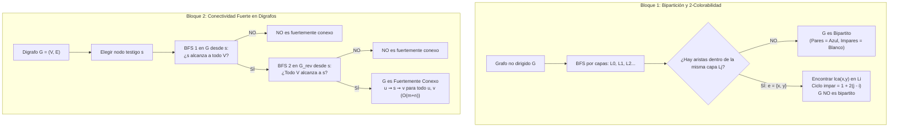

# Clase 8 · Bipartición, prueba con BFS y conectividad en grafos dirigidos

![[03Graphs.pdf]]

> [!info] Alcance de esta clase
> Esta nota continúa directamente donde concluyó la [[2026-09-03 ADA - grafos|clase anterior del 3 de septiembre]] (que cubrió las diapositivas 3–24 de *03Graphs.pdf*). Desarrolla de forma exhaustiva las diapositivas **25 a 43**:
> 1. **Testing bipartiteness (Diapositivas 25–32):** Definición de grafos bipartitos, aplicaciones en emparejamiento y calendarización, obstrucción estructural por ciclos impares, el lema de capas BFS, construcción del ciclo impar mediante el ancestro común más cercano ($\text{lca}$) y el algoritmo de prueba en tiempo lineal $O(m + n)$.
> 2. **Connectivity in directed graphs (Diapositivas 33–43):** Digrafos, aplicaciones del mundo real (Web, citas, blogs, redes tróficas), alcanzabilidad orientada ($s \rightsquigarrow t$), conectividad fuerte, lema del nodo testigo $s$, algoritmo de 2 recorridos BFS en $O(m + n)$ y componentes fuertemente conexas (Teorema de Tarjan 1972).

## Pregunta central

¿Cómo podemos certificar con un algoritmo lineal si un grafo no dirigido es bipartito (o aislar un ciclo impar como testigo de imposibilidad), y cómo decidimos eficientemente si en una red dirigida todos los nodos pueden comunicarse mutuamente en ambos sentidos?

> [!summary] Idea de la clase
> Un grafo no dirigido es bipartito si y solo si no contiene ciclos impares. Al ejecutar **BFS**, las capas de distancia $L_0, L_1, L_2, \dots$ intentan colorear el grafo de forma natural (capas pares de azul, capas impares de blanco); si aparece una arista interna dentro de una misma capa $L_j$, sus extremos se unen en su ancestro común más cercano produciendo un ciclo impar de longitud $1 + 2(j - i)$. Por otra parte, en **grafos dirigidos**, la conectividad fuerte exige alcanzabilidad mutua ($u \rightsquigarrow v$ y $v \rightsquigarrow u$). Gracias al **lema del nodo testigo**, basta elegir un vértice $s$ y verificar mediante dos BFS (uno en $G$ y otro en $G^{rev}$) que $s$ alcance a todos y sea alcanzado por todos, resolviendo el problema en tiempo óptimo $O(m + n)$.



---

## 1. Grafos bipartitos y 2-colorabilidad

*Diapositivas 25–27.*

### 1.1 Definición formal

Un grafo no dirigido $G = (V, E)$ es **bipartito** si su conjunto de vértices $V$ puede dividirse en dos subconjuntos disjuntos $V_1$ y $V_2$ ($V = V_1 \cup V_2$ con $V_1 \cap V_2 = \emptyset$) tales que **cada arista** $\{u, v\} \in E$ tiene un extremo en $V_1$ y el otro extremo en $V_2$.

Equivalentemente, un grafo es bipartito si es **$2$-coloreable**: podemos asignar uno de dos colores (por ejemplo, blanco y azul) a cada nodo de modo que ningún par de vecinos comparta el mismo color.

```
       Conjunto V1 (Azul)        Conjunto V2 (Blanco)
             (v2) ----------------- (v1)
             (v4) ----------------- (v3)
             (v5) ----------------- (v6)
             (v7) -----------------
```

### 1.2 Aplicaciones del mundo real

1. **Emparejamiento estable (Stable Matching):**
   - Vértices azules = Estudiantes médicos postulantes.
   - Vértices blancos = Hospitales con plazas de residencia.
   - Aristas = Solicitudes o compatibilidades de postulación. No hay aristas entre dos estudiantes ni entre dos hospitales.
2. **Calendarización de tareas (Scheduling):**
   - Vértices azules = Máquinas o procesadores disponibles.
   - Vértices blancos = Trabajos o tareas a ejecutar.
   - Aristas = Compatibilidad técnica de la máquina para ejecutar dicho trabajo.
3. **Optimización computacional:**
   - Problemas intrínsecamente intratables (NP-completos) en grafos generales, como el **Conjunto Independiente Máximo** (*Maximum Independent Set*) o la **Cobertura de Vértices** (*Vertex Cover*), se vuelven computables en **tiempo polinomial** exacto cuando el grafo subyacente es bipartito (reduciéndose a problemas de flujo máximo en redes).

---

## 2. La obstrucción estructural: Ciclos impares

*Diapositiva 28.*

¿Qué le impide a un grafo ser bipartito? La respuesta radica en la paridad de sus ciclos.

> [!important] Lema de la Obstrucción
> Si un grafo $G$ contiene un ciclo simple de longitud impar, **$G$ no puede ser bipartito** (no es 2-coloreable).

### Demostración formal:
Sea $C = v_1 - v_2 - v_3 - \dots - v_{2k+1} - v_1$ un ciclo simple con $2k + 1$ aristas y vértices (longitud impar, como un triángulo $C_3$ o un pentágono $C_5$).
1. Supongamos que $G$ admite una $2$-coloración válida con colores $\{0, 1\}$.
2. Sin pérdida de generalidad, asignemos el color $0$ al nodo $v_1$: $\text{color}(v_1) = 0$.
3. Como $v_2$ es vecino de $v_1$, forzosamente $\text{color}(v_2) = 1$.
4. De forma inductiva, para cada nodo $v_i$ del ciclo:
   $$\text{color}(v_i) = (i - 1) \pmod 2$$
   - Todos los nodos con índice impar ($v_1, v_3, v_5, \dots$) deben tener color $0$.
   - Todos los nodos con índice par ($v_2, v_4, v_6, \dots$) deben tener color $1$.
5. Al llegar al último nodo del ciclo, $v_{2k+1}$ (cuyo índice es impar), debe tener obligatoriamente:
   $$\text{color}(v_{2k+1}) = 0$$
6. Sin embargo, en el ciclo existe la arista de cierre $\{v_{2k+1}, v_1\}$. Ambos extremos tienen color $0$, lo cual viola la definición de $2$-coloración.
7. Por contradicción, ningún ciclo de longitud impar puede ser 2-coloreado.

---

## 3. El algoritmo de prueba de bipartición mediante capas BFS

*Diapositivas 29–32.*

El lema anterior demuestra que los ciclos impares impiden la bipartición. Pero, ¿es esta la **única** obstrucción posible? El siguiente teorema responde afirmativamente y proporciona un algoritmo lineal para certificarlo.

### 3.1 Teorema de caracterización por capas BFS

Sea $G$ un grafo conexo y sean $L_0, L_1, L_2, \dots, L_k$ las capas de distancia generadas por [[Búsqueda en anchura|BFS]] a partir de un nodo inicial $s$ ($L_0 = \{s\}$). 

Recordemos la propiedad fundamental del árbol BFS: para toda arista $\{u, v\} \in E$, los niveles de sus extremos difieren a lo más en $1$ ($|\text{nivel}(u) - \text{nivel}(v)| \le 1$). Por tanto, cada arista de $G$ cae exclusivamente en uno de dos casos:
- Une vértices en niveles adyacentes ($L_i$ y $L_{i+1}$).
- Une vértices en el **mismo nivel** ($L_j$ y $L_j$).

> [!important] Lema de Capas de Bipartición
> Se cumple exactamente una de las siguientes dos afirmaciones:
> 1. **Caso (i):** Ninguna arista de $G$ une dos nodos de la misma capa $\implies$ **$G$ es bipartito**.
> 2. **Caso (ii):** Existe al menos una arista de $G$ que une dos nodos de la misma capa $\implies$ **$G$ contiene un ciclo de longitud impar** (y por tanto no es bipartito).

### 3.2 Demostración del Caso (i): Bipartición natural
Si no hay aristas que conecten nodos dentro de la misma capa, toda arista $\{u, v\}$ une necesariamente una capa $L_i$ con una capa contigua $L_{i+1}$. Asignamos:
- **Nodos azules:** Vértices pertenecientes a capas pares ($L_0, L_2, L_4, \dots$).
- **Nodos blancos:** Vértices pertenecientes a capas impares ($L_1, L_3, L_5, \dots$).

Como cada arista conecta una capa par con una impar, ningún par de nodos del mismo color puede ser adyacente. La 2-coloración es válida y $G$ es bipartito.

### 3.3 Demostración del Caso (ii): Aislamiento del ciclo impar
Supongamos que existe una arista $e = \{x, y\}$ donde ambos nodos están en el mismo nivel: $x, y \in L_j$.
1. En el árbol BFS generado, trazamos el camino único desde $x$ hacia la raíz $s$, y el camino desde $y$ hacia la raíz $s$.
2. Sea $z = \text{lca}(x, y)$ el **ancestro común más cercano** (*lowest common ancestor*) de $x$ y $y$ en el árbol BFS, ubicado en algún nivel $L_i$ (donde necesariamente $i \le j$).
3. Consideremos el ciclo cerrado formado por:
   - La arista directa $\{x, y\}$ (longitud $1$).
   - El camino en el árbol de $y$ ascendiendo a $z$ (longitud $j - i$).
   - El camino en el árbol de $z$ descendiendo a $x$ (longitud $j - i$).
4. La longitud total de este ciclo simple es:
   $$\text{Longitud} = 1 + (j - i) + (j - i) = 1 + 2(j - i)$$
5. Como $j \ge i$, la diferencia $(j - i)$ es un entero mayor o igual a cero. La cantidad $2(j - i)$ es forzosamente un número par. Al sumarle $1$, obtenemos un **número estrictamente impar**.
6. Por lo tanto, hemos aislado un ciclo simple de longitud impar en $G$, certificando que $G$ no es bipartito.

> [!tip] Corolario fundamental
> Un grafo no dirigido $G$ es bipartito **si y solo si** no contiene ningún ciclo de longitud impar. Los ciclos impares son la **única** obstrucción a la bipartición.

### 3.4 Algoritmo y tiempo de ejecución

```python
def probar_biparticion(G):
    color = {}   # Guarda 0 (azul) o 1 (blanco)
    for s in G.vertices:
        if s not in color:
            color[s] = 0
            cola = [s]
            while cola:
                u = cola.pop(0)
                for v in G.vecinos(u):
                    if v not in color:
                        color[v] = 1 - color[u]   # Alternar color
                        cola.append(v)
                    elif color[v] == color[u]:
                        return False, "Grafo no bipartito: ciclo impar detectado"
    return True, color
```

- **Complejidad temporal:** Cada vértice se encola a lo más una vez y cada arista se examina dos veces (una por cada extremo). Utilizando listas de adyacencia, el tiempo total es **$\Theta(m + n)$**.
- **Complejidad espacial:** $\Theta(n)$ para almacenar los colores y la cola de exploración.

---

## 4. Laboratorio interactivo: Bipartición y Conectividad Fuerte

Experimenta interactivamente con la prueba de 2-colorabilidad por capas de BFS y con el algoritmo de dos recorridos para digrafos.

<iframe src="biparticion-y-conectividad-fuerte.htm" style="width:100%;height:600px;border:1px solid var(--lightgray);border-radius:4px;" loading="lazy"></iframe>

**Idea central si el laboratorio no carga:**
1. En la pestaña de Bipartición, el grafo se organiza en columnas que representan las capas $L_0, L_1, L_2$. Si todas las aristas van entre columnas vecinas, el grafo es bipartito. Si aparece una arista vertical entre dos nodos de la misma columna (en rojo), el simulador encuentra su ancestro común más cercano y dibuja el ciclo impar de longitud $1 + 2(j-i)$.
2. En la pestaña de Conectividad Fuerte, al seleccionar un nodo $s$, el algoritmo recorre $G$ hacia adelante y luego $G^{rev}$ hacia atrás. Si ambos recorridos alcanzan a todos los nodos, la red es fuertemente conexa.

---

## 5. Grafos dirigidos (Digrafos) y aplicaciones

*Diapositivas 33–39.*

### 5.1 Notación formal

Un **grafo dirigido** o **digrafo** $G = (V, E)$ se compone de vértices $V$ y aristas dirigidas $E$. Cada arista es un **par ordenado**:

$$(u, v) \in E$$

- Sale del nodo $u$ y entra al nodo $v$.
- La orientación es crítica: $(u, v)$ no garantiza la existencia de $(v, u)$.

### 5.2 Grados y apretón de manos en digrafos

- $\text{in-degree}(v)$: Número de aristas que entran a $v$.
- $\text{out-degree}(v)$: Número de aristas que salen de $v$.

$$\sum_{v \in V} \text{in-degree}(v) = \sum_{v \in V} \text{out-degree}(v) = m = |E|$$

### 5.3 Aplicaciones canónicas de digrafos

| Red / Dominio | Vértice | Arista dirigida $(u \to v)$ | Importancia de la dirección |
|---|---|---|---|
| **World Wide Web** | Página web | Hipervínculo de $u$ hacia $v$ | Los motores de búsqueda (Google PageRank) usan la estructura de enlaces entrantes como medida de autoridad y relevancia. |
| **Red vial urbana** | Esquina / Intersección | Calle de sentido único | Si una calle es de un solo sentido, el tráfico solo puede fluir en una dirección. |
| **Blogosfera política** | Blog político | Enlace de citación | El estudio de Adamic y Glance (2004) demostró que el 91% de los enlaces se producen dentro de la misma comunidad ideológica (polarización). |
| **Red trófica ecológica** | Especie animal/vegetal | Relación presa $\to$ depredador | La energía fluye unidireccionalmente del organismo consumido al consumidor. |
| **Citas científicas** | Artículo de investigación | El artículo $u$ cita al artículo $v$ | El grafo es necesariamente acíclico respecto al tiempo (un artículo no puede citar trabajos futuros). |
| **Flujo de control** | Bloque básico de código | Salto o transición | Modela la ejecución de instrucciones en compiladores y análisis estático. |

---

## 6. Alcanzabilidad y búsqueda en digrafos

*Diapositiva 40.*

- **Alcanzabilidad dirigida:** Dado un nodo origen $s$, encontrar todos los nodos $t$ tales que existe un camino dirigido de $s$ a $t$ (denotado $s \rightsquigarrow t$).
- **Camino más corto orientado:** Longitud mínima (menor número de arcos dirigidos) para ir de $s$ a $t$.
- **Algoritmo:** BFS se extiende de manera inmediata a grafos dirigidos considerando únicamente las **aristas salientes** de cada nodo explorado.
- **Rastreador web (Web Crawler):** Comienza en una página semilla $s$ y explora enlaces salientes de forma iterativa mediante BFS para indexar la web alcanzable.

---

## 7. Conectividad fuerte (Strong Connectivity)

*Diapositivas 41–42.*

En un grafo no dirigido, si existe camino de $u$ a $v$, automáticamente existe camino de $v$ a $u$. En grafos dirigidos esto ya no es cierto.

### 7.1 Definición formal

- Dos nodos $u$ y $v$ son **mutuamente alcanzables** si existe tanto un camino dirigido $u \rightsquigarrow v$ como un camino dirigido $v \rightsquigarrow u$.
- Un digrafo $G$ es **fuertemente conexo** (*strongly connected*) si **todo par de nodos** $u, v \in V$ es mutuamente alcanzable.

### 7.2 El Lema del Nodo Testigo

Comprobar directamente la definición evaluando todos los pares requeriría verificar $n(n - 1)$ caminos dirigidos ($O(n(m + n))$). El siguiente lema reduce el problema a un análisis centrado en un único nodo testigo:

> [!important] Lema del Nodo Testigo
> Sea $s \in V$ un nodo cualquiera fijado arbitrariamente. El digrafo $G$ es fuertemente conexo **si y solo si**:
> 1. Todo nodo $v \in V$ es alcanzable desde $s$ ($s \rightsquigarrow v$).
> 2. El nodo $s$ es alcanzable desde todo nodo $u \in V$ ($u \rightsquigarrow s$).

### Demostración:
- **$\implies$ (Necesidad):** Se sigue directamente de la definición: si todos los pares son mutuamente alcanzables, en particular $s$ y $v$ lo son para cualquier $v$.
- **$\impliedby$ (Suficiencia):** Sean $u$ y $v$ dos nodos arbitrarios cualesquiera de $G$.
  - Por la condición (2), existe un camino dirigido $u \rightsquigarrow s$.
  - Por la condición (1), existe un camino dirigido $s \rightsquigarrow v$.
  - Concatenando ambos caminos pasando por el testigo $s$, obtenemos un camino dirigido válido:
    $$u \rightsquigarrow s \rightsquigarrow v$$
  - De forma idéntica, concatenando el camino $v \rightsquigarrow s$ con $s \rightsquigarrow u$, obtenemos:
    $$v \rightsquigarrow s \rightsquigarrow u$$
  - Como $u$ y $v$ fueron elegidos arbitrariamente, todo par es mutuamente alcanzable.

```
       u ──────────> ( s ) ──────────> v
       [camino u ⇝ s]     [camino s ⇝ v]
       
       Concatenación: u ⇝ s ⇝ v demuestra que u alcanza a v.
```

### 7.3 Algoritmo en tiempo $O(m + n)$ mediante dos recorridos BFS

Para verificar si todo nodo alcanza a $s$, construimos el **grafo reverso $G^{rev}$** invirtiendo el sentido de todas las aristas de $G$. Notemos que:
$$u \rightsquigarrow s \text{ en } G \iff s \rightsquigarrow u \text{ en } G^{rev}$$

```python
def es_fuertemente_conexo(G):
    s = G.vertices[0]   # Tomar cualquier nodo como testigo
    
    # 1. Primer BFS: explorar hacia adelante en G desde s
    R1 = BFS(G, s)
    if len(R1) < len(G.vertices):
        return False   # s no alcanza a todos
        
    # 2. Invertir aristas para obtener G_rev
    G_rev = construir_grafo_reverso(G)
    
    # 3. Segundo BFS: explorar en G_rev desde s (equivale a quienes alcanzan a s en G)
    R2 = BFS(G_rev, s)
    if len(R2) < len(G.vertices):
        return False   # no todos los nodos alcanzan a s
        
    return True   # Pasa ambas pruebas: G es fuertemente conexo
```

### Complejidad:
- BFS en $G$: $O(m + n)$.
- Construcción de $G^{rev}$: $O(m + n)$.
- BFS en $G^{rev}$: $O(m + n)$.
- **Tiempo total:** $O(m + n)$ (óptimo y lineal).

---

## 8. Componentes fuertemente conexas (SCC)

*Diapositiva 43.*

Cuando un digrafo no es fuertemente conexo en su totalidad, suele descomponerse de forma única en subgrafos fuertemente conexos maximales.

### 8.1 Definición

Una **componente fuertemente conexa (SCC)** es un subconjunto maximal de vértices $C \subseteq V$ tales que para todo par $u, v \in C$, $u$ y $v$ son mutuamente alcanzables.

Maximal significa que no se puede agregar ningún otro vértice a $C$ sin destruir la propiedad de alcanzabilidad mutua. Las componentes fuertemente conexas forman una **partición** de los vértices de $V$.

### 8.2 Teorema de Robert Tarjan (1972)

> [!note] Teorema de Tarjan
> Es posible identificar y etiquetar **todas** las componentes fuertemente conexas de cualquier grafo dirigido en tiempo lineal **$O(m + n)$** utilizando un único recorrido DFS asistido por una pila y dos números por vértice: tiempo de descubrimiento (*discovery time*) y el enlace bajo (*low-link value*).

---

## 9. Ejercicios resueltos paso a paso

### Ejercicio 1: Identificación de bipartición y ciclo impar
**Problema:** Determinar si el grafo con $V = \{1, 2, 3, 4, 5\}$ y aristas $E = \{1-2, 2-3, 3-4, 4-5, 5-2\}$ es bipartito. Si no lo es, aislar el ciclo impar.

**Procedimiento:**
1. Ejecutamos BFS con raíz $s = 1$:
   - $L_0 = \{1\}$ (Azul)
   - Vecinos de $1$: solo $2 \implies L_1 = \{2\}$ (Blanco)
   - Vecinos de $2$ no visitados: $\{3, 5\} \implies L_2 = \{3, 5\}$ (Azul)
   - Vecinos de $3$: $4 \implies L_3 = \{4\}$ (Blanco)
2. Analizamos las aristas restantes:
   - Arista $\{4, 5\}$: Conecta el nodo $4 \in L_3$ con el nodo $5 \in L_2$ (capas adyacentes, permitida).
   - Arista $\{5, 2\}$: Conecta $5 \in L_2$ con $2 \in L_1$ (capas adyacentes, permitida).
   - Pero observemos el ciclo formado por los vértices $2, 3, 4, 5$:
     $2 - 3 - 4 - 5 - 2$.
3. Contamos las aristas de este ciclo cerrado: son $4$ aristas ($2-3, 3-4, 4-5, 5-2$). Es un ciclo par de longitud $4$.
4. Sin embargo, ¿hay alguna arista conflictiva?
   - Si coloreamos: $\text{color}(1) = \text{Azul}$, $\text{color}(2) = \text{Blanco}$, $\text{color}(3) = \text{Azul}$, $\text{color}(5) = \text{Azul}$, $\text{color}(4) = \text{Blanco}$.
   - Revisemos la arista $\{4, 5\}$: el nodo $4$ es blanco y el $5$ es azul $\implies$ ¡Válida!
   - Revisemos la arista $\{5, 2\}$: el nodo $5$ es azul y el $2$ es blanco $\implies$ ¡Válida!
5. **Conclusión:** El grafo **SÍ es bipartito** con bipartición $V_1 = \{1, 3, 5\}$ y $V_2 = \{2, 4\}$. No contiene ciclos impares (el único ciclo tiene longitud 4).

---

### Ejercicio 2: Prueba de conectividad fuerte con nodo testigo
**Problema:** Sea el digrafo con vértices $\{1, 2, 3, 4\}$ y aristas:
$$E = \{(1, 2), (2, 3), (3, 1), (2, 4), (4, 3)\}$$
Demostrar mediante el lema del nodo testigo si es fuertemente conexo tomando $s = 1$.

**Procedimiento:**
1. **Paso 1: BFS en $G$ desde $s = 1$:**
   - De $1 \to 2$.
   - De $2 \to 3$ y $2 \to 4$.
   - De $4 \to 3$ (ya visitado).
   - Nodos alcanzados: $\{1, 2, 3, 4\}$. Todos los nodos son alcanzables desde $1$ ($s \rightsquigarrow V$).
2. **Paso 2: Invertir aristas ($G^{rev}$):**
   - $E^{rev} = \{(2, 1), (3, 2), (1, 3), (4, 2), (3, 4)\}$.
3. **Paso 3: BFS en $G^{rev}$ desde $s = 1$:**
   - De $1 \to 3$ en $G^{rev}$.
   - De $3 \to 2$ y $3 \to 4$ en $G^{rev}$.
   - Nodos alcanzados en $G^{rev}$: $\{1, 3, 2, 4\}$. Todos los nodos son alcanzables desde $1$ en $G^{rev}$, lo que significa que en $G$ original, todos los nodos alcanzan a $1$ ($V \rightsquigarrow s$).
4. **Conclusión:** Por el lema del nodo testigo, **$G$ es fuertemente conexo**.

---

## 10. Errores conceptuales frecuentes

| Error conceptual | Corrección |
|---|---|
| Creer que un grafo es bipartito si tiene número par de vértices | La paridad de los vértices no importa; lo determinante es que **todos los ciclos sean de longitud par**. Un grafo de 4 vértices con un triángulo no es bipartito. |
| Pensar que para probar bipartición basta con verificar que no haya triángulos ($C_3$) | Cualquier ciclo impar ($C_5, C_7, C_9\dots$) rompe la bipartición. Un pentágono no tiene triángulos y no es bipartito. |
| Confundir aristas entre niveles con aristas dentro del mismo nivel en BFS | Dos nodos en niveles contiguos ($L_1$ y $L_2$) con arista entre ellos son normales en BFS y compatibles con bipartición; el conflicto ocurre solo cuando una arista une nodos en el **mismo nivel** ($L_j$ y $L_j$). |
| Asumir que si $s$ alcanza a todos los nodos en un digrafo, el digrafo ya es fuertemente conexo | Es un error grave: el grafo puede tener un nodo sumidero del cual no se pueda regresar. Se requiere obligatoriamente la doble condición ($s \rightsquigarrow v$ y $v \rightsquigarrow s$). |

---

## 11. Preguntas de autoevaluación

1. Si un grafo tiene $n=100$ vértices y no contiene ningún ciclo, ¿es necesariamente bipartito?
2. En la prueba de bipartición con BFS, si encontramos una arista entre dos nodos de la capa $L_4$ cuyo ancestro común más cercano está en $L_2$, ¿cuál es la longitud del ciclo impar resultante?
3. ¿Por qué el algoritmo de conectividad fuerte invierte las aristas para el segundo recorrido BFS en lugar de hacer $n-1$ recorridos desde cada nodo?
4. Si un digrafo $G$ es fuertemente conexo, ¿cuántas componentes fuertemente conexas tiene?

<details>
<summary>Respuestas explicadas</summary>

1. **Sí, siempre.** Si no contiene ciclos (es un bosque o árbol), en particular no contiene ciclos impares. Todo árbol es siempre bipartito.
2. **Longitud 5.** La fórmula es $1 + 2(j - i) = 1 + 2(4 - 2) = 1 + 4 = 5$ (un pentágono).
3. Porque hacer $n-1$ recorridos tomaría tiempo $O(n(m+n))$, lo cual es ineficiente; al invertir las aristas, un solo BFS desde $s$ explora en reversa todos los caminos que conducen a $s$ en tiempo lineal $O(m+n)$.
4. **Exactamente una sola componente fuertemente conexa** que contiene a todos los vértices del grafo.

</details>

---

## 12. Recorrido diapositiva por diapositiva

| Diapositiva | Contenido original | Dónde se desarrolla |
|:---:|---|---|
| **25** | Agenda de Bipartición: Testing bipartiteness | §1 |
| **26** | Definición de grafo bipartito (2-colorable) y aplicaciones (matching, scheduling) | §1.1 y §1.2 |
| **27** | Dibujo alternativo de un grafo bipartito $G$ y complejidad de problemas | §1.1 |
| **28** | Lema de obstrucción: los ciclos impares no son 2-coloreables | §2 |
| **29** | Lema de capas BFS: Caso (i) y Caso (ii) | §3.1 |
| **30** | Demostración del Caso (i) (paridad de capas blancas y azules) | §3.2 |
| **31** | Demostración del Caso (ii) (construcción del ciclo impar $1+2(j-i)$ con lca) | §3.3 |
| **32** | Corolario: $G$ es bipartito ssi no contiene ciclos impares | §3.3 y Laboratorio |
| **33** | Agenda de Grafos Dirigidos: Connectivity in directed graphs | §5 |
| **34** | Definición y notación de digrafos: pares ordenados $(u, v)$ | §5.1 |
| **35** | Ejemplo de la World Wide Web y motores de búsqueda | §5.3 |
| **36** | Ejemplo de red vial con calles de un solo sentido | §5.3 |
| **37** | Estudio de la blogosfera política (Adamic y Glance 2005) | §5.3 |
| **38** | Ejemplo de red trófica ecológica (presa a depredador) | §5.3 |
| **39** | Tabla de aplicaciones de grafos dirigidos | §5.3 |
| **40** | Alcanzabilidad dirigida, camino más corto y Web crawler | §6 |
| **41** | Conectividad fuerte: definición y Lema del nodo testigo $s$ | §7.1 y §7.2 |
| **42** | Algoritmo de conectividad fuerte en $O(m+n)$ con BFS en $G$ y $G^{rev}$ | §7.3 |
| **43** | Definición de componentes fuertemente conexas (SCC) y Teorema de Tarjan 1972 | §8 |

---

## Conexiones

- **Anterior:** [[2026-09-03 ADA - grafos|Clase del 3 de septiembre: Grafos, representaciones, árboles y BFS básico]].
- **Recurso interactivo de esta clase:** `![[biparticion-y-conectividad-fuerte.html]]`
- **Siguiente clase:** [[2026-09-10 ADA - DAGs-y-ordenamiento-topologico|Clase del 10 de septiembre: DAGs y Ordenamiento Topológico]].
