## Pregunta central

¿Por qué Gale–Shapley siempre termina y produce un emparejamiento perfecto y estable, y por qué el resultado es el mejor emparejamiento estable para el lado que propone?

> [!summary] Respuesta corta
> Cada propuesta elimina para siempre una posibilidad, así que hay a lo sumo $n^2$. El conjunto provisional $M$ siempre es un emparejamiento; al terminar no puede quedar un hospital libre y, para cada pareja ausente, al menos uno de sus integrantes prefiere su asignación final. Además, ningún hospital es rechazado por una estudiante con quien pudiera aparecer en otra solución estable: por eso quien propone obtiene su mejor socio válido.

## Punto de partida: aceptación diferida

La clase continúa desde la **diapositiva 11**. Sean $H$ los hospitales, $S$ los estudiantes y $M$ las parejas provisionales.

```text
M ← ∅
mientras exista un hospital h libre que no haya propuesto a todo S:
    s ← primera estudiante en la lista de h a quien aún no propuso
    si s está libre: agregar (h,s) a M
    si s tiene pareja h' y prefiere h a h':
        reemplazar (h',s) por (h,s)
    en otro caso: s rechaza a h
devolver M
```

La aceptación es **diferida**: un “sí” es provisional. Cada estudiante conserva la mejor propuesta recibida y puede cambiarla por otra mejor.

> [!note] Definición usada en las pruebas
> Un emparejamiento es **estable** si es perfecto y no contiene un par $(h,s)$ fuera de $M$ tal que ambos se prefieran frente a sus parejas actuales. Con las listas usadas abajo, $M^*=\{A\text{–}X,B\text{–}Y,C\text{–}Z\}$ es estable: para toda pareja ausente, al menos uno de sus integrantes prefiere su asignación en $M^*$.

### Convención visual consistente

Todos los diagramas usan el mismo ejemplo y los mismos colores: azul = hospital que propone; amarillo = comparación; verde = pareja; rojo = rechazo; gris = libre. Las preferencias son:

| Hospital | Arreglo de preferencias | Estudiante | Arreglo de preferencias |
|---|---|---|---|
| $A$ | $X \succ Y \succ Z$ | $X$ | $A \succ C \succ B$ |
| $B$ | $Y \succ X \succ Z$ | $Y$ | $B \succ C \succ A$ |
| $C$ | $X \succ Y \succ Z$ | $Z$ | $A \succ B \succ C$ |

```mermaid
flowchart TB
  subgraph PH["Arreglos de hospitales"]
    direction TB
    subgraph PA["A"]
      direction LR
      A1["1: X"] --- A2["2: Y"] --- A3["3: Z"]
    end
    subgraph PB["B"]
      direction LR
      B1["1: Y"] --- B2["2: X"] --- B3["3: Z"]
    end
    subgraph PC["C"]
      direction LR
      C1["1: X"] --- C2["2: Y"] --- C3["3: Z"]
    end
  end
  subgraph PS["Arreglos de estudiantes"]
    direction TB
    subgraph PX["X"]
      direction LR
      X1["1: A"] --- X2["2: C"] --- X3["3: B"]
    end
    subgraph PY["Y"]
      direction LR
      Y1["1: B"] --- Y2["2: C"] --- Y3["3: A"]
    end
    subgraph PZ["Z"]
      direction LR
      Z1["1: A"] --- Z2["2: B"] --- Z3["3: C"]
    end
  end
  classDef libre fill:#f3f4f6,stroke:#6b7280,color:#111827;
  class A1,A2,A3,B1,B2,B3,C1,C2,C3,X1,X2,X3,Y1,Y2,Y3,Z1,Z2,Z3 libre;
```

## Ejecución completa del algoritmo

### Estado 0 — Inicialización

$M_0=\varnothing$. La caja entre corchetes es la siguiente opción de cada hospital.

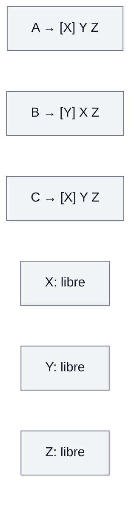

### Paso 1 — $A$ propone a $X$

$X$ está libre y acepta provisionalmente: $M_1=\{A\text{–}X\}$.

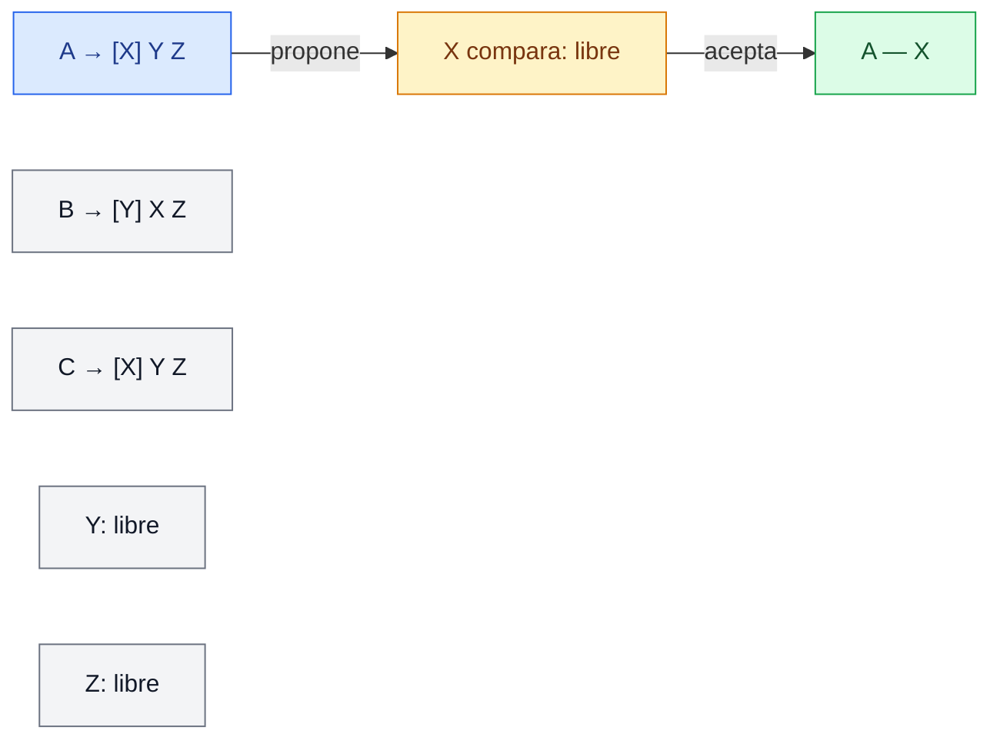

### Paso 2 — $B$ propone a $Y$

$Y$ está libre y acepta: $M_2=\{A\text{–}X,B\text{–}Y\}$.

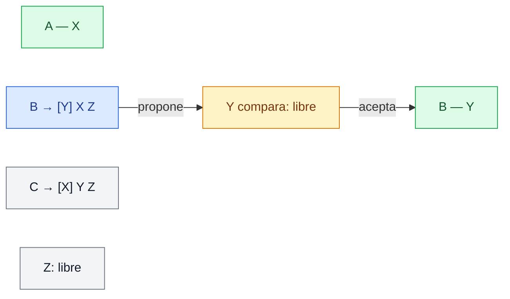

### Paso 3 — $C$ propone a $X$ y es rechazado

$X$ compara el nuevo hospital con su pareja. Como $A\succ_X C$, conserva a $A$ y rechaza a $C$; $M$ no cambia.

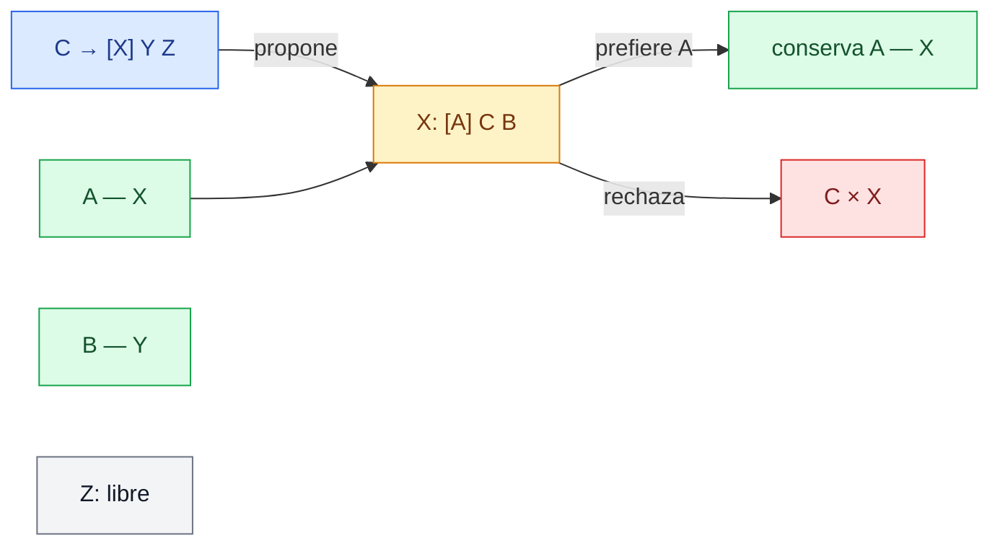

### Paso 4 — $C$ avanza a $Y$

$C$ mueve su índice una caja. $Y$ compara $C$ con $B$ y conserva a $B$, pues $B\succ_Y C$.

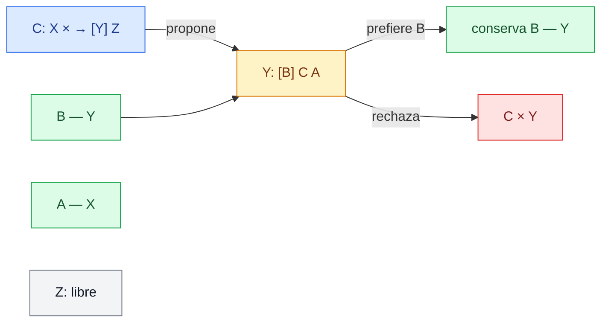

### Paso 5 — $C$ propone a $Z$

$Z$ está libre y acepta. La salida es $M^*=\{A\text{–}X,B\text{–}Y,C\text{–}Z\}$.

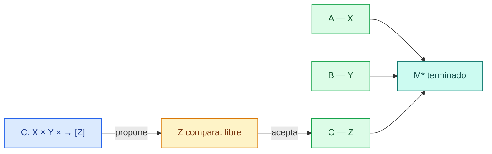

> [!important] Dos movimientos monotónicos
> Los hospitales solo avanzan hacia la derecha de sus arreglos, de más a menos preferido. Una estudiante comprometida nunca vuelve a estar libre: solo cambia hacia la izquierda de su arreglo, es decir, hacia hospitales mejores.

## Demostración de corrección

“El algoritmo funciona” se divide en cuatro afirmaciones: termina; $M$ siempre es un emparejamiento; la salida es perfecta; y la salida es estable.

### 1. Terminación — diapositiva 12

Cada iteración produce una propuesta nueva $(h,s)$. El universo de propuestas es un arreglo de $n\times n$ cajas y ninguna se usa dos veces.

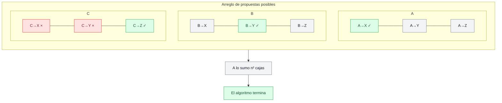

El ciclo ejecuta a lo sumo $n^2$ veces. Con un índice por hospital y una tabla de rangos por estudiante, cada iteración cuesta $O(1)$ y el tiempo total es $O(n^2)$. Una cota fina es $n(n-1)+1$, pero $n^2$ basta para la prueba.

### 2. Invariante: $M$ siempre es un emparejamiento — diapositiva 13

**Invariante.** Al inicio y al final de cada iteración, ningún hospital ni estudiante aparece en más de una pareja de $M$.

**Base.** $M=\varnothing$, así que se cumple.

**Paso inductivo.** Supongamos que se cumple al inicio. Solo propone un hospital libre $h^*$ a una estudiante $s^*$. Hay tres casos exhaustivos:

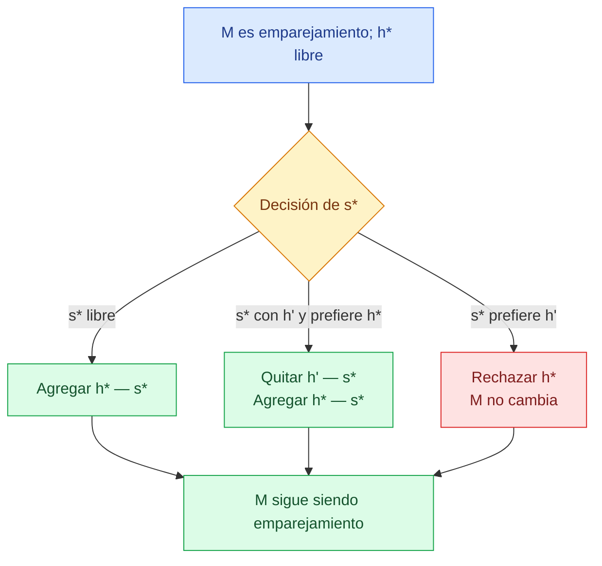

En el segundo caso se retira $(h',s^*)$ **antes** de agregar $(h^*,s^*)$; $s^*$ nunca tiene dos parejas. Por inducción, el invariante vale en toda la ejecución.

### 3. La salida es perfecta — diapositiva 13

Supongamos por contradicción que al terminar queda un hospital $h$ libre.

1. Como existen $n$ participantes de cada lado y $M$ es un emparejamiento, también queda una estudiante $s$ libre.
2. Una estudiante que recibe una propuesta acepta si está libre y después solo cambia por una pareja mejor. Por ello, $s$ libre al final significa que nunca recibió propuestas.
3. Pero $h$ está libre y el ciclo terminó; entonces agotó su arreglo y propuso a todas, incluida $s$.
4. $s$ recibió y no recibió la propuesta de $h$: contradicción.

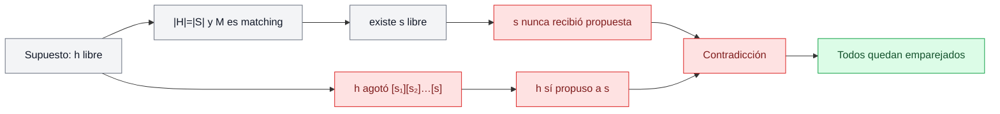

Así, los $n$ hospitales quedan emparejados. Por conteo, sus parejas son $n$ estudiantes distintos; como solo existen $n$, todos los estudiantes también quedan emparejados. Luego $|M|=n$.

### 4. La salida es estable — diapositiva 14

Sea $M^*$ la salida y tomemos cualquier pareja ausente $(h,s)\notin M^*$. Sean $M^*(h)=s'$ y $M^*(s)=h'$. Solo hay dos casos:

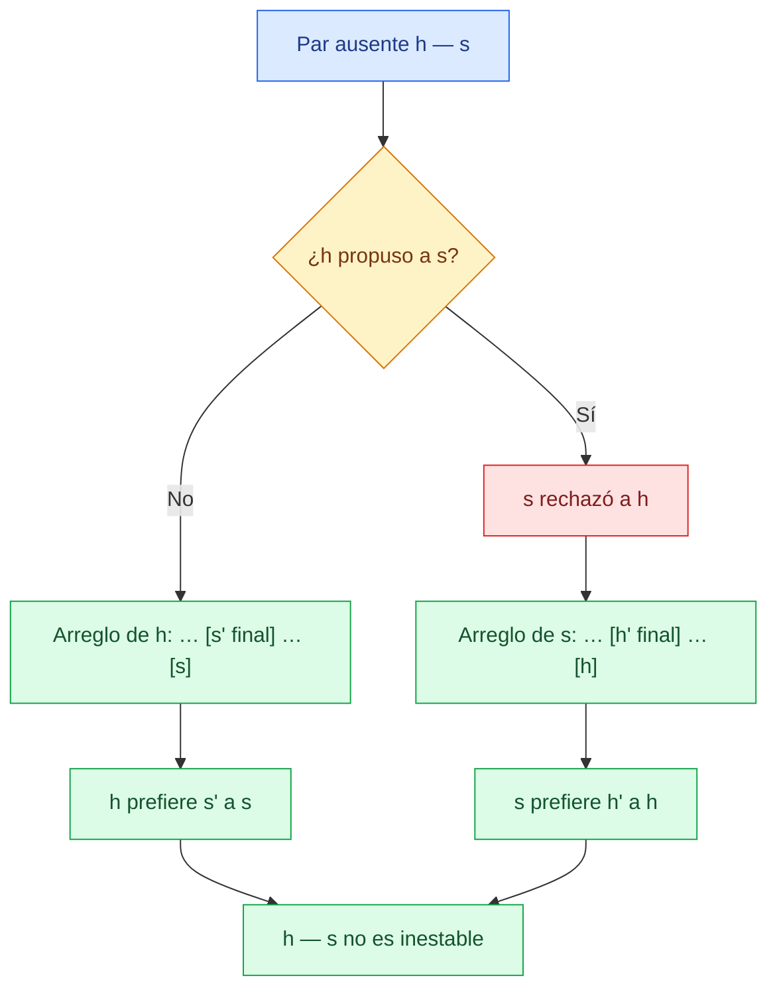

- Si $h$ nunca propuso a $s$, terminó con $s'$ antes de llegar a ella; por tanto $s'\succ_h s$ y $h$ no quiere desviarse.
- Si $h$ sí propuso a $s$, ella lo rechazó de inmediato o después. Como solo cambia por hospitales mejores, $h'\succ_s h$ y $s$ no quiere desviarse.

En ambos casos falla al menos una condición de un par inestable. Como $(h,s)$ era arbitraria, $M^*$ es estable.

> [!theorem] Teorema de Gale–Shapley
> Para toda instancia con $n$ hospitales, $n$ estudiantes y listas completas y estrictas, aceptación diferida termina y devuelve un emparejamiento perfecto y estable.

## Varias soluciones estables y socios válidos — diapositivas 16–20

Una instancia puede tener varias soluciones estables, por ejemplo
$M_1=\{A\text{–}X,B\text{–}Y,C\text{–}Z\}$ y
$M_2=\{A\text{–}Y,B\text{–}X,C\text{–}Z\}$.

Un [[03_Conceptos/Socio válido|socio válido]] de $h$ es alguien con quien $h$ aparece en **algún** emparejamiento estable. “Válido” es más fuerte que “aceptable”.

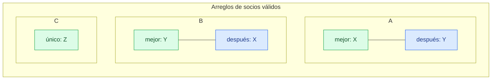

Aunque el orden en que se eligen hospitales libres puede variar, fijando el lado proponente y listas estrictas, todas las ejecuciones producen la misma asignación óptima para quien propone.

### Quiz 3 de la diapositiva 20

La diapositiva enumera seis emparejamientos estables. En ellos, los socios posibles de $W$ son $A$, $B$ y $C$; $D$ no aparece emparejado con $W$. Como el arreglo de preferencias de $W$ es $D\succ A\succ B\succ C$, su **mejor socio válido es $A$**. $D$ sería su favorito absoluto, pero no es válido porque no aparece con $W$ en ninguna solución estable.

## Optimalidad para hospitales — diapositivas 21–22

Si proponen los hospitales, cada hospital recibe su **mejor socio válido**.

### Intuición

Un hospital comienza por su primera opción y solo desciende al ser rechazado. La prueba muestra que ningún hospital puede ser rechazado por una pareja que todavía podría pertenecer a una solución estable mejor para él.

### Prueba por la primera negativa válida

Supongamos que algún hospital no recibe su mejor socio válido. Entonces algún hospital fue rechazado por un socio válido.

1. Sea $h$ el **primer** hospital rechazado por un socio válido $s$.
2. Como $s$ es válido para $h$, existe un emparejamiento estable $M$ con $(h,s)$.
3. Al rechazar a $h$, $s$ conserva a $h'$ y $h'\succ_s h$.
4. Sea $s'$ la pareja de $h'$ en $M$.
5. Por ser esta la primera negativa de un socio válido, $h'$ aún no había sido rechazado por $s'$ cuando propuso a $s$.
6. Como los hospitales recorren sus arreglos en orden, $s\succ_{h'}s'$.
7. Así, $h'$ y $s$ se prefieren frente a sus parejas en $M$: bloquean $M$, contradicción.

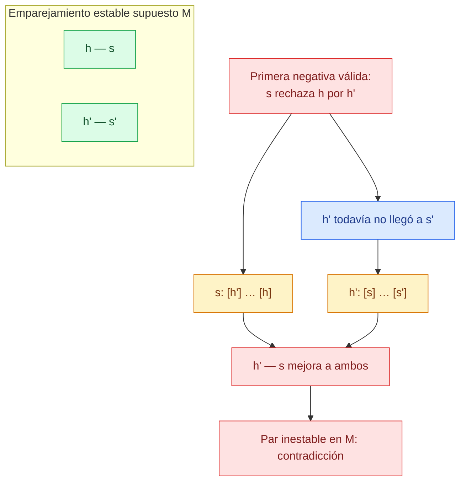

La contradicción elimina la supuesta primera negativa: cada hospital termina con su mejor socio válido.

## Pesimismo para estudiantes — diapositiva 23

La contraparte es que cada estudiante recibe su **peor socio válido**. Supongamos que Gale–Shapley empareja a $h$ con $s$, pero existe una solución estable $M$ donde $s$ está con un hospital $h'$ que le gusta menos. Sea $s'$ la pareja de $h$ en $M$.

- $s$ prefiere $h$ a $h'$.
- Por optimalidad para hospitales, $s$ es el mejor socio válido de $h$; como $s'$ es válido en $M$, $h$ prefiere $s$ a $s'$.
- Entonces $(h,s)$ bloquea $M$, contradicción.

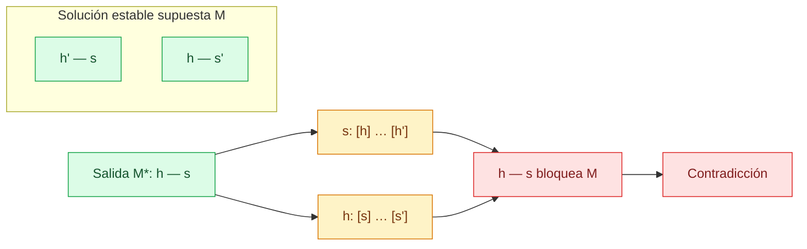

“Peor” significa peor **entre socios válidos**, no que la salida sea incorrecta. Si proponen los estudiantes, todo se invierte: ellos obtienen su mejor socio válido y los hospitales el peor.

## Preferencias estratégicas — diapositiva 24

El lado proponente no puede obtener un socio estrictamente mejor falseando individualmente su lista: ya recibe su mejor socio válido. El lado receptor no tiene esa garantía general. Esta es una propiedad del mecanismo, no una afirmación moral de “justicia”.

## Extensiones — diapositiva 26

El modelo admite participantes inaceptables, hospitales con varias plazas y cantidades desiguales. Con capacidad $q_h$, un hospital conserva provisionalmente hasta $q_h$ estudiantes y, al excederla, rechaza al menos preferido.

Una pareja $(h,s)$ bloquea cuando ambos se consideran aceptables, $s$ está libre o prefiere $h$, y $h$ tiene una plaza libre o prefiere a $s$ sobre alguna persona asignada.

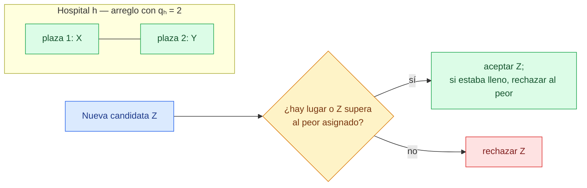

La generalización de Gale–Shapley conserva la existencia de una solución estable. Restricciones con complementariedades —por ejemplo, parejas que exigen destinos coordinados— pueden eliminar esa garantía.

## Guía de demostraciones para examen

| Resultado | Técnica | Idea clave |
|---|---|---|
| Terminación | Conteo | Cada caja $(h,s)$ se usa una vez; hay a lo sumo $n^2$. |
| $M$ es emparejamiento | Invariante | Propone un hospital libre y cada estudiante conserva a lo sumo una pareja. |
| $M$ es perfecto | Contradicción + conteo | Dos participantes libres implicarían una propuesta que ocurrió y no ocurrió. |
| $M$ es estable | Dos casos | Si $h$ no propuso, él no mejora; si propuso, ella no mejora. |
| Óptimo para hospitales | Primera negativa | Rechazar al primer socio válido crea un par bloqueador en otra solución estable. |
| Pesimista para estudiantes | Contradicción | Una pareja mejor para ella bloquearía una solución estable alternativa. |

## Dudas para repasar

- [ ] Ejecutar el algoritmo con otro orden de hospitales libres.
- [ ] Explicar por qué “aceptable” y “válido” no son sinónimos.
- [ ] Reconstruir la prueba de la primera negativa sin consultar la nota.
- [ ] Comparar hospital-proponente y estudiante-proponente en la misma instancia.
- [ ] Revisar qué cambia cuando hay empates.

## Conceptos relacionados

- [[03_Conceptos/Algoritmo de Gale-Shapley|Algoritmo de Gale–Shapley]]
- [[03_Conceptos/Aceptación diferida|Aceptación diferida]]
- [[03_Conceptos/Invariante de ciclo|Invariante de ciclo]]
- [[03_Conceptos/Emparejamiento perfecto|Emparejamiento perfecto]]
- [[03_Conceptos/Emparejamiento estable|Emparejamiento estable]]
- [[03_Conceptos/Socio válido|Socio válido]]
- [[03_Conceptos/Óptimo para hospitales|Óptimo para hospitales]]
- [[03_Conceptos/Pesimista para estudiantes|Pesimista para estudiantes]]
- [[03_Conceptos/Emparejamiento con capacidades|Emparejamiento con capacidades]]

## Referencias mencionadas

- Kevin Wayne, *Stable Matching*, diapositivas 11–26, basadas en Kleinberg y Tardos.
- Jon Kleinberg y Éva Tardos, *Algorithm Design*, sección 1.1.
- ![[01StableMatching.pdf]]

## Resumen después de clase

Gale–Shapley termina porque cada propuesta ocupa una caja distinta de un arreglo de $n^2$ posibilidades. Su corrección se divide en tres pruebas: un invariante garantiza que $M$ siempre es emparejamiento, una contradicción prueba que es perfecto y dos casos muestran que no tiene pares inestables. La solución puede no ser la única estable, pero es la mejor para el lado que propone y la peor solución estable para quien recibe. Las mismas ideas se extienden a listas incompletas, capacidades y conjuntos de tamaños distintos.
