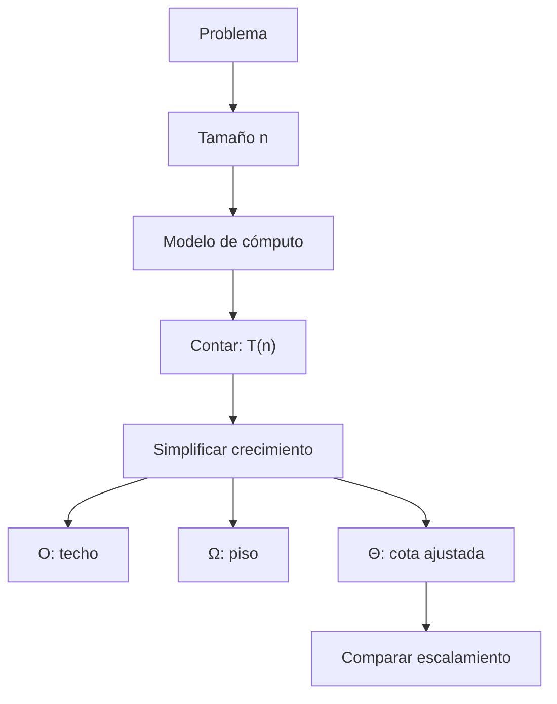
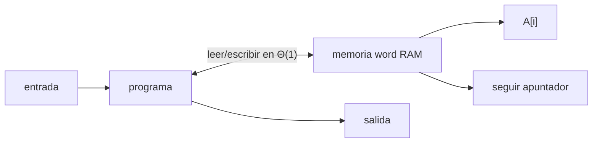
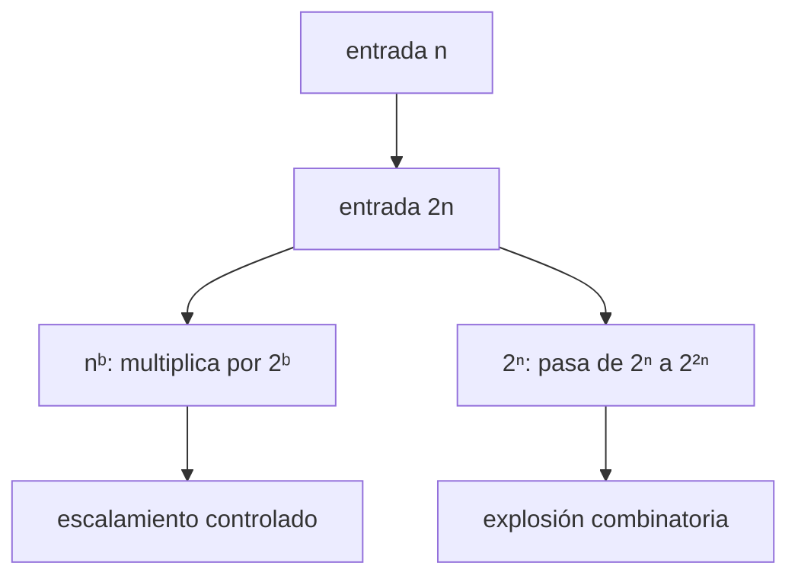
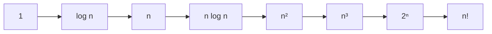

![[02AlgorithmAnalysis.pdf#page=1]]

## Pregunta central

¿Cómo comparamos algoritmos sin depender de una computadora concreta y cómo expresamos rigurosamente la rapidez con la que crece su costo?

> [!summary] Respuesta corta
> Se define el tamaño $n$ de la entrada, se fija un modelo de cómputo y se cuentan operaciones primitivas para obtener $T(n)$. Luego se conserva el orden de crecimiento con $O$ (cota superior), $\Omega$ (cota inferior) o $\Theta$ (cota ajustada). Esta abstracción permite comparar escalamiento, aunque para entradas concretas también importan constantes, memoria y hardware.

## Mapa de la clase

### Del problema a una cota asintótica

El análisis no empieza adivinando una letra $O$. Se avanza en orden: definir qué crece, decidir qué operaciones cuestan una unidad, especificar qué caso se estudia, contar y solo entonces simplificar.

<iframe src="../../algoritmos/recursos/modelo-coste-paso-a-paso.htm" style="width:100%;height:600px;border:1px solid var(--lightgray);border-radius:4px;" loading="lazy"></iframe>

---

## 1. ¿Qué significa analizar un algoritmo?

Charles Babbage ya formulaba la pregunta esencial: si una máquina puede obtener el mismo resultado de varias maneras, ¿qué secuencia lo obtiene con menos trabajo? En su máquina analítica la intuición era **cuántas veces hay que girar la manivela**.

Hoy se miden principalmente dos recursos:

- **Tiempo:** número de operaciones primitivas ejecutadas.
- **Memoria:** número de celdas ocupadas.

El conteo solo tiene sentido después de declarar el modelo de cómputo.

### Paso 1: definir el tamaño de la entrada

El símbolo $n$ debe medir la cantidad de información recibida:

- arreglo: $n$ = número de elementos;
- cadena: $n$ = número de símbolos;
- grafo: suelen intervenir $n=|V|$ vértices y $m=|E|$ aristas;
- entero $x$: el tamaño es aproximadamente $\log_2 x$ bits, no el valor $x$.

> [!warning] Por qué importa
> Un algoritmo que realiza $x$ pasos no es lineal en el tamaño binario del entero: como $x\approx2^n$, puede ser exponencial en $n$.

### Paso 2: fijar el modelo de cómputo

| Modelo | Qué cuenta como paso | Ventaja | Limitación |
|---|---|---|---|
| Máquina de Turing determinista | Transición, lectura/escritura y movimiento del cabezal | Modelo teórico simple | No ofrece acceso aleatorio |
| **Word RAM** | Aritmética/lógica, acceso a arreglo, lectura/escritura, apuntadores y saltos | Se parece a una computadora real | Operaciones con enteros enormes requieren un modelo más fino |

En word RAM, cada palabra tiene $w$ bits y se supone $w\geq\log_2n$, para que un índice o dirección quepa en una palabra.

> [!important] El modelo puede cambiar la respuesta
> Reconocer un palíndromo de $n$ bits requiere al menos orden cuadrático en una máquina de Turing de una cinta, mientras que con acceso aleatorio puede hacerse en tiempo lineal. No hay contradicción: cambiaron las operaciones permitidas.

### Paso 3: elegir el tipo de análisis

| Tipo                      | Pregunta que responde                                       | Ejemplo                                                                |
| ------------------------- | ----------------------------------------------------------- | ---------------------------------------------------------------------- |
| Peor caso                 | ¿Cuál es el máximo costo entre entradas de tamaño $n$?      | Garantía para cualquier entrada                                        |
| Esperado (probabilístico) | ¿Cuál es el costo esperado del azar del algoritmo?          | Quicksort aleatorio usa cerca de $2n\ln n$ comparaciones en esperanza  |
| Amortizado                | ¿Cuánto cuesta cualquier secuencia completa de operaciones? | $n$ `push`/`pop` en un arreglo redimensionable cuestan $O(n)$ en total |
| Caso promedio             | ¿Cuál es el promedio bajo una distribución de entradas?     | Requiere justificar esa distribución                                   |

El peor caso se formaliza como

$$
T_{\max}(n)=\max_{|x|=n}T(x).
$$

No debe confundirse **tiempo esperado** con **caso promedio**: el primero promedia el azar interno del algoritmo para una entrada fija; el segundo promedia entradas según una distribución.

> [!note] Excepciones prácticas
> En la vida cotidiana, se usan algoritmos de tiempo exponencial ya que los peores casos no aparecen (simplex, grep linux, k-means).

---

## 2. Tratabilidad computacional

### Fuerza bruta

Un algoritmo de **fuerza bruta** enumera soluciones candidatas y verifica cada una. Suele ser fácil de describir, pero puede necesitar $2^n$, $n!$ o más pasos.

En emparejamiento estable, probar los $n!$ emparejamientos perfectos y verificar su estabilidad es correcto, pero impracticable incluso para valores moderados de $n$.

### Tiempo polinomial

Un algoritmo es de **tiempo polinomial** si existen constantes $a>0$ y $b>0$ tales que, para toda entrada de tamaño $n$,

$$
T(n)\leq an^b.
$$

La propiedad clave aparece al duplicar la entrada:

$$
T(2n)\leq a(2n)^b=2^b an^b.
$$

El costo aumenta por un factor constante $2^b$, independiente de $n$.

En teoría se llama **eficiente** a un algoritmo polinomial porque esta clase es relativamente estable ante cambios razonables del modelo de cómputo. En la práctica, la palabra eficiente exige más cuidado.

> [!warning] Polinomial no significa automáticamente práctico
> $20n^{120}$ es polinomial, pero sus constantes y exponente lo hacen inútil para casi cualquier entrada. El análisis asintótico describe el comportamiento cuando $n$ crece; no reemplaza una evaluación concreta.

> [!note] Eficiencia aslgorítimca
> Decimos que un algoritmo es eficiente si tiene  tiempo de ejecucion polinomial.

## 3. Notación asintótica

Sea $f(n)$ el costo y $g(n)$ una función de referencia. Las notaciones ignoran constantes multiplicativas y una cantidad finita de valores iniciales, pero responden preguntas distintas.

### $O(g(n))$: cota superior

$$
f(n)\in O(g(n))
\iff
\exists c>0,\exists n_0\geq0:
0\leq f(n)\leq c g(n)\quad\forall n\geq n_0.
$$

Interpretación: desde cierto punto, $cg(n)$ es un **techo** para $f(n)$.

### $\Omega(g(n))$: cota inferior

$$
f(n)\in\Omega(g(n))
\iff
\exists c>0,\exists n_0\geq0:
f(n)\geq cg(n)\geq0\quad\forall n\geq n_0.
$$

Interpretación: desde cierto punto, $cg(n)$ es un **piso** para $f(n)$.

Además,

$$
f(n)\in\Omega(g(n))\iff g(n)\in O(f(n)).
$$

### $\Theta(g(n))$: cota ajustada

$$
f(n)\in\Theta(g(n))
\iff
\exists c_1,c_2>0,\exists n_0\geq0:
0\leq c_1g(n)\leq f(n)\leq c_2g(n)
$$

para todo $n\geq n_0$. Por tanto,

$$
f\in\Theta(g)\iff f\in O(g)\land f\in\Omega(g).
$$

> [!tip] Mnemotecnia
> $O$ es **techo**, $\Omega$ es **piso** y $\Theta$ es el **sándwich** entre ambos.

### Visualización de las tres cotas

En el ejemplo $f(n)=32n^2+17n+1$, la curva queda por debajo de $50n^2$ y por encima de $32n^2$ para $n\geq1$. Cambia de vista para observar el techo, el piso y su combinación.

<iframe src="../../algoritmos/recursos/cotas-asintoticas-interactivas.htm" style="width:100%;height:600px;border:1px solid var(--lightgray);border-radius:4px;" loading="lazy"></iframe>

### Ejemplo completo con constantes explícitas

Sea

$$
f(n)=32n^2+17n+1.
$$

Para $n\geq1$, se cumple $n\leq n^2$ y $1\leq n^2$, así que

$$
f(n)\leq32n^2+17n^2+n^2=50n^2.
$$

Esto prueba $f\in O(n^2)$ con $c_2=50$ y $n_0=1$. También,

$$
f(n)\geq32n^2,
$$

por lo que $f\in\Omega(n^2)$ con $c_1=32$. Juntando ambos resultados,

$$
32n^2\leq f(n)\leq50n^2\qquad(n\geq1),
$$

y entonces

$$
\boxed{f(n)\in\Theta(n^2)}.
$$

### Una cota correcta puede ser poco informativa

Para

$$
f(n)=3n^2+17n\log_2n+1000,
$$

son ciertas las afirmaciones $f\in O(n^2)$ y $f\in O(n^3)$. La segunda es más floja: no es falsa, solo describe peor el crecimiento real.

### Abuso de notación

$O(g(n))$ es un conjunto de funciones. Lo formal es escribir

$$
f(n)\in O(g(n)).
$$

Es común ver $f(n)=O(g(n))$, pero esa “igualdad” solo expresa pertenencia. De $5n^3=O(n^3)$ y $3n^2=O(n^3)$ no se deduce que $5n^3=3n^2$.

> [!important] Algoritmo frente a problema
> “Este algoritmo usa $O(n\log n)$ comparaciones” acota una estrategia. “Todo algoritmo de ordenamiento por comparaciones necesita $\Omega(n\log n)$” acota el problema dentro de un modelo.

---

## 4. Reglas para simplificar costos

### Propiedades de $O$

1. **Reflexividad:** $f\in O(f)$.
2. **Constantes:** si $f\in O(g)$ y $c>0$, entonces $cf\in O(g)$.
3. **Productos:** si $f_1\in O(g_1)$ y $f_2\in O(g_2)$, entonces $f_1f_2\in O(g_1g_2)$.
4. **Sumas:** $f_1+f_2\in O(\max\{g_1,g_2\})$.
5. **Transitividad:** si $f\in O(g)$ y $g\in O(h)$, entonces $f\in O(h)$.

La regla de sumas justifica ignorar términos menores:

$$
5n^3+3n^2+n+1234\in\Theta(n^3).
$$

### Por qué funciona la regla del producto

Si, para $n$ suficientemente grande,

$$
0\leq f_1(n)\leq c_1g_1(n),
\qquad
0\leq f_2(n)\leq c_2g_2(n),
$$

entonces, al multiplicar,

$$
0\leq f_1(n)f_2(n)
\leq c_1c_2g_1(n)g_2(n).
$$

La desigualdad vale desde $n_0=\max\{n_1,n_2\}$.

### Criterio del cociente

Cuando existe

$$
L=\lim_{n\to\infty}\frac{f(n)}{g(n)},
$$

se obtiene:

| Valor de $L$ | Conclusión |
|---:|---|
| $0<L<\infty$ | $f\in\Theta(g)$ |
| $L=0$ | $f\in O(g)$ y $f\notin\Omega(g)$ |
| $L=\infty$ | $f\in\Omega(g)$ y $f\notin O(g)$ |

El recíproco de la primera fila es falso: $f\in\Theta(g)$ no obliga a que $f/g$ tenga límite; el cociente puede oscilar entre dos constantes positivas.

### Familias comunes

- Si $f(n)=a_0+a_1n+\cdots+a_dn^d$ con $a_d>0$, entonces $f\in\Theta(n^d)$.
- Las bases constantes de los logaritmos difieren solo por una constante:

$$
\log_a n=\frac{\log_b n}{\log_b a}\in\Theta(\log_b n).
$$

- Para $a>1$ y $d>0$, $\log_a n\in O(n^d)$.
- Para $r>1$ y $d>0$, $n^d\in O(r^n)$.
- Por la fórmula de Stirling, $n!=2^{\Theta(n\log n)}$.

Cada flecha significa “crece asintóticamente más lento que”.

### Funciones de varias variables

Si

$$
f(m,n)=32mn^2+17mn+32n^3,
$$

entonces

$$
f(m,n)\in O(mn^2+n^3).
$$

Solo con una precondición como $m\leq n$ puede simplificarse a $O(n^3)$. Por la misma razón, el costo $O(m+n)$ de BFS no debe reducirse a $O(n)$ sin una relación entre aristas y vértices.

---

## Método de examen

1. Escribir qué significa $n$.
2. Identificar el modelo y las operaciones de costo constante.
3. Indicar si se analiza peor caso, esperanza o costo amortizado.
4. Obtener una expresión $T(n)$ antes de simplificar.
5. Para demostrar $O$, proponer $c$ y $n_0$ y verificar un techo.
6. Para demostrar $\Omega$, proponer $c$ y $n_0$ y verificar un piso.
7. Para concluir $\Theta$, demostrar ambos con la misma función de referencia.

## Errores frecuentes

- Confundir $O$ con “igualdad exacta” o con “peor caso”.
- Decir que $O(n^3)$ es falso para una función $\Theta(n^2)$: es cierto, pero flojo.
- Escribir “requiere al menos $O(n\log n)$”; una cota inferior se expresa con $\Omega$.
- Eliminar $m$ de un costo $O(m+n)$ sin una precondición.
- Usar una gráfica con pocos valores como demostración: la desigualdad debe valer para **todo** $n\geq n_0$.
- Creer que polinomial significa siempre rápido en la práctica.

## Quizzes de las diapositivas 13, 17–20

| Quiz | Respuesta | Razón |
|---:|:---:|---|
| 1 | C | $f\in O(n^2)$ y por transitividad también $f\in O(n^3)$ |
| 2 | A | $f\in\Omega(g)\iff g\in O(f)$; cumplir la desigualdad para infinitos $n$ no basta |
| 3 | A | $O(g)\cap\Omega(g)=\Theta(g)$; el cociente puede oscilar y no tener límite |

## Autoevaluación

- [ ] Puedo explicar por qué el tamaño de un entero es su número de bits.
- [ ] Puedo distinguir word RAM de una máquina de Turing de una cinta.
- [ ] Puedo diferenciar peor caso, esperado, amortizado y caso promedio.
- [ ] Puedo demostrar $32n^2+17n+1\in\Theta(n^2)$ con constantes explícitas.
- [ ] Puedo explicar por qué una cota superior no tiene que ser ajustada.
- [ ] Puedo analizar una función que dependa de $m$ y $n$ sin ocultar variables.

## Resumen después de clase

Analizar un algoritmo consiste en convertir su ejecución en una función de costo bien definida. El modelo word RAM aproxima operaciones comunes de una computadora y el peor caso ofrece una garantía para toda entrada. El tiempo polinomial captura un escalamiento controlado. Finalmente, $O$, $\Omega$ y $\Theta$ permiten hablar de techos, pisos y cotas ajustadas ignorando constantes y comportamiento inicial, pero sin olvidar las hipótesis ni las variables de la entrada.

## Conexión con la siguiente clase

La diapositiva 24 abre la sección de implementación. El jueves se usará todo lo anterior para demostrar que una representación cuidadosa de Gale–Shapley alcanza $\Theta(n^2)$ y para estudiar ejemplos de $O(1)$ a tiempo exponencial.

→ [[2026-08-27 ADA - implementacion-y-tiempos-de-ejecucion|Jueves 27 — Implementación y tiempos de ejecución]]

## Referencias

- Kevin Wayne, *Algorithm Analysis*, diapositivas 1–24, actualización del 16 de diciembre de 2021.
- Jon Kleinberg y Éva Tardos, *Algorithm Design*, capítulo 2.
