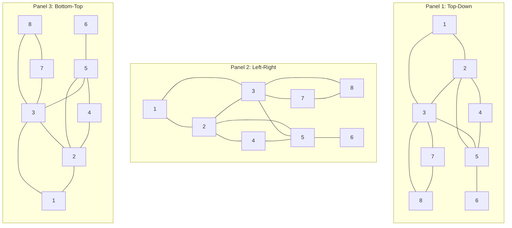

# Grafos: de las relaciones a los recorridos

> [!info] Alcance de esta clase
> Apunte desarrollado a partir de **03Graphs.pdf**, diapositivas **3–24**. El corte es antes del bloque **Testing bipartiteness**, anunciado en la diapositiva 25. Se incluyen definiciones, aplicaciones, representaciones, caminos, ciclos, árboles, BFS, componentes conexas y flood fill. Las pruebas desarrolladas, trazas y ejercicios son explicaciones didácticas añadidas al material. DFS se menciona únicamente para entender la comparación de la diapositiva 24.


## Pregunta centra
![[03Graphs.pdf]]
l

**¿Cómo representamos relaciones entre objetos y encontramos, de manera eficiente, qué objetos podemos alcanzar y cuántos pasos necesitamos?**

El recorrido de ideas es:

1. Elegir qué representa cada **vértice** y cada **arista**.
2. Guardar las relaciones mediante una **matriz** o **listas de adyacencia**.
3. Entender qué significa moverse por **caminos** y regresar mediante **ciclos**.
4. Reconocer los **árboles**, que conectan sin rutas redundantes.
5. Explorar por capas con **BFS** para obtener distancias mínimas.
6. Usar un recorrido para encontrar una **componente conexa** y realizar **flood fill**.

## 1. Un grafo separa objetos y relaciones

*Diapositivas 3–7.*

### 1.1 Desmenuzar la notación

Un grafo se denota por:

$$G=(V,E).$$

- **$G$** es el objeto completo: vértices y conexiones.
- **$V$** es el conjunto de vértices, también llamados nodos. Cada elemento representa un objeto.
- **$E$** es el conjunto de aristas. Cada arista expresa una relación entre dos vértices.
- **$n=|V|$** cuenta los vértices. (Las barras significan cardinalidad: cuántos elementos hay.)
- **$m=|E|$** cuenta las aristas.

En un grafo **no dirigido**, una arista $\{u,v\}$ no distingue origen y destino. Escribiremos $u-v$ para abreviar. Si puedes pasar de $u$ a $v$, también puedes pasar de $v$ a $u$ por esa misma arista.

![[Screenshot 2026-09-19 at 1.35.43 p.m..png|202]]


En los ejemplos de esta clase trabajamos con grafos finitos **simples**: sin lazos de un vértice a sí mismo y sin varias aristas distintas entre el mismo par. Esta convención importa al contar aristas y al interpretar ciclos.

> [!example] El grafo que reutilizaremos
> $$V=\{1,2,3,4,5,6,7,8\}$$
> $$E=\{1-2,1-3,2-3,2-4,2-5,3-5,3-7,3-8,4-5,5-6,7-8\}.$$
> Por tanto, **$n=8$ y $m=11$**. Es el grafo de la diapositiva 3, redibujado en las visualizaciones.


> [!important] **Los dibujos no son grafos en sí, la estructura matemática lo es** 
> Mover el vértice 3 no cambia sus vecinos. Dos líneas que se cruzan tampoco crean un vértice si no hay un nodo explícito en el cruce. Una arista larga en el dibujo sigue costando un salto: aquí no hemos asignado pesos.

Observemos como podemos obtener diferentes representaciones de el mismo grafo.


### 1.2 Vecinos, adyacencia e incidencia

Dos vértices son **adyacentes** o **vecinos** cuando existe una arista que los une directamente. Una arista es **incidente** a cada uno de sus extremos.

El **grado** de $u$, escrito $\deg(u)$, es su número de vecinos en un grafo simple no dirigido.

Por ejemplo:

- Los vecinos de 3 son $\{1,2,5,7,8\}$; por eso $\deg(3)=5$.
- El único vecino de 6 es 5; por eso $\deg(6)=1$.
- 1 y 6 no son vecinos, aunque sí podemos viajar de uno al otro por varios saltos.
- Un vértice de grado cero se llama **aislado**. Sigue contando dentro de $n$.

### 1.3 Antes de resolver, decidir qué modelamos

Las diapositivas muestran redes de correos de Enron, coaliciones de cabildeo ante la FCC y una red social del estudio de Framingham. Sirven para ver que una red puede representar objetos y relaciones muy diferentes. Los colores, tamaños y etiquetas pueden añadir atributos, sin reemplazar la estructura de vértices y aristas.

En el ejemplo de Framingham, los nodos representan personas y las conexiones representan vínculos sociales o familiares. Su uso aquí es ilustrar una representación de datos mediante grafos.

| Aplicación de las diapositivas | Vértice | Arista o relación |
|---|---|---|
| Comunicaciones | Teléfono o computadora | Cable de fibra óptica |
| Circuito | Compuerta, registro o procesador | Cable |
| Sistema mecánico | Articulación | Barra, viga o resorte |
| Finanzas | Acción o moneda | Transacción |
| Transporte | Intersección o aeropuerto | Carretera o ruta aérea |
| Internet | Red | Conexión |
| Juego | Posición del tablero | Movimiento legal |
| Relaciones sociales | Persona o actor | Amistad o participación compartida |
| Red neuronal | Neurona | Sinapsis |
| Red de proteínas | Proteína | Interacción |
| Molécula | Átomo | Enlace |

Una aplicación no fija por sí sola si el grafo es dirigido. Por ejemplo, al modelar correos podemos guardar “hubo comunicación entre estas personas” como relación no dirigida, o guardar quién envió a quién si necesitamos dirección. Aquí estudiamos la primera clase de estructura.

## 2. ¿Cómo guardamos un grafo en memoria?

*Diapositivas 8–9.*

La computadora necesita una estructura concreta para contestar: “¿existe $u-v$?” y “¿quiénes son los vecinos de $u$?”. Dos estructuras representan la misma información, pero sus costos difieren.

### 2.1 Matriz de adyacencia: guardar todas las posibilidades

Construimos una tabla $A$ con $n$ filas y $n$ columnas:

$$
A_{uv}=\begin{cases}
1 & \text{si existe }u-v,\\
0 & \text{si no existe }u-v.
\end{cases}
$$

Para consultar $2-5$:

1. Localizamos la fila 2.
2. Localizamos la columna 5.
3. Leemos $A_{2,5}=1$: la arista existe.
4. También $A_{5,2}=1$, pues es la misma relación sin dirección.

La matriz de nuestro ejemplo es:

```text
      1 2 3 4 5 6 7 8
  1   0 1 1 0 0 0 0 0
  2   1 0 1 1 1 0 0 0
  3   1 1 0 0 1 0 1 1
  4   0 1 0 0 1 0 0 0
  5   0 1 1 1 0 1 0 0
  6   0 0 0 0 1 0 0 0
  7   0 0 1 0 0 0 0 1
  8   0 0 1 0 0 0 1 0
```

**Simetría:** $A_{uv}=A_{vu}$. **Diagonal cero:** $A_{uu}=0$, porque no admitimos lazos. **Dos unos por arista:** uno en cada orientación de consulta; no son dos aristas diferentes.

El espacio es $\Theta(n^2)$ porque reservamos todas las celdas, incluso las que contienen cero. Consultar una celda cuesta $\Theta(1)$, suponiendo vértices indexados. Enumerar los vecinos de una fila cuesta $\Theta(n)$; enumerar todas las aristas escaneando la matriz cuesta $\Theta(n^2)$. Revisar solo el triángulo superior evita reportar duplicados, pero conserva el orden cuadrático.

### 2.2 Listas de adyacencia: guardar los vecinos que sí existen

Guardamos un arreglo indexado por vértice y, en cada entrada, una lista de sus vecinos:

```text
Adj[1] = [2, 3]
Adj[2] = [1, 3, 4, 5]
Adj[3] = [1, 2, 5, 7, 8]
Adj[4] = [2, 5]
Adj[5] = [2, 3, 4, 6]
Adj[6] = [5]
Adj[7] = [3, 8]
Adj[8] = [3, 7]
```

Ordenamos los vecinos numéricamente para que las trazas sean reproducibles. La diapositiva presenta algunos en otro orden: **el orden de una lista no cambia las aristas del grafo**.
![[Screenshot 2026-09-19 at 1.41.28 p.m..png|306]]

La arista $2-5$ aparece como 5 en `Adj[2]` y como 2 en `Adj[5]`. Nuevamente son dos registros de una sola arista.

Para saber si existe $3-8$, recorremos `Adj[3]` hasta encontrar 8 o terminar. En una lista ordinaria cuesta $O(\deg(3))$; no suponemos una tabla hash ni búsqueda binaria. Si encontramos el vecino pronto, la consulta concreta puede ser más rápida que el peor caso.

### 2.3 ¿De dónde sale $n+m$?

Necesitamos $n$ entradas principales, incluyendo las de vértices aislados. El total de entradas de vecinos es:

$$\sum_{u\in V}\deg(u)=2m.$$

Cada arista tiene dos extremos, así que contribuye una unidad al grado de cada extremo. En el ejemplo:

$$2+4+5+2+4+1+2+2=22=2(11).$$

Por ello, el espacio es $\Theta(n+2m)=\Theta(n+m)$. **Quitar el factor 2 en notación asintótica no significa que la segunda copia desaparezca de la implementación.**

| Operación | Matriz | Listas ordinarias |
|---|---:|---:|
| Espacio | $\Theta(n^2)$ | $\Theta(n+m)$ |
| Consultar si existe $u-v$ | $\Theta(1)$ | $O(\deg(u))$ |
| Enumerar vecinos de $u$ | $\Theta(n)$ | $\Theta(1+\deg(u))$ |
| Enumerar todas las aristas | $\Theta(n^2)$ | $\Theta(n+m)$ |

El $1$ de $\Theta(1+\deg(u))$ incluye acceder a la lista aunque esté vacía. A menudo se abrevia como tiempo proporcional al grado.

Un grafo **disperso** tiene pocas aristas frente a las $n(n-1)/2$ posibles; las listas suelen ahorrar espacio. En un grafo **denso**, $m=\Theta(n^2)$, por lo que ambos espacios tienen orden cuadrático. Elegimos según las operaciones que necesitamos.

### Visualización: construir y consultar la representación

Avanza primero por las once aristas y después por cada vértice. Compara las aristas resaltadas, la fila de la matriz y la lista de vecinos. La idea central es que **la matriz reserva ausencias; las listas enumeran presencias**.

<iframe src="../../algoritmos/recursos/grafos-paso-a-paso/01-representaciones.htm" style="width:100%;height:600px;border:1px solid var(--lightgray);border-radius:4px;" loading="lazy"></iframe>

## 3. Caminos, conectividad y ciclos

*Diapositivas 10–11.*

### 3.1 Un camino es una secuencia comprobable

Las diapositivas llaman *path* a una secuencia $v_1,v_2,\ldots,v_k$ donde cada pareja consecutiva está unida por una arista y las aristas utilizadas son distintas.

![[Screenshot 2026-09-19 at 2.05.30 p.m..png|370]]

Para comprobar $1,2,4,5,6$:

1. $1-2$ existe.
2. $2-4$ existe.
3. $4-5$ existe.
4. $5-6$ existe.
5. No repetimos ninguna arista.

La **longitud** es el número de aristas recorridas: aquí es 4, aunque escribimos 5 vértices. En general, una secuencia de $k$ vértices tiene $k-1$ saltos.

Un grafo no dirigido es **conexo** si para cada par de nodos $u$ y $v$, existe un camino entre $u$ y $v$

Un camino es **simple** si todos sus vértices son distintos. El ejemplo anterior es simple.

> [!note] Convención de vocabulario
> Algunos libros llaman “recorrido” a una secuencia que puede repetir aristas, “sendero” a una que no repite aristas y “camino” a una que no repite vértices. Aquí seguimos la definición explícita de las diapositivas y añadimos “simple” cuando no se repiten vértices. Así evitamos mezclar convenciones.

Un ejemplo que repite un vértice sin repetir aristas es **$2,1,3,2,4$**: repite 2, usa cuatro aristas distintas y termina en 4. Es un camino bajo la convención de las diapositivas, pero no es simple.


### 3.2 Conexo no significa completo

![[Screenshot 2026-09-19 at 2.05.30 p.m..png|370]]

Un grafo es **conexo** cuando para cualquier par $u,v$ existe algún camino que los une. **No exige una arista directa entre todos los pares.**

- 1 y 6 no son adyacentes.
- Sí existe $1-2-5-6$.
- Por eso la ausencia de $1-6$ no implica desconexión.

Un grafo **completo** sí contiene todas las aristas entre pares distintos. Ser completo es una condición mucho más fuerte que ser conexo.

### 3.3 Un ciclo regresa al comienzo

Un ciclo, con la convención de las diapositivas, es:

> Un ciclo es un camino $v_1, v_2, \dots, v_k$ en el cual $v_1 = v_k$, los primeros $k - 1$ nodos son distintos, y **$k \ge 2$**"

es decir, un camino cuya primera y última etiqueta coinciden. Es **simple** si los demás vértices no se repiten.

![[Screenshot 2026-09-19 at 2.13.27 p.m..png|265]]

El ejemplo de la diapositiva 11 es:

$$1\to2\to4\to5\to3\to1.$$

Tiene cinco aristas, comienza y termina en 1, y no repite ningún otro vértice. Por eso es un ciclo simple de longitud 5.

**$1\to2\to1$ no es un ciclo en nuestro grafo simple:** usa dos veces la misma arista no dirigida. Aunque la diapositiva escribe una condición general $k\ge2$ para la secuencia cerrada, junto con “aristas distintas” y la ausencia de lazos o aristas paralelas, el ciclo mínimo en estos grafos tiene tres aristas.

### Visualización: validar un salto a la vez

Recorre un camino simple y después cierra el ciclo de la diapositiva. Los últimos pasos muestran dos errores: saltar entre no vecinos y reutilizar la misma arista de ida y vuelta.

<iframe src="../../algoritmos/recursos/grafos-paso-a-paso/02-caminos-ciclos.htm" style="width:100%;height:600px;border:1px solid var(--lightgray);border-radius:4px;" loading="lazy"></iframe>

## 4. Árboles: conectar sin ciclos

*Diapositivas 12–15.*

### 4.1 Las dos condiciones de la definición

Un **árbol** es un grafo no dirigido que:

1. Es **conexo**: no quedan partes separadas.
2. Es **acíclico**: no contiene ciclos.

![[Screenshot 2026-09-19 at 2.21.51 p.m..png|312]]

Un grafo sin ciclos puede estar desconectado; entonces es un **bosque**. Por ejemplo, dos aristas separadas forman un bosque, pero no un árbol.

En un árbol hay **exactamente un camino simple entre cada par de vértices**. Existe porque es conexo. Si hubiera dos caminos simples distintos, su separación y posterior reunión permitirían formar un ciclo.

Dos consecuencias prácticas:

- Quitar cualquier arista de un árbol lo desconecta: no existe una ruta alternativa entre sus extremos.
- Agregar una arista entre dos vértices no adyacentes crea un ciclo: la nueva arista cierra el camino que ya existía entre ellos.

### 4.2 Teorema: Caracterización de los árboles

> [!warning] Tener $n-1$ aristas no basta por sí solo
> Un triángulo más un vértice aislado tiene $n=4$ y $m=3=n-1$. Sin embargo, contiene un ciclo y está desconectado. Para aplicar el teorema necesitamos una segunda propiedad.


Sea $G=(V,E)$ un grafo simple, no dirigido, con $n=|V|\geq 1$ vértices. Consideremos las siguientes propiedades:

- **A:** $G$ es conexo.
- **B:** $G$ no contiene ciclos.
- **C:** $G$ tiene exactamente $n-1$ aristas.

**Teorema.** Cualesquiera dos de las propiedades anteriores implican la tercera.

Antes de demostrarlo, estableceremos un lema que caracteriza cuándo la adición de una arista produce un ciclo.

#### 4.2.1. Lema: Formación de ciclos al añadir una arista

**Lema.** Sea $G=(V,E)$ un grafo simple no dirigido y sean $u,v\in V$ dos vértices distintos tales que $\{u,v\}\notin E$.

Al añadir la arista $\{u,v\}$ al grafo, se forma un nuevo ciclo si y solo si ya existía un camino entre $u$ y $v$.

### Demostración

**$(\Leftarrow)$ Supongamos que existe un camino entre $u$ y $v$.**

Podemos considerar un camino simple de la forma

$$
u=v_0,v_1,\ldots,v_k=v.
$$

Al añadir la arista $\{u,v\}$, cerramos dicho camino, formando un ciclo.

<svg viewBox="0 0 320 145" width="100%" xmlns="http://www.w3.org/2000/svg">
  <g stroke-width="2.5" fill="none">
    <path d="M34 100 L96 35 L162 35 L224 35 L287 100" stroke="#147dba"/>
    <path d="M34 100 L287 100" stroke="#d97706" stroke-dasharray="6 4"/>
  </g>
  <g fill="#147dba" stroke="#ffffff" stroke-width="1">
    <circle cx="34" cy="100" r="11"/>
    <circle cx="96" cy="35" r="11"/>
    <circle cx="162" cy="35" r="11"/>
    <circle cx="224" cy="35" r="11"/>
    <circle cx="287" cy="100" r="11"/>
  </g>
  <g fill="currentColor" font-size="12" text-anchor="middle">
    <text x="34" y="125">u</text>
    <text x="287" y="125">v</text>
    <text x="162" y="15">Camino existente</text>
    <text x="162" y="91">Nueva arista</text>
  </g>
</svg>

La nueva arista, representada en naranja, cierra el camino que ya conectaba a los vértices $u$ y $v$.

**$(\Rightarrow)$ Supongamos que al añadir $\{u,v\}$ se forma un nuevo ciclo.**

Dicho ciclo necesariamente contiene la nueva arista, pues, de lo contrario, ya habría existido en el grafo original.

Al eliminar la arista $\{u,v\}$ del nuevo ciclo, obtenemos un camino entre $u$ y $v$ cuyas aristas pertenecían al grafo original.

Por tanto, ya existía un camino entre ambos vértices antes de añadir la arista.

En consecuencia,

$$
\boxed{
\begin{gathered}
\text{Añadir }\{u,v\}\text{ forma un ciclo}\\
\iff\\
\text{Ya existe un camino entre }u\text{ y }v.
\end{gathered}
}
$$

$\square$

#### Consecuencia del lema

Al construir un grafo añadiendo aristas una por una, existen dos posibilidades:

1. Si los extremos de la nueva arista pertenecen a **componentes conexas distintas**, la arista une dichas componentes sin formar un ciclo.

2. Si sus extremos pertenecen a **la misma componente conexa**, ya existe un camino entre ellos y, por tanto, la nueva arista forma un ciclo.

Además, cada arista añadida puede reducir el número de componentes conexas, como máximo, en una unidad.

Esta observación será fundamental para demostrar el teorema.

#### 4.2.2. Demostración del teorema

##### Primera implicación: $A+B\implies C$

**Hipótesis:**
- $G$ es conexo.
- $G$ no contiene ciclos.

**Tesis:** $G$ tiene exactamente $n-1$ aristas.

**Demostración.**

Consideremos inicialmente los $n$ vértices de $G$ sin ninguna arista.

En este estado, el grafo tiene exactamente $n$ componentes conexas, cada una formada por un solo vértice.

Construyamos ahora el grafo $G$ añadiendo sus aristas una por una, en cualquier orden.

Como $G$ no contiene ciclos, ninguna arista añadida puede conectar dos vértices que ya estén unidos por un camino. En caso contrario, por el lema anterior, se formaría un ciclo, contradiciendo nuestra hipótesis.

Por tanto, cada nueva arista une dos componentes conexas distintas y reduce exactamente en una unidad el número de componentes conexas.

Si denotamos por $m=|E|$ el número total de aristas, después de añadirlas todas tendremos

$$
k=n-m
$$

componentes conexas.

Pero, por hipótesis, $G$ es conexo, por lo que tiene exactamente una componente conexa. En consecuencia,

$$
n-m=1.
$$

Despejando el número de aristas, obtenemos

$$
\boxed{|E|=n-1}.
$$

Por tanto,

$$
\boxed{A+B\implies C}.
$$

$\square$

---

##### Segunda implicación: $A+C\implies B$

**Hipótesis:**

- $G$ es conexo.
- $G$ tiene exactamente $n-1$ aristas.

**Tesis:** $G$ no contiene ciclos.

**Demostración por contradicción.**

Supongamos que $G$ contiene al menos un ciclo.

Seleccionemos una arista cualquiera $\{u,v\}$ perteneciente a dicho ciclo y eliminémosla del grafo.

Al eliminar esta arista, los vértices $u$ y $v$ permanecen conectados mediante el camino alternativo formado por las demás aristas del ciclo.

Además, cualquier camino que utilizara la arista eliminada puede sustituirla por dicho camino alternativo.

En consecuencia, el nuevo grafo

$$
G'=(V,E\setminus\{\{u,v\}\})
$$

continúa siendo conexo.

Sin embargo, su número de aristas es

$$
\begin{aligned}
|E'|
&=|E|-1\\
&=(n-1)-1\\
&=n-2.
\end{aligned}
$$

**Observemos ahora que todo grafo conexo con $n$ vértices necesita al menos $n-1$ aristas.**

En efecto, si comenzamos con $n$ vértices aislados, tenemos $n$ componentes conexas.

Cada arista añadida puede reducir el número de componentes conexas, como máximo, en una unidad.

Para pasar de $n$ componentes conexas a una sola, necesitamos reducir su número en $n-1$ unidades. Por tanto, se requieren al menos $n-1$ aristas.

Pero el grafo $G'$ es conexo y solamente tiene $n-2$ aristas, lo cual contradice este resultado.

En consecuencia, nuestra suposición de que $G$ contiene un ciclo es falsa.

Por tanto, $G$ no contiene ciclos y concluimos que

$$
\boxed{A+C\implies B}.
$$

$\square$

---

##### Tercera implicación: $B+C\implies A$

**Hipótesis:**

- $G$ no contiene ciclos.
- $G$ tiene exactamente $n-1$ aristas.

**Tesis:** $G$ es conexo.

**Demostración por contradicción.**

Supongamos que $G$ no es conexo.

Entonces, existen $k\geq 2$ componentes conexas, que denotaremos por

$$
G_1,G_2,\ldots,G_k.
$$

Sea $n_i$ el número de vértices de la componente $G_i$.

Como las componentes conexas forman una partición del conjunto de vértices de $G$, tenemos

$$
\sum_{i=1}^{k}n_i=n.
$$

Además, cada componente $G_i$ es conexa por definición y no contiene ciclos, pues el grafo original tampoco los contiene.

Por la primera implicación que demostramos, cada componente tiene exactamente $n_i-1$ aristas.

Como no existen aristas entre componentes conexas distintas, el número total de aristas de $G$ es

$$
\begin{aligned}
|E|
&=\sum_{i=1}^{k}(n_i-1)\\
&=\sum_{i=1}^{k}n_i-\sum_{i=1}^{k}1\\
&=n-k.
\end{aligned}
$$

Pero, por hipótesis, sabemos que

$$
|E|=n-1.
$$

Igualando ambas expresiones, obtenemos

$$
n-k=n-1.
$$

Por tanto,

$$
k=1.
$$

Esto contradice nuestra suposición de que el grafo tenía al menos dos componentes conexas.

En consecuencia, $G$ es conexo y concluimos que

$$
\boxed{B+C\implies A}.
$$

$\square$

---

#### 4.2.3. Interpretación: ¿Por qué no basta contar las aristas?

Recordemos que el número máximo de aristas que puede tener un grafo simple no dirigido con $n$ vértices es

$$
\binom{n}{2}=\frac{n(n-1)}{2}.
$$

Sin embargo, para conectar sus $n$ vértices se necesitan al menos $n-1$ aristas.

Es importante observar que **tener exactamente $n-1$ aristas no garantiza, por sí solo, que el grafo sea conexo o que no contenga ciclos**.

Por ejemplo, consideremos el siguiente grafo:

<svg viewBox="0 0 320 155" width="100%" xmlns="http://www.w3.org/2000/svg">
  <g stroke="currentColor" stroke-width="2" fill="none">
    <path d="M45 105 L100 24 L155 105 L45 105"/>
    <path d="M236 48 L285 105"/>
  </g>
  <g fill="#147dba" stroke="#ffffff" stroke-width="1.2">
    <circle cx="45" cy="105" r="13"/>
    <circle cx="100" cy="24" r="13"/>
    <circle cx="155" cy="105" r="13"/>
    <circle cx="236" cy="48" r="13"/>
    <circle cx="285" cy="105" r="13"/>
  </g>
  <g fill="white" text-anchor="middle" font-size="11" font-weight="600">
    <text x="45" y="109">1</text>
    <text x="100" y="28">2</text>
    <text x="155" y="109">3</text>
    <text x="236" y="52">4</text>
    <text x="285" y="109">5</text>
  </g>
</svg>

Este grafo tiene $n=5$ vértices y $m=4=n-1$ aristas.

No obstante, contiene un ciclo formado por los vértices $1,2,3$ y tiene dos componentes conexas.

Por tanto, no basta con establecer que un grafo tiene $n-1$ aristas: es necesario imponer alguna de las otras dos propiedades para garantizar que sea un árbol.

---

#### 4.2.4. Corolario: Identidad fundamental de los bosques

**Corolario.** Sea $G$ un grafo no dirigido sin ciclos, con $n$ vértices, $m$ aristas y $k$ componentes conexas. Entonces,

$$
\boxed{m=n-k}.
$$

**Demostración.**

Cada componente conexa $G_i$ de $G$ es un árbol, pues es conexa y no contiene ciclos.

Si la componente $G_i$ tiene $n_i$ vértices, por la primera implicación del teorema tiene exactamente $n_i-1$ aristas.

Sumando sobre todas las componentes,

$$
\begin{aligned}
m
&=\sum_{i=1}^{k}(n_i-1)\\
&=\sum_{i=1}^{k}n_i-k\\
&=n-k.
\end{aligned}
$$

Por tanto,

$$
\boxed{m=n-k}.
$$

$\square$

**Interpretación.**

Un grafo sin ciclos recibe el nombre de *bosque*. Si además es conexo, recibe el nombre de *árbol*.

En particular:

- Si $k=1$, el grafo es conexo y tiene exactamente $m=n-1$ aristas.
- Si $k\geq2$, el grafo es disconexo y tiene, como máximo, $m=n-2$ aristas.

La identidad $m=n-k$ establece una relación directa entre el número de aristas y el número de componentes conexas de cualquier bosque.


### 4.3 Elegir una raíz organiza la misma estructura

Un **árbol enraizado** es un árbol al que elegimos un vértice $r$ como raíz. Podemos orientar conceptualmente cada arista alejándonos de $r$ para representar una jerarquía.

- La **raíz** no tiene padre.
- El **padre** de $v\ne r$ es su vecino en el camino único hacia la raíz.
- Los **hijos** de $v$ son los vértices cuyo padre es $v$.
- Un **ancestro** aparece en el camino hacia la raíz.
- Un **descendiente** queda debajo al seguir relaciones de hijos.
- La **profundidad** es la cantidad de aristas desde la raíz.
- Una **hoja** del árbol enraizado no tiene hijos. En un árbol no enraizado de al menos dos nodos, una hoja es un vértice de grado 1.

En el árbol de nueve nodos de la diapositiva 13, con raíz 1:

![[Screenshot 2026-09-19 at 3.59.19 p.m..png]]


El padre de 7 es 1, sus hijos son 8 y 9, y la profundidad de 9 es 2. Si elegimos otra raíz, pueden cambiar padres, hijos y profundidades; las aristas originales no cambian.

Las diapositivas ilustran árboles con una filogenia y con la jerarquía de contención de componentes de una interfaz gráfica. En ambos casos, la estructura permite expresar cómo se organizan elementos en niveles.

### Visualización: cambiar de raíz y romper las condiciones

Compara las raíces 1, 2 y 7 en la tabla. Después agrega una arista y elimina otra en escenas separadas: observa por qué aparecen un ciclo o una desconexión.

<iframe src="../../algoritmos/recursos/grafos-paso-a-paso/03-arboles.htm" style="width:100%;height:600px;border:1px solid var(--lightgray);border-radius:4px;" loading="lazy"></iframe>

## 5. Dos preguntas distintas: alcanzar y llegar con menos saltos

*Diapositiva 17.*

Dados un origen $s$ y un destino $t$:

- **Conectividad $s$–$t$:** ¿existe un camino? La respuesta es sí o no.
- **Camino más corto $s$–$t$:** ¿cuál es el mínimo número de aristas necesario? También podemos pedir una ruta que alcance ese mínimo.

Escribimos $d(s,t)$ para esa distancia. Si $s=t$, la distancia es cero: no necesitamos movernos. Si no existe un camino, usamos $\infty$ como marca de inalcanzabilidad.

En el grafo de ocho vértices, $1-2-4-5-6$ demuestra que 6 es alcanzable, pero su longitud 4 no es mínima. La ruta $1-2-5-6$ usa solo 3 aristas.

Las aplicaciones de las diapositivas son conexiones en una red social, recorrer un laberinto, el número de Kevin Bacon —actores vinculados por películas compartidas— y minimizar saltos en una red de comunicaciones.

**En esta clase cada arista vale un salto.** Si distintas aristas tuvieran costos diferentes, minimizar saltos no necesariamente minimizaría el costo total.

## 6. BFS: explorar por capas

*Diapositivas 18–20.*

### 6.1 Intuición desde cero

**BFS**, *breadth-first search* o búsqueda en anchura, descubre primero lo que está a un salto, luego lo que está a dos, después a tres, etc.

![[Screenshot 2026-09-19 at 4.03.37 p.m..png]]

Construimos capas:

$$L_0=\{s\}.$$

$L_1$ contiene los vecinos de $s$ todavía no descubiertos. $L_2$ contiene los vecinos de $L_1$ que no pertenecen a ninguna capa anterior. En general:

$$L_{i+1}=\{v\notin L_0\cup\cdots\cup L_i:\exists u\in L_i\text{ con }u-v\in E\}.$$

Leamos la fórmula por partes:

1. Elegimos un vértice $v$ que **no hayamos asignado** a una capa.
2. Buscamos un vecino $u$ en la capa actual $L_i$.
3. Si existe, podemos llegar a $v$ dando un paso adicional.
4. Colocamos $v$ en $L_{i+1}$ una sola vez, aunque varios nodos lo descubran.

### 6.2 Las capas del ejemplo desde 1

![[Screenshot 2026-09-19 at 4.04.32 p.m..png]]

| Capa | Vértices | Cómo aparecen |
|---|---|---|
| $L_0$ | $\{1\}$ | Es el origen |
| $L_1$ | $\{2,3\}$ | Son los vecinos de 1 |
| $L_2$ | $\{4,5,7,8\}$ | Son nuevos vecinos de 2 o 3 |
| $L_3$ | $\{6\}$ | Es un nuevo vecino de 5 |
| $L_4$ | $\varnothing$ | No queda nada nuevo |

Por ejemplo, 5 aparece como vecino de 2 y también de 3. Eso no produce dos copias de 5. Además, 2 y 3 son vecinos entre sí, pero ya estaban descubiertos: no los volvemos a colocar en $L_2$.

### 6.3 Implementación: una cola mantiene el orden de las capas

Una **cola FIFO** atiende primero al que entró primero. Agregamos al final y retiramos del frente.

Guardamos:

| Estructura | Significado |
|---|---|
| `dist[v]` | Distancia desde el origen; $\infty$ indica no descubierto |
| `padre[v]` | Desde qué vértice descubrimos a `v` |
| `Q` | Descubiertos que esperan ser procesados |

**Descubrir** es encontrar por primera vez y encolar. **Procesar** es retirar de la cola y revisar sus vecinos. Son momentos diferentes.

```text
BFS(G, s):
    para cada v en V:
        dist[v] = infinito
        padre[v] = nulo

    dist[s] = 0
    Q = cola vacía
    encolar(Q, s)

    mientras Q no esté vacía:
        u = desencolar(Q)
        para cada v en Adj[u]:
            si dist[v] == infinito:
                dist[v] = dist[u] + 1
                padre[v] = u
                encolar(Q, v)

    devolver dist, padre
```

**Marcamos antes de encolar.** Al asignar una distancia finita, cualquier otro vecino reconocerá que el vértice ya fue descubierto. Marcar solo al retirarlo permitiría insertar copias innecesarias mientras espera en la cola.

### 6.4 Traza resumida desde 1

Con listas en orden numérico, después de inicializar `Q=[1]`:

| Vértice retirado | Nuevos descubrimientos | Cola después de revisar sus vecinos |
|---|---|---|
| 1 | 2, 3 | `[2,3]` |
| 2 | 4, 5 | `[3,4,5]` |
| 3 | 7, 8 | `[4,5,7,8]` |
| 4 | Ninguno | `[5,7,8]` |
| 5 | 6 | `[7,8,6]` |
| 7 | Ninguno | `[8,6]` |
| 8 | Ninguno | `[6]` |
| 6 | Ninguno | `[]` |

La cola puede contener el final de una capa y el comienzo de la siguiente, pero nadie de la siguiente se procesa antes de terminar la anterior.

El resultado es:

| $v$ | 1 | 2 | 3 | 4 | 5 | 6 | 7 | 8 |
|---|---|---|---|---|---|---|---|---|
| `dist[v]` | 0 | 1 | 1 | 2 | 2 | 3 | 2 | 2 |
| `padre[v]` | — | 1 | 1 | 2 | 2 | 5 | 3 | 3 |

Las aristas de padre forman el **árbol BFS**: $1-2,1-3,2-4,2-5,5-6,3-7,3-8$. El árbol utiliza siete de las once aristas. Las otras cuatro siguen en el grafo; el recorrido no las elimina.

Cambiar el orden de los vecinos puede cambiar el padre de un vértice cuando hay varios caminos mínimos. No cambia la distancia mínima ni la capa a la que pertenece.

### 6.5 Recuperar un camino a partir de los padres

Para reconstruir un camino de 1 a 6:

1. Comenzamos en 6.
2. `padre[6]=5`: retrocedemos a 5.
3. `padre[5]=2`: retrocedemos a 2.
4. `padre[2]=1`: llegamos al origen.
5. Invertimos $6,5,2,1$ para obtener **$1,2,5,6$**.

Son tres aristas. También $1,3,5,6$ es mínimo, aunque nuestra elección de padres almacenó la otra ruta. Si `dist[t]` es infinita, no intentamos seguir padres: no hay camino desde este origen.

### Visualización: cada consulta del algoritmo

Usa “Siguiente” para ver una sola operación, o el selector para saltar a una escena. El recorrido contiene **dos ejecuciones completas**, desde 1 y desde 6. Observa la cola, las consultas que no descubren nada, los padres y el contador que termina en 22.

La idea central es que **descubrir un vértice una sola vez no impide examinar todas las conexiones que llegan a él**.

<iframe src="../../algoritmos/recursos/grafos-paso-a-paso/04-bfs.htm" style="width:100%;height:600px;border:1px solid var(--lightgray);border-radius:4px;" loading="lazy"></iframe>

### 6.6 Por qué las capas son distancias mínimas

**Teorema:** $L_i$ contiene exactamente los vértices cuya distancia desde $s$ es $i$.

Demostración por inducción, desarrollando la afirmación de la diapositiva 18:

1. **Base:** $L_0=\{s\}$ y la distancia de $s$ a sí mismo es cero.
2. **Hipótesis:** las capas hasta $L_i$ contienen exactamente los vértices a esas distancias.
3. **Lo que agregamos sí está a distancia $i+1$:** si $v\in L_{i+1}$, lo descubrimos desde un vecino $u\in L_i$. Un camino de longitud $i$ hasta $u$, más $u-v$, da longitud $i+1$. No puede existir uno de longitud menor, porque entonces $v$ pertenecería a una capa anterior por la hipótesis.
4. **No omitimos ningún vértice a distancia $i+1$:** toma un camino mínimo de longitud $i+1$ hasta $v$. El penúltimo vértice $u$ está a distancia exactamente $i$; si llegáramos antes a $u$, también llegaríamos antes a $v$. Por hipótesis, $u\in L_i$, y al revisar sus vecinos descubriremos $v$.

Así probamos ambas inclusiones, no solo que BFS produce algún camino. En consecuencia, $t$ es alcanzable **si y solo si aparece en alguna capa**.

### 6.7 Una arista no puede saltarse dos capas

La diapositiva 19 afirma que, para una arista $x-y$ de la componente explorada:

$$|d(s,x)-d(s,y)|\le1.$$

Supón que $x$ está en la capa $i$. Llegar a $x$ y dar un paso a $y$ produce un camino de longitud $i+1$, por lo que $d(s,y)\le i+1$. Como la arista no tiene dirección, también podemos intercambiar $x$ y $y$. Juntas, ambas desigualdades limitan la diferencia a uno.

Una arista puede unir vértices de **la misma capa**: $2-3$ une dos vértices de $L_1$. También puede unir **capas consecutivas**: $5-6$ une $L_2$ y $L_3$. No puede unir $L_0$ y $L_3$; esa arista daría un atajo y el supuesto nivel 3 sería incorrecto.

### 6.8 Por qué el tiempo es $O(n+m)$ y no necesariamente $O(n^2)$

Contemos trabajo real usando listas de adyacencia:

1. Inicializar distancias y padres cuesta $O(n)$.
2. Cada vértice se encola como máximo una vez y se retira como máximo una vez: $O(n)$.
3. Procesar $u$ recorre $\deg(u)$ entradas de vecinos, no $n$ entradas por obligación.
4. La suma de grados en todo el grafo es $2m$.
5. Cada consulta hace trabajo constante: prueba de descubrimiento y, si corresponde, asignaciones y operación de cola.

$$T(n,m)=O(n)+O(n)+O\left(\sum_{u\in V}\deg(u)\right)=O(n+m).$$

La cota $O(n^2)$ de las diapositivas es válida, pero puede ser holgada: multiplica hasta $n$ vértices por hasta $n$ posibles vecinos. Sumar los tamaños reales de las listas explica la cota más precisa.

En nuestro ejemplo se procesan 8 vértices y se examinan 22 entradas de vecinos. Esto **no quiere decir que todo el programa ejecute exactamente 30 instrucciones**: cada operación abstracta involucra trabajo constante adicional.

Con la inicialización completa del pseudocódigo, si solo visitamos una componente $C$, el costo más preciso es $O(n+|E_C|)$, pues $|V_C|\le n$. La cota general sigue siendo $O(n+m)$. Si recorremos todo un grafo conexo, el costo de esta implementación es $\Theta(n+m)$.

La memoria **adicional** es $O(n)$ para cola, distancias y padres. Sumando el almacenamiento del grafo, el espacio total con listas es $O(n+m)$.

> [!warning] La representación y la cola son parte del análisis
> Con matriz, procesar un nodo exige examinar una fila de $n$ celdas. Un recorrido que procesa todos los vértices cuesta $\Theta(n^2)$. Además, la cola debe permitir insertar y retirar en tiempo constante: una cola circular o deque sirve. Quitar siempre la primera posición de un arreglo desplazando el resto puede añadir trabajo que invalida el análisis lineal.

## 7. Componentes conexas: todo lo alcanzable

*Diapositivas 21 y 24.*

### 7.1 Una componente es un grupo maximal conectado

La **componente conexa que contiene a $s$** es el conjunto de todos los vértices alcanzables desde $s$, con las aristas del grafo entre ellos.

“Maximal” quiere decir que no podemos agregar otro vértice del grafo manteniendo la conectividad de ese grupo. No quiere decir que deba ser la componente más grande.

![[Screenshot 2026-09-19 at 7.23.18 p.m..png|566]]

En el dibujo de la diapositiva 21:

$$C_1=\{1,2,3,4,5,6,7,8\},\qquad C_2=\{9,10\},\qquad C_3=\{11,12,13\}.$$

Las dos aristas de la última componente son $11-12$ y $12-13$. No hay aristas entre las tres componentes. BFS desde 1 solo visita $C_1$; no tiene forma de “saltar” a 9. Un vértice aislado también sería una componente válida, de tamaño uno.

### 7.2 El algoritmo general de expansión

Podemos encontrar la componente sin fijar todavía el orden de exploración:

```text
R = {s}
mientras exista una arista u-v con u en R y v fuera de R:
    agregar v a R
```

Aquí $R$ significa “vértices alcanzados”. La regla es segura porque, si ya existe un camino hasta $u$, podemos prolongarlo con $u-v$.

**Corrección, paso a paso:**

1. Inicialmente $R=\{s\}$ solo contiene un alcanzable: el propio origen.
2. Cada inserción conserva el invariante “todo vértice de $R$ es alcanzable desde $s$”.
3. Cada paso agrega un vértice nuevo, así que el proceso termina tras como máximo $n-1$ inserciones.
4. Al terminar no puede faltar un alcanzable. Si faltara $t$, toma un camino de $s$ a $t$ y busca el primer vértice de ese camino fuera de $R$.
5. Su predecesor está dentro de $R$, por lo que habría una arista de dentro hacia fuera. Eso contradice la condición de terminación.

Por tanto, el conjunto final contiene **todos y solo** los alcanzables.

Esta descripción abstracta no garantiza por sí sola tiempo lineal: buscar desde cero una arista de salida en cada iteración podría repetir mucho trabajo. BFS concreta una estrategia eficiente mediante cola y listas.

### 7.3 BFS y la mención de DFS

BFS elige qué explorar en orden de distancia desde el origen. DFS, búsqueda en profundidad, explora avanzando por una rama antes de retroceder. Ambos pueden encontrar la componente; la garantía de distancias mínimas en número de aristas que demostramos aquí corresponde a BFS. La diapositiva 24 solo contrasta las estrategias: no desarrolla DFS.

Para obtener **todas** las componentes, recorremos los vértices y lanzamos una búsqueda cuando encontramos uno aún no visitado. Conservamos las marcas entre búsquedas: así cada vértice y cada lista se procesan una sola vez y el total sigue siendo $O(n+m)$.

### Visualización: observar la frontera de $R$

Cada escena agrega un vértice a través de una arista que cruza de dentro hacia fuera. Al agotarse esas aristas, hemos completado una componente. Las escenas siguientes comienzan búsquedas nuevas en los otros grupos.

<iframe src="../../algoritmos/recursos/grafos-paso-a-paso/05-componentes.htm" style="width:100%;height:600px;border:1px solid var(--lightgray);border-radius:4px;" loading="lazy"></iframe>

## 8. Flood fill: una imagen también puede ser un grafo

*Diapositivas 22–23.*

La herramienta de relleno cambia el color de **una mancha conectada** a partir de un píxel elegido.

### 8.1 Traducir imagen a grafo

1. Un **vértice** representa un píxel del color original que queremos reemplazar.
2. Una **arista** conecta dos píxeles vecinos de ese mismo color.
3. El **origen** es el píxel donde hacemos clic.
4. La **componente** del origen es la mancha que debemos recolorear.

Debemos precisar la vecindad. En el ejemplo interactivo usamos **cuatro vecinos**: arriba, abajo, izquierda y derecha, siempre dentro de la imagen. El contacto diagonal no conecta. Otra aplicación podría usar ocho vecinos, incluyendo diagonales; cambiar esta regla cambia el grafo y posiblemente las manchas.

### 8.2 Procedimiento con BFS

```text
rellenar(imagen, s, nuevo):
    original = color(s)
    si original == nuevo:
        terminar

    cambiar color(s) a nuevo
    Q = cola con s

    mientras Q no esté vacía:
        u = desencolar(Q)
        para cada vecino v de u dentro de la imagen:
            si color(v) == original:
                cambiar color(v) a nuevo
                encolar(Q, v)
```

Cambiar el color antes de encolar funciona como marca de descubrimiento: ese píxel ya no satisface la condición de color original. Si preferimos conservar la imagen intacta durante el recorrido, podemos usar un conjunto de visitados separado.

La comprobación `original == nuevo` evita que el cambio de color deje de funcionar como marca. Tampoco necesitamos construir una matriz o lista de adyacencia explícita: calculamos los vecinos a partir de las coordenadas.

Si la mancha tiene $k$ píxeles y cada uno tiene como máximo cuatro vecinos, procesarla cuesta $O(k)$ y la cola puede requerir $O(k)$ espacio. Si además recorremos o copiamos toda la imagen de $H\times W$ píxeles, ese trabajo adicional cuesta $O(HW)$.

### Visualización: rellenar solo la mancha del origen

Los nodos representan píxeles del color original y las líneas su vecindad horizontal o vertical. Se marca y procesa la mancha conectada al nodo 1; los nodos 9, 10 y 11 quedan separados aunque su color original sea el mismo. Es una cuadrícula didáctica añadida, no una copia de la imagen de las diapositivas.

<iframe src="../../algoritmos/recursos/grafos-paso-a-paso/06-flood-fill.htm" style="width:100%;height:600px;border:1px solid var(--lightgray);border-radius:4px;" loading="lazy"></iframe>

## 9. Comprobación de comprensión

Intenta contestar antes de desplegar las soluciones.

1. ¿Por qué las listas contienen 22 entradas de vecinos si hay 11 aristas?
2. ¿Cuál es la longitud de $1-3-5-6$? ¿Es simple? ¿Es mínimo desde 1 a 6?
3. ¿Por qué $1-2-1$ no es un ciclo válido bajo las convenciones de esta clase?
4. Un grafo de 9 vértices tiene 8 aristas: ¿podemos asegurar que es un árbol?
5. ¿Cuáles son las capas de BFS si el origen es 6?
6. ¿Puede una arista unir un nodo de $L_1$ con uno de $L_3$?
7. Si 5 ya está en cola y 3 vuelve a encontrarlo, ¿lo encolamos otra vez?
8. ¿Por qué “hay un ciclo `for` dentro de un `while`” no demuestra tiempo cuadrático?
9. ¿Qué ocurre con las distancias a 9 y 10 al ejecutar BFS desde 1 en el grafo de 13 nodos?
10. ¿Por qué flood fill no sustituye todos los píxeles de un mismo color?

> [!success]- Soluciones razonadas
> 1. Cada arista no dirigida aparece en las listas de sus dos extremos; $\sum\deg(u)=2m$.
> 2. Tiene tres aristas, no repite vértices y es mínimo: 6 pertenece a $L_3$ desde 1.
> 3. Repite la misma arista en ambos sentidos; las aristas no tienen dirección y la definición no permite repetirlas.
> 4. No. Además necesitamos conexidad o ausencia de ciclos. Un ciclo de ocho vértices más uno aislado tiene 9 vértices y 8 aristas, pero no es árbol.
> 5. $L_0=\{6\}$, $L_1=\{5\}$, $L_2=\{2,3,4\}$, $L_3=\{1,7,8\}$.
> 6. No: desde $L_1$ esa arista daría una ruta de longitud 2 al supuesto nodo de $L_3$.
> 7. No. Se marcó cuando fue descubierto, antes de entrar en la cola.
> 8. Las iteraciones internas suman los grados, $2m$; no ejecutan $n$ pasos para cada vértice necesariamente.
> 9. Permanecen en $\infty$: no pertenecen a la componente de 1.
> 10. Solo modifica los píxeles conectados con el origen bajo la vecindad elegida; el mismo color puede formar varias componentes.

## 10. Resumen después de clase

Un grafo representa objetos mediante vértices y relaciones mediante aristas; su representación en memoria determina cuánto cuestan las consultas y recorridos. Los caminos expresan alcanzabilidad, los ciclos representan rutas cerradas y los árboles conectan todos sus vértices sin ciclos. BFS procesa por capas, encuentra distancias mínimas en número de aristas y permite reconstruir caminos con padres. Con listas de adyacencia y una cola adecuada tarda $O(n+m)$, porque procesa cada vértice una vez y cada arista desde sus dos extremos. Encontrar una componente conexa y rellenar una mancha de píxeles son aplicaciones de esta misma idea de exploración.

## Conceptos para extraer

- Grafo no dirigido; vértices, aristas y grado.
- Matriz frente a listas de adyacencia.
- Camino, camino simple, ciclo y conexidad.
- Árbol, bosque, raíz y jerarquía.
- BFS, capas, cola FIFO, distancias y padres.
- Suma de grados y análisis agregado $O(n+m)$.
- Componente conexa e invariante de alcanzabilidad.
- Flood fill y vecindad de píxeles.

## Referencias y correspondencia con las diapositivas

Fuente: **Kevin Wayne, “3. Graphs”**, diapositivas de *Algorithm Design* de Kleinberg y Tardos; el archivo indica actualización del 1 de abril de 2019. Copia local: [[01_Materias/Algoritmos/Recursos/03Graphs.pdf|03Graphs.pdf]].

| Diapositivas | Contenido incorporado |
|---|---|
| 3 | Grafo no dirigido y ejemplo de 8 vértices, 11 aristas |
| 4–7 | Redes reales y aplicaciones |
| 8–9 | Matriz, listas y costos |
| 10–11 | Caminos, conectividad y ciclos |
| 12–15 | Árboles, teorema, raíces y aplicaciones jerárquicas |
| 17 | Conectividad y caminos más cortos |
| 18–20 | BFS, capas, propiedad de aristas y análisis |
| 21 | Componentes conexas |
| 22–23 | Flood fill |
| 24 | Expansión del conjunto alcanzable; mención de BFS y DFS |

Las diapositivas 1, 2 y 16 son portada o separadores. El bloque que comienza en la 25 queda para la siguiente clase.

## Acciones de estudio

- [ ] Ejecutar BFS a mano desde 6 y contrastar con la visualización.
- [ ] Explicar sin consultar el apunte por qué una arista no salta dos capas.
- [ ] Rehacer las tres implicaciones del teorema de los árboles.
- [ ] Justificar $O(n+m)$ contando visitas a listas, sin multiplicar mecánicamente ciclos anidados.
