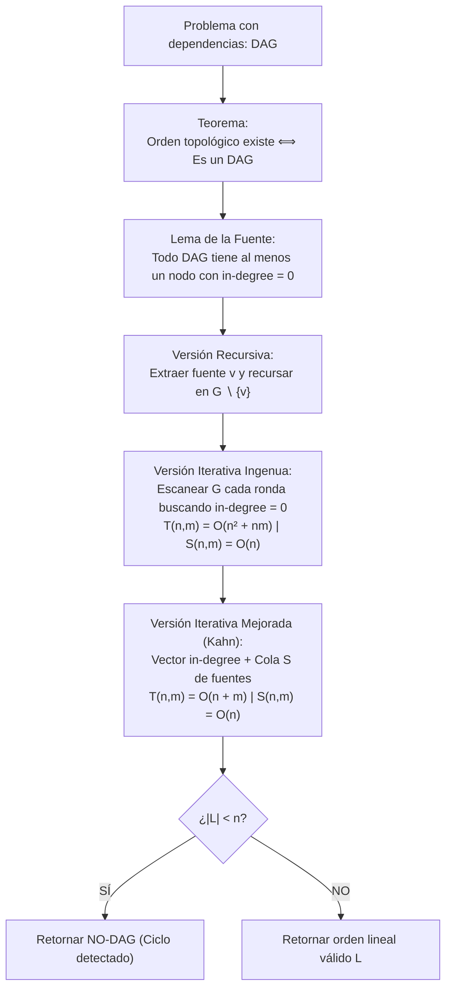

# Clase 9 · DAGs, restricciones de precedencia y algoritmos de ordenamiento topológico

![[03Graphs.pdf]]

> [!info] Alcance y fuentes de esta clase
> Esta nota integra dos fuentes complementarias del curso:
> 1. **03Graphs.pdf (Diapositivas 44–51):** Teoría de Gráficas Dirigidas Acíclicas (DAGs), restricciones de precedencia, teorema de equivalencia ($G \text{ es DAG} \iff \text{tiene orden topológico}$), lema del nodo fuente ($\text{in-degree} = 0$) y demostración inductiva.
> 2. **Ordenamiento Topológico (Diapositivas 1–8):** Análisis formal comparativo impartido en clase entre la **versión recursiva**, la **versión iterativa ingenua** ($T(n,m) = O(n^2 + nm), S(n,m) = O(n)$) y la **versión iterativa mejorada de Kahn** ($T(n,m) = O(n + m), S(n,m) = O(n)$) con detección de ciclos cuando $|L| < n$.

### Material extra
https://www.cs.emory.edu/~cheung/Courses/253/Syllabus/Graph/DAG.html

## Pregunta central

¿Cómo podemos ordenar linealmente un conjunto de tareas con dependencias para que ninguna tarea se ejecute antes de que sus prerrequisitos estén listos, cómo demostramos matemáticamente si dicho orden existe, y cómo optimizamos el algoritmo para pasar de $O(n^2 + nm)$ a tiempo lineal $O(n + m)$?

> [!summary] Idea de la clase
> Un ordenamiento topológico es una disposición lineal de los vértices de un digrafo donde todas las aristas van de izquierda a derecha. Dicho orden existe **si y solo si** el grafo es un **DAG** (sin ciclos dirigidos). Todo DAG finito contiene al menos un nodo fuente con grado de entrada cero ($\text{in-degree} = 0$), lo que permite extraer fuentes sucesivamente. Buscar fuentes de manera ingenua en cada paso cuesta $O(n^2 + nm)$; el **algoritmo de Kahn** mantiene un vector de grados de entrada y una cola $S$ con los nodos de grado cero, reduciendo el costo a **$O(n + m)$** en tiempo y $O(n)$ en espacio, detectando además ciclos dirigidos si la lista final tiene menos de $n$ vértices.



---

## 1. Gráficas Dirigidas Acíclicas (DAGs) y Precedencia

*Diapositivas 44–46 de 03Graphs.pdf.*

### 1.1 Definición formal de DAG

Un **grafo dirigido acíclico** o **DAG** (*Directed Acyclic Graph*) es un grafo dirigido $G = (V, E)$ que no contiene ningún ciclo dirigido simple. Es decir, no existe ninguna trayectoria dirigida que comience y termine en el mismo vértice ($v \not\rightsquigarrow v$).

### 1.2 Restricciones de precedencia

En una red de dependencias, una arista dirigida $(v_i, v_j)$ formaliza una **restricción de precedencia**: la tarea $v_i$ debe completarse obligatoriamente antes de poder iniciar la tarea $v_j$.

**Ejemplos en computación y vida real:**
1. **Malla curricular universitaria:** La materia $v_i$ es prerrequisito formal de $v_j$ (ej. *Cálculo I* $\to$ *Cálculo II*). Si existiera un ciclo ($A \to B \to C \to A$), sería imposible graduarse.
2. **Sistemas de compilación de software:** En herramientas como `make`, `CMake` o `Bazel`, el archivo o módulo $v_i$ debe compilarse antes de generar el binario o biblioteca $v_j$.
3. **Pipelines de tareas concurrentes:** La salida generada por el proceso $v_i$ es requerida como entrada por el proceso $v_j$.

---

## 2. Definición del Ordenamiento Topológico

*Diapositiva 45 de 03Graphs.pdf y Diapositiva 1 de Ordenamiento Topológico.*

Dado un grafo dirigido $G = (V, E)$ con $n = |V|$ vértices, un **ordenamiento topológico** es una permutación lineal de sus nodos:

$$v_1, v_2, \dots, v_n$$

tal que para **toda arista dirigida** $(v_i, v_j) \in E$, el índice de $v_i$ en la secuencia es estrictamente menor que el índice de $v_j$:

$$(v_i, v_j) \in E \implies i < j$$

### Representación visual: El grafo canónico del hexágono

En la diapositiva 45 de Kleinberg & Tardos (y diapositiva 1 de la clase), se presenta el DAG canónico de 7 vértices:

```
           v2 ───────> v3
          ^  \        /  \
         /    \      /    \
        /      v    v      v
      v6 <────  v5  ──────> v4
        \      ^    ^      /
         \    /      \    /
          v  /        \  v
           v7 <─────── v1
```

Al proyectar los vértices sobre una línea horizontal según un orden topológico válido, **todas las aristas apuntan estrictamente hacia adelante** (de izquierda a derecha). Ningún arco puede apuntar hacia atrás:

```
(v1) ───> (v2) ───> (v3) ───> (v4) ───> (v5) ───> (v6) ───> (v7)
 └───────────────────────> aristas van siempre i < j
```

---

## 3. Teorema: Relación biunívoca entre DAGs y Orden Topológico

*Diapositivas 47–48 de 03Graphs.pdf.*

> [!important] Teorema Fundamental
> Un grafo dirigido $G$ admite un ordenamiento topológico **si y solo si** $G$ es un DAG (no contiene ciclos dirigidos).

### 3.1 Demostración de la ida ($\implies$): Si tiene orden topológico, entonces es un DAG

*Demostración por contradicción (Diapositiva 47):*
1. Supongamos que $G$ tiene un orden topológico $v_1, v_2, \dots, v_n$ y que, al mismo tiempo, $G$ contiene un ciclo dirigido $C$.
2. Sea $v_i$ el nodo del ciclo $C$ que tiene el **índice más bajo** en el orden topológico (es decir, el que aparece más a la izquierda en la línea).
3. Sea $v_j$ el nodo inmediatamente anterior a $v_i$ en el ciclo $C$. Por tanto, la arista dirigida $(v_j, v_i)$ pertenece al grafo:
   $$(v_j, v_i) \in E$$
4. Por haber elegido a $v_i$ como el nodo de índice mínimo en $C$, todos los demás nodos de $C$ tienen un índice mayor; en particular:
   $$i < j$$
5. Sin embargo, dado que $(v_j, v_i) \in E$ y la secuencia es un orden topológico válido, por definición de orden topológico se debe cumplir que el origen precede al destino:
   $$j < i$$
6. Obtenemos simultáneamente $i < j$ y $j < i$, lo cual es una **contradicción lógica directa** ($i < j < i$).
7. Por lo tanto, ningún grafo que admita un orden topológico puede contener un ciclo dirigido. $G$ es forzosamente un DAG. $\blacksquare$

---

## 4. Lema fundamental: Existencia de una fuente en todo DAG

*Diapositiva 49 de 03Graphs.pdf.*

Para demostrar el regreso ($\impliedby$), necesitamos garantizar que siempre existe al menos un nodo con el cual podamos comenzar el orden.

> [!important] Lema de la Fuente (Source Lemma)
> Si $G$ es un DAG finito con $n \ge 1$ vértices, entonces $G$ tiene **al menos un vértice sin aristas de entrada** ($\text{in-degree} = 0$).

### Demostración por contradicción (Paseo hacia atrás):
1. Supongamos que $G$ es un DAG pero **ningún** nodo tiene grado de entrada cero; es decir, todo nodo $u \in V$ tiene al menos una arista que entra a él:
   $$\text{in-degree}(u) \ge 1 \quad \forall u \in V$$
2. Elijamos un vértice inicial cualquiera $v_1 \in V$.
3. Como $\text{in-degree}(v_1) \ge 1$, existe una arista $(v_2, v_1) \in E$. Damos un paso hacia atrás y nos paramos en $v_2$.
4. Como $\text{in-degree}(v_2) \ge 1$, existe una arista $(v_3, v_2) \in E$. Retrocedemos a $v_3$.
5. Repetimos este retroceso paso a paso de forma indefinida:
   $$\dots \to v_4 \to v_3 \to v_2 \to v_1$$
6. Como el conjunto de vértices $V$ es finito ($|V| = n$), tras dar a lo más $n$ pasos hacia atrás, por el **principio del palomar**, forzosamente visitaremos por segunda vez algún vértice $w$ ya visitado anteriormente.
7. La secuencia de nodos visitados entre la primera visita a $w$ y la segunda visita a $w$ constituye un **ciclo dirigido**:
   $$w \to \dots \to x \to u \to w$$
8. Esto contradice la hipótesis de que $G$ es un DAG (no tiene ciclos).
9. Por contradicción, la suposición inicial es falsa: **debe existir al menos un nodo con $\text{in-degree} = 0$**. $\blacksquare$

---

## 5. Existencia de Orden Topológico por Inducción

*Diapositiva 50 de 03Graphs.pdf.*

Con el lema de la fuente, demostramos que todo DAG tiene un orden topológico mediante **inducción matemática en el número de vértices $n$**:

- **Caso base ($n = 1$):** Un grafo con un solo vértice y sin lazos es un DAG y su único orden topológico es el vértice mismo.
- **Hipótesis de inducción:** Supongamos que todo DAG con $n - 1$ vértices tiene al menos un orden topológico válido.
- **Paso inductivo (para $n$ vértices):**
  1. Por el lema de la fuente, existe un nodo $v \in V$ tal que $\text{in-degree}(v) = 0$.
  2. Consideremos la subgráfica inducida $G' = G \setminus \{v\}$ (eliminando el vértice $v$ y todas las aristas que salen de él).
  3. $G'$ tiene $n - 1$ vértices y sigue siendo un DAG, pues eliminar vértices y aristas nunca puede crear ciclos nuevos.
  4. Por hipótesis de inducción, $G'$ posee un ordenamiento topológico: $u_1, u_2, \dots, u_{n-1}$.
  5. Construimos el orden para $G$ colocando a $v$ en la primera posición:
     $$v, u_1, u_2, \dots, u_{n-1}$$
  6. ¿Es este orden válido para $G$? Sí, porque como $\text{in-degree}(v) = 0$, **ninguna arista en $G$ entra a $v$**; todas las aristas incidentes a $v$ salen de él hacia los nodos de $G'$, cumpliendo estrictamente la condición de precedencia $i < j$. $\blacksquare$

---

## 6. Los tres algoritmos de Ordenamiento Topológico

*Presentación Ordenamiento Topológico, Diapositivas 1–8.*

La demostración inductiva sugiere directamente algoritmos concretos. En clase se analizaron tres variantes formales.

### 6.1 Algoritmo 1: Versión Recursiva (`Topo-Recursivo`)

*Diapositiva 2 de Ordenamiento Topológico.*

```text
Algoritmo Topo-Recursivo(G):
    If G tiene un único vértice v Then
        Return v
    Else
        v = vértice de G sin aristas de entrada;
        de no haberlo Return NO-DAG
        G' = gráfica G sin v y las aristas que salen de v
        Return v · Topo-Rec(G')
End Topo-Rec
```

- **Mecánica:** Encuentra una fuente $v$, la retira de $G$, llama recursivamente con la subgráfica restante y concatena $v$ al frente. Si en alguna llamada no encuentra ninguna fuente, la gráfica no es un DAG.

---

### 6.2 Algoritmo 2: Versión Iterativa Ingenua (`Topo-Iterativo`)

*Diapositivas 3–5 de Ordenamiento Topológico.*

Elimina la pila de recursión manteniendo una lista $L$ acumuladora:

```text
Algoritmo Topo-Iterativo(G):
    L = cadena vacía                                    // O(1)
    While G tiene por lo menos un vértice Do            // (n + 1) veces
        v = vértice de G sin aristas de entrada;        // O(n + m) cada vez
        de no haberlo, Return NO-DAG
        L = L · v                                       // O(1)
        G = gráfica G sin v y las aristas que salen de v // O(1)
    Return L                                            // O(1)
End Topo-Rec
```

#### Análisis formal de tiempo de ejecución (Diapositiva 4)
- La inicialización $L = \text{cadena vacía}$ toma $O(1)$.
- El bucle `While` evalúa la condición $n + 1$ veces. En cada evaluación, verificar si $G$ tiene vértices toma $O(n)$, dando $(n+1) \times O(n) = O(n^2)$.
- El cuerpo del bucle se ejecuta exactamente $n$ veces:
  - Encontrar un vértice sin aristas de entrada escaneando la representación de la gráfica toma **$O(n + m)$**.
  - Al ejecutarse $n$ veces, este costo acumulado es:
    $$n \times O(n + m) = O(n^2 + nm)$$
  - Las operaciones $L = L \cdot v$ y la eliminación toman $O(1)$.
- **Tiempo total:**
  $$T(n, m) = O(n^2 + nm)$$

#### Análisis formal de espacio en memoria (Diapositiva 5)
- La lista o cadena $L$ almacena los $n$ vértices en secuencia.
- **Espacio total:**
  $$S(n, m) = O(n)$$

---

### 6.3 Algoritmo 3: Versión Iterativa Mejorada / Algoritmo de Kahn (`Topo-Iterativo-Mejorado`)

*Diapositivas 6–8 de Ordenamiento Topológico y Diapositiva 51 de 03Graphs.pdf.*

El cuello de botella de la versión ingenua radica en reescanear toda la gráfica en cada ronda para buscar qué vértice tiene grado cero. La versión mejorada evita este desperdicio manteniendo:
1. Un vector dinámico `in-neighbourhood(w)` (o `in-degree[w]`) con el número de aristas de entrada pendientes de cada vértice.
2. Una estructura de datos $S$ (cola o pila) que contiene **exclusivamente los vértices listos** cuyo grado de entrada actual es $0$.

```text
Algoritmo Topo-Iterativo-Mejorado(G):
    S = cola vacía                                      // O(1)
    L = lista vacía                                     // O(1)
    
    For cada vértice v de G Do                          // O(n + m)
        in-neighbourhood(v) = #aristas de entrada de v
        If in-neighbourhood(v) == 0 Then
            Meter v a S
            
    While S != vacío Do                                 // O(n)
        v = tomar el siguiente de S
        L = L · v
        For cada arista (v, w) de G Do                  // O(m) acumulado
            in-neighbourhood(w) = in-neighbourhood(w) - 1
            If in-neighbourhood(w) == 0 Then
                Meter w a S
                
    If |L| < n Then                                     // O(1)
        Return NO-DAG                                   // Detección de ciclo
    Else
        Return L
End Topo-Rec
```

#### Análisis formal de tiempo de ejecución (Diapositiva 7)
1. **Inicialización:**
   - Crear las estructuras $S$ y $L$: $O(1)$.
   - Contar las aristas de entrada de todos los vértices mediante un escaneo de las listas de adyacencia: $O(n + m)$.
   - Encolar los vértices iniciales de grado cero en $S$: a lo más $n$ operaciones $O(1) \implies O(n)$.
2. **Bucle `While` principal:**
   - Cada vértice $v$ entra a la cola $S$ y sale de ella a lo más una vez. El número total de iteraciones del `While` es $\le n$, tomando $O(n)$ en total.
3. **Bucle interno `For cada arista (v, w)`:**
   - Cuando se procesa el nodo $v$, recorremos sus aristas salientes. A lo largo de toda la ejecución del algoritmo, **cada arista dirigida $(v, w) \in E$ es examinada exactamente una sola vez**.
   - En cada arista, se realiza un decremento $O(1)$ (`in-neighbourhood(w) = in-neighbourhood(w) - 1`) y una comparación.
   - La suma acumulada del costo de todas las aristas es:
     $$\sum_{v \in V} \text{out-degree}(v) = m \implies O(m)$$
4. **Verificación final:**
   - Comparar $|L| < n$ toma $O(1)$.
5. **Tiempo total de ejecución:**
   $$T(n, m) = O(1) + O(n + m) + O(n) + O(m) = O(n + m)$$

#### Análisis formal de espacio en memoria (Diapositiva 8)
- El arreglo `in-neighbourhood` requiere tamaño $n \implies O(n)$.
- La cola $S$ almacena a lo más $n$ vértices $\implies O(n)$.
- La lista de salida $L$ almacena a lo más $n$ vértices $\implies O(n)$.
- **Espacio total:**
  $$S(n, m) = O(n)$$

---

## 7. Detección formal de ciclos dirigidos

¿Qué ocurre si la gráfica contiene un ciclo dirigido (por ejemplo, $v_1 \to v_2 \to v_3 \to v_1$)?
1. En un ciclo cerrado, **todos los nodos del ciclo tienen al menos una arista de entrada** proveniente de su predecesor dentro del ciclo.
2. Ningún nodo perteneciente al ciclo puede tener jamás `in-degree == 0` a menos que se rompa el ciclo desde afuera.
3. Si el ciclo no tiene dependencias externas (o cuando estas ya se procesaron), ninguno de los nodos del ciclo entrará jamás a la cola $S$.
4. La cola $S$ se vaciará prematuramente antes de que todos los nodos hayan sido procesados.
5. Al terminar el bucle, la longitud de la lista de salida será estrictamente menor que el número total de vértices:
   $$|L| < n$$
6. Esta condición simple $|L| < n$ certifica formalmente que la gráfica contiene al menos un ciclo y retorna `NO-DAG` en tiempo $O(n + m)$.

---

## 8. Laboratorio interactivo: Simulador de Ordenamiento Topológico

Ejecuta paso a paso el algoritmo de Kahn sobre el grafo canónico hexagonal de 7 nodos, visualiza la cola $S$, el vector dinámico `in-degree` y el orden lineal resultante, o inyecta un ciclo para observar la detección de `NO-DAG`.

<iframe src="../../algoritmos/recursos/ordenamiento-topologico-interactivo.htm" style="width:100%;height:600px;border:1px solid var(--lightgray);border-radius:4px;" loading="lazy"></iframe>

**Idea central si el laboratorio no carga:** El algoritmo inicia calculando el grado de entrada de cada nodo. Los nodos con grado cero ($v_1$ y $v_2$) entran a la cola $S$. En cada paso se extrae un nodo, se añade a la lista $L$ y se decrementa el grado de sus vecinos salientes. Cuando el grado de un vecino llega a cero, entra a la cola. Al finalizar, si se procesaron los 7 nodos, la lista $L$ representa un ordenamiento topológico válido. Si se inyecta una arista cíclica ($v_7 \to v_1$), la cola se vacía con $|L| < 7$, reportando `NO-DAG`.

---

## 9. Comparación sistemática de las tres versiones

| Criterio | Versión Recursiva | Versión Iterativa Ingenua | Versión Iterativa Mejorada (Kahn) |
|---|---|---|---|
| **Estrategia** | Inducción matemática directa | Búsqueda exhaustiva de fuentes en bucle | Mantenimiento dinámico con cola $S$ |
| **Tiempo $T(n,m)$** | $O(n^2 + nm)$ | **$O(n^2 + nm)$** | **$O(n + m)$ (Óptimo)** |
| **Espacio $S(n,m)$** | $O(n)$ (pila de llamadas) | **$O(n)$** | **$O(n)$** |
| **Estructuras auxiliares** | Pila del sistema | Lista $L$ | Vector `in-degree` + Cola $S$ + Lista $L$ |
| **Detección de ciclos** | Al no encontrar fuente en recursión | Al no encontrar fuente en el bucle | Condición $|L| < n$ al vaciarse la cola |

---

## 10. Ejercicios resueltos paso a paso

### Ejercicio 1: Traza completa del Algoritmo de Kahn
**Problema:** Obtener un orden topológico para el DAG con vértices $\{A, B, C, D, E\}$ y aristas:
$$E = \{(A, B), (A, C), (B, D), (C, D), (D, E)\}$$

**Procedimiento:**
1. **Paso 0 (Inicialización):**
   - Grados de entrada: `in-degree = {A: 0, B: 1, C: 1, D: 2, E: 1}`.
   - Vértices con grado 0 entran a $S$: $S = [A]$.
   - Lista de salida: $L = []$.
2. **Paso 1:**
   - Desencolar $A$ de $S \implies L = [A]$.
   - Procesar aristas salientes $(A, B)$ y $(A, C)$:
     - `in-degree[B]` pasa de $1$ a $0 \implies$ meter $B$ a $S$.
     - `in-degree[C]` pasa de $1$ a $0 \implies$ meter $C$ a $S$.
   - Estado: $S = [B, C]$.
3. **Paso 2:**
   - Desencolar $B$ de $S \implies L = [A, B]$.
   - Procesar arista saliente $(B, D)$:
     - `in-degree[D]` pasa de $2$ a $1$ (no es 0, no entra a $S$).
   - Estado: $S = [C]$.
4. **Paso 3:**
   - Desencolar $C$ de $S \implies L = [A, B, C]$.
   - Procesar arista saliente $(C, D)$:
     - `in-degree[D]` pasa de $1$ a $0 \implies$ meter $D$ a $S$.
   - Estado: $S = [D]$.
5. **Paso 4:**
   - Desencolar $D$ de $S \implies L = [A, B, C, D]$.
   - Procesar arista saliente $(D, E)$:
     - `in-degree[E]` pasa de $1$ a $0 \implies$ meter $E$ a $S$.
   - Estado: $S = [E]$.
6. **Paso 5:**
   - Desencolar $E$ de $S \implies L = [A, B, C, D, E]$.
   - No tiene aristas salientes.
   - Estado: $S = []$.
7. **Verificación final:** $|L| = 5 = n$.
**Resultado:** Orden topológico válido: $A \to B \to C \to D \to E$. (Nota: $A \to C \to B \to D \to E$ también es válido).

---

### Ejercicio 2: Justificación formal del costo $O(n^2 + nm)$ en la versión ingenua
**Problema:** ¿Por qué la versión iterativa ingenua toma $O(n^2 + nm)$ si solo se realizan $n$ iteraciones del bucle `While`?

**Procedimiento:**
1. En cada una de las $n$ iteraciones, el algoritmo debe seleccionar un vértice $v$ tal que $\text{in-degree}(v) = 0$.
2. Sin un arreglo que almacene los grados de entrada precomputados, el algoritmo debe inspeccionar los $n$ vértices restantes.
3. Para cada uno de los $k$ vértices restantes en la ronda actual ($k \le n$), debe verificar si alguna de las aristas del grafo entra a él.
4. Escanear toda la estructura de la gráfica toma tiempo proporcional a sus vértices y aristas actuales: $O(n + m)$ por cada búsqueda.
5. Al repetirse esta búsqueda en las $n$ rondas del bucle:
   $$\sum_{i=1}^n O(n + m) = n \cdot O(n + m) = O(n^2 + nm)$$
6. Sumando la condición de parada del `While` ($(n+1) \times O(n) = O(n^2)$), el tiempo global queda dominado por $O(n^2 + nm)$.

---

## 11. Errores conceptuales frecuentes

| Error conceptual | Corrección |
|---|---|
| Creer que un DAG tiene un único orden topológico | Falso. Salvo que el DAG contenga un camino hamiltoniano estricto, suele haber múltiples órdenes topológicos válidos según el orden en que se extraigan las fuentes independientes de $S$. |
| Pensar que el orden topológico aplica a grafos no dirigidos | No tiene sentido en grafos no dirigidos, ya que una arista $\{u, v\}$ sin dirección implicaría simultáneamente $u < v$ y $v < u$, lo cual es imposible. |
| Confundir grado cero con grado de entrada cero | Un nodo con $\text{in-degree} = 0$ puede tener muchas aristas salientes ($\text{out-degree} > 0$). La condición para entrar a la cola $S$ es únicamente tener cero aristas de entrada. |
| Asumir que Kahn solo detecta ciclos pero no los localiza | El algoritmo de Kahn detecta de forma exacta si hay un ciclo ($|L| < n$), y los vértices que quedan fuera de $L$ (con `in-degree > 0`) son precisamente los que pertenecen a ciclos dirigidos o dependen de ellos. |

---

## 12. Preguntas de autoevaluación

1. ¿Puede un árbol no dirigido tener un ordenamiento topológico?
2. Si un DAG tiene 3 nodos con grado de entrada 0 al inicio, ¿cuántos nodos tendrá la cola $S$ en la primera iteración?
3. En la versión mejorada de Kahn, ¿cuántas veces se ejecuta la instrucción `in-neighbourhood(w) = in-neighbourhood(w) - 1` en total a lo largo de todo el algoritmo?
4. Si al terminar el algoritmo de Kahn la lista $L$ contiene 8 vértices y el grafo original tenía 10 vértices, ¿qué podemos concluir con certeza?

<details>
<summary>Respuestas explicadas</summary>

1. **No.** El ordenamiento topológico solo está definido para grafos **dirigidos**. Un árbol no dirigido no tiene orientación; requeriría orientar sus aristas desde una raíz para convertirse en un DAG.
2. **Tendrá 3 nodos.** Todos los vértices que cumplen inicialmente $\text{in-degree} = 0$ se encolan durante la fase de inicialización.
3. **Exactamente $m$ veces** (una vez por cada arista dirigida $(v, w) \in E$), cuando su nodo origen $v$ es extraído de $S$.
4. **Que el grafo contiene al menos un ciclo dirigido** y no es un DAG (retorna `NO-DAG`), y que 2 vértices quedaron atrapados en dependencias circulares.

</details>

---

## 13. Recorrido de diapositivas

| Diapositiva | Contenido original | Dónde se desarrolla |
|:---:|---|---|
| **03Graphs: 44** | Agenda: DAGs and topological ordering | §1 |
| **03Graphs: 45** | Definición de DAG y orden topológico; dibujo de hexágono y orden lineal | §1.1 y §2 |
| **03Graphs: 46** | Restricciones de precedencia (cursos, compilación, pipelines) | §1.2 |
| **03Graphs: 47** | Demostración por contradicción: Orden topológico $\implies$ DAG | §3.1 |
| **03Graphs: 48** | Preguntas centrales de existencia y cálculo | §4 |
| **03Graphs: 49** | Lema de la fuente ($\text{in-degree}=0$) y demostración por paseo hacia atrás | §4 |
| **03Graphs: 50** | Demostración constructiva inductiva de existencia de orden topológico | §5 |
| **03Graphs: 51** | Análisis de tiempo $O(m+n)$ mediante `count(w)` y conjunto $S$ | §6.3 |
| **Topo: 1** | Portada: Gráfica hexagonal canónica y orden lineal | §2 |
| **Topo: 2** | Pseudocódigo formal de `Topo-Recursivo(G)` | §6.1 |
| **Topo: 3** | Pseudocódigo formal de `Topo-Iterativo(G)` | §6.2 |
| **Topo: 4** | Análisis formal de tiempo de `Topo-Iterativo`: $T(n,m) = O(n^2 + nm)$ | §6.2 |
| **Topo: 5** | Análisis formal de espacio de `Topo-Iterativo`: $S(n,m) = O(n)$ | §6.2 |
| **Topo: 6** | Pseudocódigo formal de `Topo-Iterativo-Mejorado(G)` (Kahn) | §6.3 |
| **Topo: 7** | Análisis formal de tiempo de `Topo-Iterativo-Mejorado`: $T(n,m) = O(n + m)$ | §6.3 |
| **Topo: 8** | Análisis formal de espacio y estructuras de datos: $S(n,m) = O(n)$ | §6.3 y §9 |

---

## Conexiones

- **Anterior:** [[2026-09-08 ADA - biparticion-y-grafos-dirigidos|Clase del 8 de septiembre: Bipartición, 2-colorabilidad y conectividad en grafos dirigidos]].
- **Recurso interactivo de esta clase:** `![[01_Materias/Algoritmos/Recursos/ordenamiento-topologico-interactivo.html]]`
- **Siguiente clase:** [[2026-09-17 ADA - toposort-dfs-y-componentes-fuertemente-conexas|Clase del 17 de septiembre: TopoSort con DFS, componentes fuertemente conexas y gráfica de condensación (G_cc)]].
