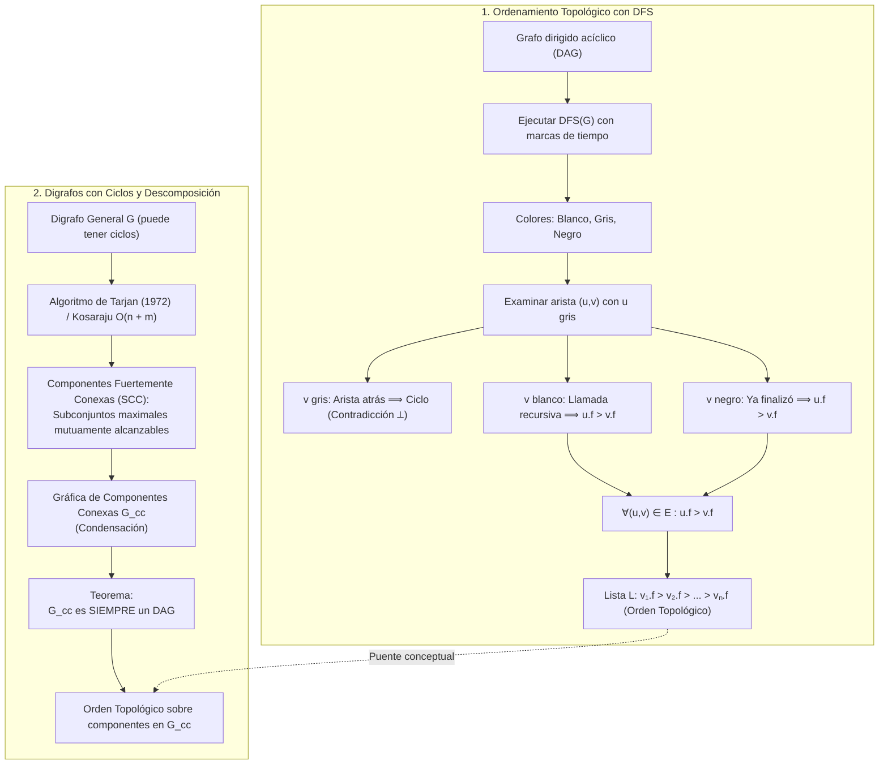

# Clase 10 · Ordenamiento topológico con DFS, componentes fuertemente conexas y gráfica de condensación ($G_{cc}$)

![[03Graphs.pdf]]

> [!info] Alcance y fuentes de esta clase
> Esta sesión articula tres bloques fundamentales desarrollados en el pizarrón y en el material de referencia (`03Graphs.pdf` y CLRS):
> 1. **Ordenamiento topológico mediante DFS (`TopoSort-DFS`):** Demostración formal del lema de corrección mediante el análisis exhaustivo de los **tres casos de coloración** al procesar una arista dirigida $(u, v)$ ($v$ gris, $v$ blanco, $v$ negro), probando que $u.f > v.f$ y que la lista $L = [v_1, \dots, v_n]$ ordenada por tiempos de finalización decrecientes es un orden topológico válido.
> 2. **Componentes Fuertemente Conexas (SCC):** Definición formal de subconjunto maximal de vértices mutuamente alcanzables, análisis del digrafo canónico de 13 nodos de Robert Tarjan (1972) en $O(n + m)$, y comparación con el algoritmo de Kosaraju-Sharir.
> 3. **Gráfica de componentes conexas ($G_{cc}$ o condensación):** Definición formal del grafo de supernodos, demostración de que **$G_{cc}$ es siempre un DAG**, y la perspectiva unificada de descomposición jerárquica de digrafos generales.

---

## Pregunta central

¿Cómo podemos calcular un orden topológico aprovechando el orden de finalización de una búsqueda en profundidad (DFS), cómo demostramos formalmente que los tiempos de finalización satisfacen $u.f > v.f$ para toda arista, y cómo descomponemos cualquier grafo dirigido arbitrario (incluso con ciclos) en una jerarquía acíclica de componentes fuertemente conexas ($G_{cc}$)?

> [!summary] Idea de la clase
> En un DAG, realizar una búsqueda en profundidad (DFS) y ordenar los vértices de mayor a menor tiempo de finalización ($v_1.f > v_2.f > \dots > v_n.f$) produce un orden topológico estricto. La prueba analiza los tres colores posibles del destino $v$ al procesar $(u, v)$ desde un nodo gris $u$: $v$ gris es imposible porque cerraría un ciclo (arista hacia atrás); si $v$ es blanco, su recursión concluye antes de retornar a $u$ ($u.f > v.f$); y si $v$ es negro, ya concluyó en el pasado ($u.f > v.f$).
> Por otro lado, cuando un digrafo contiene ciclos, se descompone en **componentes fuertemente conexas (SCC)**, calculables en tiempo $O(n + m)$ (Tarjan 1972). Al colapsar cada SCC en un supernodo se obtiene la **gráfica de componentes conexas $G_{cc}$**, la cual es **garantizadamente un DAG**, unificando la teoría de grafos dirigidos: todo digrafo es un DAG a nivel macro cuyas componentes internas son fuertemente conexas a nivel micro.



---

## 1. De Kahn a DFS: Una perspectiva dual del ordenamiento topológico

En la [[2026-09-10 ADA - DAGs-y-ordenamiento-topologico|clase anterior]] estudiamos el algoritmo de Kahn (`Topo-Iterativo-Mejorado`), cuya intuición es **frontal y extractiva**:
1. Identifica nodos con grado de entrada cero ($\text{in-degree} = 0$, fuentes).
2. Extrae una fuente, la coloca al final de la lista de salida $L$, y "elimina" sus aristas salientes.
3. Repite hasta vaciar el grafo o detectar un ciclo si $|L| < n$.

En esta clase abordamos la formulación clásica basada en **Búsqueda en Profundidad (DFS)** (atribuida a Tarjan y Cormen et al.):
- En lugar de buscar fuentes que no tengan dependencias pendientes, DFS avanza en profundidad hasta topar con un **sumidero local** (un vértice que no puede avanzar más a nodos no visitados).
- Cuando un vértice agota todas sus opciones de exploración y la recursión se repliega, dicho vértice ha completado todas sus dependencias posteriores.
- Al registrar el instante de repliegue de cada vértice (su **tiempo de finalización** $f$), los vértices que terminan al último son precisamente aquellos de los que dependen los demás.
- Por ende, ordenar los vértices de **mayor a menor tiempo de finalización** produce un orden topológico válido.

---

## 2. El algoritmo TopoSort con DFS

*Basado en la evidencia del pizarrón (Fotografía 1) y CLRS Sección 22.4.*

### 2.1 Colores y marcas de tiempo en DFS

Durante la ejecución de DFS sobre un grafo dirigido $G = (V, E)$, cada vértice $u \in V$ mantiene:
- **Color:**
  - $\text{color}[u] = \text{BLANCO}$: El vértice aún no ha sido descubierto.
  - $\text{color}[u] = \text{GRIS}$: El vértice ha sido descubierto y está actualmente en la pila de llamadas recursivas (su exploración está activa).
  - $\text{color}[u] = \text{NEGRO}$: La llamada recursiva de $u$ ha finalizado (todos sus vecinos salientes han sido completamente procesados).
- **Tiempos del reloj global:**
  - $u.d$: Tiempo de **descubrimiento** (*discovery time*), cuando $u$ pasa de blanco a gris.
  - $u.f$: Tiempo de **finalización** (*finishing time*), cuando $u$ pasa de gris a negro.

Para todo vértice $u$, los intervalos de descubrimiento y finalización están bien ordenados:
$$1 \le u.d < u.f \le 2n$$

### 2.2 Pseudocódigo formal

```python
def TopoSort_DFS(G):
    # Inicialización de estructuras
    for u in G.V:
        color[u] = BLANCO
        u.d = None
        u.f = None
    
    tiempo = 0
    L = []  # Lista enlazada que contendrá el orden topológico
    
    # Recorrido general del bosque DFS
    for u in G.V:
        if color[u] == BLANCO:
            DFS_Visit(G, u, tiempo, L)
            
    return L

def DFS_Visit(G, u, tiempo, L):
    tiempo += 1
    u.d = tiempo
    color[u] = GRIS
    
    for v in G.Adj[u]:  # Procesar cada arista dirigida (u, v)
        if color[v] == BLANCO:
            # Caso 2: Descubrimiento de nuevo subárbol
            DFS_Visit(G, v, tiempo, L)
        elif color[v] == GRIS:
            # Caso 1: Arista hacia atrás detectada
            error "G contiene un ciclo dirigido; no es un DAG"
        elif color[v] == NEGRO:
            # Caso 3: Vértice ya procesado en el pasado
            pass
            
    tiempo += 1
    u.f = tiempo
    color[u] = NEGRO
    
    # Inserción al frente de la lista L
    L.insertar_al_frente(u)
```

### 2.3 Estructura de la lista de salida $L$

Como cada nodo $u$ se inserta al frente de $L$ en el instante exacto en que pasa a negro y se fija su tiempo $u.f$, la lista resultante:

$$L = [v_1, v_2, \dots, v_n]$$

cumple estrictamente que los tiempos de finalización decrecen de izquierda a derecha:

$$v_1.f > v_2.f > \dots > v_n.f$$

*(Anotación literal del pizarrón, Fotografía 1).*

---

## 3. Lema y Demostración Formal: Los tres casos del pizarrón

*Transcripción y desarrollo formal de las Fotografías 3 y 5.*

> [!important] Lema de Corrección de TopoSort-DFS
> Si $G = (V, E)$ es un grafo dirigido acíclico (DAG), entonces la lista $L$ producida por el algoritmo `TopoSort-DFS(G)` es un orden topológico válido de $G$.

### 3.1 Planteamiento de la prueba

Para demostrar que $L$ es un orden topológico, debemos verificar que para **toda arista dirigida** $(u, v) \in E$, el vértice $u$ aparece **antes** que el vértice $v$ en la lista $L$.

Dado que los vértices se ordenan en $L$ en orden decreciente de sus tiempos de finalización, la condición de precedencia $u \prec_L v$ equivale exactamente a demostrar que:

$$u.f > v.f \quad \forall (u, v) \in E$$

Consideremos el momento exacto en que el algoritmo `DFS_Visit` ejecutado sobre $u$ procesa la arista dirigida $(u, v)$.
En ese instante:
- El nodo $u$ es **GRIS** (está activo en la pila de llamadas, y su tiempo de finalización $u.f$ todavía no ha sido asignado).
- Evaluamos los **tres casos posibles** según el color del vértice destino $v$ en ese momento:

```
                  ┌─────────────────┐
                  │ Examinar (u, v) │  (u es GRIS)
                  └────────┬────────┘
                           │
       ┌───────────────────┼───────────────────┐
       ▼                   ▼                   ▼
 1) v es GRIS        2) v es BLANCO       3) v es NEGRO
  Arista atrás         Subárbol DFS         Ya finalizó
  v rightsquigarrow u     recursivo          v.f < ahora
       │                   │                   │
  Ciclo v ↻ u       v termina antes       u terminará
  ¡CONTRADICCIÓN!      u.f > v.f          después ⟹ u.f > v.f
```

---

### 3.2 Caso 1: $v$ es GRIS (Imposible en un DAG)

- Si $v$ es gris cuando se explora la arista $(u, v)$, significa que $v$ ya fue descubierto pero su llamada `DFS_Visit(v)` aún no concluye.
- Por la naturaleza de la pila de llamadas recursivas de DFS, $v$ es un **ancestro** de $u$ en el árbol DFS actual.
- En consecuencia, ya existe un camino dirigido desde $v$ hasta $u$ en el árbol DFS:
  $$v \rightsquigarrow u$$
- Al examinar la arista $(u, v)$, esta arista apunta de un descendiente a un ancestro, por lo que es una **arista hacia atrás** (*back edge*).
- La concatenación del camino de árbol $v \rightsquigarrow u$ con la arista $(u, v)$ forma un **ciclo dirigido simple**:
  $$v \rightsquigarrow u \to v$$
- **Contradicción:** Por hipótesis del lema, $G$ es un DAG (no contiene ciclos dirigidos).
- **Conclusión del Caso 1:** Este caso **no puede ocurrir** durante la ejecución de TopoSort sobre un DAG. Si este caso llegara a presentarse, certificaría de inmediato que el grafo no es un DAG.

---

### 3.3 Caso 2: $v$ es BLANCO (Llamada recursiva descendente)

- Si $v$ es blanco, significa que $v$ no ha sido descubierto aún por el recorrido.
- Como la arista $(u, v)$ existe y $u$ es gris, el algoritmo invoca de forma inmediata la llamada recursiva `DFS_Visit(G, v)`.
- En este subárbol, $v$ se convierte en un descendiente de $u$ en el bosque DFS.
- Toda la exploración que parte de $v$ (incluyendo a todos los nodos alcanzables desde $v$) debe completarse en su totalidad antes de que la llamada recursiva de $v$ retorne el control a $u$.
- En el instante en que `DFS_Visit(v)` termina:
  1. Se le asigna a $v$ su tiempo de finalización $v.f$.
  2. El nodo $v$ se pinta de negro.
  3. El control retorna a $u$.
- Dado que a $u$ todavía le resta terminar de examinar sus demás aristas salientes antes de concluir su propia llamada:
  $$u.d < v.d < v.f < u.f$$
- Por lo tanto, se cumple estrictamente:
  $$u.f > v.f$$

---

### 3.4 Caso 3: $v$ es NEGRO (Finalización previa)

- Si $v$ es negro, significa que la exploración de $v$ ya concluyó en su totalidad en una etapa anterior del recorrido (ya sea en una rama previa del árbol DFS actual o en un árbol DFS disjunto explorado anteriormente).
- Por lo tanto, el tiempo de finalización $v.f$ ya fue calculado y fijado en el pasado:
  $$v.f < \text{tiempo actual}$$
- Por otro lado, como $u$ sigue siendo gris en este instante, su tiempo de finalización $u.f$ todavía no se ha fijado; se le asignará un valor del reloj estrictamente en el futuro:
  $$u.f > \text{tiempo actual}$$
- Comparando ambas cotas temporales:
  $$v.f < \text{tiempo actual} < u.f \implies u.f > v.f$$

---

### 3.5 Conclusión de la Demostración

Habiendo agotado todos los casos posibles:
1. El Caso 1 ($v$ gris) es imposible porque violaría la aciclicidad de $G$.
2. En el Caso 2 ($v$ blanco), la recursión garantiza $u.f > v.f$.
3. En el Caso 3 ($v$ negro), la finalización previa garantiza $u.f > v.f$.

Por lo tanto, para **toda** arista $(u, v) \in E$, se cumple invariablemente que $u.f > v.f$. Al ordenar los vértices de mayor a menor tiempo de finalización en la lista $L$, $u$ precede a $v$ para toda arista $(u, v)$. 

Concluimos que la lista $L$ es un ordenamiento topológico válido de $G$. $\blacksquare$

---

## 4. Componentes Fuertemente Conexas (SCC)

*Diapositiva 43 de 03Graphs.pdf (Fotografía 4).*

### 4.1 Definición formal

> [!important] Componente Fuertemente Conexa (SCC)
> En un grafo dirigido $G = (V, E)$, una **componente fuertemente conexa** (*Strongly Connected Component* o SCC) es un subconjunto **maximal** de vértices $C \subseteq V$ tales que para todo par de nodos $u, v \in C$, $u$ y $v$ son **mutuamente alcanzables**:
> $$u \rightsquigarrow v \quad \text{y} \quad v \rightsquigarrow u$$

**La condición de maximalidad:**
Decir que $C$ es *maximal* significa que no existe ningún superconjunto estricto $C' \supset C$ tal que todos los nodos de $C'$ sigan siendo mutuamente alcanzables entre sí. Si añadimos cualquier nodo externo $w \notin C$, se rompe la propiedad de alcanzabilidad mutua con al menos un nodo de $C$.

### 4.2 Partición del conjunto de vértices

La relación de alcanzabilidad mutua ($u \sim v \iff u \rightsquigarrow v \text{ y } v \rightsquigarrow u$) es una **relación de equivalencia**:
1. **Reflexiva:** $u \rightsquigarrow u$ (camino trivial de longitud 0).
2. **Simétrica:** $u \sim v \implies v \sim u$.
3. **Transitiva:** Si $u \sim v$ y $v \sim w$, concatenando caminos dirigidos obtenemos $u \rightsquigarrow w$ y $w \rightsquigarrow u$, luego $u \sim w$.

Como toda relación de equivalencia sobre un conjunto finito, **las componentes fuertemente conexas forman una partición disjunta del conjunto de vértices $V$**:
$$V = C_1 \;\dot\cup\; C_2 \;\dot\cup\; \dots \;\dot\cup\; C_k$$
Cada vértice del grafo pertenece a exactamente una componente fuertemente conexa.

---

### 4.3 El digrafo canónico de Robert Tarjan (1972)

En la diapositiva 43 de Kleinberg & Tardos (presentada en clase), se analiza el siguiente digrafo de 13 vértices $\{0, 1, \dots, 12\}$:

```
      [0] ───────────────> [6] <════> [8] ───────> [7]
     ^ |  \                 |
    /  |   v                |
  [1]  |   [2]              v
   ^   |  /   \           [9] ───────> [10]
    \  v v     v           ^  \          |
    [5] <───── [4]         |   v         v
        \                 [11] <────── [12]
         └─────────────────┘
```

#### Descomposición en sus 4 componentes conexas maximales:

| Componente | Vértices | Estructura interna |
|---|---|---|
| **$C_1$** | $\{0, 1, 2, 3, 4, 5\}$ | Ciclos entrelazados: $0 \to 2 \to 3 \to 5 \to 1 \to 0$ y $2 \to 4 \to 3$. Todos se alcanzan mutuamente. |
| **$C_2$** | $\{6, 8\}$ | Par bidireccional simple: aristas $(6, 8)$ y $(8, 6)$. |
| **$C_3$** | $\{7\}$ | Nodo individual sumidero: recibe aristas desde $\{6, 8\}$ pero no tiene aristas salientes hacia ningún otro nodo. |
| **$C_4$** | $\{9, 10, 11, 12\}$ | Ciclo dirigido de 4 nodos: $9 \to 10 \to 12 \to 11 \to 9$ con arista cruzada $(9, 12)$. |

### 4.4 Teorema de Tarjan (1972)

> [!important] Teorema de Robert Tarjan (1972)
> Todas las componentes fuertemente conexas de un grafo dirigido $G = (V, E)$ pueden encontrarse en tiempo lineal óptimo:
> $$T(n, m) = O(n + m)$$
> utilizando una sola pasada de DFS que mantiene valores de descubrimiento y números de ancestro más bajo alcanzable (*low-link values*).

*Referencia histórica:* Tarjan, R. (1972), *Depth-First Search and Linear Graph Algorithms*, SIAM Journal on Computing, Vol. 1, No. 2, pp. 146–160.

---

## 5. La Gráfica de Componentes Conexas ($G_{cc}$)

*Basado en la definición y diagramas del pizarrón (Fotografía 2).*

### 5.1 Definición formal de $G_{cc}$ (Condensación de un digrafo)

> [!important] Definición formal de $G_{cc}$
> Dada una digráfica $G = (V, E)$, su **gráfica de componentes conexas** $G_{cc} = (V_{cc}, E_{cc})$ (también conocida en la literatura como *grafo de condensación* o *Kernel DAG*) se define como:
> 1. **Vértices:** Cada vértice de $G_{cc}$ corresponde a una componente fuertemente conexa completa de $G$:
>    $$V_{cc} = \{C_1, C_2, \dots, C_k\}$$
> 2. **Aristas:** Existe una arista dirigida dirigida entre dos componentes distintas $X, Y \in V_{cc}$ ($X \neq Y$) si y solo si existe al menos una arista dirigida en $G$ que parte de algún nodo de $X$ y llega a algún nodo de $Y$:
>    $$(X, Y) \in E_{cc} \iff \exists u \in X, \; \exists v \in Y \quad \text{tal que } (u, v) \in E$$

```
 Componente X                    Componente Y
┌──────────────┐                ┌──────────────┐
│  (u1)  (u2)  │  (u1, v1)      │  (v1)  (v2)  │
│    \   /     │───────────────>│    \   /     │
│     (u3)     │  (u3, v2)      │     (v3)     │
│              │- - - - - - - ->│              │
└──────────────┘                └──────────────┘
  En G_cc se colapsa a una única macro-arista:
              [ X ] ──────────────> [ Y ]
```

---

### 5.2 Teorema Fundamental: $G_{cc}$ es siempre un DAG

> [!important] Teorema de Aciclicidad de la Condensación
> Para cualquier grafo dirigido arbitrario $G$, su gráfica de componentes conexas $G_{cc}$ es **siempre un grafo dirigido acíclico (DAG)**.

#### Demostración formal por contradicción:
1. Supongamos, por contradicción, que $G_{cc}$ **no** es un DAG.
2. Si $G_{cc}$ no es un DAG, entonces contiene al menos un ciclo dirigido simple compuesto por $r \ge 2$ componentes distintas:
   $$C_1 \to C_2 \to C_3 \to \dots \to C_r \to C_1$$
3. Por la definición de arista en $G_{cc}$:
   - Como $(C_1, C_2) \in E_{cc}$, existe una arista $(u_1, v_2) \in E$ con $u_1 \in C_1$ y $v_2 \in C_2$.
   - Como $(C_2, C_3) \in E_{cc}$, existe una arista $(u_2, v_3) \in E$ con $u_2 \in C_2$ y $v_3 \in C_3$.
   - $\dots$
   - Como $(C_r, C_1) \in E_{cc}$, existe una arista $(u_r, v_1) \in E$ con $u_r \in C_r$ y $v_1 \in C_1$.
4. Ahora, elijamos dos nodos cualesquiera $x, y \in C_1 \cup C_2 \cup \dots \cup C_r$. Supongamos sin pérdida de generalidad que $x \in C_i$ e $y \in C_j$:
   - Para ir de $x$ a $y$: Dentro de $C_i$, como $C_i$ es fuertemente conexa, existe un camino $x \rightsquigarrow u_i$. Luego tomamos la arista $(u_i, v_{i+1})$ hacia $C_{i+1}$. Repitiendo este proceso a lo largo del ciclo de componentes, llegamos a $v_j \in C_j$. Finalmente, dentro de $C_j$ existe un camino de $v_j$ a $y$. Por lo tanto:
     $$x \rightsquigarrow y$$
   - Para ir de $y$ a $x$: Continuando el recorrido por el resto del ciclo de componentes desde $C_j$ hasta $C_i$ de manera análoga, obtenemos:
     $$y \rightsquigarrow x$$
5. Por lo tanto, **todos los vértices de la unión** $C_1 \cup C_2 \cup \dots \cup C_r$ son mutuamente alcanzables entre sí en $G$.
6. Esto significa que el conjunto unificado $C_1 \cup C_2 \cup \dots \cup C_r$ forma una única región fuertemente conexa estrictamente más grande que cualquiera de las componentes individuales.
7. ¡Contradicción directa! Esto viola la **maximalidad** de cada componente $C_i$, pues por definición una SCC no puede ser extendida a un conjunto mayor de nodos mutuamente alcanzables.
8. Por lo tanto, $G_{cc}$ no puede contener ciclos dirigidos: **$G_{cc}$ es obligatoriamente un DAG**. $\blacksquare$

---

### 5.3 La Gran Síntesis: Descomposición jerárquica de digrafos

Este resultado revela la estructura universal de cualquier grafo dirigido:
1. **Nivel Micro (Componentes Fuertes):** Los ciclos dirigidos quedan totalmente confinados dentro de las componentes fuertemente conexas individuales.
2. **Nivel Macro (Condensación $G_{cc}$):** La relación entre las distintas componentes es puramente acíclica (un DAG).
3. **Consecuencia algorítmica:** Dado que $G_{cc}$ es un DAG, **siempre admite un ordenamiento topológico**. Podemos ordenar las componentes completas $C_1, \dots, C_k$ de tal forma que ninguna componente dependa circularmente de otra.

En el ejemplo canónico de Tarjan:
$$G_{cc} = (\{C_1, C_2, C_3, C_4\}, \{(C_1, C_2), (C_1, C_4), (C_2, C_3), (C_2, C_4)\})$$
Un ordenamiento topológico válido de las componentes en $G_{cc}$ es:
$$C_1 \longrightarrow C_2 \longrightarrow C_4 \longrightarrow C_3$$
(o equivalentemente $C_1 \to C_2 \to C_3 \to C_4$).

---

## 6. Laboratorio interactivo: Simulador de TopoSort DFS y Condensación en $G_{cc}$

El siguiente simulador permite ejecutar paso a paso el algoritmo `TopoSort-DFS` sobre un DAG observando la pila de recursión, los tiempos $u.d$ / $u.f$ y la clasificación de los 3 casos de aristas en tiempo real, así como alternar a la pestaña de componentes fuertemente conexas para visualizar la condensación del grafo de 13 nodos en $G_{cc}$.

<iframe src="../../algoritmos/recursos/toposort-dfs-y-componentes-fuertes.htm" style="width:100%;height:600px;border:1px solid var(--lightgray);border-radius:4px;" loading="lazy"></iframe>

> [!note] Idea central si el laboratorio no carga
> - **En TopoSort-DFS:** El simulador muestra cómo los nodos descubiertos pasan a **gris** y entran a la pila. Al topar con un nodo sin aristas no visitadas, pasa a **negro** y se le asigna su tiempo de finalización $f$, insertándose al frente de $L$. Si se selecciona el modo con ciclo, se visualiza el **Caso 1** (arista hacia atrás a nodo gris), demostrando por qué no puede existir en un DAG.
> - **En Condensación ($G_{cc}$):** Se visualiza el grafo de 13 nodos particionado en sus 4 SCCs ($C_1$ a $C_4$). Al pulsar "Condensar", los nodos colapsan en 4 supernodos conectados por macro-aristas que forman un DAG perfecto sin ciclos.

---

## 7. Comparación sistemática: Enfoques de Ordenamiento y Conectividad

| Criterio | Algoritmo de Kahn (`Topo-Iterativo`) | TopoSort con DFS |
|---|---|---|
| **Estrategia fundamental** | Búsqueda de fuentes ($\text{in-degree} = 0$) | Rastreo en profundidad hasta sumideros locales |
| **Estructura directriz** | Cola $S$ de nodos con grado 0 | Pila de llamadas recursivas / tiempos de finalización $f$ |
| **Tiempo $T(n, m)$** | $O(n + m)$ | $O(n + m)$ |
| **Espacio $S(n, m)$** | $O(n)$ (vector `in-degree` y cola $S$) | $O(n)$ (pila de recursión y marcas de tiempo) |
| **Detección de ciclos** | Cardinalidad final: $|L| < n$ | Arista hacia atrás: destino $v$ es GRIS |
| **Orden de generación** | De izquierda a derecha (añade al final) | De derecha a izquierda (inserta al frente al finalizar) |

---

## 8. Ejercicios resueltos paso a paso

### Ejercicio 1: Traza completa de TopoSort con DFS
**Problema:** Dado el DAG con vértices $\{A, B, C, D, E\}$ y aristas:
$$E = \{(A, B), (A, C), (B, D), (C, D), (D, E)\}$$
Realizar la traza de `TopoSort-DFS` iniciando la exploración en $A$ (y resolviendo empates alfabéticamente).

**Procedimiento:**
1. $t = 1$: `DFS_Visit(A)` $\implies A$ es GRIS, $A.d = 1$. Pila: $[A]$.
2. Arista $(A, B)$: $B$ es BLANCO (**Caso 2**).
   - $t = 2$: `DFS_Visit(B)` $\implies B$ es GRIS, $B.d = 2$. Pila: $[A, B]$.
3. Arista $(B, D)$: $D$ es BLANCO (**Caso 2**).
   - $t = 3$: `DFS_Visit(D)` $\implies D$ es GRIS, $D.d = 3$. Pila: $[A, B, D]$.
4. Arista $(D, E)$: $E$ es BLANCO (**Caso 2**).
   - $t = 4$: `DFS_Visit(E)` $\implies E$ es GRIS, $E.d = 4$. Pila: $[A, B, D, E]$.
5. $E$ no tiene aristas salientes:
   - $t = 5$: $E$ pasa a NEGRO, $E.f = 5$. Pila: $[A, B, D]$. Insertar $E$ en $L$: $L = [E]$.
6. Se regresa a $D$. $D$ no tiene más aristas salientes:
   - $t = 6$: $D$ pasa a NEGRO, $D.f = 6$. Pila: $[A, B]$. Insertar $D$ al frente: $L = [D, E]$.
7. Se regresa a $B$. $B$ no tiene más aristas salientes:
   - $t = 7$: $B$ pasa a NEGRO, $B.f = 7$. Pila: $[A]$. Insertar $B$ al frente: $L = [B, D, E]$.
8. Se regresa a $A$. Arista $(A, C)$: $C$ es BLANCO (**Caso 2**).
   - $t = 8$: `DFS_Visit(C)` $\implies C$ es GRIS, $C.d = 8$. Pila: $[A, C]$.
9. Arista $(C, D)$: $D$ es NEGRO (**Caso 3**).
   - Como $D$ ya finalizó ($D.f = 6$) y $C$ es gris, $C.f$ será $> D.f$. No se hace llamada recursiva.
10. $C$ no tiene más aristas salientes:
    - $t = 9$: $C$ pasa a NEGRO, $C.f = 9$. Pila: $[A]$. Insertar $C$ al frente: $L = [C, B, D, E]$.
11. Se regresa a $A$. $A$ no tiene más aristas salientes:
    - $t = 10$: $A$ pasa a NEGRO, $A.f = 10$. Pila: $[\;]$. Insertar $A$ al frente: $L = [A, C, B, D, E]$.

**Resultado:**
- Tiempos de finalización: $A.f (10) > C.f (9) > B.f (7) > D.f (6) > E.f (5)$.
- Orden topológico resultante:
  $$A \longrightarrow C \longrightarrow B \longrightarrow D \longrightarrow E$$

---

### Ejercicio 2: Construcción de la Gráfica de Componentes Conexas ($G_{cc}$)
**Problema:** Sea $G = (V, E)$ con $V = \{1, 2, 3, 4, 5, 6\}$ y aristas:
$$E = \{(1, 2), (2, 3), (3, 1), (2, 4), (4, 5), (5, 6), (6, 4)\}$$
Determinar las SCCs, construir $G_{cc}$ y verificar que $G_{cc}$ es un DAG.

**Procedimiento:**
1. **Identificación de ciclos dirigidos:**
   - Ciclo 1: $1 \to 2 \to 3 \to 1$. Los nodos $\{1, 2, 3\}$ son mutuamente alcanzables.
   - Ciclo 2: $4 \to 5 \to 6 \to 4$. Los nodos $\{4, 5, 6\}$ son mutuamente alcanzables.
2. **Componentes Fuertemente Conexas maximales:**
   - $C_1 = \{1, 2, 3\}$
   - $C_2 = \{4, 5, 6\}$
3. **Aristas entre componentes:**
   - Existe la arista $(2, 4) \in E$, donde $2 \in C_1$ y $4 \in C_2$.
   - No existe ninguna arista de ningún nodo de $C_2$ hacia ningún nodo de $C_1$.
4. **Construcción de $G_{cc}$:**
   - Vértices: $V_{cc} = \{C_1, C_2\}$.
   - Aristas: $E_{cc} = \{(C_1, C_2)\}$.
5. **Verificación:**
   - $G_{cc}$ consta de dos supernodos conectados por una sola arista dirigida: $C_1 \to C_2$.
   - No contiene ciclos dirigidos; es estrictamente un **DAG**.
   - Su orden topológico trivial es: $C_1 \to C_2$.

---

## 9. Errores conceptuales frecuentes

| Error conceptual | Corrección rigurosa |
|---|---|
| Creer que $u.d < v.d$ implica que $u$ precede a $v$ en un orden topológico | **Falso.** Los tiempos de descubrimiento $d$ no preservan el orden topológico. Si $u$ y $v$ están en ramas distintas de un árbol DFS o en árboles distintos del bosque, puede ocurrir $u.d < v.d$ pero no existir camino entre ellos, o incluso que $v$ deba preceder a $u$. Son **exclusivamente los tiempos de finalización $f$** los que garantizan $u.f > v.f$. |
| Confundir componente conexa (no dirigida) con fuertemente conexa (dirigida) | En grafos dirigidos, la conectividad no es simétrica. Dos nodos pueden estar en la misma componente conexa débil (ignorando la dirección de los arcos) pero pertenecer a componentes fuertemente conexas totalmente separadas si no pueden regresar el uno al otro. |
| Pensar que $G_{cc}$ puede tener ciclos si el grafo original $G$ tenía muchos ciclos | **Imposible.** Si existiera un ciclo entre componentes en $G_{cc}$, por transitividad todos los vértices de esas componentes serían mutuamente alcanzables entre sí y habrían formado una única SCC por maximalidad. $G_{cc}$ es **siempre un DAG**. |
| Asumir que toda arista examinada en DFS con $v$ negro es una arista hacia adelante | Las aristas con $v$ negro pueden ser **aristas de cruce** (*cross edges*) entre diferentes ramas del árbol o incluso entre diferentes árboles del bosque DFS. |

---

## 10. Preguntas de autoevaluación

1. Durante la ejecución de `TopoSort-DFS`, si al examinar una arista $(u, v)$ el nodo $v$ es gris, ¿qué conclusión matemática se deduce de inmediato?
2. Si un grafo dirigido $G$ ya es de por sí un DAG, ¿cómo son sus componentes fuertemente conexas?
3. ¿Por qué es necesario insertar los nodos al frente de la lista $L$ cuando pasan a negro en lugar de agregarlos al final cuando pasan a gris?
4. En la gráfica de componentes conexas $G_{cc}$ de cualquier digrafo, ¿cuál es el número mínimo y máximo posible de vértices que puede tener $V_{cc}$?

<details>
<summary>Respuestas explicadas</summary>

1. **Se concluye que $G$ contiene al menos un ciclo dirigido y por lo tanto no es un DAG.** Un nodo $v$ gris es un ancestro activo en la pila de recursión ($v \rightsquigarrow u$). La arista $(u, v)$ es una arista hacia atrás que cierra el ciclo $v \rightsquigarrow u \to v$.
2. **Cada componente fuertemente conexa consta de exactamente un solo vértice ($|C_i| = 1$).** Si alguna componente tuviera 2 o más vértices, existiría un ciclo dirigido entre ellos, lo cual contradice que $G$ sea un DAG. En este caso, $G_{cc}$ es isomorfo a $G$.
3. **Porque los tiempos de descubrimiento no garantizan la relación de precedencia, mientras que los de finalización sí.** Un nodo $u$ puede descubrirse antes que $v$, pero quedar a la espera de que $v$ termine. Al insertar al frente en el momento en que se vuelve negro, el nodo que termina al final de toda la recursión quedará colocado en la primera posición de $L$, asegurando el orden decreciente de $f$.
4. **Mínimo 1 y máximo $n$.** Si el grafo es fuertemente conexo en su totalidad, colapsa en un solo supernodo ($|V_{cc}| = 1$). Si el grafo es un DAG sin ciclos, cada vértice es su propia componente y $|V_{cc}| = n$.

</details>

---

## 11. Recorrido de diapositivas y evidencias del pizarrón

| Fuente | Evidencia original | Dónde se desarrolla |
|:---:|---|---|
| **Pizarrón (Foto 1)** | $L = v_1, v_2, \dots, v_n$ con $v_1.f > v_2.f > \dots > v_n.f$ | §2.3 |
| **Pizarrón (Foto 3)** | Lema: `TopoSort-DFS` produce un orden topológico. Prueba: $u.f > v.f$ | §3.1 |
| **Pizarrón (Foto 3 y 5)** | Análisis de los 3 casos: 1) $v$ gris (arista atrás/ciclo), 2) $v$ blanco, 3) $v$ negro | §3.2, §3.3 y §3.4 |
| **Pizarrón (Foto 5)** | Diagrama de recursión: $u$ gris $\to$ llamada a $v$ $\to$ termina $v$ $\to$ regresa a $u$ | §3.3 |
| **03Graphs: 43 (Foto 4)** | Strong components: maximal subset of mutually reachable nodes. Digrafo de 13 nodos | §4.1 y §4.3 |
| **03Graphs: 43 (Foto 4)** | Teorema de Tarjan (1972): SCCs en $O(m + n)$ en *SIAM J. Comput.* | §4.4 |
| **Pizarrón (Foto 2)** | Def. Gráfica de componentes conexas $G_{cc}$: vértices son SCCs, aristas $X \to Y$ si $\exists (u,v)$ | §5.1 |
| **Pizarrón (Foto 2)** | Diagrama de blobs de componentes $X$ e $Y$ con aristas dirigidas | §5.1 y §5.2 |

---

## Conexiones

- **Anterior:** [[2026-09-10 ADA - DAGs-y-ordenamiento-topologico|Clase del 10 de septiembre: DAGs, restricciones de precedencia y algoritmo de Kahn]].
- **Recurso interactivo de esta clase:** `![[01_Materias/Algoritmos/Recursos/toposort-dfs-y-componentes-fuertes.html]]`
- **Concepto atómico relacionado:** [[03_Conceptos/Gráfica de componentes conexas|Gráfica de componentes conexas ($G_{cc}$)]].
- **Siguiente tema:** Algoritmos voraces (*Greedy Algorithms*): Selección de intervalos y caminos más cortos con Dijkstra.
