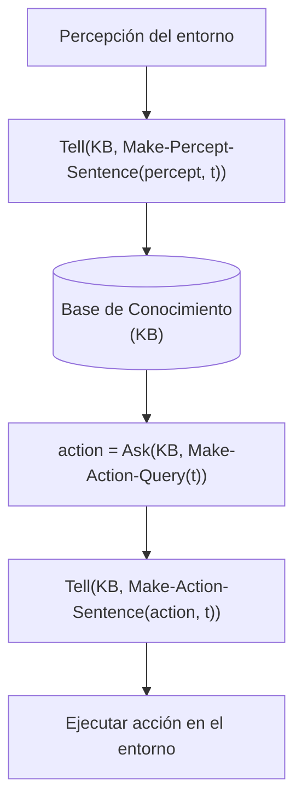

# Agente basado en conocimiento

## Definición

Agente cuyo comportamiento está guiado por una representación explícita del mundo almacenada en una **[[Base de conocimiento|Base de Conocimiento (KB)]]**, sobre la cual aplica un mecanismo o motor de inferencia formal para deducir hechos no observados directamente y derivar qué acciones ejecutar.

## Intuición

En entornos parcialmente observables o complejos, un agente no puede limitarse a reaccionar a los estímulos sensoriales inmediatos (como un agente reflejo) ni a proyectar estados ciegamente sin considerar restricciones lógicas (como la búsqueda de caminos tradicional). El agente basado en conocimiento mantiene un estado interno formalizado en sentencias lógicas, lo actualiza con cada nueva percepción y deduce racionalmente si una acción o casilla es segura antes de dar un paso.

## Arquitectura y ciclo de interacción

El agente interactúa con su base de conocimiento a través de dos operaciones fundamentales:

1. **`Tell[sentencia]`:** Informa a la base de conocimiento sobre percepciones o axiomas del entorno. Cada sentencia añadida reduce el conjunto de mundos posibles compatibles con la realidad.
2. **`Ask[consulta]`:** Pregunta a la base de conocimiento si cierta hipótesis o acción se deriva válidamente de lo conocido mediante [[Vinculación lógica|vinculación lógica]].

## Ejemplo mínimo

En el [[Mundo del Wumpus|Mundo del Wumpus]], el agente comienza en $[1,1]$ sin percibir brisa ($\neg B_{1,1}$). Ejecuta `Tell[¬B_11]`. Gracias a la regla del mundo $B_{1,1} \leftrightarrow (P_{1,2} \vee P_{2,1})$, el motor de inferencia deduce inmediatamente $\neg P_{1,2} \wedge \neg P_{2,1}$. Al ejecutar `Ask[Segura(1,2)]`, la respuesta es afirmativa, permitiendo al agente avanzar sin riesgo de muerte.

## Contraejemplo o límites

- **Coste computacional:** La inferencia lógica en casos generales (como SAT o lógica de primer orden) puede ser NP-completa o indecidible, por lo que requiere algoritmos eficientes o restricciones en la expresividad del lenguaje (como cláusulas de Horn).
- **Incertidumbre estocástica pura:** No reemplaza a los modelos probabilísticos cuando los hechos no admiten un valor de verdad determinista $\{0, 1\}$, sino grados de creencia.
- **Diferencia con el agente reflejo:** Un agente reflejo simple vincula reglas directas `condición → acción` sin razonar sobre la historia previa ni sobre consecuencias lógicas intermedias.

## Relaciones

- Es un tipo de: [[Agente racional|Agente racional]].
- Contiene y gestiona una: [[Base de conocimiento|Base de conocimiento]].
- Se expresa mediante: [[Lógica proposicional|Lógica proposicional]] y lógica de primer orden.
- Se evalúa en el: [[Mundo del Wumpus|Mundo del Wumpus]].
- Contrasta con: [[Agente por reflejo|Agente por reflejo]] y [[Agente de resolución de problemas|Agente de resolución de problemas]].

## Procedencia

- Clase: [[2026-09-10 IA - Agentes logicos|Clase 9: Agentes lógicos]].
- Fuente: Russell & Norvig, *Artificial Intelligence: A Modern Approach* (4.ª ed.), Capítulo 7: *Logical Agents*.
