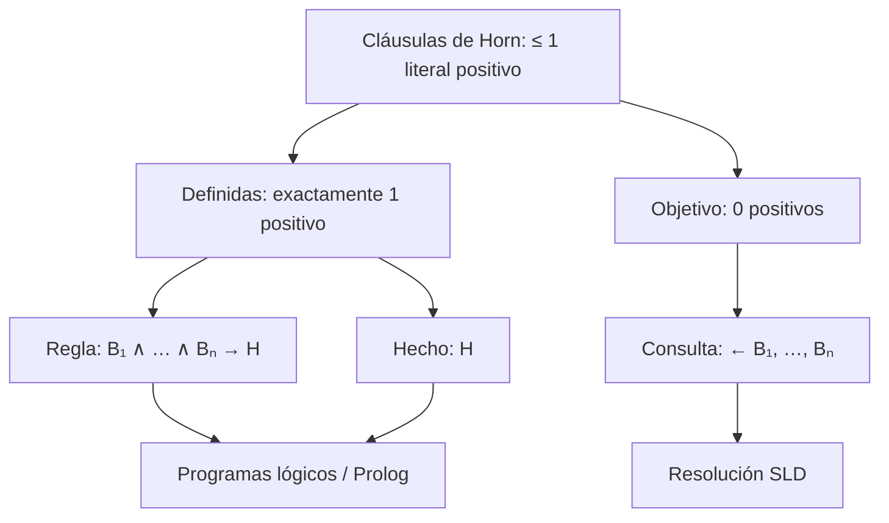

# Cláusula de Horn

Una **cláusula de Horn** es una disyunción de literales que contiene como máximo un literal positivo. Por ejemplo, $\neg Humano(x)\vee Mortal(x)$ es una cláusula de Horn; expresa que si alguien es humano, entonces es mortal:

$$Humano(x)\to Mortal(x).$$

Sus variables se entienden universalmente cuantificadas. La forma de regla general es $H\leftarrow B_1,\ldots,B_n$, equivalente a $B_1\land\cdots\land B_n\to H$.

## Variantes

- **Cláusula definida:** tiene exactamente un literal positivo. En lógica de programación corresponde a una regla (o, si el cuerpo está vacío, un hecho).
- **Cláusula objetivo:** no tiene literales positivos; se usa para representar una consulta que se intenta demostrar.
- **Cláusula de Horn general:** puede tener cero o un literal positivo. Por ello no toda cláusula de Horn es una cláusula definida.



## Relación con inferencia y programación lógica

La resolución conserva la forma de Horn: al resolver una cláusula objetivo con una cláusula definida se obtiene otra cláusula objetivo. La [[Resolución SLD|resolución SLD]] aprovecha precisamente esta estructura para responder consultas mediante unificación. [[Prolog|Prolog]] representa hechos y reglas como cláusulas definidas.

## Ejemplo

```prolog
humano(socrates).          % hecho
mortal(X) :- humano(X).    % cláusula definida
```

La regla equivale a $\neg humano(X)\vee mortal(X)$. La consulta `?- mortal(socrates).` es una cláusula objetivo: el motor busca derivar contradicción al resolverla con el programa, o operacionalmente reducir todas sus metas a una lista vacía.

## Procedencia y referencias

- Clase: [[2026-09-22 IA - logica de primer orden|Inferencia en lógica de primer orden]], sección 7.
- SWI-Prolog, [glosario: definite clause](https://www.swi-prolog.org/pldoc/man?section=glossary).
- Waterloo, [Logic and Computation: Horn clauses and logic programming](https://www.cs.uwaterloo.ca/~plragde/flaneries/LACI/Logic1.html).
- [[Lenguajes declarativos|Lenguajes declarativos]].
