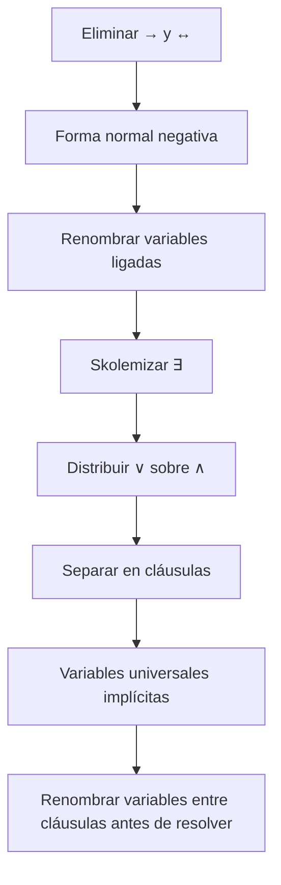

# Forma normal conjuntiva en lógica de primer orden

## Definición

Una fórmula de [[Lógica de primer orden|lógica de primer orden]] está en **forma clausal** o FNC cuando se representa como una conjunción de cláusulas, cada una formada por una disyunción de literales. Tras eliminar existenciales, las variables restantes de cada cláusula se consideran universalmente cuantificadas.

## Procedimiento para resolución

1. Eliminar $\leftrightarrow$ y $\to$.
2. Empujar negaciones hasta los átomos, intercambiando $\forall$ y $\exists$ cuando una negación cruza un cuantificador.
3. Estandarizar variables ligadas para que cada cuantificador use un nombre propio.
4. Aplicar [[Skolemización|skolemización]] a los existenciales.
5. Distribuir $\vee$ sobre $\land$.
6. Separar la conjunción en cláusulas y omitir los universales.
7. Antes de resolver, **estandarizar aparte** las variables de cláusulas diferentes.

El diagrama resume el orden de conversión que prepara una fórmula para resolución. La estandarización aparte del último paso se aplica al combinar cláusulas; evita que nombres de variables coincidentes creen dependencias accidentales.

## Ejemplo mínimo

$$\forall x\,[Humano(x)\to Mortal(x)]$$

se convierte en la cláusula:

$$\neg Humano(x)\vee Mortal(x).$$

En cambio, un existencial bajo el alcance de $x$ necesita una función de Skolem:

$$\forall x\,\exists y\,Ama(y,x)\quad\leadsto\quad Ama(F(x),x).$$

## Distinción importante

La eliminación de implicaciones y las leyes de De Morgan preservan **equivalencia lógica**. La skolemización preserva **satisfacibilidad**, no equivalencia literal en el vocabulario ampliado. Esto basta para la [[Resolución de primer orden|resolución por refutación]], porque lo relevante es si el conjunto de cláusulas puede o no tener un modelo.

## Errores frecuentes

- Borrar un cuantificador existencial sin introducir un testigo de Skolem.
- Usar una constante de Skolem cuando el testigo depende de variables universales en alcance.
- Tratar variables con el mismo nombre en cláusulas distintas como si fueran una sola.
- Distribuir $\land$ sobre $\vee$ en lugar de $\vee$ sobre $\land$.

## Procedencia y referencias

- Clase: [[2026-09-22 IA - logica de primer orden|Inferencia en lógica de primer orden]], diapositivas 3–7.
- Russell, S. J. y Norvig, P. (2020). *Artificial Intelligence: A Modern Approach* (4.ª ed.), §9.5; [sitio oficial](https://aima.cs.berkeley.edu/).
- Enderton, H. B. (2001). *A Mathematical Introduction to Logic* (2.ª ed.), capítulos 2–3. Academic Press. Referencia formal sobre equivalencias, cuantificadores y formas normales.
