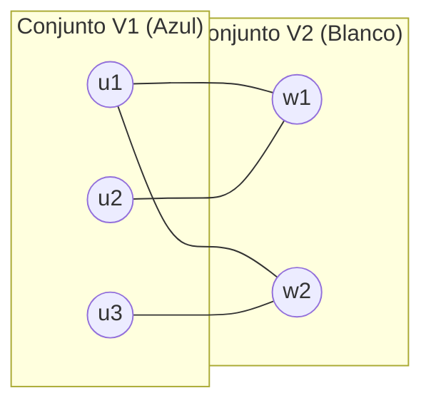

# Grafo bipartito

## Definición

Un grafo no dirigido $G = (V, E)$ es **bipartito** (o $2$-coloreable) si su conjunto de vértices $V$ puede particionarse en dos conjuntos disjuntos $V_1$ y $V_2$ ($V = V_1 \cup V_2$ y $V_1 \cap V_2 = \emptyset$) tales que **toda arista** $e = \{u, v\} \in E$ tiene un extremo en $V_1$ y el otro extremo en $V_2$.

Equivalentemente, es posible asignar uno de dos colores (por ejemplo, blanco y azul) a cada vértice de modo que ningún par de vértices adyacentes comparta el mismo color.

## Intuición

Un grafo bipartito modela relaciones exclusivas entre dos categorías distintas de entidades donde no existen conexiones internas dentro de una misma categoría:
- Médicos postulantes y hospitales de residencia (en el problema de emparejamiento estable).
- Trabajos a procesar y máquinas disponibles (en calendarización).
- Clientes y productos recomendados (en sistemas de recomendación).

Muchos problemas computacionales difíciles (NP-completos en grafos generales, como *Conjunto Independiente Máximo*) se vuelven solubles en tiempo polinomial cuando la gráfica subyacente es bipartita.

## Caracterización fundamental: La obstrucción por ciclos impares

> [!important] Teorema de König
> Un grafo no dirigido $G$ es bipartito **si y solo si** no contiene ningún ciclo simple de longitud impar.

### Idea de la demostración:
1. **$\implies$ (Necesidad):** Si $G$ contiene un ciclo impar $C = v_1 - v_2 - \dots - v_{2k+1} - v_1$, al intentar 2-colorear alternando colores: $v_1$ es azul, $v_2$ blanco, $v_3$ azul... el vértice $v_{2k+1}$ forzosamente recibe el color azul. Pero $v_{2k+1}$ es adyacente a $v_1$ (también azul), violando la condición de bipartición.
2. **$\impliedby$ (Suficiencia):** Se demuestra constructivamente mediante la [[Prueba de bipartición por BFS|prueba de bipartición por BFS]], asignando color según la paridad de la capa.

## Ejemplo mínimo

- **El ciclo $C_4$ (cuadrado):** $1 - 2 - 3 - 4 - 1$. Longitud par ($4$). Vértices $\{1, 3\}$ azules y $\{2, 4\}$ blancos. Ninguna arista une vértices del mismo color $\implies$ Es bipartito.
- **El ciclo $C_3$ (triángulo):** $1 - 2 - 3 - 1$. Longitud impar ($3$). Requiere al menos 3 colores $\implies$ No es bipartito.

## Relaciones

- Se verifica algorítmicamente mediante: [[Prueba de bipartición por BFS|Prueba de bipartición por BFS]].
- Es la estructura base para el problema de: [[Emparejamiento estable|Emparejamiento estable (Gale-Shapley)]].
- Contrasta con: [[Grafo dirigido|Grafo dirigido]] y grafos generales no 2-coloreables.

## Procedencia

- Clase: [[2026-09-08 ADA - biparticion-y-grafos-dirigidos|Clase del 8 de septiembre de 2026]].
- Fuente: Kleinberg & Tardos, *Algorithm Design*, Capítulo 3, Sección 3.4 (*Testing Bipartiteness*).
