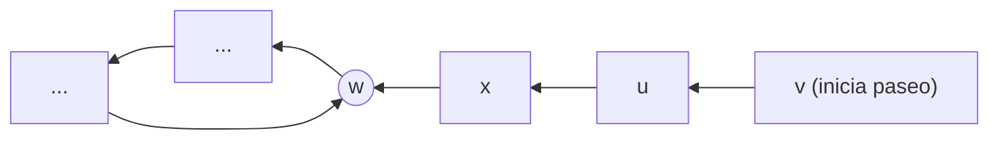

# Grafo dirigido acíclico

## Definición

Un **grafo dirigido acíclico** o **DAG** (*Directed Acyclic Graph*) es un [[Grafo dirigido|grafo dirigido]] que no contiene ningún ciclo dirigido simple; es decir, no existe ninguna secuencia de vértices $v_1, v_2, \dots, v_k$ con $k \ge 2$ tal que $(v_i, v_{i+1}) \in E$ y $v_1 = v_k$.

## Intuición y aplicaciones: Restricciones de precedencia

Los DAGs son el modelo matemático universal para representar **dependencias y precedencias** donde una tarea, proceso o elemento debe completarse obligatoriamente antes de poder iniciar otro:

- **Mapa curricular universitario:** La materia $u$ es prerrequisito obligatorio de la materia $v$. Si hubiera un ciclo ($A \to B \to C \to A$), ningún estudiante podría graduarse.
- **Sistemas de compilación (Makefiles, Bazel):** El módulo fuente $u$ debe compilarse antes de enlazar la biblioteca $v$.
- **Pipelines de datos y aprendizaje automático:** La salida del paso $u$ alimenta la entrada del modelo $v$.
- **Sistemas de control de versiones (Git):** El historial de commits forma un DAG de ancestros.

## Lema fundamental: Existencia de una fuente (Source Lemma)

> [!important] Lema de la Fuente
> En todo DAG finito $G = (V, E)$ con al menos un vértice ($n \ge 1$), **existe al menos un vértice con grado de entrada cero** ($\text{in-degree}(v) = 0$).
> 
> Dicho vértice no depende de ningún otro y se denomina **fuente** (*source*). Análogamente, existe al menos un vértice con grado de salida cero, denominado **sumidero** (*sink*).

### Demostración por contradicción (Paseo hacia atrás)
1. Supongamos que $G$ es un DAG pero **todo** nodo tiene al menos una arista de entrada ($\text{in-degree}(v) \ge 1$ para todo $v \in V$).
2. Elijamos un nodo inicial cualquiera $v_1$. Como tiene aristas entrantes, podemos retroceder a lo largo de una arista entrante $(v_2, v_1)$ hacia un nodo predecesor $v_2$.
3. Como $v_2$ también tiene al menos una arista entrante, retrocedemos hacia $v_3$, y así sucesivamente:
   $$v_k \to \dots \to v_3 \to v_2 \to v_1$$
4. Dado que el conjunto de vértices $V$ es finito ($|V| = n$), por el principio del palomar, tras dar a lo más $n$ pasos hacia atrás nos veremos forzados a visitar por segunda vez algún nodo ya visitado $w$.
5. La subsecuencia de aristas recorrida entre la primera y la segunda visita al nodo $w$ forma un **ciclo dirigido**, lo cual contradice la hipótesis de que $G$ es un DAG.
6. Por contradicción, debe existir al menos un nodo sin aristas de entrada.

## Relaciones

- Admite siempre al menos un: [[Ordenamiento topológico|Ordenamiento topológico]].
- Se procesa linealmente mediante el: [[Algoritmo de ordenamiento topológico|Algoritmo de ordenamiento topológico (Kahn)]].
- Es un caso especial de: [[Grafo dirigido|Grafo dirigido]].

## Procedencia

- Clase: [[2026-09-10 ADA - DAGs-y-ordenamiento-topologico|Clase del 10 de septiembre de 2026]].
- Fuente: Kleinberg & Tardos, *Algorithm Design*, Capítulo 3, Sección 3.6 (*DAGs and Topological Ordering*).
