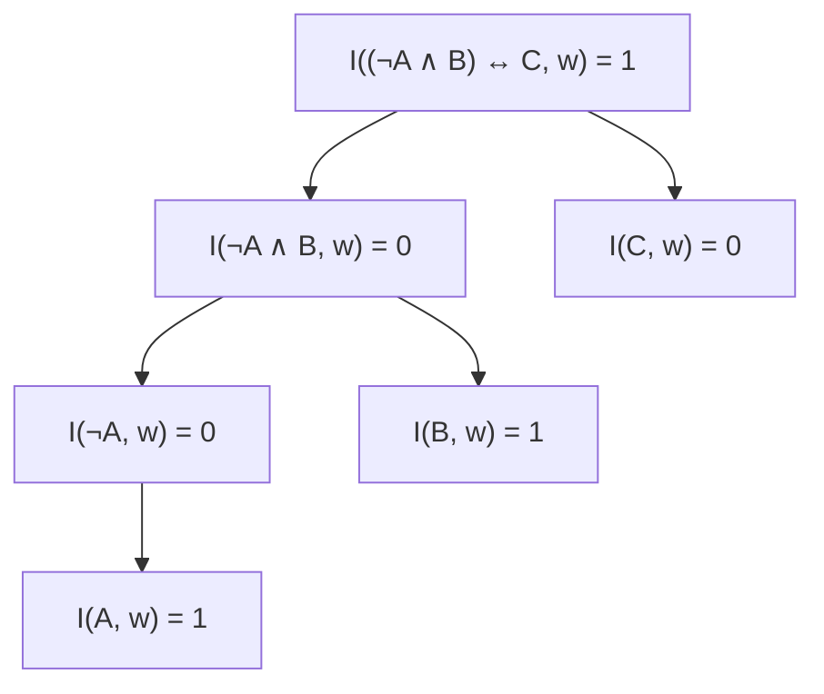

# Modelo en lógica proposicional

## Definición

En [[Lógica proposicional|lógica proposicional]], un **modelo** (o **mundo posible**) $w$ es una asignación completa y precisa de valores de verdad ($\{0, 1\}$ o $\{\text{False}, \text{True}\}$) a cada uno de los símbolos proposicionales del vocabulario.

Si un vocabulario contiene $n$ símbolos proposicionales independientes, existen exactamente:

$$
|W| = 2^n \quad \text{modelos posibles}
$$

## Función de interpretación y satisfacción

Dada una fórmula $f$ y un modelo $w$, la **función de interpretación** $I(f, w)$ devuelve:

$$
I(f, w) =
\begin{cases}
1 (\text{Verdadero}), & \text{si el modelo } w \text{ satisface la fórmula } f \\
0 (\text{Falso}), & \text{si el modelo } w \text{ no satisface la fórmula } f
\end{cases}
$$

Decimos que $w$ **satisface** $f$ (o que $w$ es un modelo de $f$) cuando $I(f, w) = 1$.

### Conjunto de modelos $M(f)$

Se define $M(f)$ como el conjunto de todos los mundos posibles en los que $f$ es verdadera:

$$
M(f) = \{w \in W \mid I(f, w) = 1\}
$$

## Conceptos semánticos derivados

- **Validez (Tautología):** Una fórmula $f$ es válida si es verdadera en **todos** los modelos posibles ($M(f) = W$). Ejemplo: $P \vee \neg P$.
- **Satisfactibilidad:** Una fórmula $f$ es satisfactible si existe **al menos un** modelo donde es verdadera ($M(f) \neq \emptyset$).
- **Insatisfactibilidad (Contradicción):** Una fórmula $f$ es insatisfactible si es falsa en todos los modelos ($M(f) = \emptyset$). Ejemplo: $P \wedge \neg P$.
- **Equivalencia lógica ($\alpha \equiv \beta$):** Dos sentencias son lógicamente equivalentes si y solo si son verdaderas exactamente en el mismo conjunto de modelos:
  $$
  \alpha \equiv \beta \iff M(\alpha) = M(\beta)
  $$

## Ejemplo mínimo: evaluación en árbol

Dada la fórmula $f = (\neg A \wedge B) \leftrightarrow C$ y el modelo particular $w = \{A: 1, B: 1, C: 0\}$ (diapositiva 14):

Como tanto el lado izquierdo $(0)$ como el derecho $(0)$ tienen el mismo valor de verdad, la equivalencia bicondicional se cumple: $I(f, w) = 1$. Por lo tanto, $w \in M(f)$.

## Contraejemplo o límites

- Un modelo no es un estado físico real del mundo exterior; es una construcción matemática abstracta (un vector de booleanos) que fija el valor de verdad de las proposiciones del lenguaje.
- Si el número de símbolos proposicionales crece (ej. $n = 50$), el espacio de modelos $2^{50} \approx 10^{15}$ se vuelve inmanejable mediante tablas de verdad exhaustivas, requiriendo algoritmos de inferencia que no exploren todos los modelos uno por uno.

## Relaciones

- El conjunto de modelos de una base es: $M(KB) = \bigcap_{f \in KB} M(f)$ en una [[Base de conocimiento|Base de conocimiento]].
- La inclusión de modelos define la: [[Vinculación lógica|Vinculación lógica]].
- La existencia de un modelo define la: [[Satisfacibilidad proposicional|Satisfacibilidad proposicional]].

## Procedencia

- Clase: [[2026-09-10 IA - Agentes logicos|Clase 9: Agentes lógicos]].
- Fuente: Russell & Norvig, *Artificial Intelligence: A Modern Approach* (4.ª ed.), Capítulo 7.
