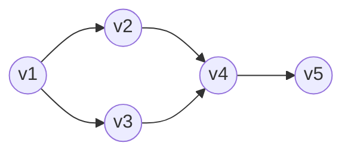

# Ordenamiento topológico

## Definición

Dado un [[Grafo dirigido|grafo dirigido]] $G = (V, E)$ con $n$ vértices, un **ordenamiento topológico** es una permutación lineal de sus nodos:

$$
v_1, v_2, \dots, v_n
$$

tal que para **toda arista dirigida** $(v_i, v_j) \in E$, el nodo origen $v_i$ aparece estrictamente antes que el nodo destino $v_j$ en la secuencia; es decir:

$$
(v_i, v_j) \in E \implies i < j
$$

Si se dibujan todos los vértices en una línea horizontal siguiendo este orden, **todas las aristas apuntan hacia adelante** (de izquierda a derecha), sin aristas de retroceso.

## Teorema fundamental de equivalencia

> [!important] Teorema de Existencia
> Un grafo dirigido $G$ tiene un ordenamiento topológico **si y solo si** $G$ es una [[Grafo dirigido acíclico|gráfica dirigida acíclica (DAG)]].

### Demostración:
1. **$\implies$ (Si $G$ tiene orden topológico, entonces es DAG):**
   - Demostración por contradicción: Supongamos que $G$ tiene un orden topológico $v_1, \dots, v_n$ y que al mismo tiempo contiene un ciclo dirigido $C$.
   - Sea $v_i$ el nodo del ciclo $C$ que tiene el **índice mínimo** en el orden topológico.
   - Sea $v_j$ el nodo inmediatamente anterior a $v_i$ en el ciclo $C$. Por tanto, $(v_j, v_i) \in E$.
   - Como $v_i$ tenía el índice mínimo en $C$, se cumple que $i < j$.
   - Pero como $(v_j, v_i) \in E$ y la secuencia es un orden topológico, por definición debe cumplirse $j < i$, lo cual es una **contradicción**.
   - Por tanto, $G$ no puede contener ciclos dirigidos.

2. **$\impliedby$ (Si $G$ es DAG, entonces tiene orden topológico):**
   - Demostración constructiva por inducción en $n$:
     - **Caso base ($n=1$):** Un único nodo es trivialmente un orden topológico.
     - **Paso inductivo ($n > 1$):** Por el *lema de la fuente*, $G$ tiene al menos un nodo $v$ con $\text{in-degree}(v) = 0$.
     - Al eliminar $v$ de $G$, la subgráfica $G \setminus \{v\}$ sigue siendo un DAG (eliminar nodos no crea ciclos) con $n-1$ nodos.
     - Por hipótesis de inducción, $G \setminus \{v\}$ tiene un orden topológico.
     - Colocamos a $v$ en la **primera posición** y a continuación la secuencia de $G \setminus \{v\}$. Como $v$ no tenía aristas de entrada, ninguna arista de $G$ apunta hacia atrás a $v$, produciendo un orden topológico válido para todo $G$.

*Orden lineal:* $v_1 \to v_2 \to v_3 \to v_4 \to v_5$ (todas las dependencias van de izquierda a derecha).

## Propiedades adicionales

- Un DAG puede tener **múltiples órdenes topológicos válidos** distintos (por ejemplo, cualquier orden entre tareas independientes es admisible).
- Un orden topológico es **único** si y solo si el DAG contiene un camino hamiltoniano dirigido (un camino que visita todos los vértices).

## Relaciones

- Solo existe en un: [[Grafo dirigido acíclico|Grafo dirigido acíclico (DAG)]].
- Se calcula eficientemente mediante el: [[Algoritmo de ordenamiento topológico|Algoritmo de ordenamiento topológico (Kahn)]].
- Determina el orden de cálculo en: [[Programación dinámica|Programación dinámica sobre DAGs]].

## Procedencia

- Clase: [[2026-09-10 ADA - DAGs-y-ordenamiento-topologico|Clase del 10 de septiembre de 2026]].
- Fuente: Kleinberg & Tardos, *Algorithm Design*, Sección 3.6.
