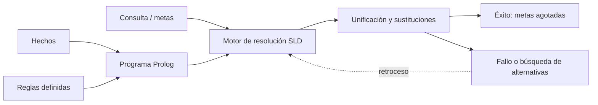

# Prolog

**Prolog** es un lenguaje de programación lógica en el que se expresan relaciones mediante hechos y reglas. Una consulta pregunta si puede demostrarse una meta a partir del programa y, si hay variables, qué sustituciones la hacen verdadera. El nombre procede de * programmation en logique*.



## Hechos, reglas y consultas

```prolog
humano(socrates).
mortal(X) :- humano(X).

?- mortal(socrates).
```

`humano(socrates).` es un hecho. `mortal(X) :- humano(X).` dice que `mortal(X)` se cumple si se cumple `humano(X)`. La consulta `mortal(socrates)` se resuelve unificando con la cabeza de la regla (`X = socrates`) y reemplazándola por el cuerpo `humano(socrates)`, que coincide con el hecho.

## Conexión lógica

El núcleo de los programas Prolog tradicionales usa [[Cláusula de Horn|cláusulas definidas]] y responde consultas mediante [[Resolución SLD|resolución SLD]], una forma de resolución de primer orden guiada por metas. La unificación calcula las sustituciones necesarias. La lectura de hechos y reglas expresa conocimiento de manera [[Lenguajes declarativos|declarativa]], aunque la estrategia concreta de búsqueda también influye en el comportamiento.

La estrategia Prolog habitual selecciona la meta de más a la izquierda, intenta cláusulas en el orden del programa y explora en profundidad; si falla, retrocede a alternativas. Así, el orden puede cambiar el rendimiento o la terminación aun cuando el conjunto de cláusulas tenga el mismo significado lógico.

## Procedencia y referencias

- Clase: [[2026-09-22 IA - logica de primer orden|Inferencia en lógica de primer orden]], sección 7.
- SWI-Prolog, [Overview](https://www.swi-prolog.org/pldoc/man?section=overview) y [glosario](https://www.swi-prolog.org/pldoc/man?section=glossary).
- [[Lenguajes declarativos|Lenguajes declarativos]].
