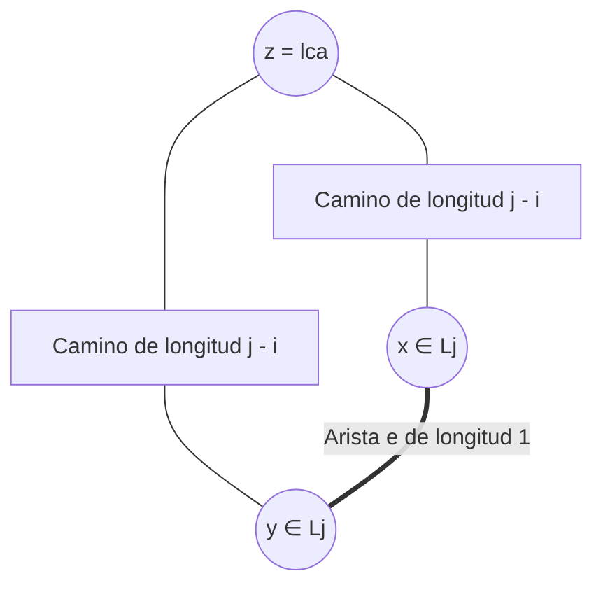

# Prueba de bipartición por BFS

## Definición

Algoritmo lineal en tiempo $O(m + n)$ que determina si un grafo no dirigido $G = (V, E)$ es un [[Grafo bipartito|grafo bipartito]] y, en caso afirmativo, produce una $2$-coloración válida, o en caso negativo, exhibe un ciclo de longitud impar que certifica formalmente la imposibilidad de bipartición.

## Fundamento teórico: Partición por capas BFS

Sea $G$ conexo y sean $L_0, L_1, L_2, \dots, L_k$ las capas de distancia producidas por [[Búsqueda en anchura|BFS]] iniciando en un vértice arbitrario $s$ ($L_0 = \{s\}$). 

Por la propiedad del árbol BFS, toda arista $\{u, v\} \in E$ une vértices cuyos niveles difieren a lo más en 1 ($|\text{nivel}(u) - \text{nivel}(v)| \le 1$). Por ende, solo existen dos casos posibles para cada arista:
1. Une vértices de niveles contiguos ($L_i$ y $L_{i+1}$).
2. Une vértices dentro del **mismo nivel** ($L_j$ y $L_j$).

> [!important] Lema de Bipartición en Capas BFS
> Sea $G$ conexo con capas BFS $L_0, \dots, L_k$. Se cumple exactamente una de las siguientes dos afirmaciones:
> 1. **Caso (i):** Ninguna arista de $G$ une dos nodos de la misma capa $\implies G$ es bipartito. La bipartición válida es:
>    $$V_1 = \bigcup_{i \text{ par}} L_i \quad (\text{Azul}), \qquad V_2 = \bigcup_{i \text{ impar}} L_i \quad (\text{Blanco})$$
> 2. **Caso (ii):** Existe una arista $e = \{x, y\}$ tal que $x, y \in L_j$ $\implies G$ contiene un **ciclo de longitud impar** y, por tanto, **no es bipartito**.

### Demostración del Caso (ii) y construcción del ciclo impar

Sea $\{x, y\}$ una arista con $x, y \in L_j$. En el árbol BFS, trazamos los caminos desde $x$ y desde $y$ hacia la raíz $s$ hasta encontrar su **ancestro común más cercano** (*lowest common ancestor*), $z = \text{lca}(x, y)$, ubicado en algún nivel $L_i$ ($i \le j$):

- El camino de $x$ a $z$ en el árbol tiene longitud $j - i$.
- El camino de $y$ a $z$ en el árbol tiene longitud $j - i$.
- La arista directa $\{x, y\}$ tiene longitud $1$.

El ciclo cerrado $x - y \rightsquigarrow z \rightsquigarrow x$ tiene longitud total:

$$
\text{Longitud} = 1 + (j - i) + (j - i) = 1 + 2(j - i)
$$

Como $2(j - i)$ es estrictamente par para cualquier entero $j \ge i$, $1 + 2(j - i)$ es **estrictamente impar**.



## Algoritmo y análisis de complejidad

```python
def es_bipartito(G, s):
    # 1. Ejecutar BFS y etiquetar niveles
    nivel = {s: 0}
    cola = [s]
    while cola:
        u = cola.pop(0)
        for v in G.vecinos(u):
            if v not in nivel:
                nivel[v] = nivel[u] + 1
                cola.append(v)
            elif nivel[v] == nivel[u]:
                # Encontrada arista en la misma capa
                return False, "Ciclo impar detectado entre " + str(u) + " y " + str(v)
    return True, nivel
```

- **Tiempo de ejecución:** $O(m + n)$ utilizando listas de adyacencia (igual que BFS estándar).
- **Espacio adicional:** $O(n)$ para almacenar los niveles y la cola.

## Relaciones

- Verifica la condición de: [[Grafo bipartito|Grafo bipartito]].
- Se basa en la exploración de: [[Búsqueda en anchura|Búsqueda en anchura (BFS)]].
- Identifica la ausencia de: Ciclos impares.

## Procedencia

- Clase: [[2026-09-08 ADA - biparticion-y-grafos-dirigidos|Clase del 8 de septiembre de 2026]].
- Fuente: Kleinberg & Tardos, *Algorithm Design*, Capítulo 3, Sección 3.4 (*Testing Bipartiteness*).
