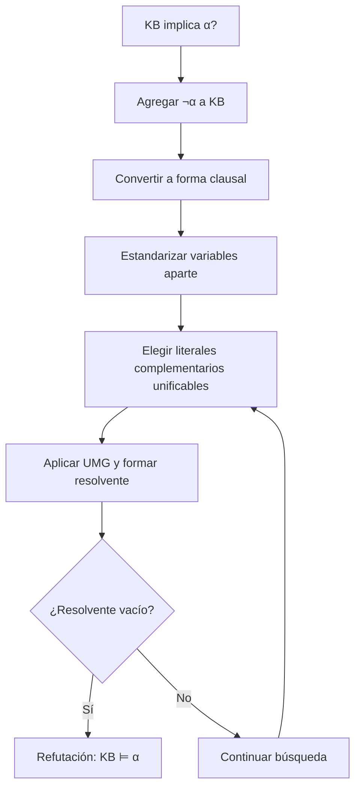

# Resolución de primer orden

## Definición

La **resolución de primer orden** es una regla de inferencia que combina dos cláusulas con literales complementarios unificables. Sean $p$ y $q$ átomos y $\theta=Unify(p,q)$:

$$
\frac{C\vee p,\qquad D\vee\neg q}
{Subst(\theta,C\vee D)}.
$$

La regla generaliza la resolución proposicional: allí $p$ y $q$ deben ser idénticos; aquí basta con que exista una [[Unificación|unificación]].

La operación aplica la sustitución a la disyunción que queda tras retirar los literales resueltos; consultar [[Sustitución lógica|sustitución lógica]]. El nombre **refutación por resolución** describe el uso de esta regla para demostrar una consecuencia reduciendo la negación de la consulta a contradicción, por lo que se integra aquí y no requiere una nota duplicada.

## Prueba por refutación

Para demostrar $KB\models\alpha$:

1. formar $KB\land\neg\alpha$;
2. convertirlo a [[Forma normal conjuntiva en lógica de primer orden|cláusulas]];
3. estandarizar aparte las variables;
4. generar resolventes;
5. buscar la cláusula vacía $\square$.

Obtener $\square$ demuestra que $KB\land\neg\alpha$ no tiene modelo y, por tanto, que $KB\models\alpha$.

## Ejemplo mínimo

$$
\neg Humano(x)\vee Mortal(x),\qquad Humano(Sócrates).
$$

Con $\theta=\{x/Sócrates\}$ obtenemos $Mortal(Sócrates)$. Al resolver esta cláusula con la negación de la consulta $\neg Mortal(Sócrates)$ se obtiene $\square$.

## Corrección, completitud y límite operativo

La resolución de primer orden es correcta y, como procedimiento de refutación con una estrategia adecuada, completa: si un conjunto de cláusulas es insatisfactible, existe una derivación finita de $\square$. Sin embargo, la consecuencia lógica de primer orden no es decidible en general; cuando la consulta no se sigue, una búsqueda puede continuar indefinidamente.

No obtener $\square$ por falta de tiempo o por una estrategia incompleta no equivale a construir un modelo ni a refutar la consulta.

## Relaciones

- Requiere [[Skolemización|skolemización]] y forma clausal.
- Usa [[Unificación|unificación]] para elegir la sustitución.
- [[Resolución SLD|Resolución SLD]] es una especialización para cláusulas definidas y metas.

## Procedencia y referencias

- Clase: [[2026-09-22 IA - logica de primer orden|Inferencia en lógica de primer orden]], diapositivas 3 y 8–15.
- Russell, S. J. y Norvig, P. (2020). *Artificial Intelligence: A Modern Approach* (4.ª ed.), §9.5; [sitio oficial](https://aima.cs.berkeley.edu/).
- Genesereth, M. R., *Introduction to Logic*, [sección de resolución](https://logic.stanford.edu/intrologic/sections/section_14.html?section=8).
