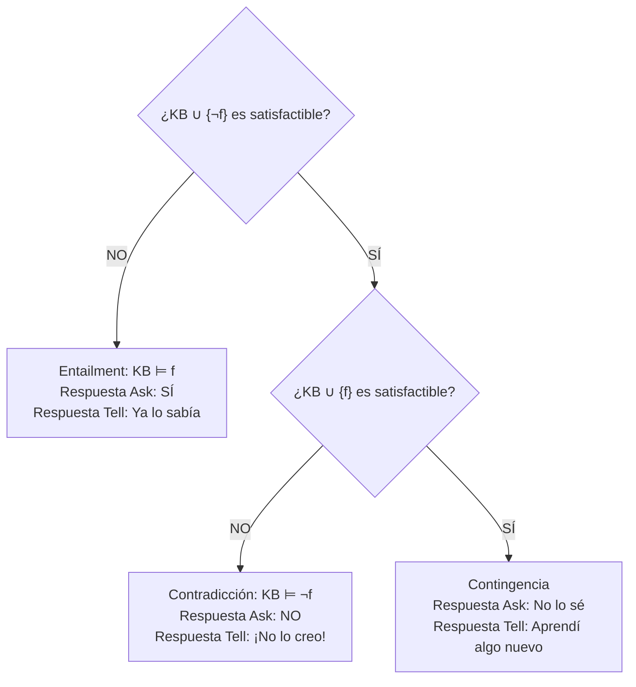
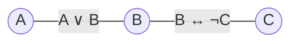

# Satisfacibilidad proposicional

## Definición

El problema de **satisfactibilidad proposicional (SAT)** consiste en determinar si existe al menos una asignación de verdad ([[Modelo en lógica proposicional|modelo]] $w$) para las variables de una fórmula o [[Base de conocimiento|Base de Conocimiento ($KB$)]] que haga que dicha sentencia sea evaluada como verdadera:

$$
KB \text{ es satisfactible} \iff M(KB) \neq \emptyset
$$

Si no existe ningún modelo que la satisfaga ($M(KB) = \emptyset$), se dice que la base o fórmula es **insatisfactible** (o contradictoria).

## Importancia en inferencia: Reducción de Ask y Tell

Cualquier consulta lógica en un [[Agente basado en conocimiento|agente lógico]] puede responderse ejecutando a lo más dos llamadas a un comprobador de satisfactibilidad (árbol de decisión de la diapositiva 22):

## Formulación de SAT como Problema de Satisfacción de Restricciones (CSP)

El problema SAT es un caso especial de un **[[Problema de satisfacción de restricciones|Problema de Satisfacción de Restricciones (CSP)]]**:

1. **Variables:** Los símbolos proposicionales del problema, $\{X_1, X_2, \dots, X_n\}$.
2. **Dominios:** Binarios para cada variable, $D_i = \{0, 1\}$ (o $\{\text{False}, \text{True}\}$).
3. **Restricciones:** Cada fórmula o cláusula lógica impone una restricción sobre las combinaciones de asignaciones permitidas para sus variables.

### Ejemplo de grafo CSP (diapositiva 23)

Dada la base $KB = \{A \vee B, B \leftrightarrow \neg C\}$:

- Restricción $A \vee B$: no permite la tupla $(A=0, B=0)$. Pares válidos: $\{(0,1), (1,0), (1,1)\}$.
- Restricción $B \leftrightarrow \neg C$: exige $B \neq C$. Pares válidos: $\{(0,1), (1,0)\}$.

Aplicando búsqueda con [[Backtracking|Backtracking]], propagación por [[Consistencia de arcos|Consistencia de arcos (AC-3)]] o algoritmos especializados como **DPLL** (Davis-Putnam-Logemann-Loveland), encontramos las asignaciones consistentes sin necesidad de construir la tabla de verdad completa.

## Complejidad y límites

- **Teorema de Cook-Levin (1971):** SAT fue el primer problema demostrado como **NP-completo**. En el peor de los casos, cualquier algoritmo general de SAT requiere tiempo exponencial $O(2^n)$.
- No obstante, para casos prácticos con estructuras restringidas (como fórmulas en cláusulas de Horn o mediante heurísticas avanzadas en SAT-solvers modernos), los problemas de gran tamaño pueden resolverse de manera extraordinariamente rápida.

## Relaciones

- Es el mecanismo algorítmico para comprobar: [[Vinculación lógica|Vinculación lógica]].
- Modela formalmente la consistencia de una: [[Base de conocimiento|Base de conocimiento]].
- Es un caso particular de: [[Problema de satisfacción de restricciones|Problema de satisfacción de restricciones (CSP)]].
- Se resuelve mediante: [[Backtracking|Backtracking]] y algoritmos DPLL.

## Procedencia

- Clase: [[2026-09-10 IA - Agentes logicos|Clase 9: Agentes lógicos]].
- Fuente: Russell & Norvig, *Artificial Intelligence: A Modern Approach* (4.ª ed.), Capítulo 7.
