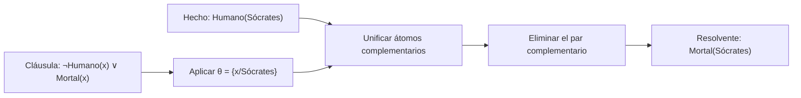

# Sustitución lógica

## Definición

Una **sustitución** es un mapeo finito de variables a términos. Se escribe, por ejemplo, $\theta=\{x/a,y/f(z)\}$. Aplicar la sustitución a una expresión reemplaza simultáneamente las variables indicadas: $P(x,y)\theta=P(a,f(z))$. Las variables no incluidas quedan intactas.

En la notación de estas notas, $Subst(\theta,E)$ significa aplicar $\theta$ a la expresión $E$. La sustitución permite instanciar fórmulas y registrar el resultado de la [[Unificación|unificación]].

## Aplicación y composición

Si $\theta=\{x/f(y),y/a\}$, la aplicación simultánea a $P(x,y)$ da $P(f(y),a)$: el $y$ que aparece dentro del término insertado no se vuelve a sustituir en esa misma aplicación. Al componer sustituciones, en cambio, la segunda puede aplicarse a los términos producidos por la primera. Por ejemplo, aplicar primero $\theta_1=\{x/y\}$ y después $\theta_2=\{y/a\}$ equivale a la composición $\theta_1\theta_2=\{x/a,y/a\}$ (la convención de orden debe declararse; aquí se lee de izquierda a derecha en el tiempo).

La sustitución debe respetar el alcance de cuantificadores: al sustituir dentro de fórmulas cuantificadas se evita capturar variables libres. En los algoritmos de unificación de términos, esta precaución se simplifica usando variables y términos explícitos, mientras que al instanciar fórmulas se debe renombrar una variable ligada si colisiona con una variable libre del término insertado.

## Ejemplo en inferencia

Para resolver $\neg Humano(x)\vee Mortal(x)$ con $Humano(Sócrates)$, el unificador $\theta=\{x/Sócrates\}$ se aplica a la cláusula restante completa: $Mortal(x)\theta=Mortal(Sócrates)$. Después se elimina el par de literales complementarios. Véase [[Resolución de primer orden|resolución de primer orden]].

## Referencias

- Clase: [[2026-09-22 IA - logica de primer orden|Inferencia en lógica de primer orden]], diapositiva 8.
- Russell, S. J. y Norvig, P. (2020). *Artificial Intelligence: A Modern Approach* (4.ª ed.), §9.2; [sitio del libro](https://aima.cs.berkeley.edu/).
- Genesereth, M. R. y Nilsson, N. J. (1987). *Logical Foundations of Artificial Intelligence*, capítulo 3. [DOI/editorial](https://doi.org/10.1007/978-1-4612-4984-5).
