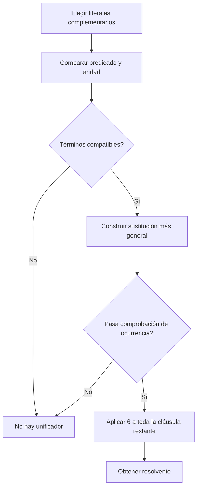

# Unificación

## Definición

La **unificación** busca una sustitución $\theta$ que haga sintácticamente iguales dos términos o átomos de [[Lógica de primer orden|primer orden]]:

$$Subst(\theta,p)=Subst(\theta,q).$$

Cuando existe, interesa el **unificador más general** (UMG): uno que impone solo las igualdades necesarias y del cual pueden obtenerse unificadores más específicos mediante sustituciones adicionales.

Formalmente, $\theta$ unifica $p$ y $q$ si $p\theta=q\theta$. Un UMG es más general que cualquier otro unificador: para cada unificador $\sigma$ existe una sustitución $\delta$ tal que $\sigma=\theta\delta$ (salvo renombramiento de variables). Para la notación y aplicación de mapeos, véase [[Sustitución lógica|sustitución lógica]].

## Ejemplo mínimo

$$Humano(x)\quad\text{y}\quad Humano(Sócrates)$$

se unifican con:

$$\theta=\{x/Sócrates\}.$$

También:

$$Loves(G(x),x)\quad\text{y}\quad Loves(u,v)$$

se unifican con $\theta=\{u/G(x),v/x\}$.

## Casos donde falla

- Predicados distintos: $Gato(x)$ y $Perro(x)$.
- Distinta aridad: $P(x)$ y $P(x,y)$.
- Constantes incompatibles: $P(a)$ y $P(b)$, si $a\neq b$.
- **Comprobación de ocurrencia:** $x$ no puede sustituirse por un término que ya contiene a $x$, como $f(x)$, porque produciría un término infinito.

## Papel en resolución

En [[Resolución de primer orden|resolución de primer orden]], la unificación permite tratar como complementarios literales que no son idénticos al inicio. Después de calcular $\theta$, la sustitución se aplica a todos los literales restantes del resolvente.

Antes de unificar cláusulas diferentes se estandarizan aparte sus variables para evitar dependencias accidentales por reutilizar nombres como $x$ o $y$.

Un procedimiento de unificación descompone ecuaciones entre términos: elimina ecuaciones idénticas, descompone funciones con el mismo símbolo y aridad, orienta una ecuación con variable al lado izquierdo y sustituye esa variable en el resto. Falla ante símbolos incompatibles o si la variable aparece dentro del término que se le asignaría (comprobación de ocurrencia). Esta última condición evita soluciones infinitas como $x=f(x)$ en la sintaxis finita ordinaria.

## Procedencia y referencias

- Clase: [[2026-09-22 IA - logica de primer orden|Inferencia en lógica de primer orden]], diapositiva 8.
- Russell, S. J. y Norvig, P. (2020). *Artificial Intelligence: A Modern Approach* (4.ª ed.), §9.2; [sitio oficial](https://aima.cs.berkeley.edu/).
- Genesereth, M. R., *Introduction to Logic*, [unificación y resolución](https://logic.stanford.edu/intrologic/sections/section_14.html?section=8).
