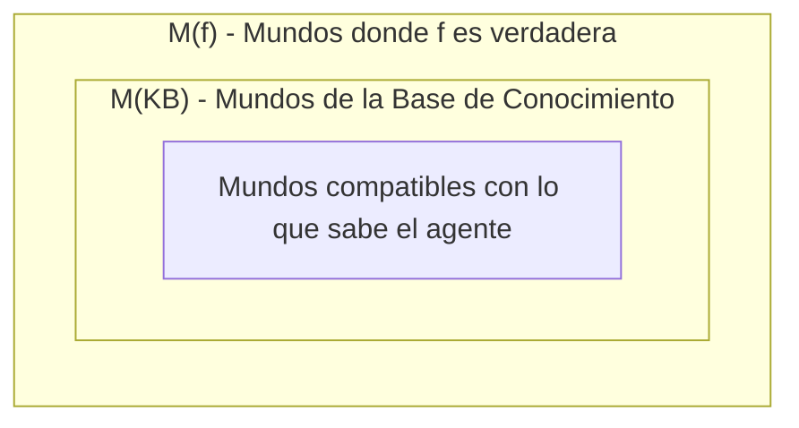

# Vinculación lógica

## Definición

Relación semántica fundamental entre una [[Base de conocimiento|Base de Conocimiento ($KB$)]] y una sentencia $f$ (o entre dos sentencias $\alpha$ y $\beta$), denotada como:

$$
KB \models f
$$

Significa que $f$ se sigue necesariamente de $KB$; es decir, en **todo** [[Modelo en lógica proposicional|modelo]] o mundo posible donde $KB$ es verdadera, $f$ también debe ser obligatoriamente verdadera.

## Formulación mediante conjuntos de modelos

La vinculación lógica equivale estrictamente a la **inclusión de subconjuntos** en el espacio de mundos posibles:

$$
KB \models f \iff M(KB) \subseteq M(f)
$$

### Distinción crítica: Implicación material ($\to$) vs. Vinculación lógica ($\models$)

- **$\to$ (o $\Rightarrow$):** Es un **conector sintáctico** dentro del lenguaje formal. Produce una nueva fórmula que puede ser verdadera o falsa según el modelo.
- **$\models$:** Es una **relación metalógica semántica** entre una teoría ($KB$) y una fórmula ($f$). No es un operador del lenguaje; es una afirmación sobre todos los modelos.
- **Teorema de la deducción:** Ambas nociones se conectan mediante la tautología:
  $$
  \alpha \models \beta \iff (\alpha \Rightarrow \beta) \text{ es válida (tautología)}
  $$

## Los tres posibles escenarios entre KB y una sentencia $f$

1. **Vinculación ($KB \models f$):** $M(KB) \subseteq M(f)$.
   - Respuesta a `Ask[f]`: **"Sí"**.
   - Respuesta a `Tell[f]`: **"Ya lo sabía"** (redundante).
2. **Contradicción ($KB \models \neg f$):** $M(KB) \cap M(f) = \emptyset$.
   - Respuesta a `Ask[f]`: **"No"**.
   - Respuesta a `Tell[f]`: **"¡No lo creo!"** (inconsistencia).
3. **Contingencia:** $\emptyset \subsetneq M(KB) \cap M(f) \subsetneq M(KB)$.
   - Respuesta a `Ask[f]`: **"No lo sé"** (indecidible con la información actual).
   - Respuesta a `Tell[f]`: **"Aprendí algo nuevo"** (reduce $M(KB)$).

## Teorema de refutación: Reducción a Satisfactibilidad

La vinculación lógica puede demostrarse mediante prueba por contradicción (reducción a absurdum):

$$
KB \models f \iff KB \cup \{\neg f\} \text{ es insatisfactible } (M(KB \cup \{\neg f\}) = \emptyset)
$$

Este resultado es la piedra angular de los algoritmos modernos de inferencia (SAT solvers y resolución).

## Ejemplo mínimo

Sea $KB = \{\text{Rain} \wedge \text{Snow}\}$.
- Consideremos la consulta $f = \text{Rain}$.
- En todo mundo donde llueve y nieva, evidentemente llueve. Por tanto, $M(\text{Rain} \wedge \text{Snow}) \subseteq M(\text{Rain})$. Conclusión: $\text{Rain} \wedge \text{Snow} \models \text{Rain}$.
- En cambio, para $g = \neg \text{Snow}$, la intersección con $KB$ es vacía; por ende $KB$ contradice $g$.

## Relaciones

- Es la meta de la inferencia en un: [[Agente basado en conocimiento|Agente basado en conocimiento]].
- Se reduce a una prueba de: [[Satisfacibilidad proposicional|Satisfacibilidad proposicional]].
- Se verifica sobre el espacio de: [[Modelo en lógica proposicional|Modelos en lógica proposicional]].

## Procedencia

- Clase: [[2026-09-10 IA - Agentes logicos|Clase 9: Agentes lógicos]].
- Fuente: Russell & Norvig, *Artificial Intelligence: A Modern Approach* (4.ª ed.), Capítulo 7.
