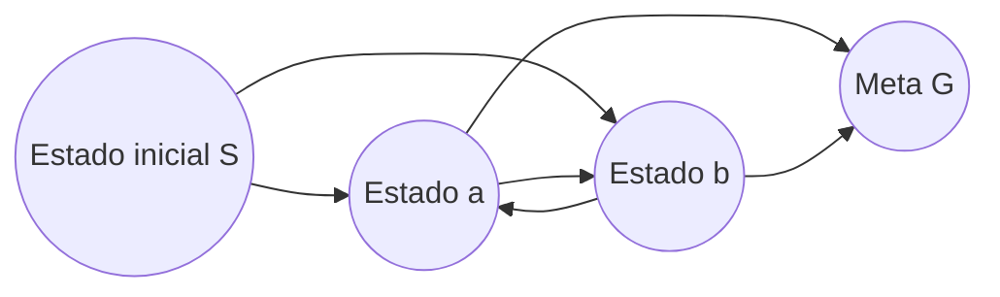
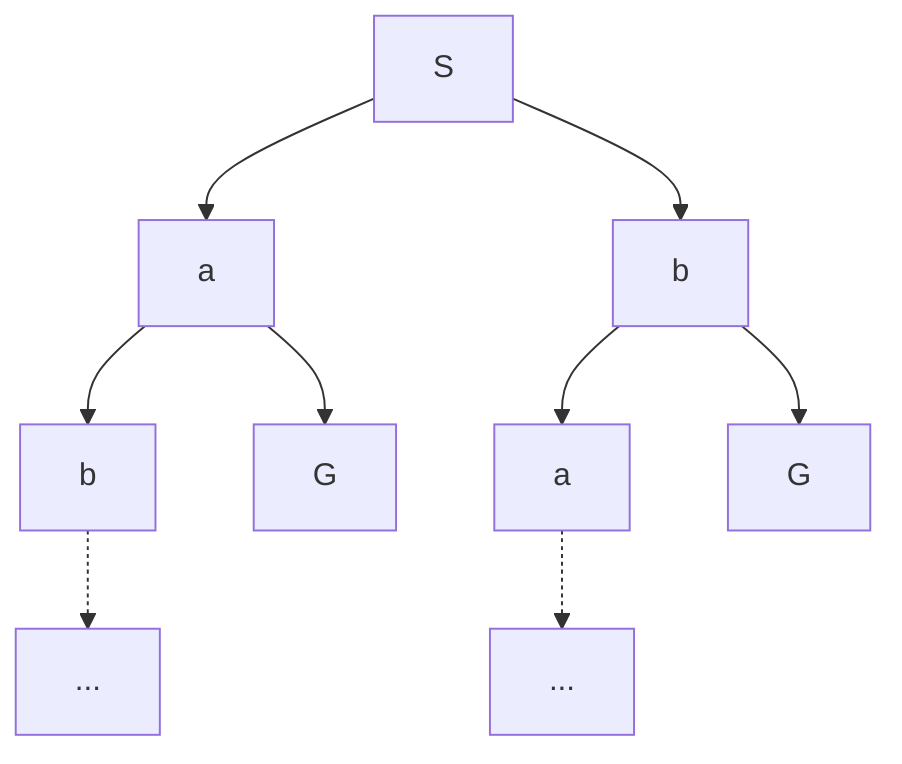
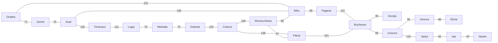
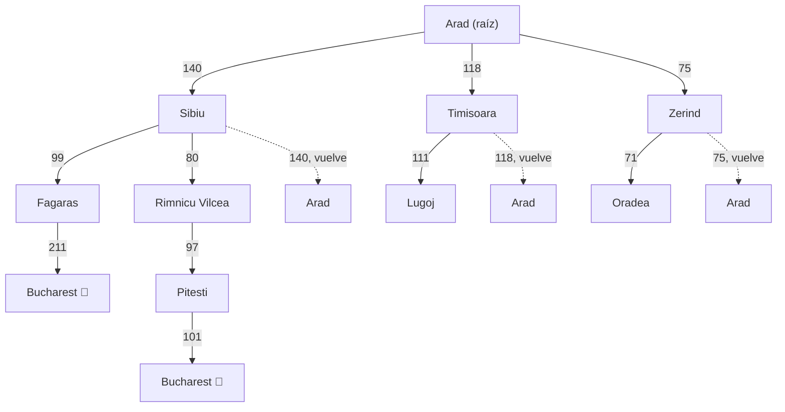
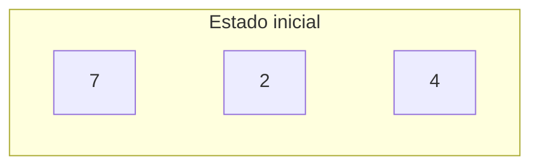
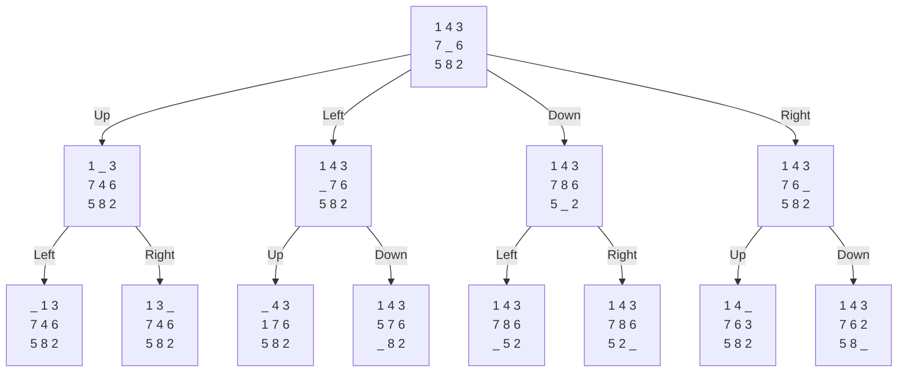

# Clase 2 — Agentes y búsqueda

![[AI 2 Agentes Inteligentes.pdf]]
## Pregunta central

¿Cómo cambia la selección de acciones cuando un agente razona sobre sus consecuencias y formula su objetivo como un problema de búsqueda?

## Apuntes rápidos

- Un agente percibe y actúa; un [[Agente racional|agente racional]] elige la acción que maximiza su utilidad esperada.
- La percepción, el ambiente y el espacio de acciones condicionan la técnica con la que se seleccionan acciones racionales.
- El curso busca enseñar a reconocer cuándo un problema nuevo puede resolverse mediante una técnica de IA existente.
- Se contrastaron los [[Agente por reflejo|agentes por reflejo]] con los [[Agente planificador|agentes que planean]].
- Se presentaron cuatro familias de técnicas de IA: búsqueda, lógica, probabilidad y aprendizaje.
- Los problemas se agruparon en decisión, búsqueda y optimización; la diapositiva no desarrolló todavía sus diferencias.

## Definiciones y resultados

### Agente racional

Un agente es una entidad que percibe y actúa. Es racional cuando selecciona una acción dirigida a maximizar su utilidad esperada.

Para describir su [[Entorno de tarea|entorno de tarea]] se usaron cuatro componentes:

| Componente | Pregunta | Ejemplo: conductor de taxi |
|---|---|---|
| Indicador de desempeño | ¿Cómo se evalúa al agente? | Seguridad, rapidez, legalidad, comodidad y ganancias |
| Ambiente | ¿En qué mundo actúa? | Camino, tráfico y clientes |
| Actuadores | ¿Cómo interviene? | Acelerar, frenar, girar el volante y tocar el claxon |
| Sensores | ¿Cómo percibe? | Cámaras, sonar, velocímetro, GPS y sensores del motor |

También se propusieron como ejercicios un sistema de diagnóstico médico, un asesor de inversiones, un tutor interactivo y el fútbol.

### Agentes por reflejo y agentes que planean

| Agente por reflejo | Agente que planea |
|---|---|
| Basa la siguiente acción en la percepción actual. | Se pregunta “¿qué tal si...?”. |
| Puede mantener memoria o un modelo del mundo dentro de su estado actual. | Necesita un modelo de cómo evoluciona el mundo. |
| No considera las consecuencias futuras de sus acciones. | Basa sus decisiones en consecuencias hipotéticas. |
| La diapositiva deja abierta la pregunta de cuándo este comportamiento es racional. | Formula una meta y representa cómo debería ser el mundo. |

### Familias de técnicas de IA

- **Búsqueda:** utiliza un espacio de búsqueda, una función sucesor y una prueba de meta. Se mencionaron búsqueda en anchura, algoritmos evolutivos y gradiente descendente; sus aplicaciones incluyen optimización, calendarización y problemas de ingeniería. La presentación señala que la búsqueda suele estar en el corazón de los sistemas de IA.
- **Lógica:** puede basarse en lógica proposicional, de primer orden o difusa. Parte de un modelo del mundo e intenta derivar conocimiento; se mencionaron diagnósticos médicos, asesores lógicos y sistemas expertos.
- **Probabilidad:** supone incertidumbre y emplea probabilidad y el teorema de Bayes para razonar. Se citaron sistemas de recomendación, robótica y causalidad.
- **Aprendizaje:** se apoya fuertemente en estadística y probabilidad. Se divide en aprendizaje supervisado, no supervisado y por refuerzo.

### Formulación de un problema de búsqueda

Una [[Formulación de un problema de búsqueda|formulación de búsqueda]] presentada en clase contiene:

| Componente                                                          | Función |                                                                   |
| ------------------------------------------------------------------- | ------- | ----------------------------------------------------------------- |
| [[Espacio de estadosEspacio de estados]] o de búsqueda |         | Delimita las configuraciones consideradas.                        |
| [[Función sucesorFunción sucesor]]                     |         | Indica las acciones posibles, los estados resultantes y su costo. |
| Estado inicial Fija desde qué estado comienza el problema.          |         |                                                                   |
| [[Prueba de metaPrueba de meta]]                       |         | Decide si un estado satisface el objetivo.                        |

### Árbol de búsqueda

En un [[Árbol de búsqueda|árbol de búsqueda]]:

- el estado inicial ocupa la raíz;
- los hijos corresponden a sucesores;
- cada [[Nodo de búsqueda|nodo]] muestra un estado, pero representa además el plan que permitió alcanzarlo;
- las soluciones pueden aparecer en distintas partes del árbol;
- rara vez es posible construir el árbol completo.

Se introdujeron dos parámetros: $b$ es el [[Factor de ramificación|factor de ramificación]] y $m$ la [[Profundidad máxima de un árbol de búsqueda|profundidad máxima]].

#### La frontera del árbol

La **frontera** es el conjunto de nodos que la búsqueda **ya descubrió, pero todavía no ha examinado**. Funciona como una lista de pendientes: se elige un nodo de la frontera, se examina, se retira y se agregan sus hijos.

<iframe src="frontera-arbol.htm" style="width:100%;height:600px;border:1px solid var(--lightgray);border-radius:4px;" loading="lazy"></iframe>

> [!tip] Idea clave
> La frontera no es una parte fija del árbol. Va cambiando durante la búsqueda y marca la separación entre lo ya explorado y lo que todavía está pendiente.

### Grafo de estados frente a árbol de búsqueda

Un [[Grafo de espacio de estados|grafo de espacio de estados]] representa cada estado y las transiciones posibles. El árbol representa planes generados desde un estado inicial. Por ello, un mismo estado del grafo puede aparecer en varios nodos del árbol; además, un ciclo del grafo puede generar ramas sin fin si se vuelve a visitar el mismo estado.

> [!tip] La diferencia clave, en una frase
> El **grafo** tiene tamaño fijo (aquí, 4 estados: $S$, $a$, $b$, $G$). El **árbol**, al desplegarse, puede crecer sin límite — porque cada vez que la búsqueda "llega" a $a$ o a $b$ por un camino distinto, crea un **nodo nuevo**, aunque el estado subyacente sea el mismo.

**Desplegando el grafo como árbol:**

Fíjate en lo siguiente:

- El nodo `b` hijo de `S` **no es "el mismo objeto"** que el nodo `b` hijo de `a`: ambos representan el estado `b` del grafo, pero corresponden a **planes distintos** para llegar ahí ($S \to b$ frente a $S \to a \to b$). Esto es justo lo que dice el apunte: *"cada nodo muestra un estado, pero representa además el plan que permitió alcanzarlo"*.
- Como $a$ y $b$ se pueden visitar mutuamente (el ciclo $a \leftrightarrow b$ del grafo), un buscador que no controle estados repetidos seguiría generando $a, b, a, b, a, b, \dots$ para siempre, **aunque en el grafo solo existan 2 estados ahí**. Esa es la rama infinita que menciona el apunte.
- Esto motiva directamente los parámetros $b$ (factor de ramificación) y $m$ (profundidad máxima): sin alguna forma de detectar o limitar esta repetición — por ejemplo, recordar estados ya visitados, o fijar un límite de profundidad — el árbol de búsqueda puede volverse infinito aunque el grafo de partida sea pequeño y finito.

> [!question] Respuesta tentativa a una de las dudas pendientes
> Sobre *"¿qué conclusión se obtuvo en clase sobre el tamaño del árbol generado por el ciclo entre $a$ y $b$?"*: la conclusión estructural (más allá de lo que se haya dicho oralmente) es que, sin control de repetición de estados, el ciclo $a \leftrightarrow b$ por sí solo basta para que el árbol de búsqueda sea infinito, aunque el grafo tenga solo 4 estados. Vale la pena confirmar con el profesor si esto es justo lo que se discutió.

### Ejemplo paso a paso: viaje de Arad a Bucarest

**1. Formulación del problema** (según la diapositiva):

| Componente | Valor |
|---|---|
| Espacio de estados | Ciudades de Rumania |
| Función sucesor | Viajar a una ciudad adyacente por un camino, con su costo |
| Estado inicial | Arad |
| Prueba de meta | ¿El estado actual es Bucarest? |
| Solución | Una ruta que lleva de Arad a Bucarest (no se fijó una ruta concreta en la diapositiva) |

**2. El grafo de espacio de estados** (el mapa completo de Rumania, tal como aparece en la diapositiva):

**3. El árbol de búsqueda** que se despliega desde Arad (solo mostrando los primeros niveles; en la práctica se sigue expandiendo hasta encontrar Bucarest o agotar profundidad):

> [!tip] Nota sobre este árbol
> Observa los nodos punteados (`Arad2`, `Arad3`, `Arad4`): representan que desde `Sibiu`, `Timisoara` o `Zerind` **se podría regresar a Arad** (porque el grafo tiene esa arista), generando un nodo repetido del mismo estado. Igual que en el ejemplo $a \leftrightarrow b$, si el algoritmo no controla estados visitados, podría regresar a Arad una y otra vez sin avanzar. También aparece `Bucharest` dos veces (una vía Fagaras, otra vía Rimnicu Vilcea → Pitesti): eso ilustra *"las soluciones pueden aparecer en distintas partes del árbol"* — hay más de un plan que llega a la meta, con distinto costo.

---

### Ejemplo paso a paso: rompecabezas Magic 8

**1. Formulación del problema** (completando los campos que la diapositiva dejó vacíos, a partir de la representación usual del rompecabezas):

| Componente | Valor |
|---|---|
| Espacio de estados | Todas las configuraciones alcanzables de las 8 fichas y el hueco en la cuadrícula 3×3 |
| Función sucesor | Deslizar una ficha adyacente al hueco hacia la posición del hueco (intercambiarlas) |
| Estado inicial | `7 2 4 / 5 _ 6 / 8 3 1` (mostrado en la diapositiva) |
| Prueba de meta | Sin especificar en la diapositiva (típicamente: `1 2 3 / 4 5 6 / 7 8 _`) |
| Solución | Una secuencia de movimientos del hueco (Up/Down/Left/Right) que transforma el estado inicial en el estado meta |

**2. El estado inicial:**

*(Obsidian no dibuja bien una cuadrícula 3×3 en mermaid; para el tablero visual usa una tabla o imagen — el diagrama importante aquí es el árbol de abajo.)*

**3. Cómo se despliega el árbol de búsqueda** (estructura genérica, tomando como ejemplo el estado `1 4 3 / 7 _ 6 / 5 8 2` que usa la diapositiva para ilustrar el mecanismo — el mismo patrón aplica a tu estado inicial `7 2 4 / 5 _ 6 / 8 3 1`):

Cada nodo del árbol es un estado (una configuración del tablero) **más el movimiento que lo generó**. Nota que cada nivel tiene como máximo 4 hijos (mover el hueco Up/Down/Left/Right) — ese máximo es justo el factor de ramificación $b$ del que habla tu apunte; aquí $b \le 4$ porque desde las esquinas o bordes hay menos movimientos posibles.

---

### Confirmación: grafo $S$-$a$-$b$-$G$ (diapositiva 20)

La diapositiva 20 confirma exactamente el grafo que ya trabajamos: $S \to a$, $S \to b$, el ciclo $a \leftrightarrow b$, y $a \to G$, $b \to G$. La pregunta que plantea la diapositiva — *"¿Qué tan grande es el árbol de búsqueda?"* — es precisamente la que respondimos arriba: **potencialmente infinito**, por el ciclo $a \leftrightarrow b$, si no se controlan estados repetidos.

## Dudas

- [ ] ¿Bajo qué condiciones puede ser racional un agente por reflejo?
- [ ] ¿Qué configuración meta se utilizó para el ejercicio Magic 8?
- [ ] ¿Qué conclusión se obtuvo en clase sobre el tamaño del árbol generado por el ciclo entre los estados $a$ y $b$?
- [ ] ¿Qué se discutió oralmente en la diapositiva sobre complejidad computacional?
- [ ] ¿Qué juego o actividad se realizó en la sección “Juguemos…”?

## Conceptos para extraer

- [[Agente racional|Agente racional]]
- [[Entorno de tarea|Entorno de tarea]]
- [[Agente por reflejo|Agente por reflejo]]
- [[Agente planificador|Agente planificador]]
- [[Formulación de un problema de búsqueda|Formulación de un problema de búsqueda]]
- [[Espacio de estados|Espacio de estados]]
- [[Función sucesor|Función sucesor]]
- [[Prueba de meta|Prueba de meta]]
- [[Grafo de espacio de estados|Grafo de espacio de estados]]
- [[Árbol de búsqueda|Árbol de búsqueda]]
- [[Nodo de búsqueda|Nodo de búsqueda]]
- [[Factor de ramificación|Factor de ramificación]]
- [[Profundidad máxima de un árbol de búsqueda|Profundidad máxima de un árbol de búsqueda]]

## Referencias mencionadas

- [[AI 2 Agentes Inteligentes.pdf|AI 2 Agentes Inteligentes]], presentación de Carlos Hernández, 21 diapositivas.

## Resumen después de clase

La racionalidad de un agente depende de cómo percibe su ambiente, qué acciones tiene disponibles y qué medida de desempeño intenta maximizar. Los agentes por reflejo reaccionan al estado actual, mientras que los agentes que planean modelan consecuencias y formulan metas. Un problema de búsqueda abstrae el mundo mediante estados, sucesores con costos, un inicio y una prueba de meta. El grafo describe las transiciones posibles y el árbol de búsqueda despliega los planes generados desde el inicio, por lo que puede repetir estados y crecer mucho más que el grafo.

## Acciones adicionales

- [ ] No hay clase el martes 2026-08-18.
- [ ] Preparar para la siguiente sesión: algoritmos de búsqueda no informada.
- [ ] Verificar que las 39 personas inscritas se incorporen a Google Classroom; la diapositiva reporta 26 estudiantes y muestra el código `yoxqo7fc`.
