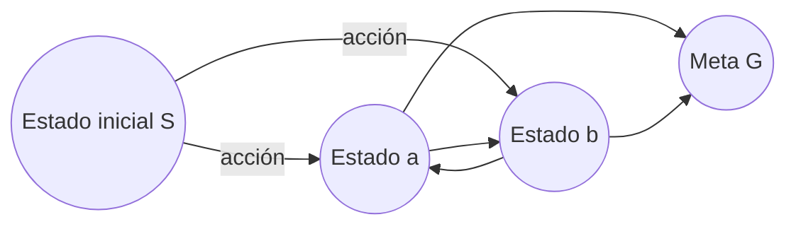
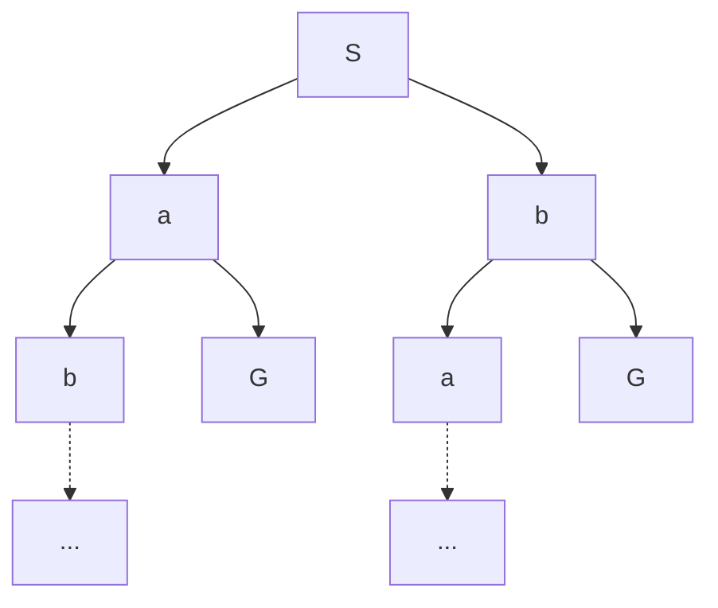
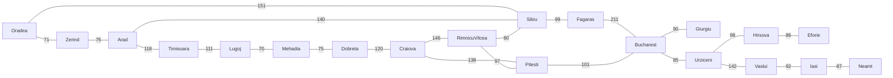
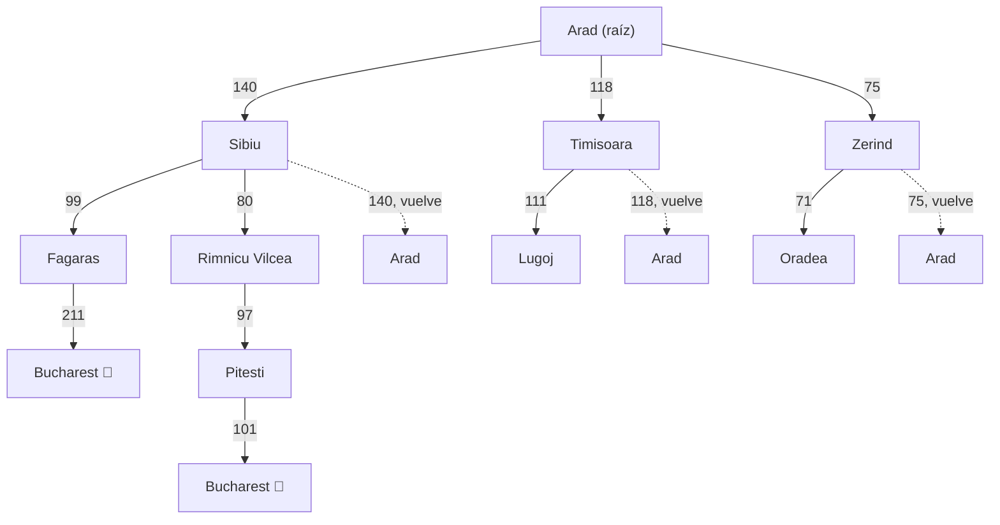
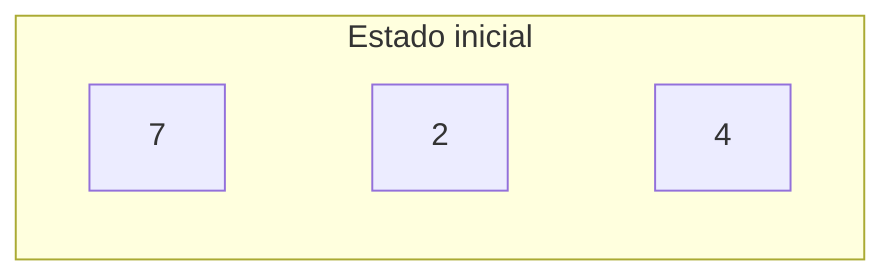
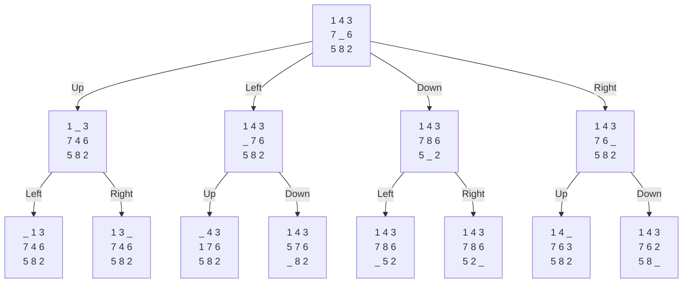

# Clase 2 — Agentes y búsqueda

![[AI 2 Agentes Inteligentes.pdf]]
## Pregunta central

¿Cómo cambia la selección de acciones cuando un agente razona sobre sus consecuencias y formula su objetivo como un problema de búsqueda?

## Fuentes complementarias
- https://inst.eecs.berkeley.edu/~cs188/textbook/search/state.html
## Apuntes rápidos

- Un agente percibe y actúa; un [[Agente racional|agente racional]] elige la acción que maximiza su utilidad esperada.
- La percepción, el ambiente y el espacio de acciones condicionan la técnica con la que se seleccionan acciones racionales.
- El curso busca enseñar a reconocer cuándo un problema nuevo puede resolverse mediante una técnica de IA existente.
- Se contrastaron los [[Agente por reflejo|agentes por reflejo]] con los [[Agente planificador|agentes que planean]].
- Se presentaron cuatro familias de técnicas de IA: búsqueda, lógica, probabilidad y aprendizaje.
- Los problemas se agruparon en decisión, búsqueda y optimización; la diapositiva no desarrolló todavía sus diferencias.

## Definiciones y resultados

### Agente racional

Un agente es una entidad que percibe y actúa. Es racional cuando selecciona una acción dirigida a maximizar su utilidad esperada.

Para describir su [[Entorno de tarea|entorno de tarea]] se usaron cuatro componentes:

| Componente             | Definición                                                                          | Pregunta                   | Ejemplo: conductor de taxi                            |
| ---------------------- | ----------------------------------------------------------------------------------- | -------------------------- | ----------------------------------------------------- |
| Indicador de desempeño | Describe cual es la utilidad que el agente busca maximizar                          | ¿Cómo se evalúa al agente? | Seguridad, rapidez, legalidad, comodidad y ganancias  |
| Ambiente               | Resume el entorno sobre el qeu actua el agente y que elementos del mismo lo afectan | ¿En qué mundo actúa?       | Camino, tráfico y clientes                            |
| Actuadores             | Herrameintas mediante las cuales el angente interviene el entotno                   | ¿Cómo interviene?          | Acelerar, frenar, girar el volante y tocar el claxon  |
| Sensores               | La manera en que el agente percibe el entorno                                       | ¿Cómo percibe?             | Cámaras, sonar, velocímetro, GPS y sensores del motor |
Esta formalización es conocida como PEAS: 
- Performance Measure
- Enviroment
- Actuators
- Sensors

También se propusieron como ejercicios un sistema de diagnóstico médico, un asesor de inversiones, un tutor interactivo y el fútbol.

### Agentes por reflejo y agentes que planean

Un **agente por reflejo** es aquel que no piensa sobre las consecuencias de sus acciones de manera deliberada, actúa unicamente sobre su intepretación del estado actual del mundo. 

Por otro lado un **agente que planea** son aquellos que mantienen un modelo del mundo, empleandolo para simular el resultado de realizar diferentes tareas para, de esta manera simular el resultado de sus acciones futuras buscando emular el comportamiento humano de escoger la mejor salida posible.

| Agente por reflejo | Agente que planea |
|---|---|
| Basa la siguiente acción en la percepción actual. | Se pregunta “¿qué tal si...?”. |
| Puede mantener memoria o un modelo del mundo dentro de su estado actual. | Necesita un modelo de cómo evoluciona el mundo. |
| No considera las consecuencias futuras de sus acciones. | Basa sus decisiones en consecuencias hipotéticas. |
| La diapositiva deja abierta la pregunta de cuándo este comportamiento es racional. | Formula una meta y representa cómo debería ser el mundo. |

### Familias de técnicas de IA

- **Búsqueda:** utiliza un espacio de búsqueda, una función sucesor y una prueba de meta. Se mencionaron búsqueda en anchura, algoritmos evolutivos y gradiente descendente; sus aplicaciones incluyen optimización, calendarización y problemas de ingeniería. La presentación señala que la búsqueda suele estar en el corazón de los sistemas de IA.
- **Lógica:** puede basarse en lógica proposicional, de primer orden o difusa. Parte de un modelo del mundo e intenta derivar conocimiento; se mencionaron diagnósticos médicos, asesores lógicos y sistemas expertos.
- **Probabilidad:** supone incertidumbre y emplea probabilidad y el teorema de Bayes para razonar. Se citaron sistemas de recomendación, robótica y causalidad.
- **Aprendizaje:** se apoya fuertemente en estadística y probabilidad. Se divide en aprendizaje supervisado, no supervisado y por refuerzo.

### Formulación de un problema de búsqueda

Una [[Formulación de un problema de búsqueda|formulación de búsqueda]] presentada en clase contiene:

| Componente                                                          | Función |                                                                   |
| ------------------------------------------------------------------- | ------- | ----------------------------------------------------------------- |
| [[Espacio de estadosEspacio de estados]] o de búsqueda |         | Delimita las configuraciones consideradas.                        |
| [[Función sucesorFunción sucesor]]                     |         | Indica las acciones posibles, los estados resultantes y su costo. |
| Estado inicial Fija desde qué estado comienza el problema.          |         |                                                                   |
| [[Prueba de metaPrueba de meta]]                       |         | Decide si un estado satisface el objetivo.                        |

### Espacios de estados y problemas de búsqueda

Para crear un **agente de planificación racional**, necesitamos una forma de representar matemáticamente el entorno en el que existe el agente. Para ello, definimos formalmente un **problema de búsqueda**:

> Dado el **estado actual** del agente, ¿cómo podemos llegar a un nuevo estado que satisfaga sus objetivos de la mejor manera posible?

Un **problema de búsqueda** está formado por:

- **Espacio de estados (_state space_):** conjunto de todos los estados posibles del mundo.
- **Acciones:** conjunto de acciones disponibles para el agente en cada estado    
- **Modelo de transición (_transition model_):** determina cuál será el nuevo estado después de ejecutar una acción desde el estado actual.
	 $$T(s,a)=s'$$
- **Costo de acción (_action cost_):** costo asociado a pasar de un estado a otro mediante una acción.
	$$ c(s,a,s') $$
- **Estado inicial (_start state_):** estado en el que comienza el agente.
    
- **Prueba de objetivo (_goal test_):** función que determina si un estado dado es un estado objetivo.
    
    $$ GoalTest(s)= \begin{cases} \text{True}, & \text{si }s\text{ es objetivo}\\ \text{False}, & \text{en otro caso} \end{cases} $$

---

### ¿Cómo se resuelve un problema de búsqueda?

El proceso general consiste en:

$$ \text{Estado inicial} \rightarrow \text{Explorar estados} \rightarrow \text{Aplicar acciones} \rightarrow \text{Generar nuevos estados} \rightarrow \text{Estado objetivo} $$

1. Se comienza en el **estado inicial**.
2. Se consideran las acciones disponibles.
3. Utilizando el **modelo de transición**, se generan los estados sucesores o hijos.
4. Se continúa explorando iterativamente el espacio de estados.
5. Cuando se encuentra un estado que satisface la **prueba de objetivo**, termina la búsqueda.

El camino encontrado desde el estado inicial hasta el objetivo se denomina normalmente:

$$ \boxed{\text{plan}} $$

La secuencia puede escribirse como:

$$ s_0 \xrightarrow{a_1} s_1 \xrightarrow{a_2} s_2 \rightarrow\cdots\rightarrow s_g $$

donde \(s_g\) es un estado objetivo.

---

### Estrategia de búsqueda

No necesariamente exploramos los estados en cualquier orden.

El orden en el que se seleccionan los estados para ser explorados depende de una **estrategia de búsqueda (_search strategy_)**.

Por ejemplo, diferentes estrategias pueden decidir:

- explorar primero los estados más cercanos al inicio;
- profundizar primero en una rama;
- explorar primero los caminos de menor costo;
- utilizar información sobre qué estados parecen estar más cerca del objetivo.

La estrategia determina, esencialmente:

> **¿Qué estado debo explorar a continuación?**

---

# Estado del mundo vs. estado de búsqueda

Es importante distinguir dos conceptos.

### Estado del mundo (_world state_)

Contiene **toda la información existente acerca de la situación actual**.

$$ \boxed{\text{World State}=\text{representación completa del mundo}} $$

### Estado de búsqueda (_search state_)

Contiene solamente la información necesaria para resolver el problema de planificación.

$$ \boxed{\text{Search State}=\text{información relevante para la búsqueda}} $$

La razón principal para eliminar información innecesaria es ahorrar:

- memoria;
- tiempo de cómputo;
- espacio de búsqueda.

Por tanto:

$$ \text{Search State}\subseteq\text{información del World State} $$

conceptualmente.

---

# Ejemplo: Pacman

![[Pasted image 20260929193549.png]]

Pacman sirve como ejemplo clásico de un problema de búsqueda.

El objetivo general del juego es que Pacman:

- navegue por un laberinto;
- coma todas las pequeñas bolitas de comida;
- evite ser atrapado por los fantasmas.

Además, existen **power pellets** o píldoras de poder. Cuando Pacman come una:

- se vuelve temporalmente inmune a los fantasmas;
- puede comer a los fantasmas;
- obtiene puntos adicionales.

Un **estado completo del mundo** podría contener información como:

$$ s= ( \text{posición de Pacman}, \text{posición de fantasmas}, \text{comida restante}, \text{power pellets}, \text{estado de fantasmas}, \text{puntaje}, \ldots ) $$

Pero dependiendo del problema que queramos resolver, nuestro **estado de búsqueda** podría ser mucho más sencillo.

Por ejemplo, si únicamente queremos encontrar un camino hasta una posición determinada:

$$ \boxed{s=(x,y)} $$

podría ser suficiente.

Es decir, aunque el mundo contiene muchísima información, el algoritmo de búsqueda debe almacenar únicamente aquello que sea relevante para alcanzar el objetivo.

### Idea central

$$ \boxed{ \text{Problema de búsqueda} = \text{Estados} + \text{Acciones} + \text{Transiciones} + \text{Costos} + \text{Inicio} + \text{Objetivo} } $$

y una **estrategia de búsqueda** determina el orden en el que exploramos ese espacio hasta encontrar un **plan**.

### Tamaño del espacio de estados

El **tamaño del espacio de estados** indica cuántos estados distintos puede tener un problema de búsqueda.

Para calcularlo se usa normalmente el **principio fundamental de conteo**:

Si existen varias variables independientes y cada una puede tomar cierto número de valores, entonces el número total de estados es el producto de todas las posibilidades:

$$
|S| = n_1 \cdot n_2 \cdot \ldots \cdot n_k
$$

donde \(n_i\) es el número de valores posibles de cada variable.

#### Ejemplo: Pacman

Supongamos que tenemos:

- **Posición de Pacman:** 120 posibilidades
- **Dirección de Pacman:** 4 posibilidades
  - Norte
  - Sur
  - Este
  - Oeste
- **Posición de los fantasmas:** 2 fantasmas, cada uno con 12 posiciones posibles
- **Configuración de comida:** 30 pellets, y cada uno puede estar:
  - comido
  - no comido

Entonces:

#### Posiciones de los fantasmas

$$
12 \cdot 12 = 12^2
$$

#### Configuraciones de comida

Cada pellet tiene 2 estados posibles, por lo tanto:

$$
2^{30}
$$

#### Tamaño total del espacio de estados

$$
|S|
=
120 \cdot 4 \cdot 12^2 \cdot 2^{30}
$$

Este número puede ser extremadamente grande.

#### Idea importante

Aunque cada variable individual tenga pocas posibilidades, al combinarlas el número de estados puede crecer de forma muy rápida.

Por ejemplo:

$$
2^{30} \approx 1.07 \times 10^9
$$

solo para representar las posibles configuraciones de los 30 pellets.

Por eso, en problemas de búsqueda, el tamaño del espacio de estados es importante para estimar:

- tiempo de ejecución
- uso de memoria
- dificultad computacional
- necesidad de usar buenas estrategias de búsqueda

> El espacio de estados crece multiplicando todas las posibilidades independientes del problema.

### Grafo de espacio de estados

Una vez definido el [[Espacio de estados|espacio de estados]], podemos representarlo conceptualmente mediante un [[Grafo de espacio de estados|grafo de espacio de estados]].

En este grafo:

- cada **estado** corresponde a un nodo;
- existe una **arista dirigida** entre un estado y cada uno de sus sucesores;
- cada arista representa una **acción**;
- si las acciones tienen costo, el peso de la arista representa el **costo de realizar esa acción**.

Por tanto, el grafo describe **todas las configuraciones posibles del problema y las transiciones permitidas entre ellas**.

> [!important] Propiedad fundamental
> En el **grafo de espacio de estados**, cada estado aparece **exactamente una vez**.
> Si existen diferentes formas de llegar al mismo estado, todas ellas terminan en el mismo nodo del grafo.

Aunque conceptualmente es útil imaginar este grafo completo, en problemas reales puede contener una cantidad enorme de estados, por lo que normalmente **no se construye ni almacena completo en memoria**.

---

### Árbol de búsqueda

Para resolver el problema a partir de un estado inicial se utiliza normalmente un [[Árbol de búsqueda|árbol de búsqueda]].

En un árbol de búsqueda:

- el **estado inicial** ocupa la raíz;
- los hijos de un nodo corresponden a los **sucesores** del estado;
- las aristas representan las acciones realizadas;
- una solución corresponde a un camino desde la raíz hasta algún **estado meta**.

Sin embargo, existe una diferencia fundamental respecto al grafo de estados:

> [!tip] Idea clave
> Un [[Nodo de búsqueda|nodo de búsqueda]] no representa únicamente un estado, sino también **el camino o plan completo utilizado para llegar hasta él desde el estado inicial**.

Por esta razón, **un mismo estado puede aparecer varias veces en el árbol de búsqueda** si existen distintos caminos para alcanzarlo.

Por ejemplo, desplegando el grafo anterior:

Los dos nodos etiquetados como `b` representan **el mismo estado del problema**, pero corresponden a planes diferentes:

$$
S \rightarrow b
$$

y

$$
S \rightarrow a \rightarrow b
$$

Por ello, son **nodos de búsqueda distintos**.

---

### Grafo de estados frente a árbol de búsqueda

![[Pasted image 20260929200547.png]]

La diferencia puede resumirse así:

| Grafo de espacio de estados | Árbol de búsqueda |
|---|---|
| Representa los **estados posibles** del problema. | Representa los **planes explorados** desde el estado inicial. |
| Cada estado aparece una sola vez. | Un estado puede aparecer muchas veces. |
| Las aristas representan acciones posibles. | Cada camino desde la raíz representa una secuencia de acciones. |
| Describe la estructura completa del problema. | Se genera progresivamente durante la búsqueda. |

> [!tip] Diferencia clave
> El **grafo de estados representa estados**; el **árbol de búsqueda representa caminos para alcanzar esos estados**.

Por ello, el árbol de búsqueda puede ser **igual o mayor** que el grafo de estados y, debido a estados repetidos, incluso puede crecer indefinidamente.

Por ejemplo, si en el grafo existe el ciclo

$$
a \leftrightarrow b
$$

el árbol puede generar:

$$
S \rightarrow a \rightarrow b \rightarrow a \rightarrow b \rightarrow a \rightarrow \cdots
$$

aunque en el grafo únicamente existan los estados $a$ y $b$.

Esto explica por qué un grafo de estados pequeño puede producir un árbol de búsqueda enorme o incluso infinito si no se controlan los estados repetidos.

---

### Tamaño del árbol de búsqueda

Para estudiar el crecimiento del árbol suelen introducirse dos parámetros:

- $b$: [[Factor de ramificación|factor de ramificación]], es decir, aproximadamente cuántos hijos genera cada nodo;
- $m$: [[Profundidad máxima de un árbol de búsqueda|profundidad máxima]] que puede alcanzar la búsqueda.

Estos parámetros permiten analizar cuánto puede crecer el árbol y cuánto tiempo o memoria puede requerir un algoritmo de búsqueda.

---

### ¿Cómo se busca sin construir todo el árbol?

Ni el grafo de estados ni el árbol de búsqueda suelen construirse completamente.

En lugar de ello, el algoritmo genera estados **bajo demanda**:

1. selecciona un nodo que quiere explorar;
2. obtiene las acciones posibles;
3. calcula los estados sucesores;
4. crea los nodos correspondientes;
5. continúa hasta encontrar un estado meta.

Es decir, solamente se mantienen en memoria los nodos necesarios para realizar la búsqueda.

---

#### La frontera del árbol

La **frontera** es el conjunto de nodos que la búsqueda **ya descubrió, pero todavía no ha explorado**.

Funciona como una lista de pendientes:

1. se selecciona un nodo de la frontera;
2. se retira de ella;
3. se comprueba o expande;
4. se generan sus hijos;
5. los nuevos nodos se añaden a la frontera.

<iframe src="frontera-arbol.htm" style="width:100%;height:600px;border:1px solid var(--lightgray);border-radius:4px;" loading="lazy"></iframe>

> [!tip] Idea clave
> La frontera no es una región fija del árbol: **cambia continuamente durante la búsqueda** y separa, de manera conceptual, los nodos ya procesados de aquellos que todavía están pendientes.

Los distintos **algoritmos de búsqueda** se diferencian principalmente en **qué nodo de la frontera deciden explorar a continuación**.

Por ejemplo:

- BFS prioriza los nodos menos profundos;
- DFS prioriza los nodos más profundos;
- UCS prioriza el camino con menor costo acumulado;
- A* combina el costo acumulado con una estimación del costo restante.

> [!summary] Idea general
> Un problema define un **espacio de estados**.
> El **grafo de espacio de estados** representa todos esos estados y sus transiciones.
> El **árbol de búsqueda** despliega los diferentes planes que parten del estado inicial.
> Como construirlo completo suele ser imposible, los algoritmos generan únicamente los nodos necesarios y utilizan la **frontera** para decidir qué explorar después.

### Ejemplo paso a paso: viaje de Arad a Bucarest

**1. Formulación del problema** (según la diapositiva):

| Componente | Valor |
|---|---|
| Espacio de estados | Ciudades de Rumania |
| Función sucesor | Viajar a una ciudad adyacente por un camino, con su costo |
| Estado inicial | Arad |
| Prueba de meta | ¿El estado actual es Bucarest? |
| Solución | Una ruta que lleva de Arad a Bucarest (no se fijó una ruta concreta en la diapositiva) |

**2. El grafo de espacio de estados**  (el mapa completo de Rumania, tal como aparece en la diapositiva):

**3. El árbol de búsqueda** que se despliega desde Arad (solo mostrando los primeros niveles; en la práctica se sigue expandiendo hasta encontrar Bucarest o agotar profundidad):

> [!tip] Nota sobre este árbol
> Observa los nodos punteados (`Arad2`, `Arad3`, `Arad4`): representan que desde `Sibiu`, `Timisoara` o `Zerind` **se podría regresar a Arad** (porque el grafo tiene esa arista), generando un nodo repetido del mismo estado. Igual que en el ejemplo $a \leftrightarrow b$, si el algoritmo no controla estados visitados, podría regresar a Arad una y otra vez sin avanzar. También aparece `Bucharest` dos veces (una vía Fagaras, otra vía Rimnicu Vilcea → Pitesti): eso ilustra *"las soluciones pueden aparecer en distintas partes del árbol"* — hay más de un plan que llega a la meta, con distinto costo.

---

### Ejemplo paso a paso: rompecabezas Magic 8

**1. Formulación del problema** (completando los campos que la diapositiva dejó vacíos, a partir de la representación usual del rompecabezas):

| Componente | Valor |
|---|---|
| Espacio de estados | Todas las configuraciones alcanzables de las 8 fichas y el hueco en la cuadrícula 3×3 |
| Función sucesor | Deslizar una ficha adyacente al hueco hacia la posición del hueco (intercambiarlas) |
| Estado inicial | `7 2 4 / 5 _ 6 / 8 3 1` (mostrado en la diapositiva) |
| Prueba de meta | Sin especificar en la diapositiva (típicamente: `1 2 3 / 4 5 6 / 7 8 _`) |
| Solución | Una secuencia de movimientos del hueco (Up/Down/Left/Right) que transforma el estado inicial en el estado meta |

**2. El estado inicial:**

*(Obsidian no dibuja bien una cuadrícula 3×3 en mermaid; para el tablero visual usa una tabla o imagen — el diagrama importante aquí es el árbol de abajo.)*

**3. Cómo se despliega el árbol de búsqueda** (estructura genérica, tomando como ejemplo el estado `1 4 3 / 7 _ 6 / 5 8 2` que usa la diapositiva para ilustrar el mecanismo — el mismo patrón aplica a tu estado inicial `7 2 4 / 5 _ 6 / 8 3 1`):

Cada nodo del árbol es un estado (una configuración del tablero) **más el movimiento que lo generó**. Nota que cada nivel tiene como máximo 4 hijos (mover el hueco Up/Down/Left/Right) — ese máximo es justo el factor de ramificación $b$ del que habla tu apunte; aquí $b \le 4$ porque desde las esquinas o bordes hay menos movimientos posibles.

---

### Confirmación: grafo $S$-$a$-$b$-$G$ (diapositiva 20)

La diapositiva 20 confirma exactamente el grafo que ya trabajamos: $S \to a$, $S \to b$, el ciclo $a \leftrightarrow b$, y $a \to G$, $b \to G$. La pregunta que plantea la diapositiva — *"¿Qué tan grande es el árbol de búsqueda?"* — es precisamente la que respondimos arriba: **potencialmente infinito**, por el ciclo $a \leftrightarrow b$, si no se controlan estados repetidos.

## Dudas

- [ ] ¿Bajo qué condiciones puede ser racional un agente por reflejo?
- [ ] ¿Qué configuración meta se utilizó para el ejercicio Magic 8?
- [ ] ¿Qué conclusión se obtuvo en clase sobre el tamaño del árbol generado por el ciclo entre los estados $a$ y $b$?
- [ ] ¿Qué se discutió oralmente en la diapositiva sobre complejidad computacional?
- [ ] ¿Qué juego o actividad se realizó en la sección “Juguemos…”?

## Conceptos para extraer

- [[Agente racional|Agente racional]]
- [[Entorno de tarea|Entorno de tarea]]
- [[Agente por reflejo|Agente por reflejo]]
- [[Agente planificador|Agente planificador]]
- [[Formulación de un problema de búsqueda|Formulación de un problema de búsqueda]]
- [[Espacio de estados|Espacio de estados]]
- [[Función sucesor|Función sucesor]]
- [[Prueba de meta|Prueba de meta]]
- [[Grafo de espacio de estados|Grafo de espacio de estados]]
- [[Árbol de búsqueda|Árbol de búsqueda]]
- [[Nodo de búsqueda|Nodo de búsqueda]]
- [[Factor de ramificación|Factor de ramificación]]
- [[Profundidad máxima de un árbol de búsqueda|Profundidad máxima de un árbol de búsqueda]]

## Referencias mencionadas

- [[AI 2 Agentes Inteligentes.pdf|AI 2 Agentes Inteligentes]], presentación de Carlos Hernández, 21 diapositivas.

## Resumen después de clase

La racionalidad de un agente depende de cómo percibe su ambiente, qué acciones tiene disponibles y qué medida de desempeño intenta maximizar. Los agentes por reflejo reaccionan al estado actual, mientras que los agentes que planean modelan consecuencias y formulan metas. Un problema de búsqueda abstrae el mundo mediante estados, sucesores con costos, un inicio y una prueba de meta. El grafo describe las transiciones posibles y el árbol de búsqueda despliega los planes generados desde el inicio, por lo que puede repetir estados y crecer mucho más que el grafo.

## Acciones adicionales

- [ ] No hay clase el martes 2026-08-18.
- [ ] Preparar para la siguiente sesión: algoritmos de búsqueda no informada.
- [ ] Verificar que las 39 personas inscritas se incorporen a Google Classroom; la diapositiva reporta 26 estudiantes y muestra el código `yoxqo7fc`.
