# Clase 4 — A*, admisibilidad y consistencia

![[AI 4 Búsqueda con información.pdf]]

## Pregunta central

¿Es A* óptimo?

> [!summary] Respuesta breve
> **Depende de la versión de A*.** En búsqueda en árbol, A* es óptimo si la heurística es admisible y los costos de paso están acotados por algún $\varepsilon>0$. En búsqueda en grafos que cierra un estado y nunca lo reabre, se pide además una heurística consistente. Si se permiten reaperturas cuando aparece un camino más barato, la admisibilidad puede bastar, aunque se pierde la ventaja de no volver a expandir.

## Qué ocurrió en las notas de clase

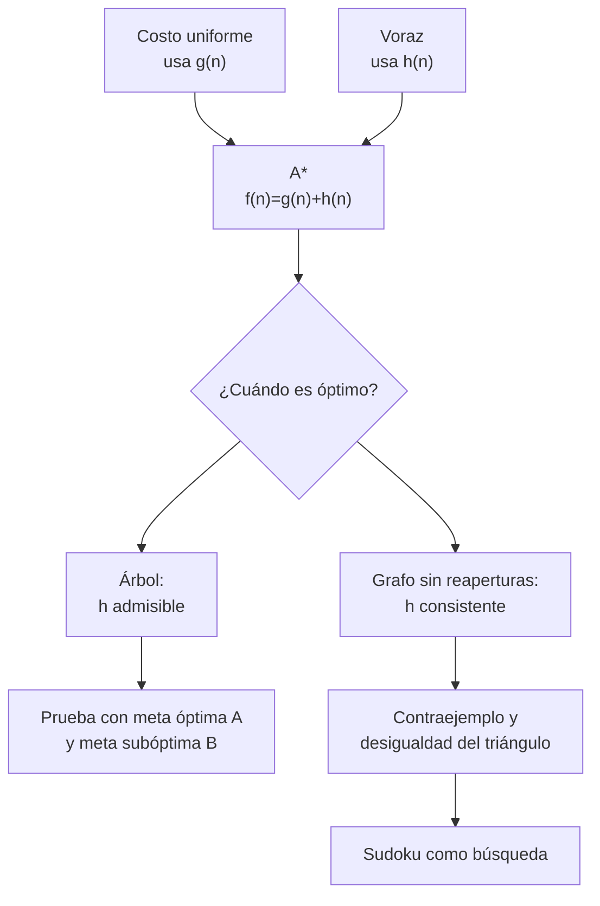

1. Se presentó A* como la combinación de costo uniforme y búsqueda voraz.
2. Se preguntó si A* siempre es óptimo.
3. Se introdujo la **admisibilidad** para probar la optimalidad en búsqueda en árbol.
4. Se mostró que, al evitar expansiones repetidas en un grafo, la admisibilidad por sí sola no basta para la implementación mostrada.
5. Se introdujo la **consistencia**, que impide que $f$ disminuya a lo largo de un camino.
6. La clase terminó conectando la búsqueda con Sudoku y con los problemas de satisfacción de restricciones.

---

## 1. A* combina costo uniforme y búsqueda voraz

A* ordena la frontera mediante

$$
f(n)=g(n)+h(n),
$$

donde:

- $g(n)$ es el costo **real ya pagado** desde el inicio hasta $n$;
- $h(n)$ estima el costo que **falta** desde $n$ hasta una meta;
- $f(n)$ estima el costo total de una solución que pase por $n$.

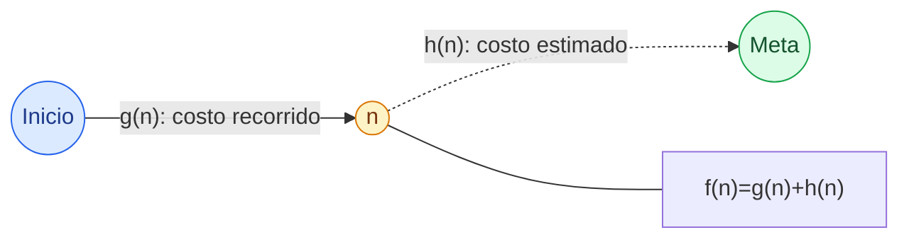

Casos útiles:

- si $h(n)=0$ para todo nodo, A* se convierte en **costo uniforme**;
- si se ignora $g(n)$ y se usa solamente $h(n)$, se obtiene búsqueda **voraz**;
- A* equilibra el costo pasado conocido con el costo futuro estimado.

> [!important] Corrección del apunte rápido
> No es correcto decir «A* es óptimo si costo uniforme es admisible». La **heurística** es la que puede ser admisible. Costo uniforme es el caso $h=0$ y es óptimo bajo costos de arco no negativos; A* requiere las condiciones indicadas al inicio.

## 2. Ejemplo de la diapositiva 8

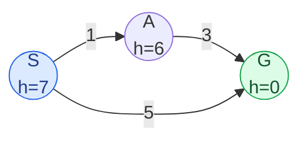

Hay dos rutas:

| Ruta | Costo real |
|---|---:|
| $S\to G$ | $5$ |
| $S\to A\to G$ | $1+3=4$ — óptima |

### Laboratorio interactivo: cómo decide A*

Alterna entre la heurística original de la diapositiva y una heurística admisible. Con **Siguiente** puedes observar cómo cambian $g$, $h$, $f$ y el orden de la frontera hasta que se extrae una meta. La explicación estática de la corrida permanece debajo por si el recurso no puede cargarse.

<iframe src="a-estrella-paso-a-paso.htm" style="width:100%;height:600px;border:1px solid var(--lightgray);border-radius:4px;" loading="lazy"></iframe>

### Corrida paso a paso

**Paso 0 — iniciar en $S$.**

$$
g(S)=0,\qquad h(S)=7,\qquad f(S)=7.
$$

**Paso 1 — expandir $S$.** Se generan $A$ y $G$:

$$
f(A)=1+6=7,\qquad f(G)=5+0=5.
$$

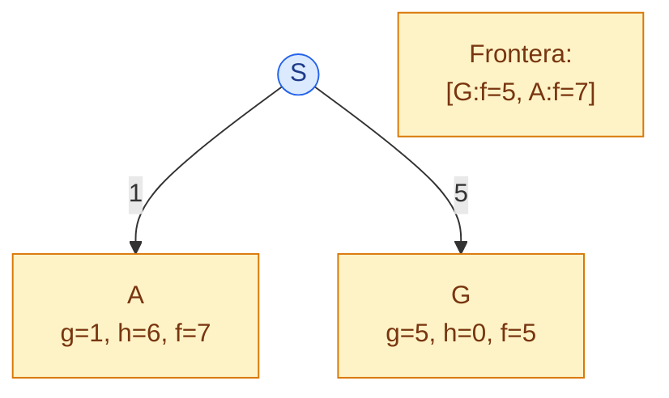

**Paso 2 — extraer $G$.** Como tiene el menor $f$ y es meta, A* devuelve la ruta directa de costo $5$.

> [!warning] Qué demuestra el ejemplo
> La heurística es **inadmisible**: $h(S)=7>h^*(S)=4$ y $h(A)=6>h^*(A)=3$. Por eso A* acepta una meta de costo 5 antes de explorar la ruta óptima de costo 4. La diapositiva responde «A* no es siempre óptimo» y motiva la admisibilidad.

---

## 3. Heurísticas admisibles

Sea $h^*(n)$ el costo verdadero del camino más barato desde $n$ hasta la meta más cercana. Una heurística es **admisible** si

$$
0\le h(n)\le h^*(n)\qquad\text{para todo }n.
$$

Puede acertar o subestimar, pero **nunca sobreestimar**.

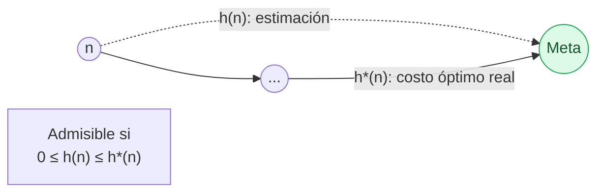

### Distancia en línea recta

Para buscar la ruta más corta entre ciudades:

$$
h_{\mathrm{SLD}}(n)=\text{distancia euclidiana de }n\text{ a la meta}.
$$

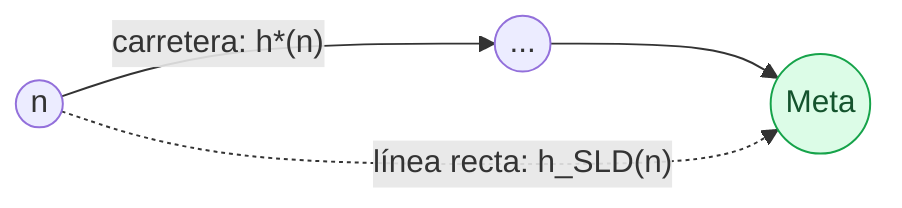

Una ruta por carretera no puede ser más corta que el segmento recto, así que

$$
0\le h_{\mathrm{SLD}}(n)\le h^*(n).
$$

### Crear heurísticas mediante problemas relajados

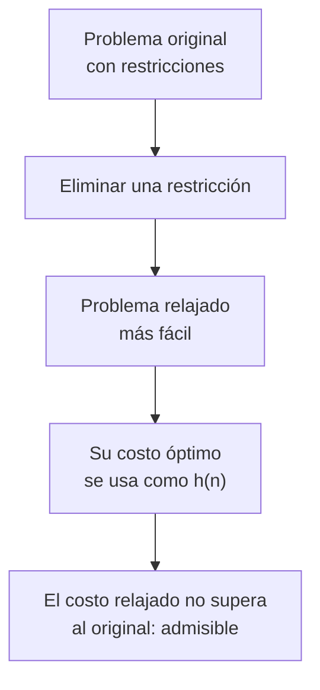

En el ejemplo:

- original: viajar únicamente por carreteras;
- relajado: poder volar directamente;
- solución relajada: distancia en línea recta.

Como relajar permite más opciones, el costo óptimo relajado no puede superar el costo óptimo original.

> [!note] Heurísticas inadmisibles
> Una sobreestimación puede acelerar la búsqueda en algunos casos, pero elimina la garantía de optimalidad. Es un intercambio deliberado.

---

## 4. Demostración de optimalidad de A* en árbol

La diapositiva define:

- $A$: meta óptima, con costo $g(A)=C^*$;
- $B$: meta subóptima, con $g(B)>C^*$;
- $n$: un ancestro de $A$ que aún está en la frontera.

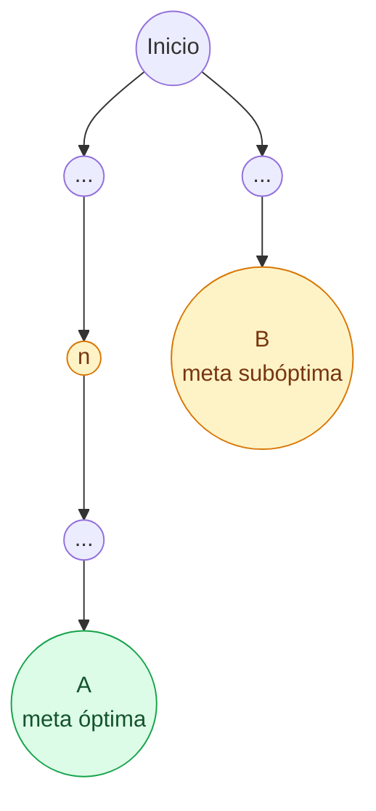

### Paso 1 — existe un ancestro pendiente

Si $A$ aún no se generó, el primer nodo no expandido de su camino está en la frontera; lo llamamos $n$. Si $A$ ya está en ella, se puede tomar $n=A$.

### Paso 2 — acotar $f(n)$

Por admisibilidad,

$$
h(n)\le h^*(n).
$$

Como $n$ está en un camino óptimo:

$$
f(n)=g(n)+h(n)\le g(n)+h^*(n)=C^*=f(A).
$$

### Paso 3 — comparar ambas metas

En una meta, $h=0$. Entonces

$$
f(B)=g(B)>C^*=f(A).
$$

### Paso 4 — encadenar

$$
f(n)\le f(A)<f(B).
$$

A* extrae primero el menor $f$, por lo que extrae $n$ antes que $B$.

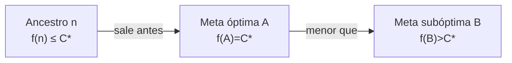

### Paso 5 — repetir

Al expandir $n$ aparece el siguiente nodo del camino óptimo. El argumento se repite hasta extraer $A$. Por tanto, A* no puede aceptar antes una meta más cara.

> [!success] Conclusión
> En búsqueda en árbol, con $h$ admisible y las condiciones usuales sobre costos, A* devuelve una solución óptima.

---

## 5. Búsqueda en grafos: por qué hace falta consistencia

La búsqueda en grafos mantiene un conjunto de estados cerrados para no expandir el mismo estado repetidamente.

> [!important] El «truco» mencionado en clase
> **Nunca expandir un estado dos veces no significa impedir que vuelva a entrar en la frontera.** Puede generarse por varios caminos. Hay que decidir si se descarta, se actualiza con un $g$ menor o se reabre después de haber sido cerrado.

### Contraejemplo exacto de las diapositivas

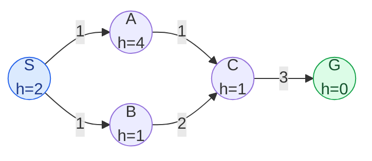

| Ruta | Costo |
|---|---:|
| $S\to A\to C\to G$ | $1+1+3=5$ — óptima |
| $S\to B\to C\to G$ | $1+2+3=6$ — subóptima |

### Laboratorio interactivo: consistencia y reaperturas

Compara tres ejecuciones sobre el mismo grafo: heurística inconsistente sin reaperturas, la misma heurística permitiendo reabrir estados y la corrección consistente $h(A)=2$. El panel conserva en cada paso la frontera, los estados cerrados y la desigualdad problemática del arco $A\to C$.

<iframe src="a-estrella-consistencia-reaperturas.htm" style="width:100%;height:600px;border:1px solid var(--lightgray);border-radius:4px;" loading="lazy"></iframe>

La heurística es admisible:

$$
h(A)=4=h^*(A),\quad h(B)=1\le5,\quad h(C)=1\le3.
$$

Pero es inconsistente en $A\to C$:

$$
h(A)\le c(A,C)+h(C)
\quad\text{exigiría}\quad
4\le1+1,
$$

lo cual es falso.

### Corrida que produce costo 6

**Paso 1 — expandir $S$.**

$$
f(A)=1+4=5,\qquad f(B)=1+1=2.
$$

Frontera: $[B:2,A:5]$.

**Paso 2 — expandir $B$.** Genera $C$ por un camino con

$$
g(C)=1+2=3,\qquad f(C)=3+1=4.
$$

Frontera: $[C:4,A:5]$.

**Paso 3 — expandir $C$.** Sale antes que $A$, se marca cerrado y genera

$$
g(G)=3+3=6,\qquad f(G)=6.
$$

Frontera: $[A:5,G:6]$.

**Paso 4 — expandir $A$.** Aparece un camino mejor hacia $C$:

$$
g_{\mathrm{nuevo}}(C)=1+1=2<3.
$$

Pero la implementación de la diapositiva observa que $C$ ya se expandió y no lo reabre. La mejora no se propaga hacia $G$.

**Paso 5 — extraer $G$.** Devuelve costo $6$, aunque existe costo $5$.

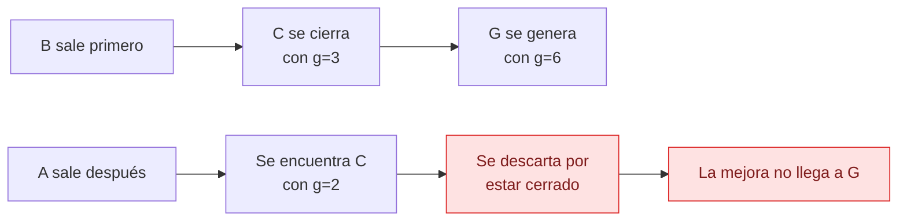

> [!warning] Qué ocurrió exactamente
> La heurística no sobreestimaba el costo a la meta: era admisible. El problema fue que cayó demasiado entre $A$ y $C$, haciendo que $f$ descendiera de $5$ a $3$ en ese arco. El mejor camino llegó a un estado que ya se había cerrado por una ruta peor.

---

## 6. Heurísticas consistentes

Una heurística es **consistente** o monótona cuando, para cada sucesor $n'$ de $n$,

$$
h(n)\le c(n,a,n')+h(n').
$$

Equivalentemente:

$$
h(n)-h(n')\le c(n,a,n').
$$

La estimación no puede disminuir más que el costo real pagado para avanzar.

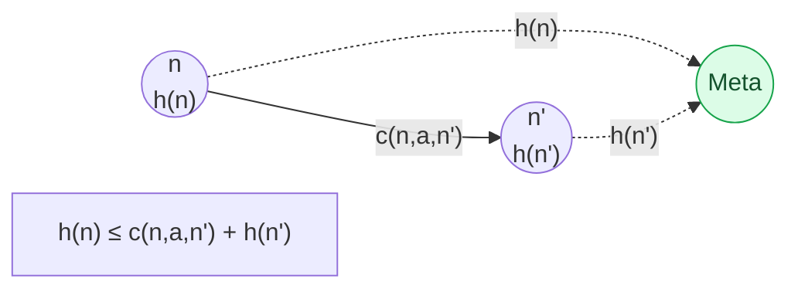

### La consistencia hace que $f$ no disminuya

Sumando $g(n)$:

$$
g(n)+h(n)\le g(n)+c(n,a,n')+h(n').
$$

Como $g(n')=g(n)+c(n,a,n')$:

$$
f(n)\le f(n').
$$

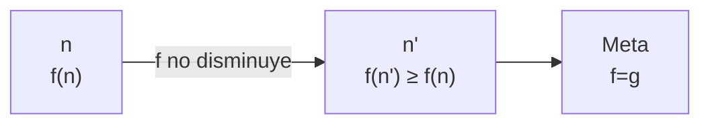

Por eso, con una heurística consistente, cuando A* extrae un estado ya encontró su mejor costo $g$ y no necesita reabrirlo.

### La corrección de la diapositiva: $h(A)=2$

Al cambiar $h(A)=4$ por $h(A)=2$:

$$
h(A)=2\le c(A,C)+h(C)=1+1=2.
$$

La corrida corregida es:

1. se expande $B$ y genera $C$ con $g=3$, $f=4$;
2. se expande $A$ porque $f(A)=1+2=3<4$;
3. se actualiza $C$ en la frontera: $g(C)$ pasa de $3$ a $2$ y $f(C)$ de $4$ a $3$;
4. se expande $C$ una sola vez, ya con su mejor camino;
5. se genera $G$ con $g=2+3=5$;
6. A* devuelve la solución óptima.

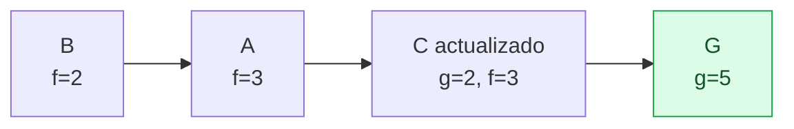

## 7. Distancia en línea recta y desigualdad del triángulo

Para la distancia euclidiana:

$$
d(n,M)\le d(n,n')+d(n',M).
$$

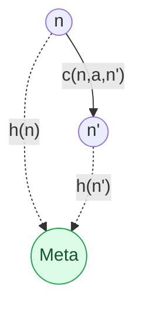

El segmento directo $n\to M$ nunca es más largo que el rodeo $n\to n'\to M$. Por eso

$$
h_{\mathrm{SLD}}(n)\le c(n,a,n')+h_{\mathrm{SLD}}(n'),
$$

y la distancia en línea recta es consistente.

### Consistencia implica admisibilidad

Aplicando la desigualdad arco por arco hasta una meta $G$:

$$
\begin{aligned}
h(n_0)&\le c(n_0,n_1)+h(n_1)\\
&\le c(n_0,n_1)+c(n_1,n_2)+h(n_2)\\
&\le\cdots\\
&\le\sum_{i=0}^{k-1}c(n_i,n_{i+1})+h(G).
\end{aligned}
$$

Como $h(G)=0$, $h(n)$ no supera el costo de ningún camino a la meta; en particular,

$$
h(n)\le h^*(n).
$$

Por tanto:

$$
\text{consistencia}\Longrightarrow\text{admisibilidad}.
$$

La implicación inversa no vale siempre: el ejemplo con $h(A)=4$ es un contraejemplo.

## 8. Admisibilidad frente a consistencia

| Propiedad | Compara | Condición | Garantía principal |
|---|---|---|---|
| Admisibilidad | nodo contra meta | $0\le h(n)\le h^*(n)$ | A* en árbol es óptimo |
| Consistencia | extremos de cada arco | $h(n)\le c(n,a,n')+h(n')$ | $f$ no disminuye; A* en grafo puede cerrar sin reabrir |

Para un ejercicio de examen:

1. calcular $h^*(n)$ para cada nodo;
2. verificar $0\le h(n)\le h^*(n)$ nodo por nodo;
3. verificar $h(u)\le c(u,v)+h(v)$ arco por arco;
4. si falla una desigualdad, señalar el nodo o arco que sirve de contraejemplo;
5. recordar: consistente implica admisible, pero admisible no necesariamente consistente.

---

## 9. Algoritmo de A* en grafos

Una versión robusta conserva el mejor costo conocido de cada estado:

```text
frontera ← cola de prioridad con inicio, ordenada por f=g+h
mejor_g[inicio] ← 0
cerrados ← ∅

mientras frontera no esté vacía:
    n ← extraer el nodo con menor f
    si la entrada de n es obsoleta: continuar
    si estado(n) es meta: devolver su camino

    agregar estado(n) a cerrados

    para cada sucesor s:
        nuevo_g ← g(n) + costo(n,s)
        si s es nuevo o nuevo_g < mejor_g[s]:
            mejor_g[s] ← nuevo_g
            padre[s] ← n
            insertar o actualizar s con f(s)=nuevo_g+h(s)

            si h puede ser inconsistente y s estaba cerrado:
                quitar s de cerrados para reabrirlo

devolver fallo
```

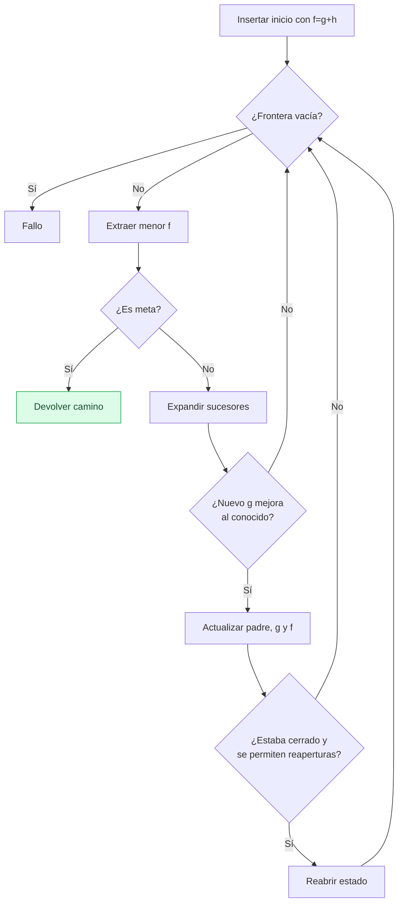

> [!note] Dos políticas
> Con $h$ consistente basta cerrar cada estado una vez. Con $h$ admisible pero inconsistente, una implementación correcta puede necesitar **reabrir** estados cuando encuentra un $g$ menor. La diapositiva usa la primera política para motivar la consistencia.

---

## 10. ¿Qué ocurre con Sudoku y DFS?

La frase «llenar todo de unos y después irlos cambiando» describe informalmente una búsqueda en profundidad cuando los candidatos se prueban en orden ascendente.

Un estado es un tablero parcial. Una acción elige una celda vacía y le asigna un valor permitido.

### Laboratorio interactivo: decidir, propagar y retroceder

El ejemplo usa un pequeño grafo de restricciones en vez de un Sudoku completo para que cada decisión sea visible. El mecanismo es el mismo: asignar el primer candidato, propagar restricciones, detectar un dominio vacío, deshacer decisiones y continuar con la siguiente alternativa.

<iframe src="csp-backtracking.htm" style="width:100%;height:600px;border:1px solid var(--lightgray);border-radius:4px;" loading="lazy"></iframe>

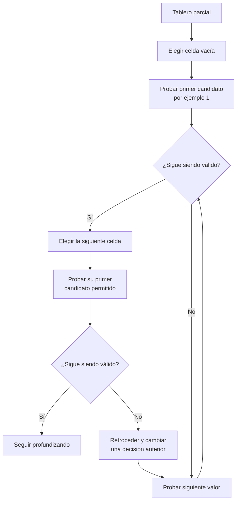

### Paso a paso

1. DFS intenta el primer valor disponible, por ejemplo 1, si es legal.
2. Antes de explorar valores alternativos para esa celda, avanza a la siguiente.
3. Vuelve a intentar el valor más pequeño permitido.
4. Continúa hasta completar el tablero o producir una contradicción.
5. Ante una contradicción hace *backtracking*: deshace la decisión más reciente con alternativas.
6. Prueba el siguiente valor y vuelve a profundizar.

No se escribe literalmente 1 en todas las celdas: las restricciones de fila, columna y subcuadro eliminan muchos unos de inmediato. La frase describe el **sesgo por el orden de candidatos**.

### ¿Por qué no BFS o A* como primera opción?

- BFS guarda todos los tableros de una misma profundidad y consume mucha memoria.
- Si cada asignación cuesta lo mismo, las soluciones completas tienen básicamente la misma profundidad.
- A* necesitaría una heurística útil y barata; el problema central es satisfacer restricciones, no minimizar una ruta física.
- DFS con *backtracking*, propagación de restricciones y buena elección de variable se ajusta mejor.

Esto prepara la siguiente clase sobre **problemas de satisfacción de restricciones (CSP)**:

- elegir primero la celda con menos candidatos;
- eliminar valores incompatibles;
- retroceder en cuanto se detecte una contradicción.

---

## 11. Comentarios conceptuales de cierre

### Planear es simular

El agente no ejecuta en el mundo real todos los planes candidatos. Usa un modelo para simular consecuencias y después elige.

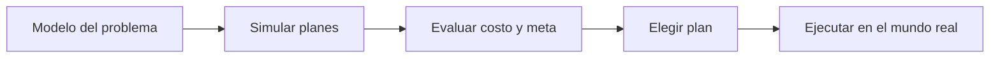

### La búsqueda es tan buena como el modelo

Incluso un algoritmo correcto puede dar una mala solución si faltan estados o acciones, los costos son inadecuados, las transiciones están mal modeladas, la heurística viola sus supuestos o el entorno cambia. La garantía del algoritmo se refiere al **modelo**, no automáticamente al mundo real.

## Resumen después de clase

A* ordena por $f(n)=g(n)+h(n)$: combina el costo recorrido con una estimación de lo que falta. Una heurística admisible no sobreestima y permite probar la optimalidad en árbol; una heurística consistente satisface una condición local por arco, hace que $f$ no disminuya y permite cerrar estados sin reabrirlos en grafos. El ejemplo de clase mostró que una heurística admisible pero inconsistente puede cerrar $C$ por una ruta cara y devolver costo 6 en vez de 5. La discusión de Sudoku anticipó los CSP y DFS con *backtracking*.

## Dudas resueltas

- [x] ¿Es A* óptimo? — Sí, bajo las condiciones precisas indicadas.
- [x] ¿Consistencia implica admisibilidad? — Sí.
- [x] ¿Admisibilidad implica consistencia? — No.
- [x] ¿«No expandir dos veces» significa no volver a generar un estado? — No.
- [x] ¿Por qué DFS parece llenar Sudoku con unos y luego cambiarlos? — Por el orden de candidatos y la profundización antes del retroceso.

## Para la siguiente clase

- [ ] Problemas de satisfacción de restricciones.
- [ ] Representar Sudoku como variables, dominios y restricciones.

## Referencias

- [[AI 4 Búsqueda con información.pdf|Carlos Hernández, “Clase 4: Búsqueda con información”]], diapositivas 6–20.
- [[2026-08-20 IA - Algoritmos de busqueda|Clase anterior: algoritmos de búsqueda]].
