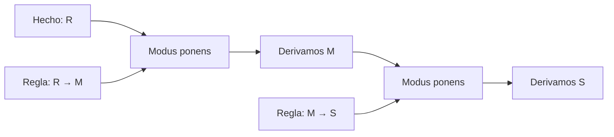
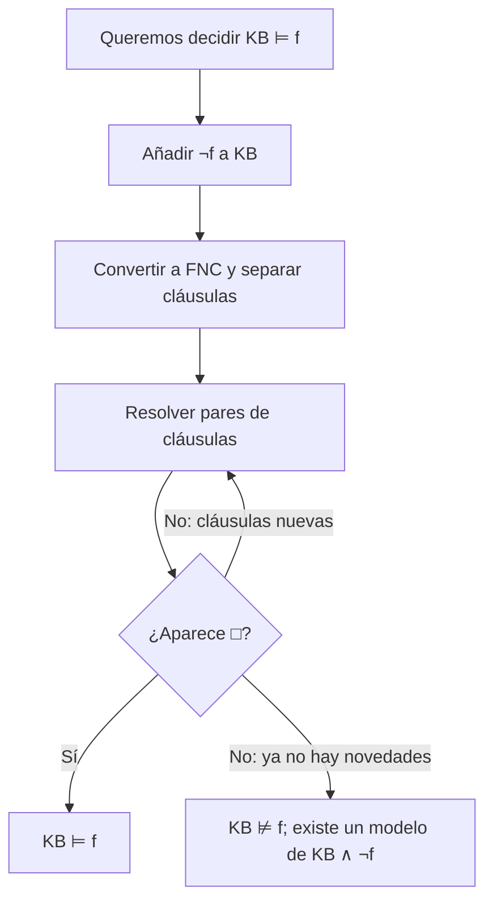
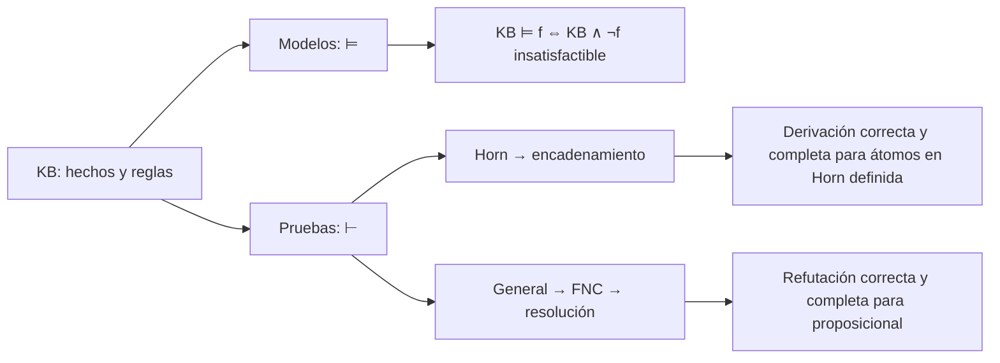

# Clase 10 · De lo que sabemos a lo que podemos demostrar

![[AI 10 Lógica proposicional.pdf]]

> [!summary] Pregunta de la clase
> Si una base de conocimiento contiene reglas y hechos, ¿cómo obtenemos consecuencias nuevas sin revisar manualmente todos los mundos posibles? La ruta de hoy va de **modelos y satisfacibilidad** a **reglas de inferencia**, **encadenamiento hacia adelante**, **cláusulas de Horn**, **resolución** y **forma normal conjuntiva (FNC/CNF)**. La última parte muestra qué le falta a la lógica proposicional para hablar de objetos y de «todos» o «existe».

**Puente con la [[2026-09-10 IA - Agentes logicos|clase anterior]]:** ya sabemos que un modelo es una asignación de verdad, que $M(KB)$ reúne los modelos compatibles con la base y que $KB\models f$ significa $M(KB)\subseteq M(f)$. Ahora buscamos procedimientos para decidir o demostrar esa consecuencia.

## 1. Una historia antes de los símbolos

Imagina un agente que recibe estas tres frases:

1. «Está lloviendo».
2. «Si llueve, el suelo se moja».
3. «Si el suelo está mojado, puede estar resbaloso».

Si interpretamos la tercera como una regla categórica («si está mojado, está resbaloso»), el agente puede concluir primero **mojado** y después **resbaloso**. No necesita observar directamente el suelo: combina información. La precisión importa: si la regla original dijera solamente «*puede* estar resbaloso», no autorizaría una conclusión lógica segura.

Tomemos $R=$ «llueve», $M=$ «el suelo está mojado» y $S=$ «el suelo está resbaloso». Entonces:

$$KB=\{R,\;R\to M,\;M\to S\}. $$



La flecha $R\to M$ representa una **condición suficiente**: si $R$ es verdadero, $M$ también debe serlo. De $M$ solo no podemos concluir $R$; el suelo pudo mojarse por otra causa. Esta es la falacia de **afirmar el consecuente**.

## 2. Repaso semántico: ¿qué significan «saber» y «no saber»?

Un modelo $w$ asigna verdadero o falso a cada átomo. Una base es **satisfactible** cuando tiene al menos un modelo: $M(KB)\neq\varnothing$. En el ejemplo, $R=1$ obliga a $M=1$ y $S=1$, así que la base tiene un modelo y vincula $S$.

Para consultar $f$, basta comparar dos posibilidades:

| Prueba | Resultado | Interpretación si $KB$ es satisfactible |
|---|---|---|
| $KB\land\neg f$ es insatisfactible | $KB\models f$ | $f$ está garantizada: `Ask(f)` responde **sí**. |
| $KB\land f$ es insatisfactible | $KB\models\neg f$ | $f$ está descartada: `Ask(f)` responde **no**. |
| Ambas son satisfactibles | Ninguna consecuencia | `Ask(f)` responde **no sé**; $f$ es contingente respecto a $KB$. |

**Por qué funciona la primera prueba:** si no hay ningún mundo donde $KB$ sea verdadera y $f$ falsa, todos los mundos de $KB$ satisfacen $f$. Esta es la equivalencia de **refutación**:

$$KB\models f\quad\Longleftrightarrow\quad KB\land\neg f\text{ es insatisfactible}. $$

`Tell(f)` usa la misma distinción: si $KB\models f$, no aprende nada nuevo; si $KB\models\neg f$, añadir $f$ introduce una contradicción; si ninguna se cumple, elimina algunos mundos posibles y aprende algo. **Cuidado:** si $KB$ ya es insatisfactible, tanto $KB\models f$ como $KB\models\neg f$ son verdaderas por vacuidad. Por eso el cuadro de tres respuestas supone una base consistente.

### Laboratorio de modelos y consultas

En el laboratorio de la clase previa puedes alternar valores y observar qué mundos sobreviven al agregar fórmulas. Úsalo para comprobar por qué «no sé» significa que sobreviven tanto un mundo con $f$ como otro con $\neg f$.

<iframe src="modelos-entailment-satisfaccion.htm" style="width:100%;height:600px;border:1px solid var(--lightgray);border-radius:4px;" loading="lazy"></iframe>

**Si no carga:** imagina $KB=\{R\vee M\}$. Hay modelos con $R$ verdadero y modelos con $R$ falso; por tanto la base no vincula ni $R$ ni $\neg R$.

## 3. De la semántica a las pruebas: modus ponens

Una **regla de inferencia** es un patrón sintáctico que permite escribir una conclusión a partir de premisas. No requiere enumerar modelos cada vez que se usa:

$$\frac{p,\quad p\to q}{q}\qquad\text{(modus ponens)}. $$

En $\{R,R\to M,M\to S\}$, primero sustituimos $p:=R,q:=M$ y obtenemos $M$. Luego sustituimos $p:=M,q:=S$ y obtenemos $S$. Escribimos $KB\vdash S$ para decir «$S$ es **derivable** con las reglas del sistema»; $KB\models S$ significa «$S$ es verdadera en **todos los modelos** de $KB$».

> [!important] Dos relaciones distintas
> $\vdash$ habla de una **prueba construida con reglas**; $\models$ habla de **todos los modelos**. Un sistema es **correcto** (o sólido) si $KB\vdash f\Rightarrow KB\models f$. Es **completo para la clase de fórmulas considerada** si $KB\models f\Rightarrow KB\vdash f$.

Modus ponens es correcto: no puede producir una conclusión falsa si sus premisas son verdaderas. Usado como única regla para fórmulas proposicionales arbitrarias, es **incompleto**. Por ejemplo, de $P\vee Q$ y $\neg P$ se sigue $Q$, pero ninguna de las dos premisas tiene la forma $p\to q$ necesaria para aplicar modus ponens.

La mención de los teoremas de incompletitud de Gödel en la diapositiva 9 tiene un alcance diferente: trata de sistemas formales suficientemente expresivos para cierta aritmética. **No** dice que la lógica proposicional sea incompleta. Para ella sí hay procedimientos de inferencia correctos y completos, como resolución.

## 4. Encadenamiento hacia adelante: hacer explícitas las consecuencias

El algoritmo empieza con hechos y revisa las reglas. Cuando todas las premisas de una regla ya están disponibles, añade su conclusión. Repite hasta llegar a la consulta o hasta que no aparezca ningún hecho nuevo.

```text
hechos := hechos iniciales
repetir
    cambio := falso
    para cada regla (p₁ ∧ ... ∧ pₖ → q):
        si todos pᵢ están en hechos y q no está en hechos:
            añadir q; registrar qué regla lo justificó
            cambio := verdadero
hasta que cambio = falso
```

Con $R$, $R\to M$ y $M\to S$, el rastro es $\{R\}\to\{R,M\}\to\{R,M,S\}$. Si solo hay un número finito de átomos, el proceso termina: cada vuelta útil agrega al menos un átomo nuevo y nunca borra los anteriores. El orden de las reglas puede cambiar el orden de descubrimiento, pero no el conjunto final de hechos derivables en una base de cláusulas definidas.

### Laboratorio 1 · Construir una prueba hacia adelante

Activa o desactiva los hechos iniciales. Después avanza una regla a la vez y observa qué premisas faltan, qué hecho aparece y cómo se forma su justificación. Prueba especialmente el caso donde falta `Día laboral`: `Tráfico` ya no sale de `Mojado` solo.

<iframe src="logica-horn-encadenamiento.htm" style="width:100%;height:600px;border:1px solid var(--lightgray);border-radius:4px;" loading="lazy"></iframe>

**Si no carga:** con $R$ y $D$ (día laboral), $R\to M$, $M\to S$ y $M\land D\to T$ obtenemos $M$, luego $S$ y $T$. Sin $D$, $T$ queda sin demostrar; esto **no** equivale a demostrar $\neg T$.

## 5. Cláusulas de Horn: cuándo basta una regla sencilla

Para formalizar el algoritmo anterior restringimos la forma de las reglas. Un **literal** es un átomo $P$ o su negación $\neg P$. Una **cláusula** es una disyunción de literales. Una **cláusula de Horn** tiene **a lo sumo un literal positivo**.

| Forma | Como regla | Como cláusula | Uso |
|---|---|---|---|
| Hecho | $Q$ | $Q$ | Punto de partida; caso de cero premisas. |
| Definida | $P_1\land\cdots\land P_k\to Q$ | $\neg P_1\vee\cdots\vee\neg P_k\vee Q$ | Derivar $Q$. |
| De meta o restricción | $P_1\land\cdots\land P_k\to\bot$ | $\neg P_1\vee\cdots\vee\neg P_k$ | Detectar una combinación prohibida. |

Aquí $\bot$ significa falso. Una cláusula definida tiene **exactamente un** literal positivo; una cláusula de meta tiene **ninguno**. Por ejemplo, $R\land A\to\bot$ prohíbe que «llueve» y «hay accidente» sean ambas verdaderas. En cambio, $P\vee Q$ tiene dos literales positivos y no es Horn.

**Alcance de la completitud:** con hechos y reglas **definidas** de Horn, el encadenamiento hacia adelante con modus ponens generalizado encuentra todos los átomos positivos implicados por la base. Si además hay cláusulas de meta, detectar que alguna tiene todas sus premisas verdaderas permite reconocer una contradicción. Esta afirmación es más precisa que decir simplemente «modus ponens es completo para cualquier uso de Horn».

Un algoritmo bien implementado mantiene un contador de premisas aún no satisfechas para cada regla y una lista de reglas que dependen de cada átomo. Así procesa cada aparición de premisa una vez, en tiempo **lineal en el tamaño de la base** para este problema de implicación proposicional Horn. Revisar ciegamente todas las reglas en cada vuelta puede costar más.

## 6. ¿Y si la información contiene alternativas? Resolución

Supón que sabemos $L\vee N$ («llueve o nieva») y $\neg N\vee T$ («si nieva, hay tráfico»). No podemos aplicar modus ponens directamente a $L\vee N$, porque no sabemos que $N$ sea verdadera. Sin embargo, podemos concluir $L\vee T$:

$$\frac{L\vee N,\qquad\neg N\vee T}{L\vee T}. $$

La intuición es por casos. Si $N$ es falsa, la primera cláusula exige $L$. Si $N$ es verdadera, la segunda exige $T$. En ambos casos se cumple $L\vee T$. La regla general es:

$$\frac{C\vee P,\qquad D\vee\neg P}{C\vee D}. $$

$P$ y $\neg P$ se llaman **literales complementarios**; $C\vee D$ es el **resolvente**. Si $C$ y $D$ no contienen ningún literal, la conclusión es la **cláusula vacía** $\square$, que no puede ser verdadera en ningún modelo.

### Ejemplo completo: demostrar $C$ por refutación

Base: $KB=\{A\to(B\vee C),\;A,\;\neg B\}$. Consulta: $C$. No agregamos $C$; agregamos su negación $\neg C$ y buscamos contradicción.

| Nº | Cláusula | Origen |
|---:|---|---|
| 1 | $\neg A\vee B\vee C$ | Eliminar $\to$ de $A\to(B\vee C)$. |
| 2 | $A$ | Hecho de $KB$. |
| 3 | $\neg B$ | Hecho de $KB$. |
| 4 | $\neg C$ | Negación de la consulta. |
| 5 | $B\vee C$ | Resolver 1 y 2 sobre $A$. |
| 6 | $C$ | Resolver 5 y 3 sobre $B$. |
| 7 | $\square$ | Resolver 6 y 4 sobre $C$. |

Como $KB\land\neg C$ conduce a $\square$, no tiene modelos y $KB\models C$. Observa que la premisa $\neg B$ es esencial: sin ella, podría ser $B$ verdadera y $C$ falsa.

### Laboratorio 2 · Resolver cláusulas hasta cerrar la prueba

Selecciona dos cláusulas con literales complementarios y el átomo que cancelarás. El laboratorio forma el resolvente, descarta tautologías y muestra cuándo aparece la cláusula vacía. El botón de pista propone un paso válido, pero puedes explorar otras parejas.

<iframe src="logica-resolucion-laboratorio.htm" style="width:100%;height:600px;border:1px solid var(--lightgray);border-radius:4px;" loading="lazy"></iframe>

**Si no carga:** sigue las filas 1–7 de la tabla. Cada paso cancela un par complementario; obtener $\square$ significa que la hipótesis $\neg C$ era imposible junto con $KB$.

## 7. Forma normal conjuntiva: preparar cualquier fórmula para resolución

Resolución opera sobre cláusulas, de modo que expresamos la fórmula como una **conjunción de disyunciones de literales**:

$$\underbrace{(P\vee\neg Q)}_{\text{cláusula 1}}\land\underbrace{(R\vee S\vee\neg P)}_{\text{cláusula 2}}. $$

Esta es la forma normal conjuntiva (FNC; *CNF* en inglés). Toda fórmula proposicional puede transformarse en una FNC **lógicamente equivalente** usando estas identidades:

1. Eliminar bicondicional: $X\leftrightarrow Y\equiv(X\to Y)\land(Y\to X)$.
2. Eliminar implicaciones: $X\to Y\equiv\neg X\vee Y$.
3. Empujar negaciones hacia los átomos: $\neg(X\land Y)\equiv\neg X\vee\neg Y$ y $\neg(X\vee Y)\equiv\neg X\land\neg Y$.
4. Cancelar doble negación: $\neg\neg X\equiv X$.
5. Distribuir $\vee$ sobre $\land$: $X\vee(Y\land Z)\equiv(X\vee Y)\land(X\vee Z)$.

### Conversión trabajada, sin saltos

La diapositiva propone `summer → snow → bizzare`. Para evitar ambigüedad de asociación, fijemos expresamente $U\to(N\to X)$:

$$
\begin{aligned}
U\to(N\to X)
&\equiv \neg U\vee(\neg N\vee X) && \text{eliminar las dos implicaciones}\\
&\equiv \neg U\vee\neg N\vee X && \text{asociatividad de }\vee.
\end{aligned}
$$

El resultado **ya es una cláusula** y, por tanto, una FNC de una sola cláusula. Aquí no hace falta distribuir. Si en cambio la intención era $(U\to N)\to X$, el resultado sería distinto:

$$ (U\to N)\to X\equiv\neg(\neg U\vee N)\vee X\equiv(U\land\neg N)\vee X\equiv(U\vee X)\land(\neg N\vee X). $$

Este par de resultados muestra por qué **los paréntesis importan**. Para ver de verdad el paso distributivo, toma $P\to(Q\land R)$:

$$P\to(Q\land R)\equiv\neg P\vee(Q\land R)\equiv(\neg P\vee Q)\land(\neg P\vee R). $$

> [!warning] Límite práctico
> Distribuir repetidamente puede hacer crecer mucho la fórmula. En resolución por refutación se puede usar una transformación de Tseitin con variables auxiliares para obtener tamaño lineal, pero esa transformación preserva **satisfacibilidad**, no necesariamente equivalencia sobre un vocabulario ampliado sin proyectar las auxiliares. Las diapositivas usan las equivalencias directas.

### Procedimiento completo de resolución



Para una base proposicional finita, resolución por refutación es correcta y completa: si $KB\models f$, puede derivarse $\square$ de $KB\land\neg f$. El peor caso general puede requerir tiempo exponencial. Esto no significa que **cada** instancia tarde tiempo exponencial; muchas pruebas concretas son cortas.

## 8. Comparación y criterio de elección

| Método | Entradas apropiadas | Qué demuestra | Coste y límite |
|---|---|---|---|
| Encadenamiento + modus ponens | Hechos y reglas definidas de Horn | Átomos positivos implicados; con cláusulas de meta, contradicciones | Implementación eficiente lineal en el tamaño de la base; no cubre disyunciones positivas generales. |
| Resolución por refutación | Cláusulas generales, tras pasar a FNC | Consecuencias proposicionales arbitrarias | Completa para lógica proposicional; peor caso exponencial. |

**Regla para estudiar:** si la base parece un programa de reglas $P_1\land\dots\land P_k\to Q$, intenta primero encadenamiento. Si contiene alternativas como $P\vee Q$ y debes demostrar una consulta general, piensa en FNC y resolución. La elección del método depende de la forma del conocimiento y de la pregunta.

## 9. Dónde termina la lógica proposicional

Una letra proposicional representa una oración completa. Podemos crear $A=$ «Alice sabe IA» y $B=$ «Bob sabe IA», y escribir $A\land B$. Pero la lógica proposicional no ve que ambas oraciones comparten la relación **sabe** y el objeto **IA**. Tampoco tiene variables ni cuantificadores para escribir «todos los estudiantes» con un único esquema.

La lógica de primer orden introduce **objetos**, **predicados**, **funciones**, **variables** y **cuantificadores**:

| Lenguaje natural | Ejemplo de formalización de primer orden | Qué agrega |
|---|---|---|
| Alice y Bob saben IA. | $Sabe(alice,ia)\land Sabe(bob,ia)$ | Predicado con dos argumentos. |
| Todos los estudiantes saben IA. | $\forall x\,(Estudiante(x)\to Sabe(x,ia))$ | Variable y cuantificador universal. |
| Todo entero par mayor que 2 es suma de dos primos. | $\forall x\,[(Entero(x)\land Par(x)\land x>2)\to\exists y\exists z\,(Primo(y)\land Primo(z)\land x=y+z)]$ | Cuantificadores anidados, predicados y función/suma. |

La última oración enuncia la **conjetura de Goldbach**: formalizarla no implica haberla demostrado. Los paréntesis fijan además el alcance correcto de los cuantificadores y conectivos. Esta sección es un **adelanto** de la siguiente clase, no un desarrollo de su semántica.

## 10. Comprueba tu comprensión

1. **Inferencia y error común.** De $P\to Q$ y $Q$, ¿puedes concluir $P$? **No**; $Q$ pudo tener otra causa. De $P$ y $P\to Q$, sí concluyes $Q$.
2. **Tres respuestas.** Para $KB=\{P\vee Q\}$, ¿qué responde `Ask(P)`? **No sé**: existen modelos compatibles con $P$ y con $\neg P$.
3. **Horn.** ¿$\neg P\vee\neg Q\vee R$ es Horn? **Sí**, tiene un solo literal positivo y equivale a $P\land Q\to R$. ¿$P\vee Q$? **No**, tiene dos.
4. **Resolución.** Resuelve $P\vee Q$ con $\neg P\vee R$. **Resultado:** $Q\vee R$.
5. **FNC.** Convierte $P\to(Q\land R)$. **Resultado:** $(\neg P\vee Q)\land(\neg P\vee R)$.
6. **Refutación.** Si $KB\land\neg f$ tiene un modelo, ¿qué sabes? **Que $KB\not\models f$**; ese modelo es un contraejemplo.

## Mapa final de ideas



**Fuente principal:** presentación del profesor Carlos Hernández, *Clase 10: Lógica proposicional*, 31 diapositivas, 17 de septiembre de 2026. Las precisiones sobre el alcance de completitud, la base inconsistente, la asociación de implicaciones y la conjetura de Goldbach se explicitan aquí para evitar inferencias equivocadas.
