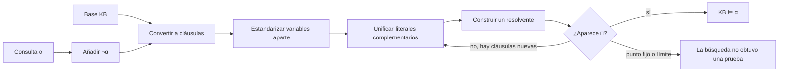

# Clase 14 · Inferencia en lógica de primer orden

![[AI 12 Inferencia agentes lógicos.pdf]]

> [!summary] Pregunta central
> ¿Cómo puede un agente demostrar una consecuencia cuando su conocimiento contiene objetos, relaciones, variables y cuantificadores? La estrategia de la clase es transformar la base a cláusulas, representar los testigos existenciales mediante [[Skolemización|símbolos de Skolem]] y aplicar [[Resolución de primer orden|resolución]] usando [[Unificación|unificación]].

> [!note] Numeración del material
> La presentación se titula «Clase 14», aunque el calendario del curso registra el 22 de septiembre como la sesión 13. Este apunte conserva la fecha real y sigue, una por una, las 19 diapositivas del PDF.

> [!warning] Ajuste de continuidad
> Este apunte resume la versión completa de 19 diapositivas disponible el 22, pero la nota rápida del [[2026-09-24 IA - CNF|24 de septiembre]] indica que la clase siguiente retomó el ejercicio de Jack, Curiosity y Tuna. Por eso, las secciones finales siguen siendo correctas como material de estudio, aunque probablemente no describen con exactitud cuánto se alcanzó a cubrir presencialmente el día 22. La versión ampliada del PDF y las discrepancias se documentan en la nota del 24.

## Antes de comenzar: cuatro ideas mínimas

La [[Lógica de primer orden|lógica de primer orden]] representa objetos y relaciones mediante **términos** y **predicados**:

- Una constante nombra un objeto: $Sócrates$, $Jack$, $Tuna$.
- Una variable puede representar cualquier objeto del dominio: $x$, $y$, $z$.
- Una función construye un término: $MadreDe(x)$ o una función de Skolem $F(x)$.
- Un predicado forma una afirmación: $Humano(Sócrates)$, $Loves(Jack,Tuna)$.

Una **sustitución** reemplaza variables por términos. Por ejemplo,
$\theta=\{x/Sócrates\}$ convierte $Mortal(x)$ en $Mortal(Sócrates)$.

Una **cláusula** es una disyunción de literales, como:

$$\neg Humano(x)\vee Mortal(x).$$

La **cláusula vacía** $\square$ no tiene literales y siempre es falsa. Derivarla significa que las premisas usadas son incompatibles.

**Puente con la [[2026-09-17 IA - Logica proposicional|clase anterior]]:** en resolución proposicional solo se cancelan literales idénticos, como $P$ y $\neg P$. En primer orden se pueden cancelar $Mortal(x)$ y $\neg Mortal(Sócrates)$ después de unificarlos con $\{x/Sócrates\}$.

---

## Diapositiva 1 · El problema de la inferencia en primer orden

La portada anuncia el tema: **inferencia en lógica de primer orden**. La representación y la inferencia son tareas diferentes:

- **Representar:** escribir formalmente hechos y reglas del mundo.
- **Inferir:** obtener consecuencias que no estaban escritas explícitamente.

Por ejemplo, una base puede contener:

$$\forall x\,[Humano(x)\to Mortal(x)]$$

$$Humano(Sócrates).$$

La sentencia $Mortal(Sócrates)$ no aparece como hecho inicial, pero está vinculada lógicamente por la base. El objetivo de la clase es construir una prueba mecánica de esa consecuencia.

## Diapositiva 2 · Agenda: resolución y consecuencia lógica

La diapositiva propone dos temas que deben distinguirse:

1. **Consecuencia lógica**, escrita $KB\models\alpha$, es una relación semántica: todo modelo de $KB$ también satisface $\alpha$.
2. **Resolución** es un procedimiento sintáctico: combina cláusulas para construir una demostración.

La conexión se establece mediante refutación:

$$KB\models\alpha
\quad\Longleftrightarrow\quad
KB\land\neg\alpha\text{ es insatisfactible}.$$

Por eso no añadimos la consulta $\alpha$ a la base; añadimos su negación. Si esa suposición conduce a $\square$, la consulta original queda demostrada.

> [!example] Ejemplo mínimo
> Para preguntar si Sócrates es mortal, se agrega provisionalmente $\neg Mortal(Sócrates)$. Si las reglas obligan también a $Mortal(Sócrates)$, aparece una contradicción.

## Diapositiva 3 · Estrategia general de resolución

La diapositiva resume el método en dos acciones: convertir a CNF/FNC y aplicar resolución repetidamente. La versión completa es:



La [[Forma normal conjuntiva en lógica de primer orden|FNC]] sirve como interfaz común: aunque las fórmulas originales tengan implicaciones y cuantificadores, el motor termina trabajando con conjuntos de cláusulas.

> [!warning] Ausencia de prueba no es prueba de ausencia
> Si una búsqueda no obtiene $\square$, no siempre puede concluirse $KB\not\models\alpha$. La inferencia general de primer orden es semidecidible: una consecuencia verdadera tiene una prueba finita, pero una búsqueda puede no terminar cuando la consulta no se sigue.

## Diapositiva 4 · Universales implícitos y funciones de Skolem

La diapositiva introduce dos convenciones esenciales.

### Variables universales por omisión

Después de convertir a cláusulas, se omiten los cuantificadores universales. Así,

$$\neg Humano(x)\vee Mortal(x)$$

se interpreta como:

$$\forall x\,[\neg Humano(x)\vee Mortal(x)].$$

La variable es universal **dentro de su cláusula**. Antes de combinar cláusulas distintas se aplica [[Estandarización aparte de variables|estandarización aparte]] para que dos variables llamadas $x$ no se confundan accidentalmente.

### Testigos para los existenciales

Un cuantificador existencial afirma que hay algún objeto, pero no dice cuál. La [[Skolemización|skolemización]] introduce un símbolo nuevo para representar ese testigo:

| Fórmula | Símbolo introducido | Motivo |
|---|---|---|
| $\exists y\,Gato(y)$ | constante $c$ | El testigo no depende de ninguna variable universal. |
| $\forall x\,\exists y\,Loves(y,x)$ | función $F(x)$ | El testigo puede ser distinto para cada $x$. |

En el segundo caso obtenemos $Loves(F(x),x)$. La función no se calcula como una función numérica; simplemente nombra «algún testigo asociado con $x$».

> [!important] Precisión semántica
> La skolemización preserva **satisfacibilidad**, no necesariamente equivalencia lógica en el vocabulario ampliado. Esto basta para resolución por refutación, porque buscamos determinar si el conjunto tiene o no un modelo.

## Diapositiva 5 · Algoritmo para convertir a FNC

La conversión debe respetar este orden:

| Paso | Operación | Ejemplo |
|---:|---|---|
| 1 | Eliminar bicondicionales e implicaciones | $P\to Q\equiv\neg P\vee Q$ |
| 2 | Empujar negaciones hasta los átomos | $\neg\forall x\,P(x)\equiv\exists x\,\neg P(x)$ |
| 3 | Estandarizar variables ligadas | $\exists y\,P(y)\vee\exists y\,Q(y)$ pasa a usar $y$ y $z$ |
| 4 | Skolemizar existenciales | $\forall x\exists y\,R(x,y)\leadsto R(x,F(x))$ |
| 5 | Distribuir $\vee$ sobre $\land$ | $P\vee(Q\land R)\equiv(P\vee Q)\land(P\vee R)$ |
| 6 | Omitir cuantificadores universales | $\forall x\,C(x)$ se escribe $C(x)$ |

### Por qué importa el orden

- Si no se empujan primero las negaciones, puede identificarse mal qué variables son existenciales.
- Si no se renombran variables ligadas, dos cuantificadores independientes pueden parecer conectados.
- Si se distribuye antes de skolemizar, se complica innecesariamente la estructura y el seguimiento de dependencias.

## Diapositiva 6 · Conversión trabajada, parte I

La fórmula de la diapositiva expresa:

> Toda persona que ama a todos los animales es amada por alguien.

Para hacer explícito el alcance de cada cuantificador, escribimos:

$$
\forall x\left(
  \left[\forall y\,(Animal(y)\to Loves(x,y))\right]
  \to \exists y\,Loves(y,x)
\right).
$$

### 1. Eliminar implicaciones

La implicación exterior $A\to B$ se reemplaza por $\neg A\vee B$ y la interior por $\neg Animal(y)\vee Loves(x,y)$:

$$
\forall x\left(
\neg\forall y\,[\neg Animal(y)\vee Loves(x,y)]
\vee\exists y\,Loves(y,x)
\right).
$$

### 2. Empujar la negación

Usamos $\neg\forall y\,P(y)\equiv\exists y\,\neg P(y)$ y De Morgan:

$$
\forall x\left(
\exists y\,[Animal(y)\land\neg Loves(x,y)]
\vee\exists y\,Loves(y,x)
\right).
$$

### 3. Estandarizar variables

Los dos cuantificadores existenciales son independientes. Renombramos el segundo $y$ como $z$:

$$
\forall x\left(
\exists y\,[Animal(y)\land\neg Loves(x,y)]
\vee\exists z\,Loves(z,x)
\right).
$$

Cambiar el nombre de una variable ligada no cambia el significado; evita confundir dos testigos potencialmente distintos.

## Diapositiva 7 · Conversión trabajada, parte II

### 4. Skolemizar

Ambos existenciales aparecen bajo el alcance de $\forall x$, por lo que sus testigos pueden depender de $x$. Introducimos dos funciones diferentes:

$$y:=F(x),\qquad z:=G(x).$$

La fórmula se convierte en:

$$
\forall x\left(
[Animal(F(x))\land\neg Loves(x,F(x))]
\vee Loves(G(x),x)
\right).
$$

Las diapositivas llaman a estas funciones $Y(x)$ y $Z(x)$; aquí usamos $F(x)$ y $G(x)$ para distinguirlas visualmente de las variables originales.

### 5. Distribuir $\vee$ sobre $\land$

Aplicamos $(P\land Q)\vee R\equiv(P\vee R)\land(Q\vee R)$:

$$
\forall x\left(
[Animal(F(x))\vee Loves(G(x),x)]
\land
[\neg Loves(x,F(x))\vee Loves(G(x),x)]
\right).
$$

### 6. Omitir el universal y separar cláusulas

$$
\begin{aligned}
A_1&: Animal(F(x))\vee Loves(G(x),x),\\
A_2&: \neg Loves(x,F(x))\vee Loves(G(x),x).
\end{aligned}
$$

Estas dos cláusulas son equisatisfactibles con la fórmula de partida y ya pueden alimentar el algoritmo de resolución.

## Diapositiva 8 · Regla de resolución con unificación

Sean dos cláusulas con literales $p$ y $\neg q$. Si $p$ y $q$ admiten un unificador $\theta$, la regla es:

$$
\frac{f_1\vee\cdots\vee f_n\vee p,qquad
\neg q\vee g_1\vee\cdots\vee g_m}
{Subst\!\left(\theta,
f_1\vee\cdots\vee f_n\vee g_1\vee\cdots\vee g_m\right)},
\qquad \theta=Unify(p,q).
$$

El procedimiento tiene tres operaciones:

1. encontrar los literales complementarios;
2. calcular una [[Sustitución lógica|sustitución]] que iguale sus átomos;
3. eliminar ese par y aplicar la sustitución a **todo** lo restante.

### Ejemplo de la diapositiva

$$Animal(F(x))\vee Loves(G(x),x)$$

$$\neg Loves(u,v)\vee Feeds(u,v).$$

$Loves(G(x),x)$ y $Loves(u,v)$ se unifican mediante:

$$\theta=\{u/G(x),\ v/x\}.$$

Después de cancelar el par y sustituir en el resto:

$$Animal(F(x))\vee Feeds(G(x),x).$$

### Cuándo falla la unificación

- $P(a)$ y $P(b)$ no unifican si $a$ y $b$ son constantes distintas.
- $P(x)$ y $Q(x)$ no unifican porque los predicados son distintos.
- $P(x)$ y $P(f(x))$ fallan con comprobación de ocurrencia: asignar $x=f(x)$ exigiría un término infinito.

---

## Diapositiva 9 · Ejercicio de Sócrates: formalizar la consulta

La información es:

1. Todo humano es mortal.
2. Sócrates es humano.
3. ¿Sócrates es mortal?

La formalización correcta es:

$$
\forall x\,[Humano(x)\to Mortal(x)],qquad Humano(Sócrates).
$$

Para una prueba por refutación se añade la negación de la consulta:

$$\neg Mortal(Sócrates).$$

La tercera fórmula no es un hecho que creamos verdadero; es una hipótesis provisional que intentaremos volver incompatible con la base.

## Diapositiva 10 · Ejercicio de Sócrates: pasar a cláusulas

Solo la primera fórmula necesita transformación:

$$
\forall x\,[Humano(x)\to Mortal(x)]
\equiv
\forall x\,[\neg Humano(x)\vee Mortal(x)].
$$

Al omitir el universal, el conjunto de cláusulas es:

| Nº | Cláusula | Tipo |
|---:|---|---|
| 1 | $\neg Humano(x)\vee Mortal(x)$ | Regla universal |
| 2 | $Humano(Sócrates)$ | Hecho |
| 3 | $\neg Mortal(Sócrates)$ | Negación de la consulta |

No hace falta skolemizar porque no existen cuantificadores existenciales.

## Diapositiva 11 · Ejercicio de Sócrates: cerrar la refutación

Primer paso: resolver 1 y 2. $Humano(x)$ unifica con $Humano(Sócrates)$ mediante $\theta=\{x/Sócrates\}$:

$$
\frac{\neg Humano(x)\vee Mortal(x),\quad Humano(Sócrates)}
{Mortal(Sócrates)}.
$$

Segundo paso: resolver el resultado con la cláusula 3:

$$
\frac{Mortal(Sócrates),\quad\neg Mortal(Sócrates)}{\square}.
$$

Por tanto:

$$KB\models Mortal(Sócrates).$$

Este ejemplo es pequeño, pero ya contiene el patrón completo: negar la consulta, convertir a cláusulas, unificar, resolver y obtener $\square$.

---

## Diapositiva 12 · Ejercicio de Jack, Curiosity y Tuna

El segundo ejercicio aumenta la dificultad porque mezcla cuantificadores, relaciones binarias y una disyunción:

> A. Quien ama a todos los animales es amado por alguien.  
> B. Quien mata a un animal no es amado por nadie.  
> C. Jack ama a todos los animales.  
> D. Jack o Curiosity mató al gato llamado Tuna.  
> E. ¿Curiosity mató al gato?

Antes de formalizar se fija el vocabulario:

| Símbolo | Lectura |
|---|---|
| $Animal(x)$ | $x$ es animal |
| $Cat(x)$ | $x$ es gato |
| $Loves(x,y)$ | $x$ ama a $y$ |
| $Kills(x,y)$ | $x$ mata a $y$ |
| $Jack$, $Curiosity$, $Tuna$ | constantes del dominio |

Para que «el gato» pueda usarse como animal en la regla B, la formalización de la siguiente diapositiva hace explícitos dos conocimientos que el lenguaje natural deja implícitos: $Cat(Tuna)$ y $\forall x(Cat(x)\to Animal(x))$.

## Diapositiva 13 · Del lenguaje natural a primer orden

Las sentencias quedan:

$$
\begin{aligned}
A:\;&\forall x\left(
[\forall y\,(Animal(y)\to Loves(x,y))]
\to[\exists y\,Loves(y,x)]
\right),\\
B:\;&\forall x\left(
[\exists z\,(Animal(z)\land Kills(x,z))]
\to[\forall y\,\neg Loves(y,x)]
\right),\\
C:\;&\forall x\,[Animal(x)\to Loves(Jack,x)],\\
D:\;&Kills(Jack,Tuna)\vee Kills(Curiosity,Tuna),\\
E:\;&Cat(Tuna),\\
F:\;&\forall x\,[Cat(x)\to Animal(x)].
\end{aligned}
$$

La consulta es:

$$G: Kills(Curiosity,Tuna).$$

Para refutar su negación añadimos:

$$\neg G:\quad\neg Kills(Curiosity,Tuna).$$

> [!note] Cambio de letras entre diapositivas
> En la diapositiva 12 la pregunta aparece como inciso E. En la formalización se añaden los hechos sobre Tuna como E y F, por lo que la consulta pasa a llamarse G. Es solo un cambio de etiquetas.

### Comprobación del alcance

En A, «ama a todos los animales» forma el antecedente completo de la implicación. En B, el $z$ existencial representa algún animal asesinado y el $y$ universal expresa que ninguna persona ama al asesino. Los paréntesis son esenciales: mover un cuantificador fuera de su alcance puede cambiar el significado.

## Diapositiva 14 · Toda la base en CNF

La fórmula A produce las dos cláusulas derivadas en las diapositivas 6–7:

$$
\begin{aligned}
A_1:;&Animal(F(x))\vee Loves(G(x),x),\\
A_2:;&\neg Loves(x,F(x))\vee Loves(G(x),x).
\end{aligned}
$$

La fórmula B se transforma así:

$$
\begin{aligned}
&\forall x\left(
[\exists z\,(Animal(z)\land Kills(x,z))]
\to[\forall y\,\neg Loves(y,x)]
\right)\\
&\equiv
\forall x\left(
\neg\exists z\,[Animal(z)\land Kills(x,z)]
\vee\forall y\,\neg Loves(y,x)
\right)\\
&\equiv
\forall x\forall z\forall y\,[
\neg Animal(z)\vee\neg Kills(x,z)\vee\neg Loves(y,x)
].
\end{aligned}
$$

Al omitir los universales, la base clausal completa es:

| Etiqueta | Cláusula |
|---|---|
| $A_1$ | $Animal(F(x))\vee Loves(G(x),x)$ |
| $A_2$ | $\neg Loves(x,F(x))\vee Loves(G(x),x)$ |
| $B$ | $\neg Loves(y,x)\vee\neg Animal(z)\vee\neg Kills(x,z)$ |
| $C$ | $\neg Animal(x)\vee Loves(Jack,x)$ |
| $D$ | $Kills(Jack,Tuna)\vee Kills(Curiosity,Tuna)$ |
| $E$ | $Cat(Tuna)$ |
| $F$ | $\neg Cat(x)\vee Animal(x)$ |
| $\neg G$ | $\neg Kills(Curiosity,Tuna)$ |

> [!tip] Cómo leer la tabla
> Cada renglón es una cláusula independiente y sus variables son universales. Al usar dos renglones en un paso de resolución, conviene renombrar sus variables aparte antes de unificar.

## Diapositiva 15 · Prueba completa de que Curiosity mató a Tuna

La prueba tiene dos ramas conceptuales:

- $E$, $F$, $D$, $\neg G$ y $B$ obligan a concluir que **nadie ama a Jack**.
- $A_1$, $A_2$ y $C$ obligan a concluir que **alguien ama a Jack**.

Estas ramas chocan y producen la cláusula vacía.

| Paso | Padres y literal resuelto | Sustitución | Resolvente |
|---:|---|---|---|
| $R_1$ | $E$ con $F$ sobre $Cat$ | $\{x/Tuna\}$ | $Animal(Tuna)$ |
| $R_2$ | $D$ con $\neg G$ sobre $Kills(Curiosity,Tuna)$ | $\{\}$ | $Kills(Jack,Tuna)$ |
| $R_3$ | $B$ con $R_1$ sobre $Animal$ | $\{z/Tuna\}$ | $\neg Loves(y,x)\vee\neg Kills(x,Tuna)$ |
| $R_4$ | $R_3$ con $R_2$ sobre $Kills$ | $\{x/Jack\}$ | $\neg Loves(y,Jack)$ |
| $R_5$ | $A_2$ con $C$ sobre $Loves(Jack,F(Jack))$ | $\{x/Jack,\ u/F(Jack)\}$ | $\neg Animal(F(Jack))\vee Loves(G(Jack),Jack)$ |
| $R_6$ | $R_5$ con $A_1$ sobre $Animal(F(Jack))$ | $\{x/Jack\}$ | $Loves(G(Jack),Jack)$ |
| $R_7$ | $R_4$ con $R_6$ sobre $Loves(G(Jack),Jack)$ | $\{y/G(Jack)\}$ | $\square$ |

En $R_5$ se escribió la variable de C como $u$ para mostrar que fue estandarizada aparte. La unificación combina:

$$
A_2:\ \neg Loves(Jack,F(Jack))\vee Loves(G(Jack),Jack)
$$

con:

$$
C:\ \neg Animal(F(Jack))\vee Loves(Jack,F(Jack)).
$$

Al cancelar los literales sobre $Loves(Jack,F(Jack))$ queda $R_5$. Después, $A_1$ elimina $\neg Animal(F(Jack))$ y produce el testigo $G(Jack)$ que ama a Jack.

Como la suposición $\neg G$ conduce a contradicción:

$$KB\models Kills(Curiosity,Tuna).$$

### Laboratorio · Recorrer la prueba de Tuna

Avanza por cada resolvente para ver sus padres, la sustitución y la interpretación informal.

<iframe src="resolucion-primer-orden-tuna.htm" style="width:100%;height:600px;border:1px solid var(--lightgray);border-radius:4px;" loading="lazy"></iframe>

**Si no carga:** sigue las filas $R_1$–$R_7$. La rama izquierda termina en $\neg Loves(y,Jack)$ y la derecha en $Loves(G(Jack),Jack)$; al usar $y=G(Jack)$ se obtiene $\square$.

---

## Diapositiva 16 · Prolog como resolución restringida

[[Prolog|Prolog]] representa conocimiento mediante [[Cláusula de Horn|cláusulas definidas]] y ejecuta consultas mediante una forma operacional de [[Resolución SLD|resolución SLD]].

```prolog
% Base de conocimiento
humano(socrates).
mortal(X) :- humano(X).

% Consulta
?- mortal(socrates).
```

### Lectura lógica

- `humano(socrates).` es un hecho.
- `mortal(X) :- humano(X).` significa $Humano(X)\to Mortal(X)$.
- `?- mortal(socrates).` pide una demostración.

### Traza operacional

| Estado | Acción |
|---|---|
| Meta: `mortal(socrates)` | Unificar con la cabeza `mortal(X)` usando `{X/socrates}`. |
| Meta: `humano(socrates)` | Sustituir la meta anterior por el cuerpo de la regla. |
| Meta vacía | El hecho `humano(socrates)` cierra la prueba; la consulta tiene éxito. |

Prolog suele seleccionar la meta de más a la izquierda, probar cláusulas en el orden del programa y buscar en profundidad con retroceso. Por ello, el orden no cambia el significado declarativo de reglas puras, pero sí puede cambiar rendimiento y terminación.

> [!warning] Prolog no es toda la lógica de primer orden
> Su núcleo trabaja con cláusulas definidas y una estrategia de búsqueda concreta. Además, la negación como fallo de Prolog no coincide automáticamente con la negación clásica usada en las pruebas anteriores.

## Diapositiva 17 · Comparación final de métodos

La diapositiva resume la transición con las expresiones informales «modus ponens++» y «resolución++». Los signos `++` no nombran algoritmos formales; indican que las reglas proposicionales se extienden con variables y unificación.

| Método | Lógica proposicional | Lógica de primer orden |
|---|---|---|
| Revisión de modelos | Enumerar asignaciones booleanas | La diapositiva marca N/A porque no se desarrolló un enumerador directo de modelos de primer orden; sus dominios pueden ser infinitos. |
| Modus ponens | De $P$ y $P\to Q$, concluir $Q$ | **Modus ponens generalizado:** unificar hechos con las premisas de una regla cuantificada. |
| Resolución | Cancelar $P$ con $\neg P$ | Estandarizar aparte, unificar términos, sustituir y cancelar literales. |
| Existenciales | No aparecen en el lenguaje proposicional | Introducir constantes o funciones de Skolem. |
| Decidibilidad | SAT proposicional es decidible | La consecuencia lógica general de primer orden es semidecidible. |

La idea constante es esta: una prueba manipula símbolos, pero su legitimidad proviene de preservar la consecuencia semántica.

## Diapositiva 18 · ¿Cómo vamos?

La diapositiva propone una retrospectiva. Aplicada a este tema:

### ¿Qué ha salido bien?

- La resolución proposicional proporciona una base intuitiva clara.
- La FNC reduce fórmulas heterogéneas a un formato uniforme.
- La unificación evita enumerar manualmente todas las instancias posibles.

### ¿Qué conviene mejorar?

- Hacer explícito el alcance de cada cuantificador con paréntesis.
- Diferenciar equivalencia lógica de equisatisfacibilidad.
- Escribir cada sustitución y aplicarla al resolvente completo.
- Estandarizar variables aparte antes de resolver.

### Acciones de estudio

- [ ] Convertir tres fórmulas nuevas a FNC sin saltar pasos.
- [ ] Practicar unificaciones que tengan éxito y otras que fallen.
- [ ] Reconstruir la prueba de Tuna sin consultar la tabla.
- [ ] Ejecutar el ejemplo de Sócrates en Prolog y explicar cada meta.

## Diapositiva 19 · Puente hacia agentes probabilísticos

La siguiente clase anuncia **agentes probabilísticos**. El cambio de tema responde a una limitación de la lógica clásica: resolución determina qué se sigue necesariamente de una base, pero no expresa por sí sola grados de incertidumbre.

| Situación | Herramienta natural |
|---|---|
| «Todo humano es mortal; Sócrates es humano» | Inferencia lógica: la conclusión es necesaria. |
| «Una prueba médica positiva suele indicar enfermedad, pero puede fallar» | Inferencia probabilística: comparar probabilidades condicionadas. |
| «No sé quién mató a Tuna, pero una regla elimina una alternativa» | Lógica y resolución. |
| «Hay 70 % de probabilidad de que Curiosity estuviera allí» | Modelo probabilístico. |

La conexión no consiste en desechar la lógica: los agentes probabilísticos también necesitan variables, modelos y consultas, pero reemplazan la verdad binaria absoluta por distribuciones y actualización de creencias.

---

## Resumen de la clase

1. Para probar $KB\models\alpha$, se intenta refutar $KB\land\neg\alpha$.
2. Las fórmulas se convierten a cláusulas eliminando implicaciones, empujando negaciones, renombrando variables, skolemizando, distribuyendo y omitiendo universales.
3. La skolemización representa testigos existenciales y preserva satisfacibilidad.
4. La unificación calcula sustituciones que permiten cancelar literales complementarios con términos distintos.
5. Obtener $\square$ demuestra que la negación de la consulta era incompatible con la base.
6. Prolog especializa estas ideas para cláusulas definidas y búsqueda dirigida por metas.

## Errores frecuentes que conviene evitar

- Afirmar el consecuente: de $Humano(x)\to Mortal(x)$ y $Mortal(Sócrates)$ no se sigue $Humano(Sócrates)$.
- Usar una constante de Skolem cuando el testigo depende de una variable universal.
- Reutilizar el mismo símbolo de Skolem para existenciales independientes.
- Confundir dos variables llamadas $x$ que proceden de cláusulas distintas.
- Aplicar la sustitución solo a los literales cancelados y no al resolvente completo.
- Considerar que «no se encontró prueba» equivale a «la consulta es falsa».
- Confundir negación clásica con negación como fallo en Prolog.

## Preguntas de autoevaluación

1. ¿Por qué se añade $\neg\alpha$ cuando se quiere demostrar $\alpha$?
2. ¿Cuándo un existencial se reemplaza por una constante y cuándo por una función de Skolem?
3. ¿Qué diferencia hay entre renombrar una variable y sustituirla por un término?
4. ¿Cuál es el unificador más general de $P(f(x),x)$ y $P(f(a),a)$?
5. ¿Por qué $x$ no puede unificarse con $f(x)$ bajo la comprobación de ocurrencia?
6. ¿Qué contradicción final aparece en el ejercicio de Tuna?
7. ¿En qué sentido Prolog es una forma restringida de resolución?

<details>
<summary>Respuestas breves</summary>

1. Porque $KB\models\alpha$ equivale a la insatisfacibilidad de $KB\land\neg\alpha$.
2. Constante si no hay universales en alcance; función de esas variables universales si el testigo puede depender de ellas.
3. Renombrar conserva una variable y evita colisiones; sustituir la instancia con un término.
4. $\{x/a\}$.
5. Porque produciría el término infinito $f(f(f(\dots)))$.
6. Se derivan $Loves(G(Jack),Jack)$ y $\neg Loves(G(Jack),Jack)$.
7. Usa cláusulas definidas, selección de metas y una estrategia operacional concreta.

</details>

## Referencias por tema

| Tema | Referencia |
|---|---|
| Material principal | Carlos Hernández, *Clase 14: inferencia en lógica de primer orden*, diapositivas 1–19: [[AI 12 Inferencia agentes lógicos.pdf|PDF de la clase]]. |
| Sintaxis y semántica de primer orden | Russell, S. J. y Norvig, P. (2020), *Artificial Intelligence: A Modern Approach*, 4.ª ed., cap. 8. Disponible en [[Artificial_inteliigence-A_modern_approach.pdf|los recursos del curso]] y en el [sitio oficial de AIMA](https://aima.cs.berkeley.edu/). |
| Unificación | Russell y Norvig, cap. 9, §9.2; [[Unificación|nota atómica]]. El [capítulo 9 oficial](https://aima.cs.berkeley.edu/4th-ed/pdfs/newchap09.pdf) desarrolla unificación, encadenamiento y resolución. |
| Resolución y forma clausal | Russell y Norvig, cap. 9, §9.5; Genesereth, *Introduction to Logic*, [capítulo interactivo sobre resolución](https://logic.stanford.edu/intrologic/extras/resolution.html). |
| Variables, sustitución y normalización | Enderton, H. B. (2001), *A Mathematical Introduction to Logic*, 2.ª ed., caps. 2–3. |
| Prolog, Horn y SLD | SWI-Prolog, [glosario de términos](https://www.swi-prolog.org/pldoc/man?section=glossary) y [ejecución de consultas](https://www.swi-prolog.org/pldoc/man?section=execquery). |

## Notas atómicas relacionadas

- [[Lógica de primer orden|Lógica de primer orden]]
- [[Forma normal conjuntiva en lógica de primer orden|Forma normal conjuntiva en lógica de primer orden]]
- [[Estandarización aparte de variables|Estandarización aparte de variables]]
- [[Skolemización|Skolemización]]
- [[Sustitución lógica|Sustitución lógica]]
- [[Unificación|Unificación]]
- [[Resolución de primer orden|Resolución de primer orden]]
- [[Cláusula de Horn|Cláusula de Horn]]
- [[Resolución SLD|Resolución SLD]]
- [[Prolog|Prolog]]
