# Clase 3 — Algoritmos de búsqueda

![[AI 3 Algoritmos de búsqueda.pdf]]

## Pregunta central

¿Cuál nodo de la frontera debemos explorar primero?

> [!summary] Idea esencial
> DFS, BFS, profundidad iterativa, costo uniforme, búsqueda voraz y A* comparten el mismo ciclo general. Lo que cambia es la **prioridad de la frontera**. Esa decisión determina el orden de expansión, la memoria, la completitud y la optimalidad.

## Convención para leer las corridas

- **Azul:** nodo expandido en ese paso.
- **Amarillo:** nodo en la frontera.
- **Verde:** meta aceptada.
- La frontera se ordena de izquierda a derecha según el siguiente nodo por extraer.
- Cada Mermaid es una **instantánea de un paso**, no un problema diferente.

## Del problema al árbol de búsqueda

En el rompecabezas de ocho piezas de las diapositivas, cada configuración es un **estado** y cada movimiento legal del espacio vacío (`Up`, `Left`, `Down`, `Right`) produce un sucesor. La raíz es el estado inicial y cada nodo representa el **plan** que llevó a esa configuración.

> [!important] Estado y nodo no son lo mismo
> Un estado describe una configuración. Un nodo de búsqueda también conserva padre, acción, profundidad y costo acumulado. Un mismo estado puede aparecer en nodos distintos si se alcanza mediante planes diferentes.

La comparación de clase entre grafo de estados y árbol de búsqueda usa este grafo:

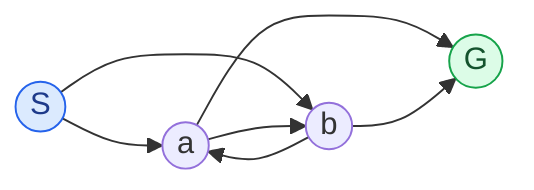

Aunque el grafo tiene cuatro estados, el ciclo $a\leftrightarrow b$ genera caminos arbitrariamente largos. La **búsqueda en árbol** puede repetir estados; la **búsqueda en grafo** registra los alcanzados para evitar repeticiones o conservar un camino mejor.

## Algoritmo general y frontera

```text
frontera ← {nodo(estado_inicial)}
alcanzados ← {estado_inicial: costo 0}   # búsqueda en grafo

mientras frontera no esté vacía:
    n ← extraer según la estrategia
    si n es meta: devolver su camino
    para cada hijo de expandir(n):
        si es nuevo o mejora el camino conocido:
            insertar o actualizar hijo en la frontera
devolver fallo
```

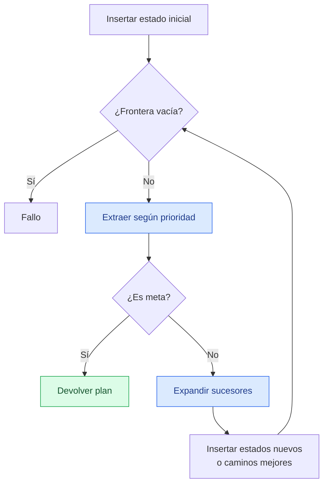

La [[03_Conceptos/Frontera de búsqueda|frontera]] o *fringe* contiene nodos generados aún no expandidos. Todos los algoritmos vistos pueden implementarse con una cola de prioridad cambiando su clave.

## Criterios de evaluación

1. **Completitud:** ¿encuentra una solución si existe?
2. **Optimalidad:** ¿encuentra el camino de menor costo?
3. **Tiempo:** ¿cuántos nodos genera o expande?
4. **Espacio:** ¿cuántos nodos conserva?

Usaremos $b$ para el factor de ramificación, $m$ para la profundidad máxima, $d$ para la profundidad de la solución más superficial, $C^*$ para el costo óptimo y $\varepsilon>0$ para el costo mínimo de un arco.

## Ejemplo común para DFS, BFS e IDS

Las diapositivas usan el árbol binario `A…O`. Para poder completar la corrida, se marca `O` como meta y se adopta el orden de hijos izquierda → derecha.

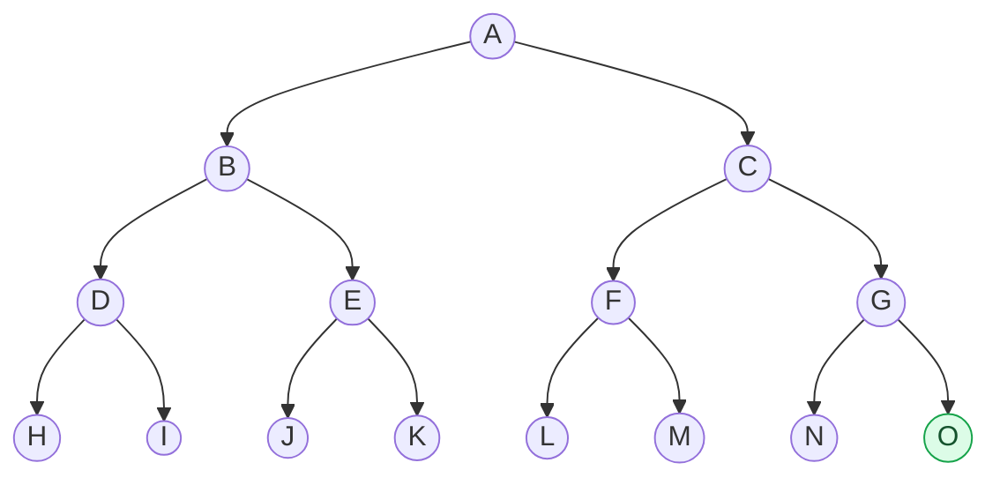

### Recorridos interactivos

Usa los botones **DFS**, **BFS** e **IDS** para aplicar las tres estrategias sobre el mismo árbol. En cada paso se actualizan el nodo expandido, la frontera y el orden acumulado.

<iframe src="../../inteligencia_artificial/recursos/recorridos-dfs-bfs-ids.htm" style="width:100%;height:600px;border:1px solid var(--lightgray);border-radius:4px;" loading="lazy"></iframe>

## 1. Búsqueda en profundidad — DFS

La [[03_Conceptos/Búsqueda en profundidad|DFS]] expande primero el nodo más profundo. Usa una pila LIFO.

### Corrida paso a paso

<details>
<summary>Ver las instantáneas estáticas de DFS</summary>

**Paso 0 — inicializar.**

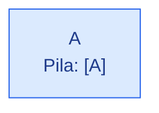

**Paso 1 — expandir `A`.**

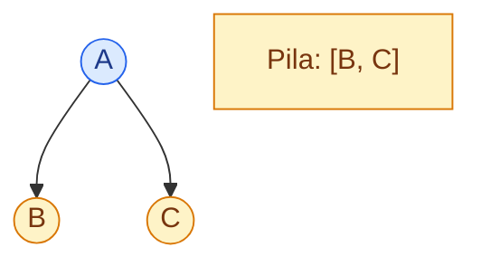

**Paso 2 — expandir `B`; se baja por `D`.**


**Paso 3 — expandir `D`.**

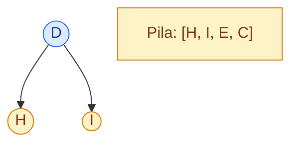

**Paso 4 — procesar la hoja `H`.**

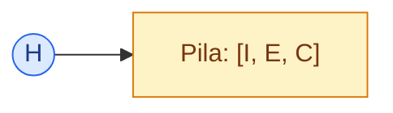

**Paso 5 — procesar la hoja `I`.**

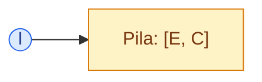

**Paso 6 — expandir `E`.**

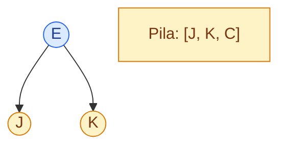

**Paso 7 — tras procesar `J` y `K`, expandir `C`.**

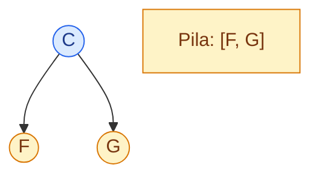

**Paso 8 — tras recorrer `F, L, M`, expandir `G`.**

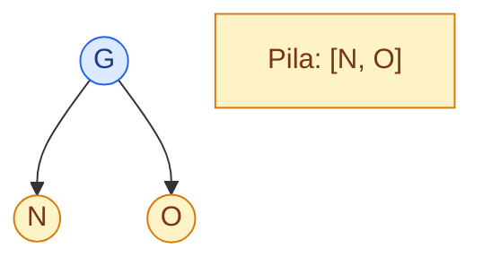

**Paso 9 — después de `N`, extraer la meta `O`.**

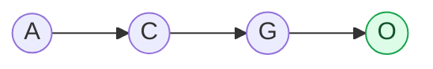

</details>

Orden: $A,B,D,H,I,E,J,K,C,F,L,M,G,N,O$.

- **Completa:** no en árboles infinitos o con ciclos; sí en grafos finitos con repetidos controlados.
- **Óptima:** no.
- **Tiempo:** $O(b^m)$.
- **Espacio:** $O(bm)$.

## 2. Búsqueda en anchura — BFS

La [[03_Conceptos/Búsqueda en anchura|BFS]] expande el nodo más superficial. Usa una cola FIFO.

### Corrida paso a paso

<details>
<summary>Ver las instantáneas estáticas de BFS</summary>

**Paso 0 — inicializar.**

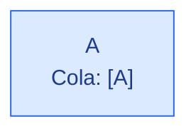

**Paso 1 — expandir `A`.**

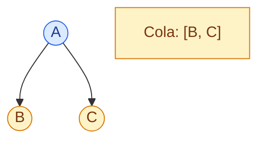

**Paso 2 — expandir `B`; `C` conserva prioridad.**

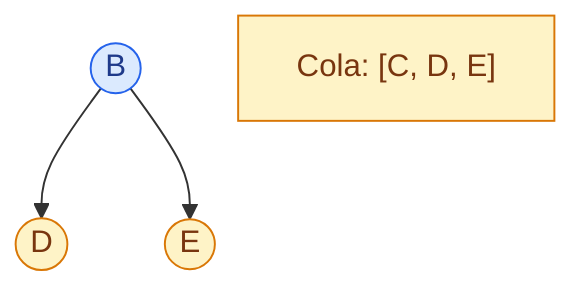

**Paso 3 — expandir `C`; queda completa la profundidad 2.**

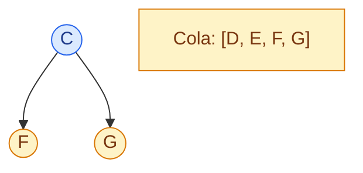

**Paso 4 — expandir `D`.**


**Paso 5 — expandir `E`.**

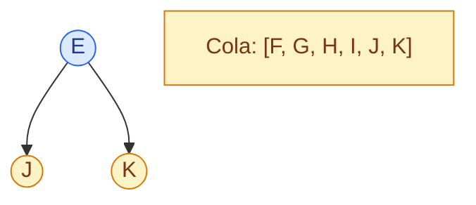

**Paso 6 — expandir `F`.**

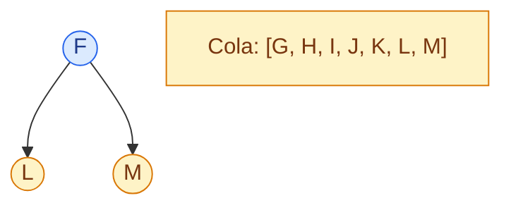

**Paso 7 — expandir `G`; `O` entra al final de la capa.**

```mermaid
flowchart TB
  G((G)) --> N((N)) & O((O))
  Q["Cola: [H, I, J, K, L, M, N, O]"]
  classDef actual fill:#dbeafe,stroke:#2563eb,color:#1e3a8a;
  classDef espera fill:#fef3c7,stroke:#d97706,color:#78350f;
  class G actual; class H,I,J,K,L,M,N,O,Q espera;
```

**Paso 8 — procesar las hojas anteriores y extraer `O`.**

```mermaid
flowchart LR
  A((A)) --> C((C)) --> G((G)) --> O((O))
  classDef meta fill:#dcfce7,stroke:#16a34a,color:#14532d;
  class O meta;
```

</details>

Orden: $A,B,C,D,E,F,G,H,I,J,K,L,M,N,O$.

- **Completa:** sí si $b$ es finito.
- **Óptima:** solo con costos iguales.
- **Tiempo y espacio:** $O(b^d)$; algunas referencias cuentan la siguiente capa y escriben $O(b^{d+1})$.

> [!question] DFS vs BFS
> DFS suele convenir con memoria limitada o soluciones profundas. BFS conviene si la solución está cerca de la raíz y se busca el menor número de pasos.

## 3. Profundidad iterativa — IDS

La [[03_Conceptos/Búsqueda de profundidad iterativa|IDS]] repite DFS con límites crecientes.

La corrida interactiva anterior también incluye **IDS** y muestra cómo aumenta el límite y se regeneran niveles.

<details>
<summary>Ver las instantáneas estáticas de IDS</summary>

**Iteración 1 — límite 1.**

```mermaid
flowchart TB
  A((A)) --> B((B)) & C((C))
  X["Orden: A, B, C<br/>resultado: corte"]
  classDef actual fill:#dbeafe,stroke:#2563eb,color:#1e3a8a;
  classDef espera fill:#fef3c7,stroke:#d97706,color:#78350f;
  class A actual; class B,C,X espera;
```

**Iteración 2 — límite 2; se regeneran los niveles anteriores.**

```mermaid
flowchart TB
  A((A)) --> B((B)) & C((C))
  B --> D((D)) & E((E))
  C --> F((F)) & G((G))
  X["Orden: A,B,D,E,C,F,G<br/>resultado: corte"]
  classDef espera fill:#fef3c7,stroke:#d97706,color:#78350f;
  class D,E,F,G,X espera;
```

**Iteración 3 — límite 3; se alcanza `O`.**

```mermaid
flowchart TB
  A((A)) --> B((B)) & C((C))
  C --> F((F)) & G((G))
  G --> N((N)) & O((O))
  classDef meta fill:#dcfce7,stroke:#16a34a,color:#14532d;
  class O meta;
```

</details>

- **Completa:** sí con $b$ finito.
- **Óptima:** sí con costos iguales.
- **Tiempo:** $O(b^d)$.
- **Espacio:** $O(bd)$.

## 4. Búsqueda de costo uniforme — UCS

La [[03_Conceptos/Búsqueda de costo uniforme|UCS]] expande el nodo con menor costo acumulado $g(n)$. Las diapositivas usan el viaje de **Arad** a **Bucharest**.

### Corrida paso a paso en Rumania

La animación mantiene ordenada la frontera por costo acumulado $g(n)$ y permite observar por qué Bucharest con costo 450 todavía no puede aceptarse.

<iframe src="../../inteligencia_artificial/recursos/ucs-rumania-v2.htm" style="width:100%;height:600px;border:1px solid var(--lightgray);border-radius:4px;" loading="lazy"></iframe>

<details>
<summary>Ver las instantáneas estáticas de UCS</summary>

**Paso 0 — inicio.**

```mermaid
flowchart LR
  A["Arad<br/>g=0"]
  classDef actual fill:#dbeafe,stroke:#2563eb,color:#1e3a8a;
  class A actual;
```

**Paso 1 — expandir Arad.**

```mermaid
flowchart LR
  A((Arad)) -->|75| Z["Zerind 75"]
  A -->|118| T["Timisoara 118"]
  A -->|140| S["Sibiu 140"]
  Q["Frontera: Z75, T118, S140"]
  classDef actual fill:#dbeafe,stroke:#2563eb,color:#1e3a8a;
  classDef espera fill:#fef3c7,stroke:#d97706,color:#78350f;
  class A actual; class Z,T,S,Q espera;
```

**Paso 2 — expandir Zerind (75).**

```mermaid
flowchart LR
  Z((Zerind)) -->|71| O["Oradea 146"]
  Q["Frontera: T118, S140, O146"]
  classDef actual fill:#dbeafe,stroke:#2563eb,color:#1e3a8a;
  classDef espera fill:#fef3c7,stroke:#d97706,color:#78350f;
  class Z actual; class O,Q espera;
```

**Paso 3 — expandir Timisoara (118).**

```mermaid
flowchart LR
  T((Timisoara)) -->|111| L["Lugoj 229"]
  Q["Frontera: S140, O146, L229"]
  classDef actual fill:#dbeafe,stroke:#2563eb,color:#1e3a8a;
  classDef espera fill:#fef3c7,stroke:#d97706,color:#78350f;
  class T actual; class L,Q espera;
```

**Paso 4 — expandir Sibiu (140).**

```mermaid
flowchart LR
  S((Sibiu)) -->|80| R["Rimnicu 220"]
  S -->|99| F["Fagaras 239"]
  Q["Frontera: O146, R220, L229, F239"]
  classDef actual fill:#dbeafe,stroke:#2563eb,color:#1e3a8a;
  classDef espera fill:#fef3c7,stroke:#d97706,color:#78350f;
  class S actual; class R,F,Q espera;
```

**Paso 5 — Oradea (146) no mejora Sibiu (297 > 140).**

```mermaid
flowchart LR
  O((Oradea)) -.->|"Sibiu 297: descartar"| S((Sibiu))
  Q["Frontera: R220, L229, F239"]
  classDef actual fill:#dbeafe,stroke:#2563eb,color:#1e3a8a;
  classDef espera fill:#fef3c7,stroke:#d97706,color:#78350f;
  class O actual; class Q espera;
```

**Paso 6 — expandir Rimnicu Vilcea (220).**

```mermaid
flowchart LR
  R((Rimnicu)) -->|97| P["Pitesti 317"]
  R -->|146| C["Craiova 366"]
  Q["Frontera: L229, F239, P317, C366"]
  classDef actual fill:#dbeafe,stroke:#2563eb,color:#1e3a8a;
  classDef espera fill:#fef3c7,stroke:#d97706,color:#78350f;
  class R actual; class P,C,Q espera;
```

**Paso 7 — expandir Lugoj (229).**

```mermaid
flowchart LR
  L((Lugoj)) -->|70| M["Mehadia 299"]
  Q["Frontera: F239, M299, P317, C366"]
  classDef actual fill:#dbeafe,stroke:#2563eb,color:#1e3a8a;
  classDef espera fill:#fef3c7,stroke:#d97706,color:#78350f;
  class L actual; class M,Q espera;
```

**Paso 8 — Fagaras (239) genera una meta con costo 450; no se acepta aún.**

```mermaid
flowchart LR
  F((Fagaras)) -->|211| B["Bucharest 450"]
  Q["Frontera: M299, P317, C366, B450"]
  classDef actual fill:#dbeafe,stroke:#2563eb,color:#1e3a8a;
  classDef espera fill:#fef3c7,stroke:#d97706,color:#78350f;
  class F actual; class B,Q espera;
```

**Paso 9 — Mehadia (299) genera Drobeta (374).**

```mermaid
flowchart LR
  M((Mehadia)) -->|75| D["Drobeta 374"]
  Q["Frontera: P317, C366, D374, B450"]
  classDef actual fill:#dbeafe,stroke:#2563eb,color:#1e3a8a;
  classDef espera fill:#fef3c7,stroke:#d97706,color:#78350f;
  class M actual; class D,Q espera;
```

**Paso 10 — Pitesti (317) mejora Bucharest de 450 a 418.**

```mermaid
flowchart LR
  P((Pitesti)) -->|101| B["Bucharest 418"]
  Q["Frontera: C366, D374, B418"]
  classDef actual fill:#dbeafe,stroke:#2563eb,color:#1e3a8a;
  classDef espera fill:#fef3c7,stroke:#d97706,color:#78350f;
  class P actual; class B,Q espera;
```

**Paso 11 — Craiova (366) no mejora ninguna ruta.**

```mermaid
flowchart LR
  C((Craiova)) --> Q["Frontera: Drobeta 374, Bucharest 418"]
  classDef actual fill:#dbeafe,stroke:#2563eb,color:#1e3a8a;
  classDef espera fill:#fef3c7,stroke:#d97706,color:#78350f;
  class C actual; class Q espera;
```

**Paso 12 — Drobeta (374) tampoco mejora ninguna ruta.**

```mermaid
flowchart LR
  D((Drobeta)) --> Q["Frontera: Bucharest 418"]
  classDef actual fill:#dbeafe,stroke:#2563eb,color:#1e3a8a;
  classDef espera fill:#fef3c7,stroke:#d97706,color:#78350f;
  class D actual; class Q espera;
```

**Paso 13 — Bucharest sale con el menor costo y se acepta.**

```mermaid
flowchart LR
  A((Arad)) -->|140| S((Sibiu)) -->|80| R((Rimnicu)) -->|97| P((Pitesti)) -->|101| B((Bucharest))
  classDef meta fill:#dcfce7,stroke:#16a34a,color:#14532d;
  class B meta;
```

</details>

Solución: Arad → Sibiu → Rimnicu Vilcea → Pitesti → Bucharest, costo $418$.

> [!warning] La meta se acepta al extraerla
> UCS no debe detenerse cuando genera la primera meta. Bucharest apareció con costo 450 y después mejoró a 418.

- **Completa y óptima:** sí si cada arco cuesta al menos $\varepsilon>0$.
- **Tiempo y espacio:** $O\!\left(b^{C^*/\varepsilon}\right)$ en la convención de las diapositivas.

## 5. Búsqueda informada y heurísticas

Una [[03_Conceptos/Heurística|heurística]] $h(n)$ estima qué tan cerca está un nodo de la meta y se diseña para cada problema. En Rumania se usa la distancia en línea recta a Bucharest.

| Ciudad | $h(n)$ |
|---|---:|
| Arad | 366 |
| Sibiu | 253 |
| Fagaras | 178 |
| Rimnicu Vilcea | 193 |
| Pitesti | 98 |
| Bucharest | 0 |

### Corridas interactivas: voraz y A*

El selector permite comparar qué información determina la prioridad: solo $h(n)$ en voraz, o $g(n)+h(n)$ en A*. También incluye los dos errores centrales de la clase: aceptar una meta al generarla y usar una heurística que sobreestima.

<iframe src="../../inteligencia_artificial/recursos/busqueda-informada.htm" style="width:100%;height:600px;border:1px solid var(--lightgray);border-radius:4px;" loading="lazy"></iframe>

### Búsqueda voraz

La [[03_Conceptos/Búsqueda voraz primero el mejor|búsqueda voraz]] prioriza solo $h(n)$.

<details>
<summary>Ver las instantáneas estáticas de búsqueda voraz</summary>

**Paso 1 — desde Arad, elegir Sibiu.**

```mermaid
flowchart LR
  A((Arad)) --> Z["Zerind h=374"] & T["Timisoara h=329"] & S["Sibiu h=253"]
  classDef actual fill:#dbeafe,stroke:#2563eb,color:#1e3a8a;
  classDef espera fill:#fef3c7,stroke:#d97706,color:#78350f;
  class A actual; class Z,T,S espera;
```

**Paso 2 — desde Sibiu, Fagaras parece mejor que Rimnicu.**

```mermaid
flowchart LR
  S((Sibiu)) --> F["Fagaras h=178"] & R["Rimnicu h=193"] & O["Oradea h=380"]
  classDef actual fill:#dbeafe,stroke:#2563eb,color:#1e3a8a;
  classDef espera fill:#fef3c7,stroke:#d97706,color:#78350f;
  class S actual; class F,R,O espera;
```

**Paso 3 — Fagaras genera Bucharest.**

```mermaid
flowchart LR
  F((Fagaras)) --> B["Bucharest h=0"]
  classDef actual fill:#dbeafe,stroke:#2563eb,color:#1e3a8a;
  classDef meta fill:#dcfce7,stroke:#16a34a,color:#14532d;
  class F actual; class B meta;
```

</details>

La ruta voraz Arad → Sibiu → Fagaras → Bucharest cuesta $450$, más que la óptima de 418. Una buena orientación no implica optimalidad; el peor caso es una DFS mal guiada.

## 6. A* — costo uniforme + voraz

El [[03_Conceptos/Algoritmo A estrella|algoritmo A*]] combina costo recorrido y estimación restante:

$$f(n)=g(n)+h(n).$$

### Ejemplo `s-a-d-G` de la diapositiva

<details>
<summary>Ver las instantáneas estáticas del ejemplo s-a-d-G</summary>

```mermaid
flowchart LR
  s(("s h=6")) -->|1| a(("a h=5"))
  a -->|1| b(("b h=6")) -->|1| c(("c h=7"))
  a -->|3| d(("d h=2")) -->|2| G(("G h=0"))
  a -->|8| e(("e h=1")) -->|1| d
```

**Paso 1 — expandir `s`:** `a` queda con $g=1,f=6$.

```mermaid
flowchart LR
  s((s)) --> a["a<br/>g=1, f=6"]
  classDef actual fill:#dbeafe,stroke:#2563eb,color:#1e3a8a;
  classDef espera fill:#fef3c7,stroke:#d97706,color:#78350f;
  class s actual; class a espera;
```

**Paso 2 — expandir `a`:** A* elige `d`, aunque `e` tiene menor $h$.

```mermaid
flowchart TB
  a((a)) --> b["b: g=2, f=8"] & d["d: g=4, f=6"] & e["e: g=9, f=10"]
  Q["Frontera: d6, b8, e10"]
  classDef actual fill:#dbeafe,stroke:#2563eb,color:#1e3a8a;
  classDef espera fill:#fef3c7,stroke:#d97706,color:#78350f;
  class a actual; class b,d,e,Q espera;
```

**Paso 3 — expandir `d`:** generar `G` con $g=f=6$.

```mermaid
flowchart LR
  d((d)) -->|2| G["G: g=6, f=6"]
  Q["Frontera: G6, b8, e10"]
  classDef actual fill:#dbeafe,stroke:#2563eb,color:#1e3a8a;
  classDef espera fill:#fef3c7,stroke:#d97706,color:#78350f;
  class d actual; class G,Q espera;
```

**Paso 4 — extraer `G`:** solución $s\to a\to d\to G$, costo 6.

```mermaid
flowchart LR
  s((s)) -->|1| a((a)) -->|3| d((d)) -->|2| G((G))
  classDef meta fill:#dcfce7,stroke:#16a34a,color:#14532d;
  class G meta;
```

</details>

### Ejemplo `S-A/B-G`: no detenerse al generar la meta

```mermaid
flowchart LR
  S(("S h=3")) -->|2| A(("A h=2")) -->|2| G(("G h=0"))
  S -->|2| B(("B h=1")) -->|3| G
```

**Paso 1 — expandir `S`:** $f(B)=3\lt f(A)=4$.

```mermaid
flowchart LR
  S((S)) --> A["A: g=2, f=4"] & B["B: g=2, f=3"]
  classDef actual fill:#dbeafe,stroke:#2563eb,color:#1e3a8a;
  classDef espera fill:#fef3c7,stroke:#d97706,color:#78350f;
  class S actual; class A,B espera;
```

**Paso 2 — expandir `B`:** aparece `G` con costo 5, pero `A` tiene menor $f$.

```mermaid
flowchart LR
  B((B)) --> G["G: g=5, f=5"]
  Q["Frontera: A4, G5"]
  classDef actual fill:#dbeafe,stroke:#2563eb,color:#1e3a8a;
  classDef espera fill:#fef3c7,stroke:#d97706,color:#78350f;
  class B actual; class G,Q espera;
```

**Paso 3 — expandir `A`:** mejorar `G` de 5 a 4.

```mermaid
flowchart LR
  A((A)) --> G["G: g=4, f=4"]
  classDef actual fill:#dbeafe,stroke:#2563eb,color:#1e3a8a;
  classDef espera fill:#fef3c7,stroke:#d97706,color:#78350f;
  class A actual; class G espera;
```

**Paso 4 — extraer `G`:** solución óptima $S\to A\to G$, costo 4.

```mermaid
flowchart LR
  S((S)) -->|2| A((A)) -->|2| G((G))
  classDef meta fill:#dcfce7,stroke:#16a34a,color:#14532d;
  class G meta;
```

### ¿A* siempre es óptimo? Contraejemplo de clase

La ruta $S\to A\to G$ cuesta 4, pero $h(A)=6$ sobreestima el costo restante real, que es 3.

**Paso 1 — al expandir `S`, la meta directa tiene menor $f$.**

```mermaid
flowchart LR
  S(("S h=7")) -->|1| A["A: g=1, h=6, f=7"]
  S -->|5| G["G: g=5, h=0, f=5"]
  classDef actual fill:#dbeafe,stroke:#2563eb,color:#1e3a8a;
  classDef espera fill:#fef3c7,stroke:#d97706,color:#78350f;
  class S actual; class A,G espera;
```

**Paso 2 — A* extrae `G` y devuelve 5 aunque existe costo 4.**

```mermaid
flowchart LR
  S((S)) -->|5| G((G))
  S -. "óptima no explorada" .-> A((A)) -. "3" .-> G
  classDef meta fill:#dcfce7,stroke:#16a34a,color:#14532d;
  class G meta;
```

La causa es una heurística no admisible.

- En búsqueda en árbol, A* es óptimo si $0\le h(n)\le h^*(n)$.
- En búsqueda en grafo sin reabrir nodos se suele exigir consistencia: $h(n)\le c(n,a,n')+h(n')$.
- $h(n)=0$ convierte A* en UCS.

## Comparación unificada

| Estrategia | Prioridad | Frontera | Completa | Óptima | Tiempo | Espacio |
|---|---|---|---|---|---|---|
| DFS | mayor profundidad | pila | No en general | No | $O(b^m)$ | $O(bm)$ |
| BFS | menor profundidad | cola | Sí, $b$ finito | Costos iguales | $O(b^d)$ | $O(b^d)$ |
| IDS | límite creciente | pila acotada | Sí, $b$ finito | Costos iguales | $O(b^d)$ | $O(bd)$ |
| UCS | menor $g(n)$ | prioridad | Sí, $c\ge\varepsilon$ | Sí | $O(b^{C^*/\varepsilon})$ | igual que tiempo |
| Voraz | menor $h(n)$ | prioridad | No en general | No | $O(b^m)$ peor caso | $O(b^m)$ |
| A* | menor $g(n)+h(n)$ | prioridad | bajo condiciones | con condiciones sobre $h$ | exponencial peor caso | alto |

## Errores conceptuales frecuentes

1. **La primera meta generada es óptima.** Falso para UCS y A*: debe salir con prioridad mínima.
2. **BFS encuentra el camino más barato.** Solo con costos iguales.
3. **Un estado es un nodo.** El nodo incluye el camino y puede repetir un estado.
4. **Una heurística garantiza optimalidad.** Voraz no es óptima y A* requiere condiciones sobre $h$.
5. **A* siempre es rápido.** Puede consumir tiempo y memoria exponenciales.

## Preguntas para estudiar

- [ ] Reproducir las fronteras de DFS y BFS en el árbol `A…O`.
- [ ] Explicar por qué IDS regenera nodos sin cambiar su orden asintótico.
- [ ] Justificar por qué UCS no acepta Bucharest con costo 450.
- [ ] Comparar las rutas voraz (450) y UCS (418) en Rumania.
- [ ] Explicar con `S-A/B-G` por qué A* no se detiene al generar una meta.
- [ ] Señalar la sobreestimación que vuelve no óptimo el último ejemplo de A*.

## Resumen después de clase

La búsqueda construye un árbol de planes y mantiene una frontera de nodos pendientes. DFS prioriza profundidad; BFS, profundidad mínima; IDS repite DFS con límites; UCS, costo acumulado; voraz, cercanía estimada; y A*, la suma de costo recorrido y estimado. En Rumania, voraz llega a Bucharest con costo 450 y UCS encuentra 418. A* combina ambas ideas, pero su optimalidad depende de la heurística y de aceptar la meta al extraerla de la frontera.
