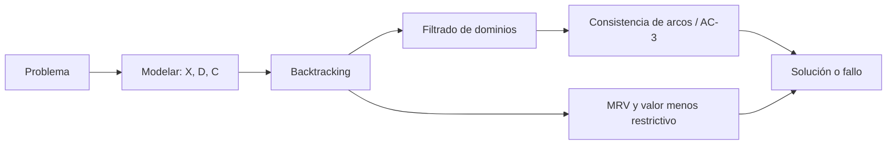
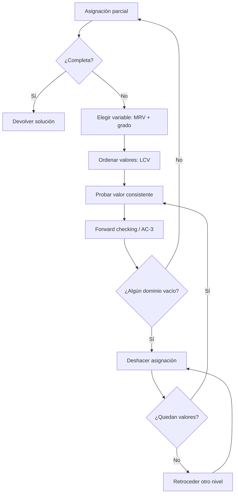

# Clase 5 — CSP: modelado, backtracking y propagación de restricciones

![[AI 5 Problemas de satisfacción de restricciones.pdf]]

## Pregunta central

¿Cómo modelar y resolver problemas en los que importa encontrar una **asignación completa que satisfaga restricciones**, más que el camino utilizado para llegar a ella?

> [!summary] Respuesta breve
> Un problema de satisfacción de restricciones o **CSP** se describe mediante variables $X_1,\ldots,X_n$, el dominio $D_i$ de cada variable y restricciones que indican qué combinaciones son válidas. Se resuelve normalmente con búsqueda en profundidad especializada (**backtracking**), evitando asignaciones inconsistentes, propagando restricciones para reducir dominios y eligiendo con cuidado la siguiente variable y el orden de sus valores.

## Ruta conceptual



---

## 1. ¿Por qué Sudoku cambia el tipo de búsqueda?

Hasta esta clase se habían usado supuestos clásicos: un solo agente, acciones deterministas, observabilidad total y estados discretos. En BFS, DFS, costo uniforme o A*, el **camino** y su costo suelen importar. En Sudoku ocurre algo diferente:

- la respuesta importante es el tablero final válido;
- cualquier solución completa asigna las mismas casillas, por lo que todos los caminos tienen esencialmente la misma profundidad;
- muchas secuencias de asignaciones representan la misma solución porque asignar primero $X$ y luego $Y$ equivale a hacerlo en el orden contrario si no hay conflicto.

Por eso conviene explotar la estructura interna del problema en vez de tratar cada tablero parcial como un estado opaco.

| Búsqueda de caminos | CSP |
|---|---|
| Importa cómo se llega a la meta | Importa la asignación final |
| Los caminos pueden tener costos distintos | Las asignaciones suelen tener costo uniforme |
| La expansión genera acciones generales | Cada paso asigna una variable |
| La prueba reconoce un estado objetivo | Exige completitud y todas las restricciones |

## 2. Definición formal de un CSP

Un CSP se representa como la terna

$$
\langle X,D,C\rangle,
$$

donde:

- $X=\{X_1,\ldots,X_n\}$ es el conjunto de **variables**;
- $D=\{D_1,\ldots,D_n\}$ contiene el **dominio** $D_i$ de cada variable;
- $C=\{C_1,\ldots,C_m\}$ es el conjunto de **restricciones**.

Una **asignación parcial** da valores solo a algunas variables. Es **consistente** si no viola ninguna restricción aplicable. Una **solución** es una asignación completa y consistente.

> [!important] Diferencia esencial
> Un dominio enumera lo que una variable *podría* valer por sí sola; las restricciones determinan qué combinaciones de valores pueden coexistir.

El siguiente explorador permite modificar asignaciones y observar cuándo aparece un conflicto:

<iframe src="../../inteligencia_artificial/recursos/csp-formulacion.htm" style="width:100%;height:600px;border:1px solid var(--lightgray);border-radius:4px;" loading="lazy"></iframe>

En el mapa, una variable representa cada región y la restricción binaria exige colores distintos entre vecinas. En 4-reinas, una variable por columna elimina de entrada la posibilidad de colocar dos reinas en la misma columna; todavía deben imponerse las restricciones de fila y diagonal.

## 3. Ejemplos de formulación

### 3.1 Sudoku

- **Variables:** una $X_{rc}$ por cada casilla vacía, en la fila $r$ y columna $c$.
- **Dominio inicial:** $D(X_{rc})=\{1,\ldots,9\}$, reducido por los números ya presentes.
- **Restricciones:** todos los valores de cada fila, columna y región $3\times3$ deben ser diferentes.

Pueden escribirse 27 restricciones globales `AllDifferent`: nueve filas, nueve columnas y nueve subcuadros. Una asignación como $X_{2,5}=7$ propaga información a todas las casillas que comparten fila, columna o bloque.

### 3.2 Coloreado de mapas

Para el mapa de Australia:

$$
X=\{WA,NT,Q,NSW,V,SA,T\},\qquad D_i=\{R,V,A\}.
$$

Cada frontera crea una restricción binaria, por ejemplo

$$
WA\ne NT,\quad WA\ne SA,\quad NT\ne SA,\quad SA\ne Q.
$$

Una restricción puede expresarse:

- **intensionalmente o de forma implícita:** mediante una regla como $WA\ne NT$;
- **extensionalmente o de forma explícita:** enumerando parejas permitidas, como $(R,V),(R,A),(V,R),\ldots$.

> [!note] Precisión de terminología
> «$estado_1\in verde$» no describe correctamente una restricción explícita. Una restricción extensional lista tuplas admitidas; una intensional las define con una relación o fórmula.

### 3.3 Criptoaritmética: TWO + TWO = FOUR

- **Variables:** $T,W,O,F,U,R$ y acarreos $C_1,C_2,C_3$.
- **Dominios:** letras en $\{0,\ldots,9\}$; acarreos en $\{0,1\}$.
- **Restricciones:** letras diferentes usan dígitos diferentes; $T\ne0$, $F\ne0$ y, por columnas:

$$
\begin{aligned}
O+O &= R+10C_1,\\
W+W+C_1 &= U+10C_2,\\
T+T+C_2 &= O+10C_3,\\
C_3 &= F.
\end{aligned}
$$

Una solución es $T=7,W=3,O=4,F=1,U=6,R=8$, pues $734+734=1468$.

### 3.4 N-reinas

Una formulación compacta usa una variable $Q_i$ por columna; $Q_i$ indica la fila de la reina de esa columna:

$$
D(Q_i)=\{1,\ldots,n\}.
$$

Para toda pareja $i\ne j$:

$$
Q_i\ne Q_j
\qquad\text{y}\qquad
|Q_i-Q_j|\ne|i-j|.
$$

La primera desigualdad impide compartir fila; la segunda impide compartir diagonal.

## 4. Tipos de variables y restricciones

### Según el dominio

- **Discretas finitas:** colores, booleanos, dígitos. Con $n$ variables y dominios de tamaño $d$, la búsqueda ingenua considera hasta $d^n$ asignaciones.
- **Discretas infinitas:** enteros o cadenas; por ejemplo, horas de inicio sin cota fijada.
- **Continuas:** valores reales. Si restricciones y objetivo son lineales se relacionan con programación lineal; si no, con optimización no lineal.

### Según la aridad

- **Unaria:** involucra una variable, como $Ciudad_1\ne azul$.
- **Binaria:** involucra dos, como $Ciudad_1\ne Ciudad_2$.
- **De orden superior o global:** involucra tres o más, como `AllDifferent(X₁,…,X₉)`.

### Fuertes y suaves

- Una restricción **fuerte** debe cumplirse; de lo contrario la asignación no es solución.
- Una restricción **suave** expresa preferencia o costo, como «rojo es preferible a verde». Entonces se busca la mejor asignación factible, lo que conduce a CSP ponderados u optimización con restricciones.

## 5. Formulación como problema de búsqueda

- **Estado inicial:** asignación vacía $\{\}$.
- **Estado:** valores asignados hasta ahora.
- **Sucesor:** escoger una variable no asignada y darle un valor consistente.
- **Prueba de meta:** todas las variables están asignadas y todas las restricciones se satisfacen.

Si se permitiera asignar cualquier variable en cada paso, la misma solución aparecería en $n!$ órdenes distintos. Como las asignaciones son **conmutativas**, se fija una variable por nivel. Así, con dominio máximo $d$, el árbol tiene profundidad $n$ y factor de ramificación de hasta $d$, sin permutaciones redundantes.

## 6. Búsqueda con backtracking

El **backtracking** es DFS especializado para CSP:

1. Si la asignación está completa, devolverla.
2. Seleccionar una variable no asignada.
3. Recorrer sus valores en algún orden.
4. Si el valor es consistente, añadirlo a la asignación.
5. Llamar recursivamente.
6. Si la rama falla, retirar la asignación y probar el siguiente valor.
7. Si no queda ningún valor, devolver fallo al nivel anterior.

```text
BACKTRACK(asignación, csp):
    si asignación está completa: devolver asignación
    var ← seleccionar-variable-no-asignada(...)
    para cada valor en ordenar-valores(var, ...):
        si valor es consistente:
            añadir {var = valor}
            resultado ← BACKTRACK(asignación, csp)
            si resultado ≠ fallo: devolver resultado
            retirar {var = valor}
    devolver fallo
```

<iframe src="../../inteligencia_artificial/recursos/csp-backtracking.htm" style="width:100%;height:600px;border:1px solid var(--lightgray);border-radius:4px;" loading="lazy"></iframe>

El retroceso no significa reiniciar. Solo deshace la decisión más reciente que aún tiene alternativas. Revisar restricciones después de cada decisión evita recorrer hasta el fondo ramas que ya son imposibles.

> [!warning] Completo no significa eficiente
> El backtracking sistemático es completo para dominios finitos, pero en el peor caso sigue siendo exponencial. El rendimiento depende mucho del filtrado y del orden de variables y valores.

## 7. Filtrado y propagación de restricciones

El filtrado mantiene el dominio restante de cada variable y elimina valores que ya no pueden participar en una solución.

### Revisión hacia adelante (*forward checking*)

El **filtrado** intenta reducir por anticipado los dominios de las variables no asignadas: elimina valores que, dada la asignación parcial actual, ya sabemos que obligarían a retroceder más adelante.

*Forward checking* es una forma básica de filtrado. Cada vez que se asigna $X_i=x$, revisa las variables no asignadas que comparten una restricción con $X_i$ y elimina de sus dominios los valores incompatibles con $x$. 

![[Pasted image 20260913114848.png]]

(https://inst.eecs.berkeley.edu/~cs188/textbook/csp/filtering.html)

Por ejemplo, en el mapa de Australia, asignar $WA=rojo$ elimina `rojo` de $D(NT)$ y $D(SA)$. Si algún dominio queda vacío, la rama no puede producir una solución y se hace *backtracking* inmediatamente.

Su límite es local: solo propaga desde la variable recién asignada hacia sus vecinas no asignadas. No revisa todavía las restricciones entre dos variables que siguen sin asignar; la consistencia de arcos amplía esa propagación a cambio de realizar más cómputo.

#### Laboratorio interactivo: *forward checking* en N-reinas

En esta representación hay una variable por fila y su dominio contiene las columnas donde todavía puede colocarse una reina. Cada nueva reina elimina de las filas futuras su columna y sus diagonales; si alguna fila se queda sin opciones, la rama se descarta de inmediato y el algoritmo retrocede.

<iframe src="../../inteligencia_artificial/recursos/csp-forward-checking-n-reinas.htm" style="width:100%;height:600px;border:1px solid var(--lightgray);border-radius:4px;" loading="lazy"></iframe>

> [!tip] Qué observar
> Avanza paso a paso y compara el tablero con el árbol. Las casillas descartadas muestran la **poda anticipada**: son decisiones que el algoritmo ya no necesita intentar. Un dominio vacío explica exactamente por qué comienza el *backtracking*.

> [!seealso] Referencias para repasar
> - [[03_Conceptos/Forward checking|Forward checking]]
> - [[03_Conceptos/Problema de las ocho reinas|Problema de las N-reinas]]
> - [[03_Conceptos/Backtracking|Backtracking]] y [[03_Conceptos/Poda del espacio de búsqueda|poda del espacio de búsqueda]]
> - [CS 188 — Filtering](https://inst.eecs.berkeley.edu/~cs188/textbook/csp/filtering.html)
> - [[AI 5 Problemas de satisfacción de restricciones.pdf|Diapositivas de CSP]]
> - [[01_Materias/Inteligencia_Artificial/Recursos/Artificial_inteliigence-A_modern_approach.pdf|Artificial Intelligence: A Modern Approach]], capítulo sobre CSP

### Consistencia de arcos

Para una restricción binaria entre $X$ y $Y$, el arco dirigido $X\to Y$ es consistente si

$$
\forall x\in D(X),\ \exists y\in D(Y)
\quad\text{tal que}\quad C_{XY}(x,y)\text{ se cumple}.
$$

El valor $y$ es un **soporte** para $x$. Si un $x$ no tiene soporte, se elimina de $D(X)$. La dirección importa: $X\to Y$ puede ser consistente aunque $Y\to X$ no lo sea.

> [!seealso] Desarrollo detallado
> Antes de estudiar el algoritmo completo, revisa [[03_Conceptos/Consistencia de arcos|Consistencia de arcos]] para fijar las ideas de dirección y soporte.

<iframe src="../../inteligencia_artificial/recursos/csp-consistencia-arcos.htm" style="width:100%;height:600px;border:1px solid var(--lightgray);border-radius:4px;" loading="lazy"></iframe>

### AC-3 paso a paso

1. Insertar en una cola todos los arcos dirigidos.
2. Extraer un arco $(X_i,X_j)$.
3. Eliminar de $D(X_i)$ cada valor sin soporte en $D(X_j)$.
4. Si $D(X_i)$ cambió, volver a encolar los arcos $(X_k,X_i)$ de sus otros vecinos, pues perdieron posibles soportes.
5. Si algún dominio queda vacío, declarar inconsistencia.
6. Terminar cuando la cola quede vacía.

```text
AC-3(csp):
    cola ← todos los arcos del csp
    mientras cola no esté vacía:
        (Xi, Xj) ← extraer(cola)
        si REVISAR(Xi, Xj):
            si D(Xi) está vacío: devolver fallo
            para cada Xk vecino de Xi, Xk ≠ Xj:
                añadir (Xk, Xi) a cola
    devolver csp con dominios reducidos
```

Para dominio máximo $d$ y $e$ arcos, una cota usual de AC-3 es $O(ed^3)$. Reducir dominios antes o durante la búsqueda puede ahorrar una gran cantidad de ramificaciones.

#### Visualización: propagación mediante la cola de AC-3

La cadena $X<Y<Z$ muestra por qué un arco debe volver a la cola: reducir $D(Y)$ puede hacer que valores de $D(X)$ pierdan el soporte que tenían cuando $X\to Y$ se revisó por primera vez.

<iframe src="../../inteligencia_artificial/recursos/csp-ac3-propagacion.htm" style="width:100%;height:600px;border:1px solid var(--lightgray);border-radius:4px;" loading="lazy"></iframe>

> [!tip] Orden de lectura
> Sigue un valor eliminado de derecha a izquierda: primero cambia $D(Y)$ por la restricción con $Z$ y después ese cambio obliga a revisar de nuevo $X\to Y$.

#### Caso aplicado: coloreo de un mapa

Ahora traslada la misma idea a un subproblema de cuatro regiones. **SA** ya está fijada en azul y cada arista significa «colores distintos». Avanza un paso a la vez: la flecha marca el arco dirigido actual, los puntos muestran los dominios y el registro explica cada poda y reinserción.

<iframe src="../../inteligencia_artificial/recursos/csp-ac3-mapa-australia.htm" style="width:100%;height:600px;border:1px solid var(--lightgray);border-radius:4px;" loading="lazy"></iframe>

> [!tip] Qué observar
> Distingue siempre $X_i\to X_j$ de $X_j\to X_i$: revisar una dirección solo elimina valores de $D(X_i)$. Si ese dominio cambia, AC-3 vuelve a poner en la cola los arcos de otros vecinos que apuntan hacia $X_i$.

> [!seealso] Para estudiar con detalle
> Consulta [[03_Conceptos/Algoritmo AC-3|Algoritmo AC-3]], donde se justifican las reinserciones, se explica la complejidad y se reúnen las referencias de Berkeley, Russell–Norvig y Mackworth.

### Qué puede ocurrir después de propagar

- Todos los dominios son unitarios: se obtuvo una solución.
- Quedan varios valores: todavía hace falta búsqueda.
- Aparece un dominio vacío: esa rama no tiene solución.
- Todos los arcos son consistentes y aun así el CSP global podría no tener solución.

> [!important] Consistencia local ≠ solución global
> AC-3 descarta valores imposibles por relaciones binarias locales, pero no decide todos los CSP. Normalmente se combina con backtracking: decidir, propagar y retroceder si aparece un dominio vacío.

## 8. Ordenamiento: buscar primero donde más informa

### MRV: variable más restringida

Elegir la variable no asignada con el menor dominio restante:

$$
X^*=\arg\min_{X\text{ no asignada}}|D(X)|.
$$

Es la estrategia **fail first**: si una variable está a punto de quedarse sin opciones, conviene descubrirlo ahora.

### Heurística de grado

Si varias variables empatan en MRV, elegir la que participa en más restricciones con otras variables no asignadas. Esa decisión tiene mayor capacidad de propagación.

### LCV: valor menos restrictivo

Para la variable elegida, probar primero el valor que elimina menos opciones de los dominios vecinos. Así se conserva flexibilidad para completar la solución.

| Decisión | Heurística | Pregunta |
|---|---|---|
| Elegir variable | MRV | ¿Cuál tiene menos valores disponibles? |
| Desempatar variable | Grado | ¿Cuál restringe a más vecinas? |
| Elegir valor | LCV | ¿Cuál deja más opciones a las demás? |

MRV intenta encontrar pronto el fallo; LCV intenta que la rama elegida sobreviva. No se contradicen porque actúan en momentos distintos.

### Primero: distinguir las dos decisiones

La primera pestaña compara tamaños de dominio para elegir una variable con MRV. La segunda mantiene fija la variable $Q$ y compara cuánto poda cada color para elegir un valor con LCV.

<iframe src="../../inteligencia_artificial/recursos/csp-mrv-lcv-fundamentos.htm" style="width:100%;height:600px;border:1px solid var(--lightgray);border-radius:4px;" loading="lazy"></iframe>

> [!important] Regla mental
> **MRV elige la variable; LCV ordena sus valores.** El filtrado ocurre antes o de forma provisional para medir los dominios que ambas heurísticas utilizan.

### Después: laboratorio completo de MRV y LCV

Este visualizador resuelve el coloreado del mapa de Australia y muestra simultáneamente el **grafo de restricciones**, el **árbol de búsqueda** y el **registro de decisiones**. Al activar o desactivar MRV y LCV se puede comparar cómo cambia el orden de exploración; los controles permiten reproducir el proceso completo o avanzar paso a paso.

<iframe src="../../inteligencia_artificial/recursos/csp-mrv-lcv.htm" style="width:100%;height:600px;border:1px solid var(--lightgray);border-radius:4px;" loading="lazy"></iframe>

> [!tip] Qué observar
> **MRV** cambia qué región se asigna a continuación; **LCV** ordena los colores según las opciones que quitan a las vecinas. Reinicia después de cambiar una heurística. En estados simétricos varios colores pueden empatar: ese empate también es un resultado correcto.

> [!seealso] Referencias para repasar
> - [[03_Conceptos/Heurística MRV|Heurística MRV]]
> - [[03_Conceptos/Valor menos restrictivo|Valor menos restrictivo (LCV)]]
> - [[03_Conceptos/Backtracking|Backtracking]]
> - [CS 188 — Ordering](https://inst.eecs.berkeley.edu/~cs188/textbook/csp/ordering.html)
> - [[AI 5 Problemas de satisfacción de restricciones.pdf|Diapositivas de CSP]]
> - [[01_Materias/Inteligencia_Artificial/Recursos/Artificial_inteliigence-A_modern_approach.pdf|Artificial Intelligence: A Modern Approach]], capítulo sobre CSP

## 9. Esquema integrado del solucionador



La secuencia mental útil es:

> **Modelar → elegir → asignar → propagar → detectar fallo → retroceder.**

## 10. Ejemplo completo de propagación

Sean $A,B,C\in\{1,2,3\}$ con $A<B$ y $B<C$.

1. Inicialmente $D(A)=D(B)=D(C)=\{1,2,3\}$.
2. En $A\to B$, $A=3$ no tiene soporte; queda $D(A)=\{1,2\}$.
3. En $B\to A$, $B=1$ no tiene soporte; queda $D(B)=\{2,3\}$.
4. En $B\to C$, $B=3$ no tiene soporte; queda $D(B)=\{2\}$.
5. Como $D(B)$ cambió, se revisan otra vez los arcos relacionados: queda $D(A)=\{1\}$ y $D(C)=\{3\}$.

La propagación obtiene la solución única:

$$
(A,B,C)=(1,2,3).
$$

## 11. Aplicaciones y herramientas

Aplicaciones: calendarización de clases, turnos y trabajos; asignación de personas, máquinas o frecuencias; transporte y logística; planeación de producción; configuración de productos y diseño de circuitos.

Herramientas mencionadas: **MiniZinc, OR-Tools, CPLEX, Gurobi, Gecode y Chuffed**. Algunas son modeladores o solucionadores de programación por restricciones y otras se orientan a optimización matemática, pero todas permiten expresar decisiones sujetas a restricciones.

## 12. Errores comunes

- Confundir **dominio** con **restricción**: el dominio es local; la restricción relaciona valores.
- Aceptar una asignación solo porque es completa: también debe ser consistente.
- Creer que forward checking y AC-3 son iguales: AC-3 propaga entre variables aún no asignadas.
- Creer que consistencia de arcos garantiza una solución: es local, no global.
- Elegir primero la variable con más valores: MRV propone lo contrario.
- Confundir «variable más restringida» con «valor menos restrictivo»: una elige variable; la otra ordena valores.

## Resumen después de clase

Un CSP representa explícitamente variables, dominios y restricciones, y busca una asignación completa válida en lugar de optimizar el camino recorrido. Backtracking elimina permutaciones redundantes al asignar una variable por nivel y retrocede cuando una decisión no puede completarse. Forward checking y AC-3 reducen dominios para detectar fallos antes; MRV, grado y LCV mejoran el orden de exploración. Sudoku, coloreado de mapas, criptoaritmética y N-reinas comparten esta estructura.

## Preguntas de autoevaluación

1. ¿Por qué una asignación parcial consistente todavía puede conducir a un callejón sin salida?
2. ¿Qué diferencia hay entre revisar $X\to Y$ y revisar $Y\to X$?
3. ¿Por qué se vuelven a encolar arcos cuando AC-3 reduce un dominio?
4. ¿En qué sentido MRV sigue el principio *fail first*?
5. ¿Por qué LCV puede ser útil después de elegir la variable más restringida?
6. Formula un horario de tres materias como $\langle X,D,C\rangle$.

## Conceptos para extraer

- [[03_Conceptos/Problema de satisfacción de restricciones|Problema de satisfacción de restricciones]]
- [[03_Conceptos/Backtracking|Backtracking]]
- [[03_Conceptos/Forward checking|Forward checking]]
- [[03_Conceptos/Consistencia de arcos|Consistencia de arcos]]
- [[03_Conceptos/Algoritmo AC-3|Algoritmo AC-3]]
- [[03_Conceptos/Heurística MRV|Heurística MRV]]
- [[03_Conceptos/Valor menos restrictivo|Valor menos restrictivo]]

## Referencias mencionadas

- [[AI 5 Problemas de satisfacción de restricciones.pdf|Diapositivas de la clase]]
- Russell y Norvig, *Artificial Intelligence: A Modern Approach*, capítulo sobre CSP.

## Acciones adicionales

- [ ] Formular un Sudoku reducido $4\times4$ como CSP.
- [ ] Ejecutar manualmente AC-3 sobre un ejemplo de coloreado de mapas.
- [ ] Comparar backtracking puro, MRV y MRV + propagación.
