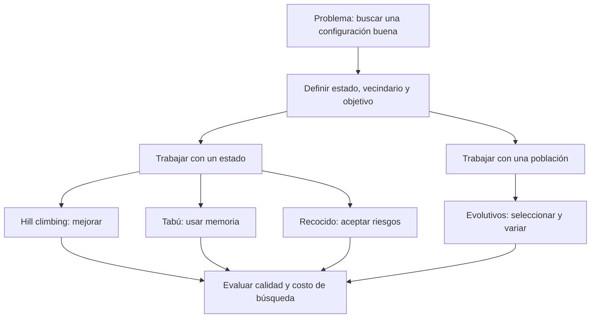
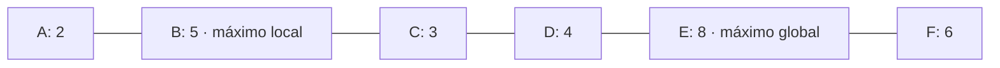
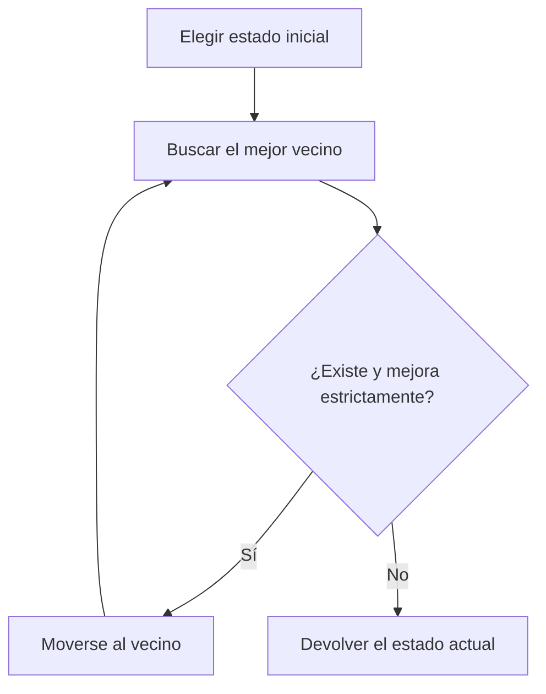
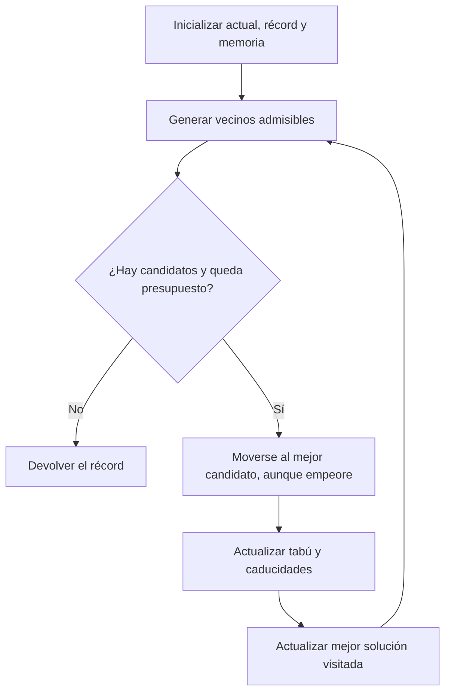
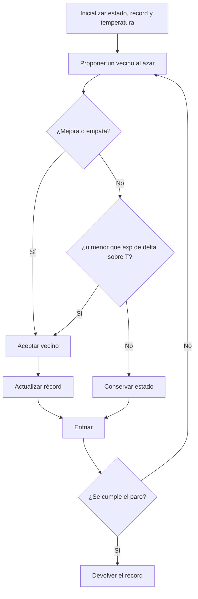
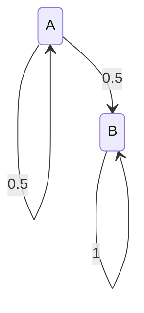
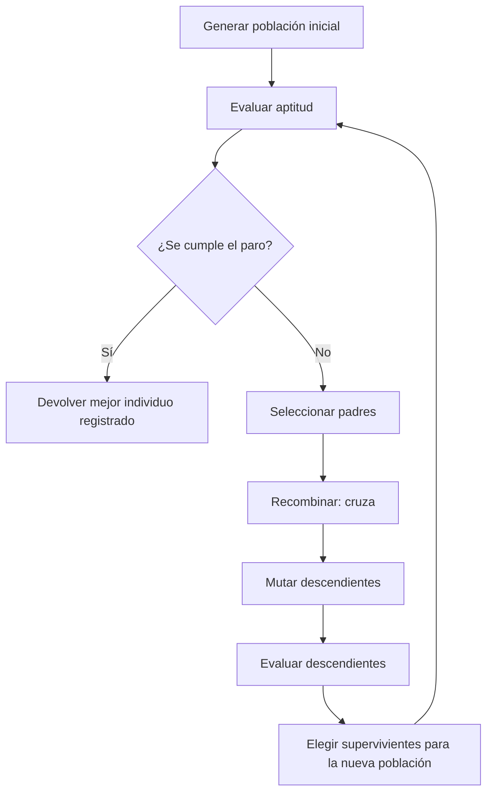
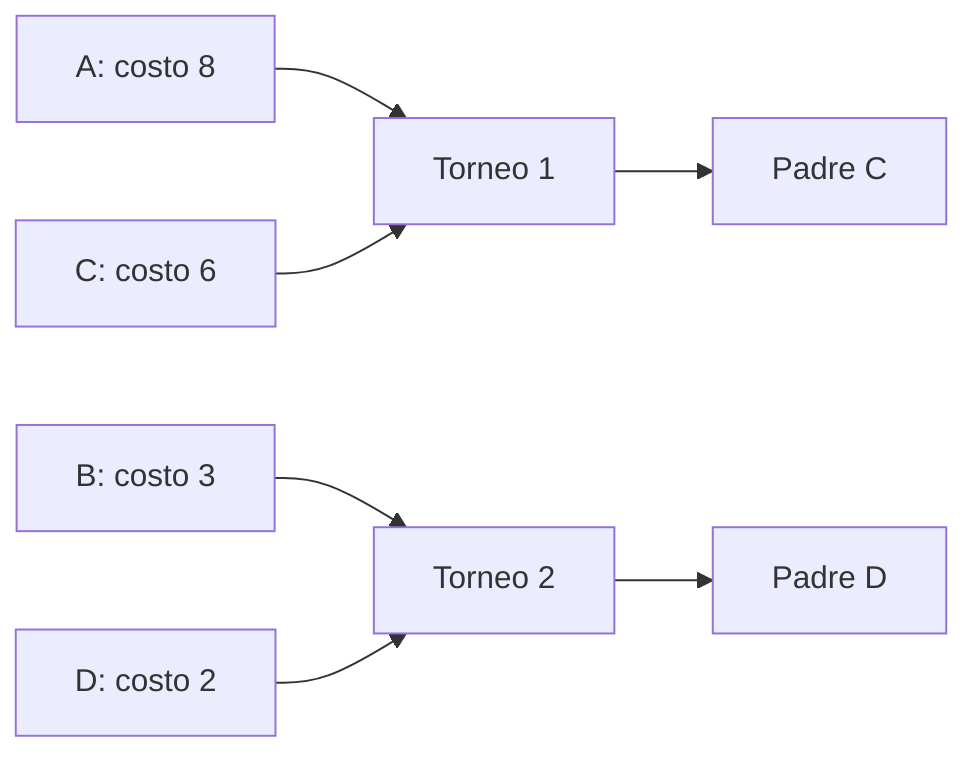
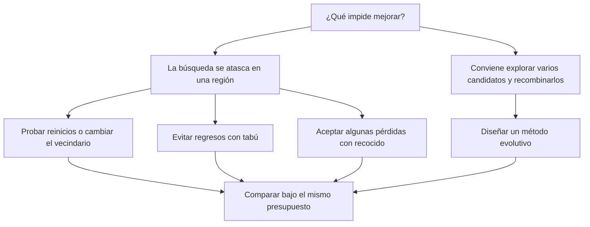

# Clase 6 · Búsqueda local y metaheurísticas


![[AI 6 Metaheuristicas.pdf]]
## Pregunta central

¿Cómo encontrar una buena configuración cuando el espacio de posibilidades es enorme y mejorar una solución completa resulta más práctico que construir todo un árbol de búsqueda?

> [!summary] 💎 Gem · La idea de la clase
> Partimos de una configuración y buscamos mejorarla. **Hill climbing** acepta mejoras; **tabú** usa memoria para evitar regresos; **recocido simulado** acepta algunos empeoramientos según una temperatura; los **evolutivos** mantienen una población y producen nuevas soluciones mediante selección y variación.

**Cómo estudiar esta nota:** primero entiende estado, vecindario y objetivo; después compara las tres búsquedas de un estado; finalmente recorre una generación de un algoritmo genético. Los recuadros 💎 son las “gems”: ideas breves para recordar.

**Fuente y alcance:** se integra el contenido de las 23 diapositivas de [[AI 6 Metaheuristicas.pdf]], incluidos el quiz y las figuras. Los ejemplos numéricos, las precisiones y el laboratorio son ampliaciones didácticas; la sección de Markov recupera el apunte tomado durante clase. No se inventan los comentarios orales de la tarea 1, que la diapositiva 1 solo menciona.



## 1. De construir caminos a mejorar configuraciones

*Diapositivas 4–5.* Conecta con [[2026-08-20 IA - Algoritmos de busqueda]] y [[2026-08-27 IA - CSP-Backtracking]].

En una búsqueda de rutas, normalmente interesa la secuencia de acciones que lleva a la meta. En búsqueda local suele importar la **configuración final**: un horario sin choques, una distribución de piezas o una asignación de reinas sin ataques. El algoritmo conserva una configuración completa, aunque todavía viole restricciones, y modifica pequeñas partes de ella.

| Elemento | Significado | Ejemplo: horario de exámenes |
|---|---|---|
| Estado $s$ | Asignación de todas las variables | Cada examen ya tiene horario |
| Vecindario $N(s)$ | Configuraciones alcanzables con un movimiento permitido | Cambiar el horario de un examen |
| Objetivo | Número que permite comparar estados | Número de choques que queremos minimizar |
| Factibilidad | Cumplimiento de todas las restricciones | Ningún alumno tiene dos exámenes simultáneos |
| Criterio de paro | Condición para terminar | Cero choques o presupuesto agotado |

Una **heurística** orienta decisiones usando información del problema. Una **metaheurística** es una estrategia general para organizar la exploración, que se adapta mediante la representación, el objetivo y los movimientos. Hill climbing es la base sencilla con la que comparamos las estrategias más elaboradas.

### 1.1 Satisfacción y optimización

- **Satisfacción:** buscamos cualquier estado factible. Podemos minimizar $C(s)$, el número de restricciones violadas. Si $C(s)=0$, terminamos con una solución.
- **Optimización:** buscamos el mejor valor entre los estados permitidos, por ejemplo minimizar la duración total de un horario ya factible.

> [!tip] 💎 Gem · Completo no significa válido
> Una **asignación completa** da un valor a todas las variables; puede violar restricciones. Un **algoritmo completo** garantiza encontrar una solución cuando existe, bajo las condiciones de su definición. Son usos distintos de “completo”.

### 1.2 Convención de esta nota

Salvo donde se indique lo contrario, **maximizamos** $f(s)$: mayor es mejor. Si el problema minimiza un costo $C(s)$, podemos usar $f(s)=-C(s)$.

$$
\Delta=f(n)-f(s).
$$

Así, $\Delta>0$ es una mejora, $\Delta=0$ es un empate y $\Delta<0$ es un empeoramiento.

> [!warning] Precisión sobre las garantías de los métodos anteriores
> La diapositiva 4 resume garantías que dependen de hipótesis. BFS e IDS son óptimos con costos de paso iguales; costo uniforme necesita condiciones adecuadas sobre los costos; A* depende de su heurística y del manejo de repetidos. DFS y búsqueda voraz no garantizan optimalidad. Backtracking busca factibilidad; optimizar requiere mecanismos adicionales, como ramificación y poda con cotas válidas.

La búsqueda local suele ahorrar memoria porque no conserva una gran frontera ni todo el árbol. No implica que toda implementación sea rápida: evaluar un vecindario puede ser costoso, tabú almacena memoria y los evolutivos almacenan poblaciones. Las versiones prácticas con presupuesto finito normalmente no garantizan encontrar una solución ni el óptimo global.

## 2. El paisaje de búsqueda

Imagina que cada posición es una configuración y la altura es $f(s)$. Los movimientos permitidos determinan qué posiciones son vecinas; una posición cercana en el dibujo no siempre será vecina en un problema real.

- **Máximo global:** ningún estado del espacio tiene mayor valor.
- **Máximo local:** ningún vecino tiene mayor valor, aunque otro estado lejano sí podría tenerlo.
- **Meseta:** región de estados con igual valor. Puede ser una cima plana o un tramo desde el cual todavía se puede subir.
- **Cresta:** en varias dimensiones, la dirección que mejora puede exigir combinar cambios que el vecindario no permite en un solo paso.
- **Cuenca de atracción:** estados iniciales que conducen al mismo óptimo bajo una regla concreta de búsqueda.

Usaremos este **ejemplo didáctico discreto**, distinto de la gráfica del quiz. Solo son vecinos los nodos unidos; maximizamos:



Desde B hay que bajar a C para llegar a E. Este único obstáculo explica por qué aparecen tabú y recocido.

> [!tip] 💎 Gem · Un óptimo local depende del vecindario
> B es máximo local si solo podemos movernos a A o C. Si permitimos saltar de B a E, deja de serlo. Diseñar los movimientos es parte de diseñar el algoritmo.

## 3. Hill climbing: subir hasta no poder mejorar

*Diapositivas 6–7.* La versión presentada elige el **mejor vecino** y exige mejora estricta.

1. Elegir un estado inicial $s$, frecuentemente al azar.
2. Evaluar los vecinos de $s$.
3. Escoger $n\in\arg\max_{v\in N(s)}f(v)$; fijar una regla para desempatar.
4. Si $f(n)>f(s)$, sustituir $s$ por $n$ y repetir.
5. Si no hay vecinos o ninguno mejora, devolver $s$.



### 3.1 Ejemplo paso a paso

| Paso | Actual | Vecinos y valores | Decisión |
|---|---|---|---|
| 0 | A: 2 | B: 5 | Ir a B |
| 1 | B: 5 | A: 2, C: 3 | Parar: ninguno mejora |

Devuelve **B con valor 5**, aunque E vale 8. Desde C, elige B porque 5 supera a 4: también termina en B. Desde D elige E y sí alcanza el óptimo global.

**Ventajas:** sencillo, poca memoria, útil como primera aproximación o refinamiento. **Desventajas:** depende del inicio y del vecindario; se detiene en máximos locales y mesetas. No es completo ni óptimo en general.

En un espacio finito, exigir mejora estricta evita ciclos y asegura que la ejecución termina, pero no que termine bien. Como ampliación, los **reinicios aleatorios** permiten probar otras cuencas; los **movimientos laterales limitados** permiten atravesar algunas mesetas. Ninguna cantidad finita de reinicios garantiza resolver cualquier instancia.

### 3.2 Resolver el quiz X–Y–Z de la diapositiva 7

En el dibujo original, B es la cima pequeña, D inicia una meseta y E es la cima más alta. Interpretamos movimientos locales pequeños sobre la curva:

| Inicio | Qué sucede | Final esperado |
|---|---|---|
| X | Sube hacia la primera cima | B |
| Y | Sube por la derecha del valle hasta la parte plana | Meseta que empieza en D, si solo acepta mejora estricta |
| Z | Sube hacia la izquierda hasta la cima alta | E |

Desde Y, **alcanzar E requiere poder atravesar o saltar la meseta**. Si se permiten movimientos laterales y se logra cruzarla, puede continuar hasta E; no está garantizado solo por permitir empates. La diapositiva no especifica tamaño del paso, vecindario ni desempate, por lo que no determina una única trayectoria formal.

> [!tip] 💎 Gem · “Ya no puedo mejorar” es una afirmación local
> Hill climbing demuestra que sus movimientos inmediatos no mejoran el estado. No demuestra que ya encontró la mejor configuración del problema.

## 4. Búsqueda tabú: memoria para no regresar inmediatamente

*Diapositiva 8.* Conserva una lista $\tau$ de estados o atributos de movimientos prohibidos temporalmente. Elige el mejor vecino **admisible**, incluso cuando es peor que el actual.

### 4.1 Procedimiento

1. Inicializar $s$, guardar `mejor = s` e iniciar la memoria tabú.
2. Construir los vecinos admisibles: en la versión de estados, $N(s)\setminus\tau$.
3. Elegir el de mayor $f$, aunque $f(n)<f(s)$.
4. Moverse a $n$, actualizar la memoria y registrar si mejora el récord.
5. Repetir hasta agotar el presupuesto o cumplir otra condición de paro.
6. Devolver **la mejor solución visitada**, no necesariamente la última.

La diapositiva escribe una lista creciente de visitados. En implementaciones prácticas suele usarse una **tenencia tabú**: tras cierto número de iteraciones una prohibición caduca. También es común prohibir el movimiento inverso en lugar de guardar estados completos. Estas son ampliaciones del esquema de clase.



### 4.2 Ejemplo con memoria de los dos últimos estados

Usamos una cola con capacidad 2, que incluye el actual. Al insertar un tercer estado, sale el más antiguo. Iniciamos en A con $\tau=[A]$.

| Paso | Movimiento | Motivo | Memoria después | Mejor visto |
|---|---|---|---|---|
| 1 | A → B | B es admisible | [A, B] | B: 5 |
| 2 | B → C | A está tabú; se permite bajar de 5 a 3 | [B, C] | B: 5 |
| 3 | C → D | B está tabú | [C, D] | B: 5 |
| 4 | D → E | C está tabú | [D, E] | E: 8 |
| 5 | E → F | D está tabú; se permite bajar | [E, F] | E: 8 |

En F, su único vecino E está tabú. Para este ejemplo paramos y devolvemos E. Una implementación debe definir qué hace si todos los movimientos están prohibidos: detenerse, relajar una prohibición o aplicar otra regla explícita.

Un **criterio de aspiración** puede permitir un movimiento tabú si mejora el récord global. La **intensificación** concentra esfuerzos en regiones prometedoras; la **diversificación** dirige la búsqueda hacia regiones menos exploradas.

> [!tip] 💎 Gem · Memoria y récord cumplen tareas distintas
> La lista tabú ayuda a decidir adónde ir; `mejor` conserva qué devolver. Aceptar un estado peor puede servir para explorar sin perder el mejor resultado encontrado.

**Limitaciones:** una memoria corta puede permitir ciclos posteriores; una muy larga puede bloquear movimientos útiles. No garantiza optimalidad con un presupuesto finito.

## 5. Recocido simulado: aceptar riesgos controlados

*Diapositivas 9–11.* Se inspira en enfriar un material: al principio permite más cambios; después se vuelve más selectivo. Elige un vecino al azar, sin exigir que sea el mejor del vecindario.

### 5.1 Regla de aceptación

Para maximizar y con $T>0$:

$$
P(\text{aceptar }n\mid s)=\min\left(1,\exp\left(\frac{f(n)-f(s)}{T}\right)\right).
$$

- Si mejora, se acepta siempre.
- Si empata, se acepta con probabilidad 1.
- Si empeora, se acepta con probabilidad $e^{\Delta/T}$.
- Para aplicar la probabilidad, generar $u\sim U[0,1)$ y aceptar si $u<p$.

Para **minimizar** costos, el signo cambia:

$$
P(\text{aceptar})=\min\left(1,e^{-(C(n)-C(s))/T}\right).
$$

> [!warning] No mezclar convenciones
> En las diapositivas de recocido, mayor $f$ es mejor. En el torneo de la diapositiva 16 gana el valor menor. Ambos esquemas son válidos; hay que invertir la comparación al cambiar de objetivo.

### 5.2 Ejemplo numérico: salir de B

Estamos en B, con $f(B)=5$, y proponemos C, con $f(C)=3$. Entonces $\Delta=-2$.

| Temperatura | Probabilidad $e^{-2/T}$ | Con $u=0.40$ |
|---|---|---|
| 10 | 0.8187 | Aceptar |
| 2 | 0.3679 | Rechazar |
| 0.5 | 0.0183 | Rechazar |

Una vez en C, proponer D mejora de 3 a 4 y se acepta siempre. Después, proponer E mejora de 4 a 8. Es una **trayectoria posible**, no una secuencia garantizada: la elección del vecino es aleatoria.

### 5.3 Enfriamiento y pseudocódigo

La clase utiliza enfriamiento geométrico:

$$
T_{k+1}=\alpha T_k,\qquad 0<\alpha<1.
$$

Con $T_0=10$ y $\alpha=0.9$, las temperaturas son $10,9,8.1,7.29,\ldots$. Un $\alpha$ cercano a 1 enfría más lentamente. La temperatura debe interpretarse respecto a la **escala de las diferencias de objetivo**: multiplicar $f$ por 100 cambia el comportamiento si no se ajusta T.

```text
s ← estado inicial
mejor ← s
T ← T0
mientras haya presupuesto y T > Tmin:
    si N(s) está vacío: terminar
    n ← vecino elegido al azar
    Δ ← f(n) - f(s)
    si Δ >= 0 o uniforme(0,1) < exp(Δ / T):
        s ← n
        si f(s) > f(mejor): mejor ← s
    T ← α * T
devolver mejor
```



La diapositiva 11 muestra un pseudocódigo que devuelve el **estado actual** al llegar a $T=0$, mientras la 9 dice devolver el **mejor visto**. Aquí usamos la segunda variante para conservar el récord. Con enfriamiento geométrico y aritmética exacta, T no llega a cero en un número finito de pasos: por eso usamos umbral o presupuesto.

### 5.4 ¿Es óptimo con tiempo infinito?

La frase de la diapositiva 10 requiere condiciones: conectividad adecuada del espacio y un calendario de enfriamiento suficientemente lento, entre otras. No convierte cualquier ejecución con $T\leftarrow\alpha T$ en un método con garantía global. AIMA, §4.1.2, explica la convergencia con enfriamiento suficientemente lento; una ejecución práctica finita puede terminar lejos del óptimo.

Con T alta respecto a $|\Delta|$, se aceptan muchos empeoramientos; la búsqueda se aproxima a un paseo aleatorio. Con T muy baja, casi solo se aceptan mejoras y empates. Se parece a un hill climber **con propuestas aleatorias**, no exactamente al que examina todos los vecinos y escoge el mejor.

> [!tip] 💎 Gem · Temperatura no es calidad
> T regula la disposición a aceptar pérdidas. La calidad sigue midiéndose con $f$. Bajar la temperatura no mejora por sí mismo el estado actual.

### 5.5 Laboratorio: comparar decisiones sobre el mismo paisaje

Selecciona algoritmo y estado inicial; avanza un movimiento a la vez. El laboratorio usa A–F, el ejemplo discreto de esta nota. En recocido muestra propuesta, probabilidad y sorteo; en tabú muestra la memoria. Cambiar los parámetros reinicia la ejecución.

<iframe src="../../inteligencia_artificial/recursos/busqueda-local-laboratorio.htm" style="width:100%;height:600px;border:1px solid var(--lightgray);border-radius:4px;" loading="lazy"></iframe>

**Idea que debes observar:** desde A, hill climbing se detiene en B; tabú puede atravesar C aunque sea peor; recocido puede aceptar o rechazar esa bajada según T y el sorteo. El récord se conserva aunque el estado actual empeore.

## 6. Cadenas de Markov: cómo describir las transiciones

*Ampliación del apunte oral; no es una sección explícita de las diapositivas.*

Una cadena de Markov modela transiciones entre estados cuando, dado el estado presente, el pasado no agrega información para predecir el siguiente:

$$
P(S_{k+1}=j\mid S_k=i,S_{k-1},\ldots,S_0)
=P(S_{k+1}=j\mid S_k=i).
$$

Un estado **absorbente** satisface $P_{ii}=1$: una vez dentro, no sale. Llegar por primera vez a una meta es un **tiempo de primera llegada**; la meta no tiene que ser absorbente.

### 6.1 Ejemplo pequeño

Desde A pasamos a B con probabilidad $1/2$ o permanecemos en A con probabilidad $1/2$. B es absorbente.



Si $h_A$ es el número esperado de pasos hasta B:

$$
h_B=0,\qquad h_A=1+\tfrac12 h_A+\tfrac12 h_B
\quad\Longrightarrow\quad h_A=2.
$$

El 1 cuenta el paso que acabamos de dar. Es un promedio: una trayectoria puede tardar uno, dos o muchos pasos.

### 6.2 Aplicación a los métodos

| Método | Qué debe contener el estado del modelo |
|---|---|
| Hill climbing con reglas fijas | La configuración; un punto de paro puede representarse con un bucle de probabilidad 1 |
| Tabú | Configuración **y memoria tabú**, incluidas caducidades; también el récord si interviene en aspiración |
| Recocido | A temperatura fija basta la configuración bajo propuestas fijas; con enfriamiento, las probabilidades cambian con el tiempo |
| Evolutivos | La población completa y los parámetros o memoria que afecten la siguiente generación |

Para recocido se puede ampliar el estado con T y, si hace falta, con el índice del calendario. A T positiva, un óptimo normalmente **no es absorbente**, porque aún se puede aceptar salir de él. Que un máximo local sea absorbente para hill climbing no lo convierte en solución global.

> [!tip] 💎 Gem · Si hay memoria, inclúyela en el estado
> Dos ejecuciones tabú pueden estar en la misma configuración y tomar decisiones diferentes porque sus listas son distintas. La configuración sola no describe todo el presente del algoritmo.

## 7. Algoritmos evolutivos: una población de candidatos

*Diapositivas 12–15.* Son una **familia** de métodos inspirados en variación heredable y selección. Un individuo representa una solución candidata, no necesariamente un agente autónomo. La metáfora biológica orienta el diseño, pero la función de aptitud es la que define qué consideramos bueno.

### 7.1 Los cuatro elementos necesarios

| Elemento | Pregunta de diseño | Ejemplo sencillo |
|---|---|---|
| Representación | ¿Cómo codifico una solución? | Una cadena de 6 bits |
| Operadores | ¿Cómo produzco variantes? | Cruza de segmentos y cambio de bits |
| Aptitud | ¿Cómo evalúo su calidad? | Número de unos |
| Selección | ¿Quién se reproduce? | Ganadores de torneos aleatorios |

**Exploración** busca regiones diferentes; **explotación** aprovecha regiones prometedoras. Seleccionar con mucha fuerza puede mejorar rápido, pero reducir diversidad y causar **convergencia prematura**: la población se parece demasiado antes de encontrar algo suficientemente bueno.

### 7.2 Tipos de la diapositiva 14

| Familia | Énfasis típico | Ejemplo didáctico |
|---|---|---|
| Estrategias evolutivas | Vectores reales y mutaciones; pueden adaptar tamaños de paso | Ajustar $(x,y)$ añadiendo perturbaciones |
| Programación evolutiva | Evolución de comportamientos o representaciones, históricamente con énfasis en mutación | Modificar una máquina de estados |
| Algoritmos genéticos | Cromosomas, selección, cruza y mutación | Evolucionar cadenas binarias |

Son tendencias históricas, no fronteras rígidas. El apunte “Berlín → estrategias evolutivas” se conserva como mención contextual de clase; no hace falta para ejecutar los algoritmos y no se desarrolla históricamente en el PDF.

### 7.3 Ciclo básico y supervivientes



La selección de **padres** decide quién produce descendencia; la selección de **supervivientes** decide quién permanece. Con **elitismo**, se copia al menos el mejor individuo a la siguiente generación: con evaluación fija y copia intacta, el mejor valor no empeora, aunque el promedio sí puede hacerlo. No garantiza alcanzar el óptimo.

Criterios de paro útiles: meta alcanzada, máximo de generaciones, presupuesto de evaluaciones o falta de mejora durante cierto tiempo. La ausencia de mejora no prueba optimalidad.

## 8. Selección por torneo

*Diapositiva 16.* Repetimos pequeños concursos entre individuos seleccionados al azar.

1. Fijar tamaño del torneo $q$ y número de posiciones de padres $\mu$.
2. Elegir $q$ candidatos aleatorios de la población, según una regla de muestreo explícita.
3. Elegir el mejor del torneo.
4. Añadirlo a la **lista** de padres.
5. Repetir hasta completar $\mu$ posiciones.

Usamos $q$ para no confundir el tamaño del torneo con el estado $s$. Un individuo puede ganar más de un torneo: la lista de padres puede contener repeticiones. Aunque la diapositiva usa notación de conjunto, eliminar duplicados cambiaría el procedimiento.

**Ejemplo de minimización, como en la diapositiva:** A tiene costo 8, B costo 3, C costo 6 y D costo 2. Con torneos de tamaño 2, el torneo {A,C} elige C y {B,D} elige D. C gana el suyo sin ser el mejor de toda la población.



Si maximizamos aptitud, gana el **mayor** valor. El torneo es aleatorio por la elección de participantes, aunque el ganador entre ellos se elija determinísticamente. Aumentar su tamaño suele aumentar la presión de selección; con tamaño 1, el padre es simplemente el participante aleatorio.

> [!tip] 💎 Gem · Seleccionar no es ordenar toda la población
> Un torneo puede elegir a alguien que no sea el mejor global. Esa posibilidad ayuda a mantener variedad de padres.

## 9. Representación: cromosoma, gen y alelo

*Diapositiva 17.* La representación binaria es tradicional, pero se pueden usar reales, enteros, permutaciones, árboles y otras estructuras.

- **Cromosoma:** codificación completa de un individuo.
- **Gen:** unidad que representa una variable o característica; en el ejemplo de las diapositivas puede ocupar varios bits.
- **Alelo:** valor que toma un gen; en una codificación por posiciones binarias, los valores posibles de cada posición son 0 y 1.
- **Genotipo:** codificación; **fenotipo:** solución interpretada al decodificarla.

Ejemplo: cromosoma `1001 | 0110`. Si cada bloque codifica un entero sin signo, el primer gen representa $x=9$ y el segundo $y=6$. El cromosoma completo describe $(9,6)$. Hay que fijar los límites de cada gen y cómo se decodifica.

> [!warning] La representación condiciona los operadores
> Una cruza binaria ordinaria no sirve automáticamente para una ruta codificada como permutación: puede repetir ciudades y omitir otras. Se necesitan operadores que preserven la validez, una reparación o un tratamiento explícito de restricciones.

## 10. Cruza de uno o varios puntos

*Diapositiva 18.* La cruza mezcla segmentos de dos padres para producir descendencia.

1. Elegir un punto de corte entre posiciones del cromosoma.
2. Hijo 1 = prefijo del padre 1 + sufijo del padre 2.
3. Hijo 2 = prefijo del padre 2 + sufijo del padre 1.

Ejemplo con corte después del tercer bit:

```text
Padre 1: 111 | 000
Padre 2: 000 | 111
Hijo 1:  111 | 111  → 111111
Hijo 2:  000 | 000  → 000000
```

Si la aptitud es contar unos, los padres valen 3 y 3; los hijos valen 6 y 0. **La cruza puede mejorar a un hijo y empeorar al otro.**

En cruza de dos puntos intercambiamos el segmento entre dos cortes. Con más puntos alternamos el origen de los segmentos. El número de cortes y su posición modifican qué bloques de información se conservan.

> [!tip] 💎 Gem · Recombinar no garantiza mejorar
> La cruza produce candidatos. Solo la evaluación permite saber si la combinación sirve para el objetivo.

## 11. Mutación: introducir variación nueva

*Diapositiva 19.* Para cada posición binaria generamos un número uniforme y cambiamos $0\leftrightarrow1$ si es menor que $P_m$. Las decisiones se toman independientemente en esta versión.

Ejemplo: `000000` cambia su quinto bit y se vuelve `000010`. La aptitud pasa de 0 a 1 si contamos unos. Si mutamos un 1 a 0, podría empeorar.

La diapositiva propone como regla inicial:

$$
P_m=\frac1L,
$$

con $L$ la longitud del cromosoma. El número esperado de bits mutados es:

$$
\mathbb E[M]=LP_m=1.
$$

Eso **no obliga a mutar exactamente un bit**. Para $L=6$:

$$
P(M=0)=\left(\frac56\right)^6\approx0.335,
\qquad
P(M=1)=6\left(\frac16\right)\left(\frac56\right)^5\approx0.402.
$$

El resto de las veces se mutan dos o más. $1/L$ es una elección inicial, no una constante universal; con cromosomas cortos ni siquiera es una probabilidad especialmente pequeña.

> [!tip] 💎 Gem · Cruza combina; mutación puede recuperar valores ausentes
> Si todos los individuos tienen 0 en una posición, la cruza por segmentos no crea un 1 allí. La mutación puede hacerlo y ayudar a recuperar diversidad.

## 12. Una generación genética completa, con números

**Problema de práctica:** maximizar el número de unos en cadenas de longitud 6. El óptimo conocido es `111111`, con aptitud 6. Es un ejemplo para entender operadores; no requiere un algoritmo genético para resolverse eficientemente.

| Individuo inicial | Cromosoma | Aptitud |
|---|---|---|
| A | 111000 | 3 |
| B | 000111 | 3 |
| C | 100000 | 1 |
| D | 000001 | 1 |

1. **Evaluar:** obtenemos las aptitudes de la tabla.
2. **Seleccionar:** un torneo {A,C} elige A; otro {B,D} elige B.
3. **Cruzar:** corte después del tercer bit → hijos `111111` y `000000`.
4. **Mutar:** supongamos que los sorteos dejan intacto el primero y cambian el quinto bit del segundo → `111111` y `000010`.
5. **Evaluar descendientes:** aptitudes 6 y 1.
6. **Elegir supervivientes:** en esta variante didáctica conservamos los cuatro mejores de padres originales y estos dos hijos. Quedan `111111`, `111000`, `000111` y uno de los individuos de aptitud 1, usando un desempate fijo.
7. **Comprobar paro:** ya alcanzamos 6; devolvemos `111111`.

Aquí generamos dos descendientes y conservamos cuatro supervivientes; otros esquemas reemplazan toda la población. Los sorteos están fijados para ilustrar una generación: otra ejecución puede tardar más o no llegar al óptimo dentro de su presupuesto.

## 13. Aplicaciones y límites de la metáfora evolutiva

*Diapositivas 20–21.* Las diapositivas mencionan diseño de circuitos, programación de trabajos y evolución de arquitecturas de redes. La nota de la página 20 subraya que su utilidad debe juzgarse por resultados, no solo por lo atractiva que resulta la metáfora de la evolución.

| Aplicación mencionada | Qué se evoluciona | Ejemplo de evaluación |
|---|---|---|
| Programación genética | Programas o árboles de expresiones | Error al producir las salidas deseadas |
| Aprendizaje automático evolutivo | Modelos, reglas, atributos o parámetros | Desempeño en validación |
| Neuroevolución | Pesos, arquitecturas u otros componentes de redes | Calidad predictiva y costo del modelo |

**Programación evolutiva** es una familia histórica; **programación genética** suele evolucionar programas. No son sinónimos.

La clase sugiere tabú y recocido para problemas discretos/combinatorios, y evolutivos para continuos o mixtos. Son orientaciones, no prohibiciones: también hay recocido continuo y algoritmos genéticos combinatorios. Importan la representación, el vecindario, la evaluación y el presupuesto.

## 14. No free lunch: no hay un ganador universal

*Diapositiva 22.* En el marco clásico de optimización sobre espacios finitos, promediando uniformemente sobre todas las funciones objetivo y bajo las condiciones del teorema, los algoritmos de búsqueda sin reevaluar puntos tienen el mismo desempeño promedio. Una ventaja en unas funciones se compensa con desventajas en otras. Véase la [explicación de Wolpert sobre los teoremas No Free Lunch](https://arxiv.org/abs/2007.10928).

**Ejemplo intuitivo, no demostración:** si sabemos que las configuraciones parecidas suelen tener calidades parecidas, la búsqueda local puede aprovechar esa estructura. Si no existe esa relación, el supuesto de que conviene explorar cerca del mejor estado pierde utilidad.

> [!tip] 💎 Gem · Elegir un algoritmo es elegir qué estructura aprovechar
> El teorema no dice que todos rindan igual en tu problema. Invita a justificar los supuestos y comparar con datos de la familia de problemas que realmente importa.

Para una comparación útil: mismo presupuesto de evaluaciones, varias semillas cuando hay azar, mismas instancias y registro de mejor valor, variabilidad, factibilidad, tiempo y memoria. Una ejecución afortunada no basta para declarar un ganador.

## 15. Comparación para repasar

| Método | Qué mantiene | Cómo propone o elige | ¿Acepta empeorar? | Riesgo principal |
|---|---|---|---|---|
| Hill climbing de clase | Estado actual | Mejor vecino | No | Quedarse en un óptimo local o meseta |
| Tabú | Estado, récord y memoria | Mejor vecino admisible | Sí | Prohibiciones mal ajustadas |
| Recocido | Estado, temperatura y récord en esta variante | Vecino al azar | Con probabilidad dependiente de T | Enfriamiento inadecuado |
| Evolutivos | Población y mejor registrado | Selección y operadores | Puede producir y conservar individuos peores | Pérdida de diversidad y evaluaciones costosas |



## 16. Preguntas de autoevaluación

1. ¿Por qué B es máximo local pero no global en el ejemplo A–F?
2. ¿Qué devuelve hill climbing al iniciar en C? ¿Y en D?
3. ¿Por qué tabú acepta B → C y conserva B como récord?
4. Si maximizas y $\Delta=-3$, ¿cuál es la aceptación con $T=3$?
5. ¿Por qué no basta representar tabú únicamente por su configuración actual?
6. En un torneo con costos 7, 4 y 9, ¿quién gana? ¿Qué cambia si son aptitudes a maximizar?
7. Cruza `101100` y `010011` después de la segunda posición.
8. Si $L=20$ y $P_m=1/L$, ¿cuántos bits se mutan en promedio? ¿Cuántos obligatoriamente?
9. ¿El elitismo garantiza que aumente la aptitud promedio?
10. ¿No free lunch impide que un algoritmo sea muy bueno para una familia concreta?

> [!success]- Respuestas razonadas
> 1. Sus vecinos A y C son peores, pero E vale más.
> 2. Desde C elige B y se detiene; desde D llega a E.
> 3. C es el mejor admisible cuando A está tabú. El récord sigue siendo B porque 5 > 3.
> 4. $e^{-3/3}=e^{-1}\approx0.3679$.
> 5. La próxima decisión depende también de la lista y sus caducidades.
> 6. Minimización: 4. Maximización: 9.
> 7. `10|1100` y `01|0011` producen `100011` y `011100`.
> 8. Uno en promedio; ninguno obligatoriamente. Pueden cambiar cero, uno o varios.
> 9. No; protege el mejor individuo bajo las condiciones indicadas, no el promedio.
> 10. No. El promedio del teorema abarca todas las funciones de su marco; una familia real puede tener estructura aprovechable.

## 17. Cobertura del material y referencias

| Diapositivas | Contenido | Dónde se desarrolla |
|---|---|---|
| 1–3 | Comentarios de tarea, portada y agenda | Alcance y mapa inicial |
| 4–5 | Métodos previos, búsqueda local, satisfacción y optimización | §1–2 |
| 6–7 | Hill climbing y quiz X–Y–Z | §3 |
| 8 | Tabú | §4 |
| 9–11 | Recocido, temperatura y algoritmo | §5 |
| 12–15 | Evolutivos, elementos, tipos y ciclo | §7 |
| 16 | Torneo | §8 |
| 17 | Representación | §9 |
| 18–19 | Cruza y mutación | §10–12 |
| 20–21 | Notas prácticas y aplicaciones | §13 |
| 22 | No free lunch | §14 |
| 23 | Siguiente tema: búsqueda con adversarios | Cierre |

- **Fuente de clase:** [[01_Materias/Inteligencia_Artificial/Recursos/AI 6 Metaheuristicas.pdf|AI 6 Metaheurísticas]].
- **Consulta complementaria disponible en el vault:** [[Artificial_inteliigence-A_modern_approach.pdf|Artificial Intelligence: A Modern Approach]], §4.1 para búsqueda local, recocido y evolutivos; §13.4.2 para cadenas de Markov.
- **Precisión complementaria:** [David H. Wolpert, What is important about the No Free Lunch theorems?](https://arxiv.org/abs/2007.10928).

## Resumen después de clase

La búsqueda local modifica configuraciones completas mediante un vecindario y una función objetivo. Hill climbing es sencillo, pero puede detenerse en óptimos locales; tabú usa memoria y recocido usa aceptación probabilística para ampliar la exploración. Los algoritmos evolutivos trabajan con poblaciones y requieren representación, aptitud, selección y operadores adecuados. El desempeño depende del problema y del presupuesto, por lo que la metáfora del algoritmo no sustituye la evaluación. La siguiente clase introduce **búsqueda con adversarios**.

## Acciones adicionales

- [ ] Repetir el laboratorio desde A, C y D y explicar la diferencia entre estado actual y récord.
- [ ] Resolver las preguntas antes de abrir las respuestas.
- [ ] Practicar una generación genética con otros sorteos y otro punto de cruza.
