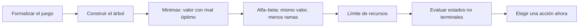
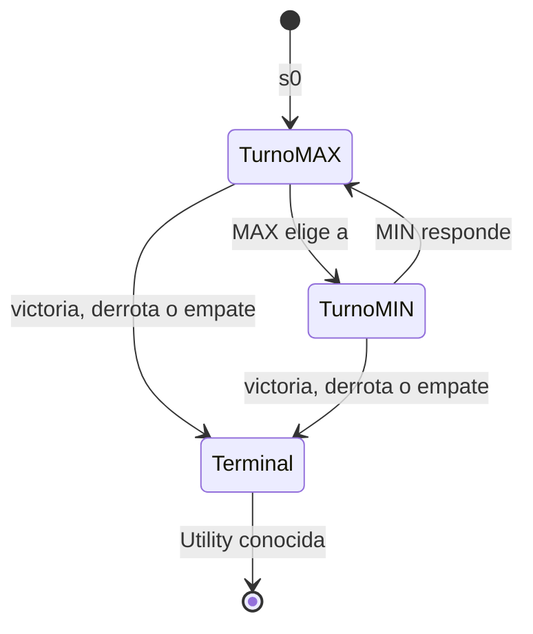
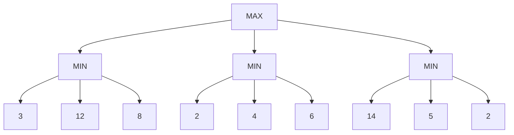
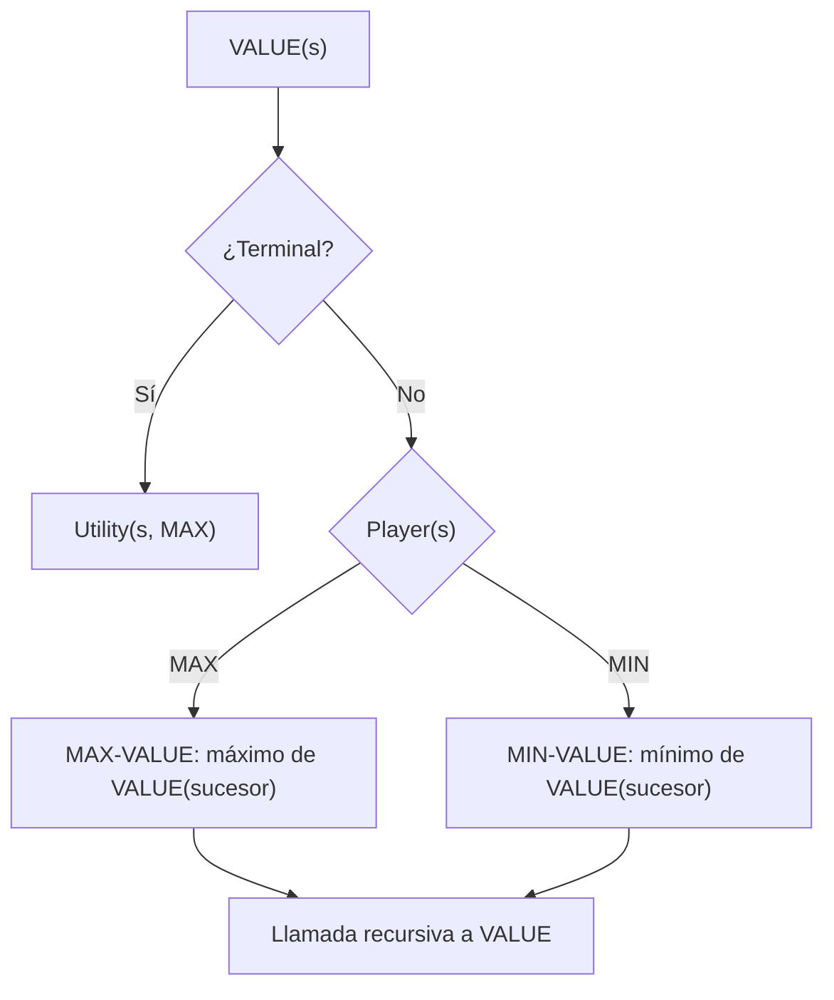
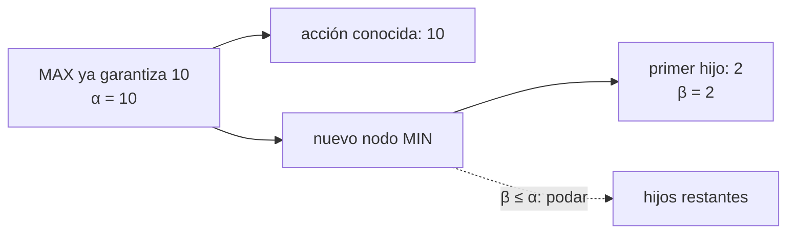
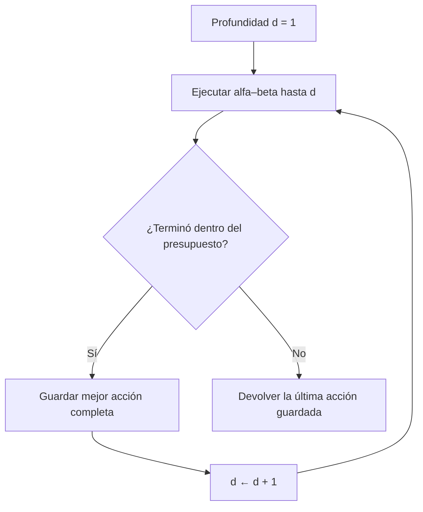
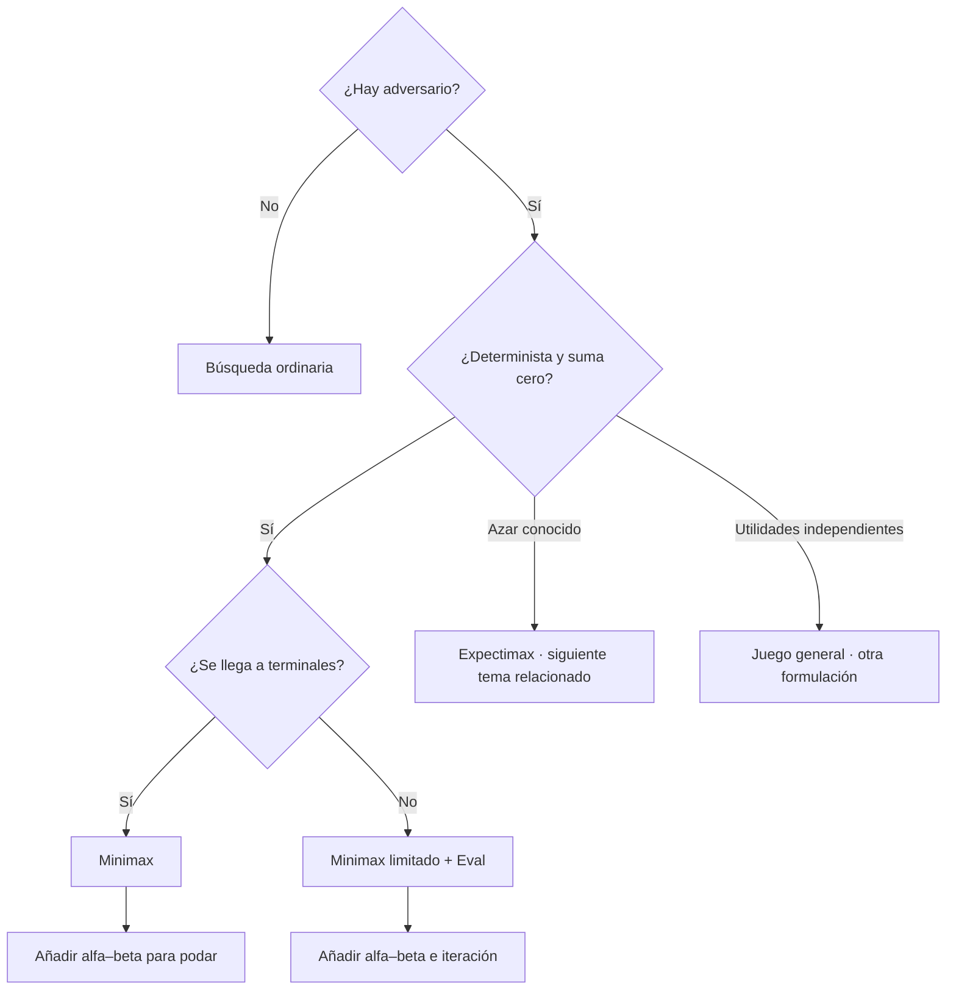

# Clase 7 Búsqueda con adversarios: minimax, alfa–beta y evaluación

![[AI 7 Búsqueda con adversarios.pdf]]

## Pregunta central

¿Cómo elegir una acción cuando el resultado no depende solo de mí, sino también de un oponente que intenta perjudicarme?

> [!summary] Respuesta breve
> En un juego determinista, de suma cero y con información perfecta, **minimax** asigna a cada estado el resultado que MAX puede garantizar si MIN responde óptimamente. Los valores se calculan desde las hojas hacia la raíz: MAX conserva máximos y MIN conserva mínimos. La **poda alfa–beta** evita ramas que ya no pueden cambiar la decisión, y las **funciones de evaluación** estiman posiciones no terminales cuando no hay recursos para llegar al final.

**Cómo estudiar esta nota:** formaliza primero el juego, identifica quién controla cada nivel y practica la propagación minimax. Después aprende qué significan $\alpha$ y $\beta$; solo entonces recorre la poda. Al final estudia la búsqueda con profundidad limitada y las funciones de evaluación.

**Fuente y alcance:** la nota integra las 29 diapositivas del PDF *AI 7 Búsqueda con adversarios* y amplía sus explicaciones con [CS 188, capítulos 3.1–3.2](https://inst.eecs.berkeley.edu/~cs188/textbook/). Los árboles numéricos de minimax y alfa–beta provienen de las diapositivas 17 y 24. Los laboratorios, las tablas de seguimiento y las precisiones son ampliaciones didácticas. La diapositiva 1 solo menciona “Dudas de tarea 1”; como no contiene las dudas concretas, aquí no se inventan.



---

## 1. De una búsqueda ordinaria a una búsqueda con adversarios

En las búsquedas anteriores, el agente controlaba todas sus decisiones y el ambiente respondía mediante un modelo de transición conocido. El algoritmo podía producir un **plan**, es decir, una secuencia de acciones. En un juego, después de nuestra acción aparece una decisión ajena: no podemos fijar de antemano todo el camino.

| Búsqueda de un agente | Búsqueda con adversarios |
|---|---|
| El agente selecciona todas las acciones del plan | Cada jugador controla solo sus propios turnos |
| Se busca una ruta hacia una meta | Se compara el resultado de distintas respuestas posibles |
| Una solución puede ser una secuencia fija | La solución es una **estrategia** condicionada al estado |
| El valor suele venir del costo del camino | El valor viene de utilidad terminal o de una evaluación |

Una estrategia del jugador $i$ puede escribirse como

$$
\pi_i(s)\in Actions(s),\qquad \text{cuando }Player(s)=i.
$$

No dice “siempre juega a la izquierda”; dice qué acción tomar **para cada estado que pudiera alcanzarse**. Durante una partida solo se ejecuta una rama, pero para elegirla se razona sobre muchas respuestas posibles.

> [!warning] Precisión sobre el apunte rápido
> Minimax no convierte el problema en la “habitación china” ni es, por sí mismo, un agente reflejo. La acción finalmente elegida puede verse como una entrada estado $\to$ acción, pero fue calculada mediante deliberación sobre consecuencias y respuestas del rival. Un agente reflejo simple no realiza necesariamente ese razonamiento.

### 1.1 Ejes para clasificar juegos

| Eje | Posibilidades | Consecuencia algorítmica |
|---|---|---|
| Resultado de una acción | Determinista / estocástico | Con azar aparecen nodos de expectativa |
| Información | Perfecta / imperfecta | Con información oculta no basta un estado totalmente observable |
| Jugadores | Dos / más de dos | Puede haber varios turnos y distintas utilidades |
| Relación de utilidades | Suma cero / juego general | En suma cero, lo que gana uno lo pierde el otro |

Esta clase se concentra en juegos **deterministas, por turnos, de dos jugadores, de suma cero y con información perfecta**, como gato, ajedrez y damas bajo su formulación clásica. En un juego de suma cero de dos jugadores puede usarse una sola escala:

$$
U(s,MAX)=-U(s,MIN).
$$

MAX intenta aumentar esa escala y MIN intenta reducirla. Esto es un convenio de nombres, no un juicio sobre quién es “bueno” o “malo”.

---

## 2. Definición formal de un juego

Podemos representar el juego mediante

$$
\mathcal G=\langle S,s_0,P,Player,Actions,Result,Terminal,Utility\rangle.
$$

| Componente | Significado | Ejemplo en gato |
|---|---|---|
| $S$ | Conjunto de estados | Todos los tableros legales y el turno |
| $s_0$ | Estado inicial | Tablero vacío; juega X |
| $P$ | Jugadores | $\{X,O\}$ |
| $Player(s)$ | Jugador que mueve en $s$ | X u O según el turno |
| $Actions(s)$ | Acciones legales | Casillas vacías |
| $Result(s,a)$ | Estado después de aplicar $a$ | Colocar la marca y cambiar turno |
| $Terminal(s)$ | ¿La partida terminó? | Hay tres en línea o no quedan casillas |
| $Utility(s,p)$ | Resultado terminal para $p$ | Para X: $+1$ ganar, $0$ empatar, $-1$ perder |



### 2.1 Paso a paso: formular una posición de gato

Supón que X es MAX y le toca jugar.

1. **Estado:** guarda las nueve casillas y el dato `turno = X`.
2. **Acciones:** enumera las casillas vacías; una ocupada no es sucesor legal.
3. **Transición:** para cada acción, coloca X y cambia el turno a O.
4. **Prueba terminal:** revisa si X u O formó una línea; si no, revisa si el tablero se llenó.
5. **Utilidad:** solo si es terminal, asigna $+1$, $0$ o $-1$ desde la perspectiva de X.
6. **Estrategia:** elige la acción cuyo sucesor tenga el mejor valor minimax, no necesariamente la acción que “se vea” mejor de inmediato.

> [!tip] El estado debe incluir el turno
> El mismo arreglo de piezas no se interpreta igual si mueve MAX o MIN. La función $Player(s)$ evita adivinar el tipo de nodo por su profundidad.

---

## 3. El valor de un estado y el principio minimax

El **valor minimax** $V(s)$ es la utilidad que MAX puede garantizar desde $s$ si ambos jugadores eligen óptimamente. La definición es recursiva:

$$
V(s)=
\begin{cases}
Utility(s,MAX), & Terminal(s),\\[4pt]
\displaystyle\max_{a\in Actions(s)}V(Result(s,a)), & Player(s)=MAX,\\[9pt]
\displaystyle\min_{a\in Actions(s)}V(Result(s,a)), & Player(s)=MIN.
\end{cases}
$$

La frase “suponer que ocurrirá lo peor” significa algo preciso: en los nodos de MIN se supone que el rival elegirá el sucesor de **menor utilidad para MAX**. No significa escoger siempre el resultado global más pequeño; MAX todavía controla sus propios nodos.

### 3.1 Ejemplo completo de propagación

La raíz es MAX y sus tres acciones llevan a nodos de MIN:



| Paso | Operación | Valor propagado | Interpretación |
|---:|---|---:|---|
| 1 | $\min(3,12,8)$ | 3 | Si MAX toma la rama izquierda, MIN fuerza 3 |
| 2 | $\min(2,4,6)$ | 2 | La rama central garantiza solo 2 |
| 3 | $\min(14,5,2)$ | 2 | MIN no permitirá que MAX reciba 14 |
| 4 | $\max(3,2,2)$ | **3** | MAX elige la rama izquierda |

No debe elegirse directamente la hoja 14: para llegar a ella MIN tendría que cooperar, y minimax supone que no lo hará.

### 3.2 La pregunta de examen: ¿empieza el oponente o yo?

La operación de la raíz depende de **quién mueve en el estado que se está analizando**, no de quién inició históricamente toda la partida.

- Si mueve MAX en la raíz: hijos MIN; en el árbol anterior el resultado es $\max(3,2,2)=3$.
- Si mueve MIN en la raíz: hijos MAX; esos hijos valen $12$, $6$ y $14$, y la raíz vale $\min(12,6,14)=6$.

> [!important] Regla mecánica
> 1. Escribe MAX o MIN junto a la raíz.  
> 2. Alterna por turnos, o consulta $Player(s)$ si hay más agentes.  
> 3. Empieza por las hojas.  
> 4. En cada nodo aplica únicamente la operación escrita en ese nodo.

El laboratorio reproduce el árbol de la diapositiva 17. Cambia quién controla la raíz y avanza una operación a la vez.

<iframe src="../../inteligencia_artificial/recursos/minimax-paso-a-paso.htm" style="width:100%;height:600px;border:1px solid var(--lightgray);border-radius:4px;" loading="lazy"></iframe>

**Idea central aunque el laboratorio no cargue:** con raíz MAX se propagan $3,2,2$ y se elige 3; con raíz MIN se propagan $12,6,14$ y se elige 6.

---

## 4. Implementación de minimax

Minimax realiza una búsqueda en profundidad y calcula los valores en **postorden**: primero resuelve los sucesores y después el padre.

### 4.1 Versión con despachador

La versión recomendada en clase separa tres responsabilidades. `VALUE` detecta terminales y despacha según el jugador; `MAX-VALUE` y `MIN-VALUE` combinan los resultados.

```text
MINIMAX-DECISION(s):
    devolver argmax_a VALUE(Result(s, a))

VALUE(s):
    si Terminal(s): devolver Utility(s, MAX)
    si Player(s) = MAX: devolver MAX-VALUE(s)
    si Player(s) = MIN: devolver MIN-VALUE(s)

MAX-VALUE(s):
    v ← −∞
    para cada a en Actions(s):
        v ← max(v, VALUE(Result(s, a)))
    devolver v

MIN-VALUE(s):
    v ← +∞
    para cada a en Actions(s):
        v ← min(v, VALUE(Result(s, a)))
    devolver v
```



El despachador evita acoplar el algoritmo a una alternancia rígida de dos funciones. Con varios adversarios consecutivos, `Player(s)` puede enviar varios niveles a un combinador MIN antes de volver a MAX. Esto es correcto si esos adversarios comparten el objetivo de minimizar la misma utilidad de MAX. Si cada jugador tiene una utilidad independiente, el juego deja de ser el minimax escalar estudiado aquí.

### 4.2 Traza de llamadas sobre una rama

Para la rama izquierda del ejemplo:

1. `VALUE(A)` detecta que A pertenece a MIN.
2. `MIN-VALUE(A)` inicializa $v=+\infty$.
3. La hoja 3 hace $v=\min(+\infty,3)=3$.
4. La hoja 12 mantiene $v=\min(3,12)=3$.
5. La hoja 8 mantiene $v=\min(3,8)=3$.
6. A devuelve 3 a la raíz.

La raíz repite el proceso con las demás ramas y conserva el máximo.

### 4.3 Propiedades

Sean $b$ el factor de ramificación y $m$ la profundidad hasta estados terminales.

| Pregunta | Respuesta bajo los supuestos de la clase |
|---|---|
| ¿Es completo? | Sí, si el árbol es finito y se exploran todos los sucesores |
| ¿Es óptimo? | Sí frente a un rival óptimo, usando utilidades terminales correctas |
| Tiempo | $O(b^m)$ |
| Espacio con DFS recursiva | $O(bm)$: un camino y los sucesores pendientes por nivel |

En un juego con ciclos o duración no acotada hace falta una regla adicional: detectar repetidos, definir empates, limitar profundidad o aplicar otra formulación. Frente a un rival imperfecto, minimax conserva una garantía de peor caso, aunque puede ser demasiado conservador para explotar errores del oponente.

---

## 5. Poda alfa–beta

Alfa–beta produce el mismo valor y la misma decisión que minimax, pero deja de explorar una región cuando demuestra que ya no puede influir en una elección anterior.

Durante una llamada se mantiene una ventana $(\alpha,\beta)$:

- $\alpha$: mejor valor —límite inferior— que MAX ya puede garantizar en el camino actual;
- $\beta$: mejor valor —límite superior— que MIN ya puede garantizar en el camino actual.

Mientras $\alpha<\beta$, la rama todavía podría importar. Cuando $\alpha\ge\beta$, aparece un corte.

| Tipo de nodo | Actualización | Corte equivalente |
|---|---|---|
| MAX | $v\leftarrow\max(v,hijo)$; $\alpha\leftarrow\max(\alpha,v)$ | $v\ge\beta$ |
| MIN | $v\leftarrow\min(v,hijo)$; $\beta\leftarrow\min(\beta,v)$ | $v\le\alpha$ |

### 5.1 ¿Por qué es seguro podar?

Supón que la raíz MAX ya encontró una acción con valor 10; por tanto $\alpha=10$. Al explorar otra acción llega a un nodo MIN y uno de sus hijos vale 2. El valor de ese MIN será **a lo sumo 2**, aunque sus otros hijos valgan 1000. MAX ya prefiere 10, así que terminar de calcular esa rama no cambiará su decisión.



### 5.2 Ejercicio de la diapositiva 24, paso a paso

Se recorre de izquierda a derecha. La raíz es MAX; debajo hay MIN y después MAX. Las hojas son $10,6,100,8,1,2,20,4$.

| Paso | Cálculo | $\alpha$ o $\beta$ relevante | Consecuencia |
|---:|---|---|---|
| 1 | Primer MAX: $\max(10,6)=10$ | En el MIN izquierdo, $\beta=10$ | Su primera opción vale 10 |
| 2 | Segundo MAX ve 100 | En ese MAX, $\alpha=100\ge\beta=10$ | Se poda la hoja 8 |
| 3 | MIN izquierdo devuelve $\min(10,100)=10$ | En la raíz, $\alpha=10$ | MAX ya garantiza 10 |
| 4 | Primer MAX derecho: $\max(1,2)=2$ | En el MIN derecho, $\beta=2$ | Esa rama vale a lo sumo 2 |
| 5 | $\beta=2\le\alpha=10$ | Corte en el MIN derecho | Se poda el subárbol con 20 y 4 |
| 6 | Raíz: $\max(10,2)=10$ | — | Resultado final 10 |

Se visitan 5 de 8 hojas: $10,6,100,1,2$. Se podan 8, 20 y 4. Recorrer en otro orden puede reducir la cantidad de cortes, pero nunca cambia el valor minimax.

<iframe src="../../inteligencia_artificial/recursos/alfa-beta-paso-a-paso.htm" style="width:100%;height:600px;border:1px solid var(--lightgray);border-radius:4px;" loading="lazy"></iframe>

**Idea central aunque el laboratorio no cargue:** una poda aparece cuando el valor parcial de una rama ya es peor que una alternativa disponible para un ancestro. El HTML permite comparar el orden izquierda→derecha, que visita 5 hojas, con derecha→izquierda, que visita las 8 en este árbol.

### 5.3 Propiedades y efecto del orden

| Aspecto | Resultado |
|---|---|
| Valor de la raíz | Igual que minimax |
| Peor orden | $O(b^m)$, sin mejora asintótica |
| Orden ideal | $O(b^{m/2})$, aproximadamente el doble de profundidad con el mismo presupuesto |
| Espacio | Mismo orden que la búsqueda DFS, $O(bm)$ |

Los nodos cortados no necesitan un valor exacto. En algunas implementaciones, un retorno temprano representa una **cota suficiente** para decidir, no una evaluación completa del nodo. Esta es la lectura precisa de la observación de clase de que los valores intermedios “pueden tener errores”: la raíz sigue siendo correcta aunque algunos valores internos no se hayan calculado exactamente.

Buenas jugadas primero $\Rightarrow$ $\alpha$ sube o $\beta$ baja antes $\Rightarrow$ más podas. Por eso el ordenamiento de acciones, la búsqueda iterativa y tablas de transposición pueden mejorar el rendimiento práctico.

---

## 6. Juegos demasiado grandes: profundidad limitada

En ajedrez, Go y muchos juegos reales, $b^m$ hace imposible llegar a todas las hojas terminales. La solución práctica combina:

1. **Corte por profundidad o tiempo:** explorar solo hasta un horizonte manejable.
2. **Función de evaluación:** estimar el valor de los estados no terminales del horizonte.
3. **Profundización iterativa:** completar profundidad 1, luego 2, luego 3, etc.; si se agota el tiempo, usar la última decisión terminada.

La recurrencia limitada a profundidad $d$ queda:

$$
V_d(s)=
\begin{cases}
Utility(s,MAX), & Terminal(s),\\
Eval(s), & d=0\text{ y }s\text{ no es terminal},\\
\max_a V_{d-1}(Result(s,a)), & Player(s)=MAX,\\
\min_a V_{d-1}(Result(s,a)), & Player(s)=MIN.
\end{cases}
$$



> [!warning] Efecto horizonte
> Una búsqueda superficial puede valorar una ganancia inmediata sin ver la pérdida que ocurre justo después del corte. Profundizar suele reducir este problema, pero aumenta exponencialmente el costo y no vuelve perfecta una mala evaluación.

---

## 7. Funciones de evaluación

Una función de evaluación estima el valor minimax de una posición no terminal:

$$
Eval(s)\approx V(s).
$$

La forma lineal más común combina **rasgos** medibles:

$$
Eval(s)=\sum_{i=1}^{n}w_i f_i(s).
$$

- $f_i(s)$ extrae una propiedad: diferencia de material, movilidad, seguridad, distancia a una meta.
- $w_i$ expresa su importancia y su dirección.
- Una buena evaluación asigna valores mayores a posiciones normalmente mejores para MAX.

### 7.1 Ejemplo en damas

El ejemplo de Berkeley usa

$$
Eval(s)=2K_{MAX}+P_{MAX}-2K_{MIN}-P_{MIN},
$$

donde $K$ cuenta damas o reyes y $P$ fichas normales. Para una posición con $K_{MAX}=1$, $P_{MAX}=5$, $K_{MIN}=0$ y $P_{MIN}=6$:

$$
Eval(s)=2(1)+5-2(0)-6=1.
$$

El valor positivo favorece a MAX según este modelo; no garantiza que la posición sea una victoria. La evaluación ignora, por ejemplo, movilidad, amenazas y estructura.

> [!note] Precisión sobre los pesos
> Los pesos no necesitan pertenecer a $[0,1]$ ni sumar 1. Si se usan rasgos separados para las piezas propias y rivales, los del rival suelen recibir pesos negativos. Si el rasgo ya es una diferencia, puede usarse un peso positivo. Multiplicar todos los pesos por una constante positiva conserva el orden de posiciones, aunque puede afectar otros umbrales del programa.

### 7.2 Diseñar y comprobar una evaluación

1. Elegir la **perspectiva**: aquí, valores altos favorecen a MAX.
2. Proponer rasgos baratos de calcular y relevantes para ganar.
3. Normalizar escalas si un rasgo domina solo por usar números mayores.
4. Elegir pesos mediante conocimiento, datos o experimentación.
5. Probar posiciones conocidas y revisar si su orden es razonable.
6. Medir partidas completas; acertar ejemplos aislados no basta.

El laboratorio permite cambiar los pesos, las cantidades de piezas y el horizonte. También muestra cómo $b^m$ crece con un solo nivel adicional.

<iframe src="../../inteligencia_artificial/recursos/evaluacion-juegos-laboratorio.htm" style="width:100%;height:600px;border:1px solid var(--lightgray);border-radius:4px;" loading="lazy"></iframe>

**Idea central aunque el laboratorio no cargue:** evaluar más profundo reduce la dependencia de la estimación, pero el número de hojas crece exponencialmente. Alfa–beta compra profundidad adicional sin alterar minimax; `Eval` compra una decisión aproximada cuando ni siquiera esa profundidad es suficiente.

### 7.3 Utilidad terminal no es evaluación heurística

| Utilidad terminal | Función de evaluación |
|---|---|
| Se aplica cuando el resultado ya se conoce | Se aplica a un corte no terminal |
| Es parte de las reglas del problema | Es una estimación diseñada por nosotros |
| Permite la garantía óptima de minimax completo | Puede ordenar estados incorrectamente |
| Ejemplo: ganar $=+1$ | Ejemplo: ventaja de material $=+3.5$ |

---

## 8. Errores frecuentes y cómo evitarlos

1. **Elegir la mejor hoja para MAX sin considerar a MIN.** Propaga nivel por nivel.
2. **Suponer que la raíz siempre es MAX.** Lee `Player(s)`; si mueve el rival, la raíz es MIN.
3. **Confundir quién inició la partida con quién mueve ahora.** Solo importa el jugador del estado analizado.
4. **Aplicar mínimo y máximo de arriba hacia abajo.** Los valores nacen en hojas y suben.
5. **Creer que alfa–beta es aproximado.** La poda exacta conserva la decisión de minimax; la aproximación aparece al cortar por recursos y usar `Eval`.
6. **Pensar que $\alpha$ pertenece siempre al nodo MAX más cercano y $\beta$ al MIN más cercano.** Son cotas acumuladas de decisiones en todo el camino actual.
7. **Creer que un nodo podado “vale cero”.** Su valor queda desconocido o acotado; no se sustituye por cero.
8. **Mezclar escalas de jugadores.** Toda la recurrencia de dos jugadores usa la utilidad desde la misma perspectiva, normalmente MAX.

> [!question]- Autoevaluación: ahora la raíz es MIN
> Sus dos hijos son nodos MAX. El primero tiene hojas 4 y 7; el segundo, 5 y 1.  
> **Paso 1:** el primer MAX devuelve $\max(4,7)=7$.  
> **Paso 2:** el segundo MAX devuelve $\max(5,1)=5$.  
> **Paso 3:** MIN devuelve $\min(7,5)=5$ y elige la segunda rama.

> [!question]- Autoevaluación: corte alfa
> La raíz MAX ya tiene $\alpha=6$. En otra rama, un nodo MIN evalúa su primer hijo y obtiene 4. Como su valor final será a lo sumo 4, se cumple $\beta=4\le\alpha=6$ y sus hijos restantes pueden podarse.

---

## 9. Mapa de decisiones



## Resumen después de clase

La búsqueda con adversarios devuelve una estrategia porque cada jugador controla solo una parte del árbol. Minimax calcula, desde las hojas, el mejor resultado que MAX puede garantizar contra un MIN óptimo. Alfa–beta mantiene cotas $\alpha$ y $\beta$ para omitir ramas irrelevantes sin cambiar la respuesta; un buen orden aumenta las podas. Cuando no se puede llegar a estados terminales, se limita la profundidad y se usa una función de evaluación, sacrificando la garantía de optimalidad a cambio de una decisión dentro del presupuesto.

## Referencias

- Carlos Hernández, *AI 7 Búsqueda con adversarios*, diapositivas de clase, 2026, PDF proporcionado: [archivo original](</Users/diegovillalba/Downloads/AI 7 Búsqueda con adversarios.pdf>).
- UC Berkeley CS 188, [Introduction to Artificial Intelligence — Textbook](https://inst.eecs.berkeley.edu/~cs188/textbook/), consultado el 2026-09-07.
- UC Berkeley CS 188, [§3.1 Games](https://inst.eecs.berkeley.edu/~cs188/textbook/games/games.html), formulación de juegos y estrategia.
- UC Berkeley CS 188, [§3.2 Minimax](https://inst.eecs.berkeley.edu/~cs188/textbook/games/minimax.html), minimax, poda alfa–beta y funciones de evaluación.

## Acciones adicionales

- [ ] Resolver el árbol de minimax empezando con MAX y después con MIN sin mirar la solución.
- [ ] Recorrer el ejercicio alfa–beta de la diapositiva 24 en ambos órdenes y anotar cada actualización de $\alpha$ y $\beta$.
- [ ] Diseñar tres rasgos para evaluar posiciones de gato y explicar qué errores puede cometer cada uno.
