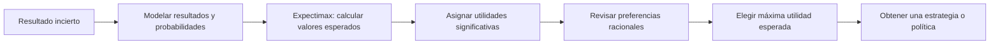
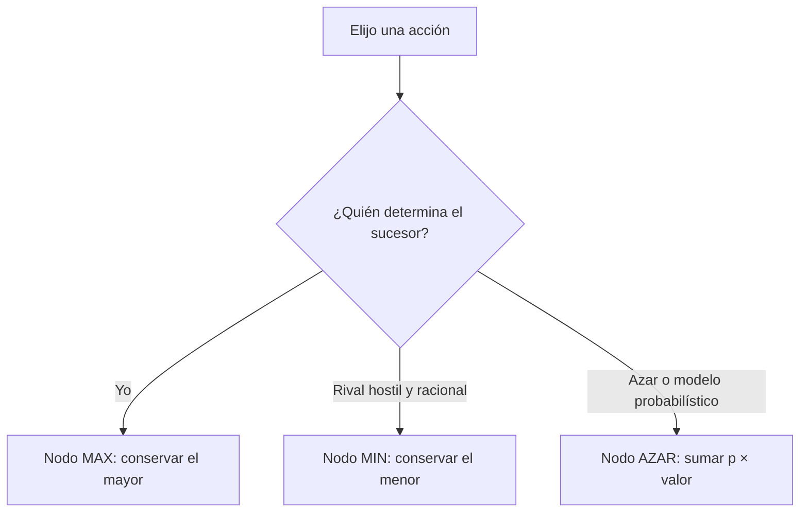
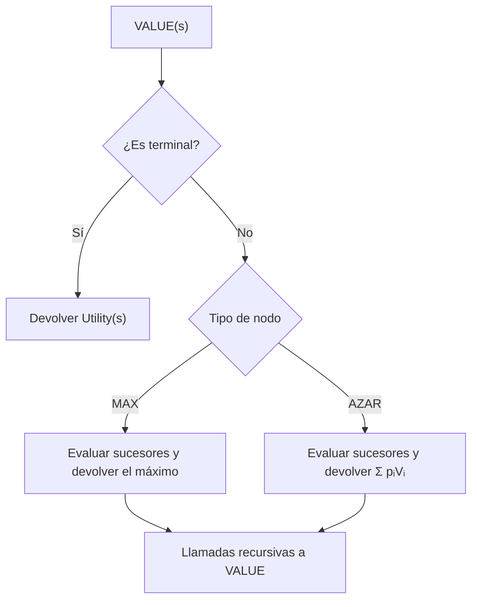
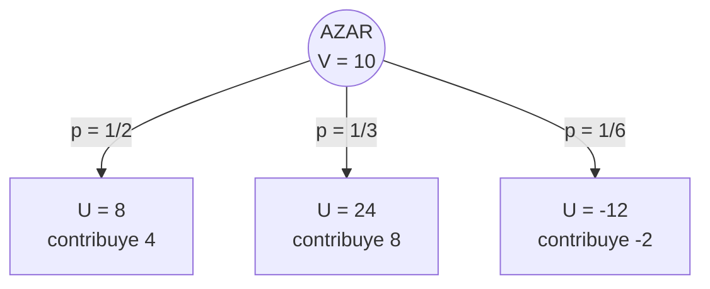
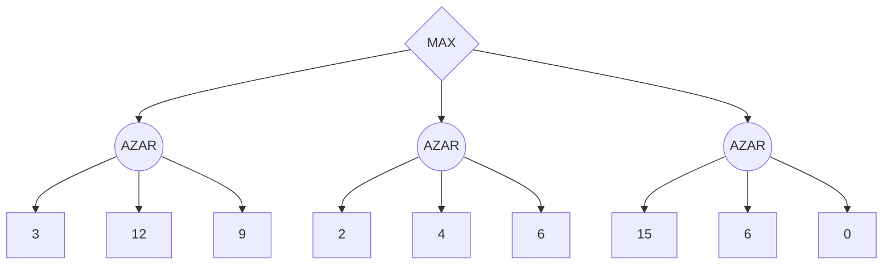
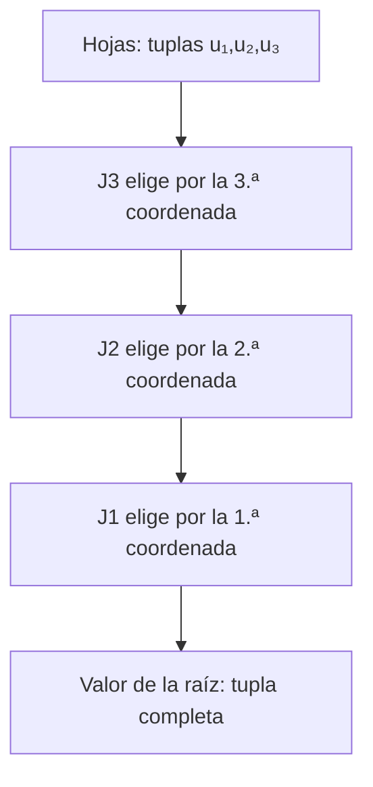
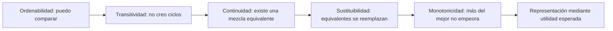
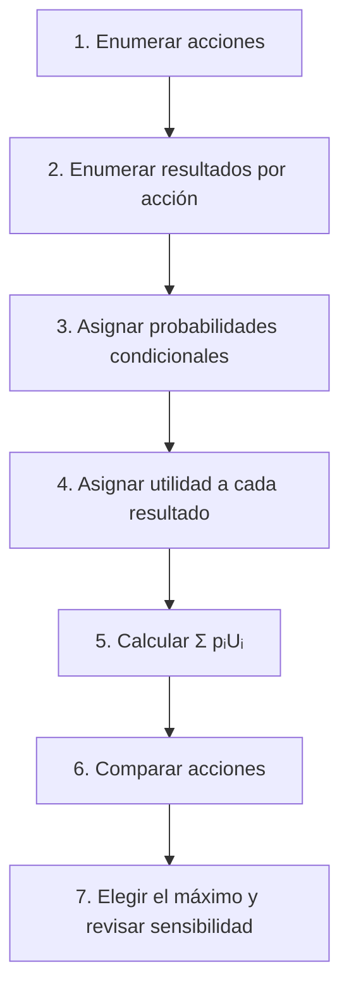
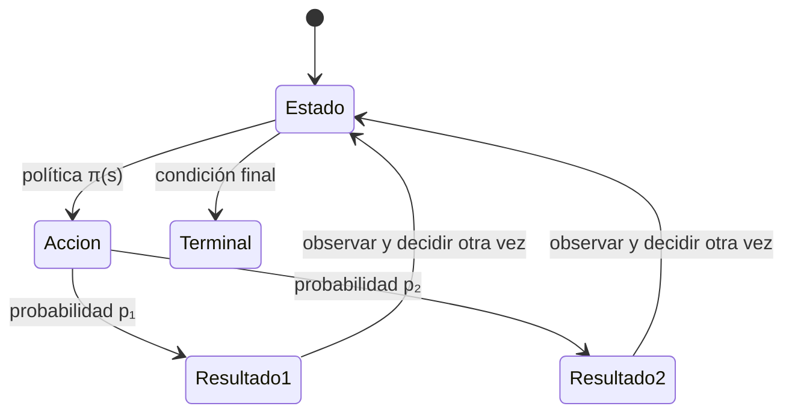

# Clase 8 · Incertidumbre, Expectimax y utilidad esperada

![[AI 8 Búsqueda con adversarios - Incertidumbre.pdf]]

## Pregunta central

¿Cómo elegir una acción cuando no controlamos ni conocemos con certeza el resultado que seguirá?

> [!summary] Idea de la clase
> **Minimax** pregunta qué puede garantizar MAX si otro agente escoge deliberadamente el peor resultado. **Expectimax** sustituye esa elección adversaria por un **nodo de azar** y calcula un promedio ponderado. Para decidir correctamente no bastan los resultados posibles: hacen falta sus probabilidades y una función de utilidad cuya magnitud represente preferencias bajo riesgo.

**Cómo estudiar esta nota:** domina primero la diferencia entre nodos MAX, MIN y AZAR. Después practica la propagación de valores desde las hojas. Finalmente estudia por qué una probabilidad necesita combinarse con una utilidad y qué condiciones deben cumplir las preferencias para ser representadas por utilidad esperada.

**Fuente y alcance:** esta nota recorre las 20 diapositivas de *AI 8 Búsqueda con adversarios - Incertidumbre*. Los árboles, valores y loterías conservan los números de la presentación. Las explicaciones, comparaciones y ejercicios son ampliaciones didácticas. La diapositiva 1 solo dice “Comentarios de tarea 2”; como no contiene los comentarios concretos, aquí no se inventan.



---

## 1. De un rival perfecto a un resultado incierto

En [[2026-09-03 IA - Busqueda Adversarios|la clase anterior]], minimax trató al oponente como un agente perfectamente racional que intenta minimizar la utilidad de MAX. Ese supuesto produce una decisión prudente: MAX elige la acción cuyo peor resultado sea lo mejor posible.

Sin embargo, no toda incertidumbre es una decisión hostil. Una acción puede tener varios resultados porque:

- existe un evento aleatorio, como el resultado de un dado;
- el adversario es impredecible y se modela estadísticamente;
- el actuador puede fallar, como un robot que resbala;
- el estado se conoce de manera incompleta;
- la función de evaluación aproxima un futuro que no alcanzamos a explorar.

> [!important] Dos preguntas diferentes
> **Minimax:** “¿qué ocurriría si alguien eligiera el peor sucesor para mí?”  
> **Expectimax:** “¿qué utilidad obtendría en promedio si los sucesores ocurrieran con estas probabilidades?”

### 1.1 Incertidumbre no significa ignorancia total

Un nodo de azar no dice “no sé qué pasará” y se detiene. Especifica una distribución:

$$
P(s'\mid s,a)\ge 0,
\qquad
\sum_{s'}P(s'\mid s,a)=1.
$$

La distribución convierte la incertidumbre en un cálculo. Si no podemos justificar probabilidades, el número esperado será tan dudoso como el modelo que lo produjo.

### 1.2 El ejemplo del blanco de la diapositiva 5

La imagen contrasta resultados como $-1000$, $0$ y $60$ alrededor de un blanco con puntuaciones positivas. Su lección es que una opción atractiva puede esconder una consecuencia catastrófica y que la **magnitud** de cada resultado cambia el promedio.

No se muestran probabilidades para los tres resultados; por tanto, la diapositiva por sí sola **no determina cuál opción es óptima**. El procedimiento correcto sería:

1. Enumerar los resultados posibles de cada tiro o acción.
2. Asignar a cada resultado una utilidad, no solo una etiqueta.
3. Estimar la probabilidad de cada resultado.
4. Calcular la utilidad esperada de cada acción.
5. Comparar con una regla conservadora si el costo de equivocarse es crítico.

Por ejemplo, si una acción produce $60$ con probabilidad $0.99$ y $-1000$ con probabilidad $0.01$:

$$
EU=0.99(60)+0.01(-1000)=59.4-10=49.4.
$$

El desenlace $-1000$ es terrible, pero no debe tratarse como si fuera seguro. Minimax asignaría a esa acción el valor $-1000$; expectimax le asignaría $49.4$ bajo el modelo anterior.

| Criterio | Cómo resume una acción | Cuándo tiene sentido |
|---|---|---|
| Minimax | Peor utilidad posible | Rival deliberadamente hostil o necesidad de garantía robusta |
| Expectimax | Promedio ponderado de utilidades | Azar o conducta con probabilidades confiables |
| Valor máximo | Mejor utilidad posible | Optimismo extremo; rara vez basta para decidir |
| Máximo arrepentimiento mínimo | Peor pérdida respecto de la mejor acción retrospectiva | Probabilidades muy inciertas, pero resultados acotados |



---

## 2. Expectimax

**Expectimax** es una búsqueda en árbol para problemas donde algunos sucesores se producen según probabilidades. Igual que minimax, evalúa desde las hojas hacia la raíz, pero cambia la operación de los nodos inciertos.

### 2.1 Tipos de nodo

| Nodo | Quién determina el sucesor | Operación |
|---|---|---|
| Terminal | Ya no hay decisión | Devolver $U(s)$ |
| MAX | El agente que optimizamos | $\max$ |
| MIN | Un rival que minimiza nuestra utilidad | $\min$ |
| AZAR o EXP | Una distribución probabilística | $\sum p_iV_i$ |

Un árbol puede mezclar los cuatro tipos. Por ejemplo, en backgammon MAX elige una jugada, el dado introduce azar y después el rival elige su respuesta.

### 2.2 Definición recursiva

Para el caso de la presentación, con nodos MAX y AZAR:

$$
V(s)=
\begin{cases}
U(s), & \text{si }s\text{ es terminal},\\[4pt]
\displaystyle\max_{a\in Actions(s)}V(Result(s,a)), & \text{si }s\text{ es MAX},\\[9pt]
\displaystyle\sum_{s'\in Succ(s)}P(s'\mid s)V(s'), & \text{si }s\text{ es AZAR}.
\end{cases}
$$

Si el azar ocurre **después** de escoger una acción, la decisión en la raíz puede escribirse directamente como:

$$
a^*=\arg\max_a\sum_{s'}P(s'\mid s,a)V(s').
$$

> [!tip] No promediar acciones
> Las probabilidades pertenecen a los **resultados inciertos** de una acción. MAX no promedia sus acciones: las compara y elige la de mayor valor esperado.



---

## 3. El algoritmo, línea por línea

La diapositiva 7 usa un despachador `VALUE`, un combinador `MAX-VALUE` y un combinador `EXP-VALUE`.

```text
VALUE(state):
    si state es terminal:
        devolver Utility(state)
    si el siguiente agente es MAX:
        devolver MAX-VALUE(state)
    si el siguiente agente es AZAR:
        devolver EXP-VALUE(state)

MAX-VALUE(state):
    v ← −∞
    para cada successor de state:
        v ← max(v, VALUE(successor))
    devolver v

EXP-VALUE(state):
    v ← 0
    para cada successor de state:
        p ← Probability(successor | state)
        v ← v + p · VALUE(successor)
    devolver v
```

### 3.1 Qué hace cada variable

- `v = −∞` permite que cualquier primer resultado real mejore el acumulador de MAX.
- `v = 0` en el nodo de azar inicia una suma, no significa que el estado valga cero.
- `Probability(successor | state)` debe corresponder al mismo sucesor que se evalúa.
- La llamada recursiva permite que debajo aparezcan más decisiones o más azar.
- La utilidad terminal y la evaluación heurística deben estar en la misma perspectiva.

### 3.2 Invariantes para detectar errores

1. En cada nodo de azar, las probabilidades deben sumar 1.
2. Con probabilidades no negativas, la esperanza queda entre el mínimo y el máximo de sus hijos:

$$
\min_i V_i\le \sum_i p_iV_i\le\max_i V_i.
$$

3. Un nodo MAX nunca devuelve menos que todos sus hijos ni más que todos ellos: devuelve exactamente uno de sus valores máximos.
4. Un promedio no ponderado solo es correcto cuando todos los sucesores son equiprobables.

---

## 4. Ejemplo pequeño de la diapositiva 8

El nodo de azar tiene tres resultados:

| Probabilidad | Utilidad | Contribución $p_iU_i$ |
|---:|---:|---:|
| $1/2$ | $8$ | $4$ |
| $1/3$ | $24$ | $8$ |
| $1/6$ | $-12$ | $-2$ |
| **Total** |  | **10** |

Paso a paso:

$$
\begin{aligned}
V(s)
&=\frac12(8)+\frac13(24)+\frac16(-12)\\
&=4+8-2\\
&=10.
\end{aligned}
$$

La comprobación rápida es $\tfrac12+\tfrac13+\tfrac16=1$. Además, $10$ está entre $-12$ y $24$, como debe ocurrir.



---

## 5. Árbol completo de la diapositiva 9

La raíz MAX tiene tres acciones. Cada una lleva a un nodo de azar con tres resultados:



La diapositiva no etiqueta probabilidades. Si adoptamos la opción más sencilla de la diapositiva 11 —**distribución uniforme**— cada hoja tiene probabilidad $1/3$.

| Paso | Rama | Cálculo | Valor esperado |
|---:|---|---|---:|
| 1 | Izquierda | $(3+12+9)/3$ | $8$ |
| 2 | Central | $(2+4+6)/3$ | $4$ |
| 3 | Derecha | $(15+6+0)/3$ | $7$ |
| 4 | Raíz MAX | $\max(8,4,7)$ | **8** |

MAX elige la rama izquierda. Observa dos detalles:

- La hoja $15$ no basta para elegir la derecha: solo es uno de tres posibles resultados.
- El valor $8$ es una esperanza; una ejecución concreta podría terminar en $3$, $12$ o $9$.

### Laboratorio paso a paso

Avanza nodo por nodo y modifica la distribución. El laboratorio normaliza los pesos y compara el resultado con la versión minimax.

<iframe src="../../inteligencia_artificial/recursos/expectimax-paso-a-paso.htm" style="width:100%;height:600px;border:1px solid var(--lightgray);border-radius:4px;" loading="lazy"></iframe>

**Idea central si el laboratorio no carga:** con probabilidades uniformes, los nodos de azar valen $8$, $4$ y $7$; MAX elige $8$. Si cambian las probabilidades, pueden cambiar tanto los promedios como la acción óptima.

### 5.1 Comparación exacta con minimax

Si interpretáramos los tres nodos como rivales MIN:

$$
\min(3,12,9)=3,\quad
\min(2,4,6)=2,\quad
\min(15,6,0)=0.
$$

La raíz escogería $\max(3,2,0)=3$. En este ejemplo ambas reglas eligen la izquierda, pero por razones diferentes y con valores distintos. No hay garantía de que siempre seleccionen la misma acción.

> [!example] Ejemplo donde sí divergen
> Acción segura: utilidad $4$ con probabilidad 1.  
> Acción riesgosa: $10$ con probabilidad $0.9$ y $-1$ con probabilidad $0.1$.  
> Minimax elige la segura porque $4>-1$. Expectimax elige la riesgosa porque $0.9(10)+0.1(-1)=8.9>4$.

---

## 6. ¿De dónde salen las probabilidades?

La diapositiva 11 propone tres fuentes.

### 6.1 Distribución uniforme

Si hay $n$ sucesores y no existe información adicional:

$$
P(s_i)=\frac1n.
$$

Es transparente y útil como línea base, pero “no sé” no implica que los casos sean equiprobables. Debe declararse como supuesto.

### 6.2 Modelo basado en datos

Se observan frecuencias o se entrena un modelo condicional. Para un oponente:

$$
P(a_{opp}\mid s,\text{historial},\text{perfil}).
$$

Un buen modelo distingue estados: que una jugada aparezca 30 % en general no implica que tenga 30 % en esta posición. También debe reservar probabilidad para conductas no observadas y actualizarse si el rival cambia.

### 6.3 Probabilidades “dadas mágicamente”

En ejercicios, simuladores o reglas de un juego, la distribución puede venir especificada. Un dado justo proporciona $1/6$ por cara; un enunciado puede declarar la tasa de falla de un actuador.

> [!warning] Error de modelado
> Expectimax es óptimo **respecto del modelo entregado**, no respecto del mundo real. Una probabilidad mal calibrada puede hacer que el algoritmo calcule perfectamente la decisión equivocada.

### 6.4 Análisis de sensibilidad

Cuando las probabilidades son inciertas:

1. Calcula la acción óptima con la estimación central.
2. Varía los parámetros dentro de rangos plausibles.
3. Identifica el punto donde cambia la acción elegida.
4. Si una variación pequeña cambia la decisión, busca mejores datos o usa un criterio más robusto.

---

## 7. Las preguntas de la diapositiva 10

### 7.1 ¿Cuándo utilizar expectimax?

Úsalo cuando:

- existen resultados aleatorios con probabilidades conocidas o estimables;
- el comportamiento de otro agente se modela como una distribución, no como un rival perfecto;
- importa el desempeño promedio a largo plazo;
- la utilidad captura adecuadamente premios, pérdidas y riesgo.

Prefiere minimax cuando necesitas una garantía contra un adversario hostil o cuando un resultado catastrófico no puede tolerarse, aunque sea poco probable. En sistemas de seguridad suele combinarse expectativa con restricciones duras de riesgo.

### 7.2 ¿Cuándo se puede podar?

La poda alfa–beta ordinaria funciona en minimax porque, una vez que una rama ya no puede mejorar una cota MAX/MIN, conocer sus hojas restantes no cambia la elección. En un nodo de azar, **cada hijo con probabilidad positiva contribuye a la suma**, así que normalmente no puede ignorarse.

Se puede podar de manera exacta en casos como:

- sucesores con probabilidad cero;
- ramas dominadas cuya cota superior ya no puede superar la mejor acción;
- utilidades conocidas dentro de $[L,U]$, de modo que la contribución aún no vista puede acotarse.

Si ya acumulamos $S$ y falta una masa de probabilidad $r$, entonces:

$$
S+rL\le V_{azar}\le S+rU.
$$

Si incluso la cota superior queda por debajo de una alternativa ya disponible, esa rama puede descartarse. Sin límites válidos sobre la utilidad, esta poda no es segura.

### 7.3 Alternativas

| Situación | Alternativa útil |
|---|---|
| Árbol pequeño y probabilidades conocidas | Expectimax exacto |
| Árbol profundo | Profundidad limitada + función de evaluación |
| Muchos resultados de azar | Muestreo o búsqueda Monte Carlo |
| Rival competitivo sin modelo confiable | Minimax o variante robusta |
| Varios jugadores con utilidades propias | Maxⁿ o métodos de teoría de juegos |
| Incertidumbre sobre el estado observado | Estados de creencia; el estado debe representar lo que se sabe |

---

## 8. Funciones de evaluación bajo incertidumbre

Cuando no podemos llegar a hojas terminales, usamos una evaluación $Eval(s)$ como aproximación de la utilidad futura. En expectimax, las estimaciones también se promedian:

$$
V(s_{azar})\approx\sum_{s'}P(s'\mid s)Eval(s').
$$

Esto vuelve crucial la **escala**.

### 8.1 Escala ordinal y escala cardinal

- En un árbol determinista de MAX/MIN, normalmente importa el **orden** de las hojas. Una transformación estrictamente creciente conserva qué hojas son mayores o menores.
- En un promedio, importan las **distancias**. No es igual pasar de 0 a 1 que de 0 a 100.

Ejemplo con dos loterías:

| Lotería | Resultado |
|---|---|
| $L_1$ | 50 % de 0 y 50 % de 100 |
| $L_2$ | 100 % de 40 |

Con $U(x)=x$, $EU(L_1)=50>40=EU(L_2)$. Si reemplazamos por la transformación creciente $U'(x)=\sqrt{x}$, obtenemos $EU'(L_1)=5<\sqrt{40}\approx6.32$. El orden de resultados individuales no cambió, pero sí la preferencia entre loterías.

> [!important] Transformación permitida
> La representación de utilidad esperada conserva decisiones bajo transformaciones afines positivas $U'(x)=aU(x)+b$, con $a>0$. Una transformación creciente arbitraria puede cambiar las decisiones bajo riesgo.

Normalizar utilidades a $[0,1]$ es cómodo:

$$
U'(x)=\frac{U(x)-U_{min}}{U_{max}-U_{min}},
$$

pero no es obligatorio y requiere fijar qué resultados cuentan como mejor y peor.

---

## 9. Generalización a más jugadores: utilidades como tuplas

En un juego de suma cero con dos jugadores basta un escalar porque $U_{MIN}=-U_{MAX}$. En un juego general, cada resultado terminal tiene una tupla:

$$
\mathbf U(s)=\bigl(U_1(s),U_2(s),\ldots,U_n(s)\bigr).
$$

En **Maxⁿ**, si el jugador $i$ controla un nodo, selecciona el hijo que maximiza la coordenada $i$ y propaga la tupla completa:

$$
V(s)=V(s^*),
\qquad
s^*\in\arg\max_{s'\in Succ(s)}V_i(s').
$$

### 9.1 Árbol de la diapositiva 12

Los niveles pertenecen a J1, J2 y J3. Primero decide J3 en los cuatro nodos inferiores:

| Nodo J3 | Alternativas | Compara | Propaga |
|---|---|---|---|
| 1 | $(1,6,6)$ vs. $(7,1,2)$ | $6>2$ | $(1,6,6)$ |
| 2 | $(6,1,2)$ vs. $(7,2,1)$ | $2>1$ | $(6,1,2)$ |
| 3 | $(5,1,7)$ vs. $(1,5,2)$ | $7>2$ | $(5,1,7)$ |
| 4 | $(7,7,1)$ vs. $(5,2,5)$ | $5>1$ | $(5,2,5)$ |

Después J2 compara la segunda coordenada:

- izquierda: $(1,6,6)$ vence a $(6,1,2)$ porque $6>1$;
- derecha: $(5,2,5)$ vence a $(5,1,7)$ porque $2>1$.

Por último J1 compara la primera coordenada: $(5,2,5)$ vence a $(1,6,6)$ porque $5>1$. La raíz vale **$(5,2,5)$**.



### Laboratorio paso a paso

<iframe src="../../inteligencia_artificial/recursos/maxn-tuplas-paso-a-paso.htm" style="width:100%;height:600px;border:1px solid var(--lightgray);border-radius:4px;" loading="lazy"></iframe>

**Idea central si el laboratorio no carga:** cada jugador maximiza únicamente su componente, pero no borra las demás; toda la tupla sube por el árbol.

### 9.2 Por qué aparecen interacciones complicadas

- Una acción puede beneficiar a dos jugadores y perjudicar a otro.
- Pueden formarse coaliciones temporales.
- El resultado puede depender de cómo se resuelven empates.
- Con utilidades no opuestas, “minimizar a MAX” ya no representa el objetivo de todos.
- La estrategia óptima puede depender de creencias sobre las decisiones futuras de cada jugador.

---

## 10. Preferencias y loterías

Una función de utilidad no comienza con números arbitrarios. Comienza con preferencias sobre resultados y sobre situaciones inciertas.

### 10.1 Notación

| Símbolo | Lectura |
|---|---|
| $A\succ B$ | A se prefiere estrictamente a B |
| $A\sim B$ | Indiferencia entre A y B |
| $A\succeq B$ | A es al menos tan preferible como B |
| $[p,A;1-p,B]$ | Lotería: A con probabilidad $p$ y B con $1-p$ |

Ejemplo:

$$
L=[0.7,\text{aprobar};0.3,\text{reprobar}].
$$

La lotería es un objeto completo de preferencia. No se compara solo el mejor premio; se comparan probabilidades y utilidades.

---

## 11. Axiomas de racionalidad

Los axiomas de la diapositiva 15 establecen coherencia entre preferencias. No dicen que el agente sea omnisciente ni moralmente correcto; dicen que sus comparaciones pueden representarse de forma consistente.

### 11.1 Ordenabilidad o completitud

Para cualesquiera $A$ y $B$, el agente puede compararlos:

$$
A\succ B\quad\lor\quad B\succ A\quad\lor\quad A\sim B.
$$

**Ejemplo:** entre dos rutas completamente descritas, el agente prefiere una o es indiferente.  
**Violación:** responde que A y B son incomparables dentro del dominio que supuestamente debe decidir.

### 11.2 Transitividad

$$
A\succ B\land B\succ C\Rightarrow A\succ C.
$$

**Ejemplo:** si prefiere 10 puntos a 8 y 8 a 5, debe preferir 10 a 5.  
**Violación:** $A\succ B$, $B\succ C$ y $C\succ A$ produce un ciclo que puede explotarse mediante intercambios sucesivos.

### 11.3 Continuidad

Si $A\succ B\succ C$, existe algún $p$ tal que:

$$
[p,A;1-p,C]\sim B.
$$

**Lectura:** el resultado intermedio B puede igualarse mediante alguna mezcla entre el mejor A y el peor C. Evita saltos infinitos donde ninguna probabilidad de A compense abandonar B.

e.g. Supongamos que tenemos 3 posibles rewards:
$$A = 100 \qquad B = 50 \qquad C = 0 $$

Si tenemos 2 situacioanes, una donde nos garatizan ue obtenedremos $50$ ccon total certeza o una loteria donde etenemos uuna pribabilidad p de ganar 100,, para una agente de risesgo neutral nautral cuta recompensa sea la cantidad la indiferencia de la eleccion ocurre en p =0.5 ya qeuqe e valor esperado es 0.5(100)+0.5(0)=50

If B is an intermediate outcome, there is some probability of obtaining A rather than C that makes the agent indifferent between taking B for certain and accepting the lottery.

Intuition: By changing the probabilities of the best and worst outcomes, we can construct a lottery that is equally desirable as an intermediate outcome.

### 11.4 Sustituibilidad o independencia

Si $A\sim B$, cualquiera puede reemplazar al otro dentro de la misma lotería:

$$
[p,A;1-p,C]\sim[p,B;1-p,C].
$$

**Lectura:** si A y B son equivalentes por sí solos, agregar el mismo contexto probabilístico C no debería romper la equivalencia.

E.g. si tenemos un agnte que tiene que escogeer entre reibic 50 en efectivo  A o 50 en un tarjeta B, podemos considerar las loterias con p=0.5 para cad uno, s el agente considera qeue el efectivo y en la tarjeta son igual de vlaiosos entones tambien es indiferente ante estas 2 loterias coo loe ra ocn als elecicoensiniciales


If the agent considers the cash and gift card equally desirable, it must also be indifferent between these two lotteries.

The probabilities remain unchanged, and only an equally preferred outcome has been substituted.

This principle allows us to replace outcomes with equivalent alternatives without changing the overall preference.
### 11.5 Monotonicidad

Si $A\succ B$, una lotería que ofrece A con mayor probabilidad es al menos tan preferible:

$$
p\ge q
\iff
[p,A;1-p,B]\succeq[q,A;1-q,B].
$$



---
If A is better than B, a lottery with a greater probability of obtaining A is at least as desirable as one with a smaller probability of obtaining A.

## 12. Teorema de utilidad esperada

Bajo los axiomas anteriores existe una función real $U$ que representa el orden de preferencias:

$$
U(A)\ge U(B)\iff A\succeq B.
$$

Además, la utilidad de una lotería es:

$$
U([p_1,S_1;\ldots;p_n,S_n])=\sum_{i=1}^{n}p_iU(S_i).
$$

El principio de **máxima utilidad esperada** dice:

$$
a^*=\arg\max_a\mathbb E[U(S')\mid s,a].
$$

### 12.1 Procedimiento completo de decisión



> [!warning] Utilidad esperada ≠ dinero esperado
> El dinero es una cantidad del resultado; la utilidad expresa cuánto se prefiere ese resultado. Si $U(x)=x$, ambas comparaciones coinciden. Si la utilidad es cóncava, el agente muestra aversión al riesgo; si es convexa, búsqueda de riesgo.

| Forma de $U(x)$ | Actitud típica | Efecto |
|---|---|---|
| Lineal | Neutral al riesgo | Compara valor monetario esperado |
| Cóncava, por ejemplo $\sqrt{x}$ | Aversión al riesgo | Ganancias adicionales aportan utilidad decreciente |
| Convexa, por ejemplo $x^2$ en un dominio acotado | Búsqueda de riesgo | Premia más los extremos altos |

---

## 13. El ejemplo de las loterías A, B, C y D

La diapositiva 17 presenta:

| Opción | Lotería | Valor monetario esperado |
|---|---|---:|
| A | $[0.8,\$4k;0.2,\$0]$ | $\$3.2k$ |
| B | $[1,\$3k;0,\$0]$ | $\$3k$ |
| C | $[0.2,\$4k;0.8,\$0]$ | $\$0.8k$ |
| D | $[0.25,\$3k;0.75,\$0]$ | $\$0.75k$ |

La presentación indica que mucha gente responde $B\succ A$ y $C\succ D$. Veamos las consecuencias bajo utilidad esperada, suponiendo $U(\$0)=0$.

### 13.1 Primera preferencia

$$
\begin{aligned}
B\succ A
&\Rightarrow U(\$3k)>0.8U(\$4k)+0.2U(\$0)\\
&\Rightarrow U(\$3k)>0.8U(\$4k).
\end{aligned}
$$

### 13.2 Segunda preferencia

$$
\begin{aligned}
C\succ D
&\Rightarrow 0.2U(\$4k)>0.25U(\$3k)\\
&\Rightarrow 0.8U(\$4k)>U(\$3k).
\end{aligned}
$$

### 13.3 Contradicción

Las preferencias estrictas exigen simultáneamente:

$$
U(\$3k)>0.8U(\$4k)
\quad\text{y}\quad
U(\$3k)<0.8U(\$4k).
$$

No existe un solo valor que satisfaga ambas. Por eso este patrón de preferencias viola las condiciones de la representación simple por utilidad esperada sobre esos premios. Psicológicamente suele asociarse con dar un peso especial a la certeza, pero el punto matemático de la diapositiva es la incompatibilidad de las dos desigualdades.

### Laboratorio de loterías

<iframe src="../../inteligencia_artificial/recursos/utilidad-esperada-loterias.htm" style="width:100%;height:600px;border:1px solid var(--lightgray);border-radius:4px;" loading="lazy"></iframe>

**Idea central si el laboratorio no carga:** al normalizar $U(\$4k)=1$, elegir B sobre A requiere $U(\$3k)>0.8$, mientras que elegir C sobre D requiere $U(\$3k)<0.8$.

---

## 14. De una acción a una estrategia

La diapositiva 18 recuerda que los métodos vistos pueden ayudar a encontrar una **estrategia**. Conviene distinguir:

- **Acción:** decisión para un estado concreto.
- **Plan:** secuencia fijada de acciones.
- **Estrategia o política:** regla que indica qué hacer en cada estado relevante.

Con incertidumbre, una secuencia fija suele ser insuficiente porque después de cada resultado debemos volver a observar y decidir.



---

## 15. Mapa de los métodos vistos hasta la diapositiva 19

| Familia                       | Métodos mencionados                                        | Qué decisión organiza                      |
| ----------------------------- | ---------------------------------------------------------- | ------------------------------------------ |
| Búsqueda sin información      | DFS, BFS, profundidad iterativa, costo uniforme            | Explorar sin heurística del objetivo       |
| Búsqueda con información      | Voraz, A*                                                  | Priorizar con heurística                   |
| Satisfacción de restricciones | Backtracking, filtrado, ordenamiento                       | Asignar variables respetando restricciones |
| Búsqueda local                | Hill climbing, recocido simulado, tabú, algoritmo genético | Mejorar configuraciones completas          |
| Búsqueda con adversarios      | Minimax, poda alfa–beta, expectimax                        | Razonar sobre decisiones ajenas y azar     |

No son intercambiables sin reformular el problema. A* necesita costos y heurística; expectimax necesita probabilidades y utilidades; backtracking necesita variables, dominios y restricciones.

---

## 16. Receta para resolver un ejercicio de expectimax

> [!check] Procedimiento mecánico
> 1. Marca cada nodo como MAX, MIN, AZAR o terminal.  
> 2. Escribe la perspectiva de la utilidad.  
> 3. Coloca las probabilidades en las aristas de azar y comprueba que sumen 1.  
> 4. Empieza por el nivel más profundo.  
> 5. En MAX usa máximo; en MIN, mínimo; en AZAR, suma ponderada.  
> 6. Propaga un nivel a la vez.  
> 7. En la raíz elige la acción, no una hoja inaccesible directamente.  
> 8. Interpreta el resultado como esperanza, no como desenlace garantizado.

### Errores frecuentes

| Error | Corrección |
|---|---|
| Promediar sin probabilidades | Solo usa media simple si los casos son equiprobables |
| Escoger la mejor hoja global | Respeta quién controla cada nivel |
| Usar frecuencias que no suman 1 | Normaliza o corrige el modelo |
| Confundir probabilidad con utilidad | $p$ describe ocurrencia; $U$ describe preferencia |
| Aplicar alfa–beta sin límites | En azar, las ramas restantes aún contribuyen al promedio |
| Mezclar perspectivas | Todas las utilidades escalares deben referirse al mismo agente |
| Interpretar $E[U]$ como resultado seguro | Es un promedio de largo plazo o criterio normativo |
| Usar tuplas y maximizar siempre la primera coordenada | Cada jugador maximiza su propia coordenada |

---

## 17. Preguntas de autoevaluación

1. ¿Qué cambia entre un nodo MIN y uno de azar si tienen las mismas hojas?
2. ¿Por qué la probabilidad uniforme es un supuesto y no una consecuencia de la ignorancia?
3. Calcula $\frac12(8)+\frac13(24)+\frac16(-12)$ y verifica los límites del resultado.
4. Con el árbol de la diapositiva 9 y probabilidades uniformes, ¿qué acción escoge MAX?
5. ¿Por qué una transformación creciente puede conservar minimax pero cambiar expectimax?
6. En el árbol de tres jugadores, ¿por qué J3 puede propagar $(5,2,5)$ en vez de $(7,7,1)$?
7. ¿Qué contradicción producen simultáneamente $B\succ A$ y $C\succ D$?
8. ¿Qué información adicional necesitarías para decidir a partir del ejemplo del blanco?

<details>
<summary>Respuestas breves</summary>

1. MIN conserva el menor valor; azar calcula $\sum p_iV_i$.
2. No conocer las probabilidades no demuestra que todos los resultados sean igual de probables.
3. El valor es $10$, dentro de $[-12,24]$.
4. Los nodos valen $(8,4,7)$; escoge la izquierda.
5. El máximo y el mínimo dependen del orden; una esperanza también depende de las distancias numéricas.
6. J3 compara la tercera coordenada: $5>1$.
7. Exigen $U(\$3k)>0.8U(\$4k)$ y también $U(\$3k)<0.8U(\$4k)$.
8. Resultados posibles por acción, probabilidades y utilidades, además de restricciones de riesgo.

</details>

---

## 18. Recorrido de la presentación, de inicio a fin

| Diapositiva | Contenido | Dónde se desarrolla |
|---:|---|---|
| 1 | Comentarios de tarea 2 | Nota de alcance; no hay detalles en el PDF |
| 2–3 | Clase 8 y agenda | Pregunta central y mapa inicial |
| 4 | Incertidumbre y conservadurismo de minimax | §1 |
| 5 | Ejemplo del blanco | §1.2 |
| 6 | Búsqueda expectimax | §2 |
| 7 | Algoritmo | §3 |
| 8 | Nodo de azar numérico | §4 |
| 9 | Árbol expectimax | §5 y laboratorio |
| 10 | Cuándo usar, podar y alternativas | §7 |
| 11 | Fuentes de probabilidad | §6 |
| 12 | Otros juegos y tuplas | §9 y laboratorio Maxⁿ |
| 13 | Escala y origen de utilidades | §8 |
| 14 | Preferencias y loterías | §10 |
| 15 | Axiomas de racionalidad | §11 |
| 16 | Máxima utilidad esperada | §12 |
| 17 | Loterías A–D | §13 y laboratorio |
| 18 | Métodos para encontrar estrategias | §14 |
| 19 | Resumen de algoritmos vistos | §15 |
| 20 | Próxima clase: agentes lógicos | Cierre |

## Conexiones

- Anterior: [[2026-09-03 IA - Busqueda Adversarios|Búsqueda con adversarios: minimax y alfa–beta]].
- Recursos interactivos: [[expectimax-paso-a-paso]], [[maxn-tuplas-paso-a-paso]] y [[utilidad-esperada-loterias]].
- Siguiente tema anunciado: agentes lógicos.

