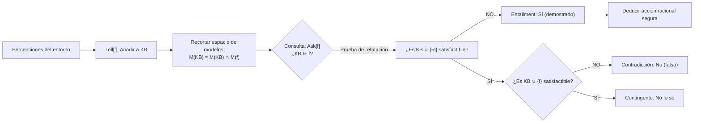
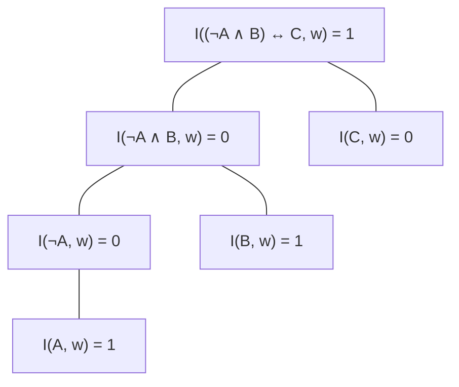
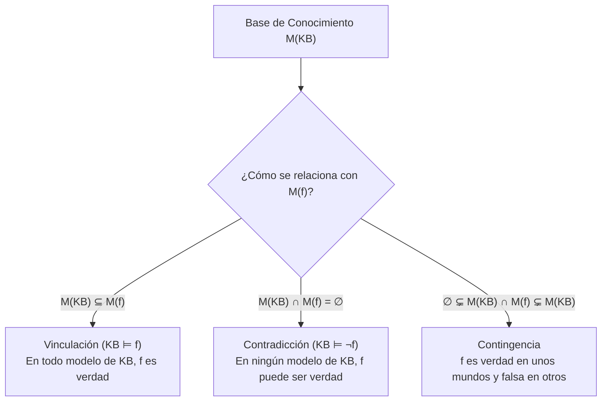
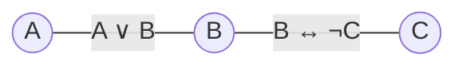

# Clase 9 · Agentes lógicos, lógica proposicional y satisfacibilidad


![[AI 9 Agentes lógicos.pdf]]

## Pregunta central

¿Cómo puede un agente representar explícitamente el conocimiento de un mundo parcialmente observable, inferir hechos no percibidos directamente y deducir racionalmente qué hacer sin depender de adivinanzas ni de búsquedas exhaustivas a ciegas?

> [!summary] Idea de la clase
> Los métodos de búsqueda clásicos y de adversarios asumen estados atómicos opacos o funciones de utilidad sobre desenlaces inmediatos. Un **agente basado en conocimiento** mantiene una **Base de Conocimiento ($KB$)** compuesta por sentencias en un lenguaje formal (como la **lógica proposicional**). Cada nueva percepción añadida mediante `Tell` descarta mundos posibles ($M(KB) = \bigcap M(f)$). La inferencia responde preguntas `Ask` mediante **vinculación lógica ($KB \models f$)**, la cual se reduce algorítmicamente a verificar la **insatisfactibilidad** de $KB \cup \{\neg f\}$ (un caso especial de CSP booleano).

**Cómo estudiar esta nota:**
1. Comprende primero por qué el [[03_Conceptos/Mundo del Wumpus|Mundo del Wumpus]] obliga al agente a razonar con perceptos pasados y reglas del entorno en vez de limitarse a buscar caminos.
2. Domina la distinción formal entre **sintaxis** (árboles de derivación BNF, precedencia de conectores) y **semántica** (mundos posibles $w$, función de interpretación $I(f,w)$, conjunto de modelos $M(f)$).
3. Interioriza la visualización de la $KB$ como una **intersección de modelos**: aprender información recorta mundos posibles; la contradicción vacía el conjunto de modelos ($M(KB) = \emptyset$).
4. Analiza con rigor el **árbol de reducción de inferencia a SAT** (diapositiva 22) y su equivalencia formal con un **CSP** de variables booleanas.

**Fuente y alcance:** Esta nota cubre detalladamente las 25 diapositivas de la presentación *Clase 9: Agentes lógicos* (IIMAS, UNAM), complementadas con el texto canónico de Russell & Norvig (*AIMA 4.ª ed., Cap. 7*), dos laboratorios interactivos en HTML incrustados y referencias a cursos abiertos de Stanford y UC Berkeley.



---

## 1. De la búsqueda ciega a los agentes basados en conocimiento

Hasta la [[2026-09-08 IA - Incertidumbre y Expectimax|clase anterior]], los problemas se resolvieron mediante algoritmos de búsqueda (BFS, DFS, A*, Minimax, Expectimax) o satisfacción de restricciones (CSP). En todos ellos, el agente consideraba estados como entidades monolíticas y requería conocer de antemano el espacio de estados o una distribución de probabilidades explícita.

Sin embargo, en el mundo real y en entornos parcialmente observables surgen tres grandes limitaciones:

1. **Incompletitud perceptiva:** El agente no observa el estado global en cada instante; solo recibe pistas locales e indirectas.
2. **Costo prohibitivo del error:** En presencia de peligros letales inmediatos, explorar caminos al azar o estimar con heurísticas no garantiza que el agente no muera en el siguiente paso.
3. **Estructura composicional del conocimiento:** Saber que *"el suelo mojado se debe a la lluvia o a un aspersor"* permite transferir conocimiento a situaciones completamente nuevas sin necesidad de redefinir el grafo de búsqueda desde cero.

Por ello, un **agente basado en conocimiento** combina:
- Un **lenguaje formal declarativo** para representar hechos y leyes del mundo.
- Un **motor de inferencia** que deriva deductivamente nuevas sentencias a partir de las ya almacenadas.

---

## 2. El Mundo del Wumpus: Entorno de prueba para el razonamiento lógico

La diapositiva 4 introduce el entorno clásico del **Mundo del Wumpus** (concebido originalmente por Gregory Yob en 1973 y formalizado en IA por Russell & Norvig).

![[Screenshot 2026-09-22 at 12.04.17 a.m..png|550]]


### 2.1 Especificación PEAS del entorno

| Componente PEAS | Descripción en el Mundo del Wumpus |
|---|---|
| **P** (Performance) | $+1000$ por salir con el oro; $-1000$ por caer en pozo o morir devorado; $-1$ por cada acción; $-10$ por usar la flecha. |
| **E** (Environment) | Cuadrícula $4 \times 4$ delimitada por muros. Casilla inicial $[1,1]$ siempre segura. Pozos distribuidos con probabilidad $p=0.2$ (excepto en $[1,1]$). Un único Wumpus inmóvil y un lingote de oro. |
| **A** (Actuators) | `Adelante`, `GirarIzquierda`, `GirarDerecha`, `TomarOro`, `DispararFlecha`, `Salir` (solo en $[1,1]$). |
| **S** (Sensors) | `Stench` (hedor en la celda del Wumpus y casillas adyacentes); `Breeze` (brisa en casillas adyacentes a pozos); `Glitter` (brillo en la celda con oro); `Bump` (choque contra pared); `Scream` (grito si el Wumpus muere). |

### 2.2 Por qué fallan los agentes sin memoria ni lógica

Un agente puramente reactivo (reflejo) en $[2,1]$ percibe brisa y no sabe si el pozo está en $[2,2]$ o en $[3,1]$. Si elige al azar, morirá en el $50\%$ de los intentos. En cambio, un agente lógico:
1. Recuerda que en $[1,1]$ no había brisa ni hedor $\implies$ deduce que $[1,2]$ y $[2,1]$ son seguras.
2. Explora $[1,2]$ y percibe hedor pero no brisa $\implies$ descarta que $[2,2]$ sea pozo.
3. Cruza la información previa de $[2,1]$ y deduce de manera impecable que $[2,2]$ es **100% segura** y que el pozo está forzosamente en $[3,1]$.

### Laboratorio interactivo 1: Deducción lógica en el Mundo del Wumpus

Explora el recorrido paso a paso en el tablero oficial de la diapositiva 4, observando cómo se actualiza la Base de Conocimiento y cómo se deducen celdas seguras y trampas.

<iframe src="../../inteligencia_artificial/recursos/mundo-wumpus-inferencia.htm" style="width:100%;height:600px;border:1px solid var(--lightgray);border-radius:4px;" loading="lazy"></iframe>

**Idea central si el laboratorio no carga:** El agente en $[1,1]$ percibe vacío y sabe que $[2,1]$ y $[1,2]$ son seguras. En $[2,1]$ detecta brisa ($P_{2,2} \vee P_{3,1}$). En vez de adivinar, regresa y entra a $[1,2]$, donde detecta hedor pero no brisa ($\neg P_{2,2}$). Por silogismo disyuntivo, deduce que el pozo está en $[3,1]$ y que la celda $[2,2]$ es totalmente segura.

---

## 3. Arquitectura del agente basado en conocimiento

La diapositiva 5 sintetiza las tres propiedades fundamentales de este tipo de agentes:

1. **Forman representaciones internas de un mundo complejo:** No almacenan píxeles ni coordenadas brutas, sino sentencias lógicas compuestas.
2. **Utilizan procesos de inferencia formal:** Derivan nuevas sentencias verdaderas que no estaban explícitas en las percepciones iniciales.
3. **Deducen qué hacer:** Formulan consultas lógicas para seleccionar acciones garantizadas como seguras o conducentes a la meta.

### 3.1 Ciclo de ejecución del agente lógico

A nivel de programa, el agente interactúa con su base mediante dos primitivas:
- `Tell(KB, sentencia)`: Incorpora percepciones y consecuencias deducidas a la base.
- `Ask(KB, consulta)`: Interroga a la base para decidir si una acción es admisible.

```python
def KB_AGENT(percept):
    # 1. Registrar percepto en la base de conocimiento
    Tell(KB, Make_Percept_Sentence(percept, t))
    
    # 2. Consultar qué acción debe ejecutarse
    action = Ask(KB, Make_Action_Query(t))
    
    # 3. Registrar la acción decidida
    Tell(KB, Make_Action_Sentence(action, t))
    t = t + 1
    return action
```

---

## 4. ¿Qué es una lógica? Componentes y tipos

La diapositiva 6 establece que toda lógica formal debe poseer tres componentes inseparables:

1. **Sintaxis:** Define la estructura gramatical de las sentencias legales (cuándo una fórmula está bien formada).
2. **Semántica:** Define el significado de las sentencias determinando su valor de verdad respecto a un mundo o **modelo**.
3. **Teoría de pruebas (Proof theory):** Conjunto de reglas de inferencia puramente sintácticas para derivar nuevas sentencias válidas sin tener que recorrer todos los modelos posibles.

### 4.1 Compromisos ontológicos y epistemológicos (Diapositiva 7)

Cada sistema formal asume supuestos distintos sobre **lo que existe en la realidad** (compromiso ontológico) y sobre el **estado de creencia del agente** (compromiso epistemológico):

| Lenguaje / Sistema | Lo que existe (Ontología) | Creencia del agente (Epistemología) |
|---|---|---|
| **Lógica proposicional** | Hechos | Verdadero / Falso / Desconocido ($T/F/\text{No sé}$) |
| **Lógica de primer orden** | Hechos, objetos, relaciones entre objetos | Verdadero / Falso / Desconocido ($T/F/\text{No sé}$) |
| **Lógica temporal** | Hechos, objetos, relaciones y tiempo | Verdadero / Falso / Desconocido ($T/F/\text{No sé}$) |
| **Teoría de probabilidad** | Hechos | Grado de creencia numérico ($[0, 1]$) |
| **Lógica difusa** | Grado de verdad continuo ($[0, 1]$) | Grado de creencia numérico |

> [!important] Lógica difusa vs. Probabilidad
> - La **probabilidad** trata con **incertidumbre de información**: el hecho "la botella está envenenada" es estrictamente verdadero o falso, pero el agente solo tiene una creencia de $0.7$.
> - La **lógica difusa** trata con **vaguedad de conceptos**: el hecho "la persona es alta" no es ni $0$ ni $1$; la persona mide $1.76\text{ m}$ y tiene un grado de verdad de pertenencia al conjunto "alto" de $0.65$.

---

## 5. Sintaxis de la lógica proposicional

Las diapositivas 8 y 9 definen la gramática formal para construir fórmulas válidas.

### 5.1 Sentencias atómicas y complejas

- **Sentencia atómica:** Consiste en un único símbolo proposicional ($P, Q, R, \dots$) o las constantes booleanas $\text{True}$ y $\text{False}$. Representa una proposición indivisible que puede ser verdadera o falsa en un mundo.
- **Sentencia compleja:** Se construye combinando sentencias mediante conectores lógicos y paréntesis.

### 5.2 Gramática BNF (Backus-Naur Form)

$$
\begin{aligned}
\text{Sentence} &\to \text{AtomicSentence} \mid \text{ComplexSentence} \\
\text{AtomicSentence} &\to \text{True} \mid \text{False} \mid P \mid Q \mid R \mid \dots \\
\text{ComplexSentence} &\to (\text{Sentence}) \mid [\text{Sentence}] \\
&\quad\mid \neg \text{Sentence} && \text{(negación)} \\
&\quad\mid \text{Sentence} \wedge \text{Sentence} && \text{(conjunción)} \\
&\quad\mid \text{Sentence} \vee \text{Sentence} && \text{(disyunción)} \\
&\quad\mid \text{Sentence} \Rightarrow \text{Sentence} && \text{(implicación)} \\
&\quad\mid \text{Sentence} \Leftrightarrow \text{Sentence} && \text{(bicondicional / si y solo si)}
\end{aligned}
$$

### 5.3 Precedencia estricta de operadores

Para evitar ambigüedad en ausencia de paréntesis explícitos, se aplica la siguiente jerarquía (de mayor a menor prioridad):

$$
\neg \quad \succ \quad \wedge \quad \succ \quad \vee \quad \succ \quad \Rightarrow \quad \succ \quad \Leftrightarrow
$$

**Ejemplo de desambiguación:**
- La expresión: $\neg A \wedge B \Rightarrow C \vee D \Leftrightarrow E$
- Se asocia paso a paso como:
  1. $(\neg A)$
  2. $((\neg A) \wedge B)$
  3. $(C \vee D)$
  4. $(((\neg A) \wedge B) \Rightarrow (C \vee D))$
  5. $[(((\neg A) \wedge B) \Rightarrow (C \vee D))] \Leftrightarrow E$

---

## 6. Semántica formal, modelos y función de interpretación

Las diapositivas 10 a 14 desarrollan cómo se asigna significado y valor de verdad a las fórmulas.

### 6.1 Definición de Modelo / Mundo posible ($w$)

Un **modelo** $w$ es una asignación completa de valores de verdad a cada símbolo proposicional presente en el vocabulario:

$$
w = \{P_1: v_1, P_2: v_2, \dots, P_n: v_n\}, \quad \text{donde } v_i \in \{0, 1\}
$$

Si existen $n$ proposiciones atómicas independientes, el espacio universal de modelos posibles es:

$$
|W| = 2^n
$$

Por ejemplo, con tres símbolos $A, B, C$, existen exactamente $2^3 = 8$ mundos posibles.

### 6.2 Función de interpretación $I(f, w)$

Dada una fórmula $f$ y un modelo $w$, la función de interpretación $I(f, w)$ devuelve:
- **$1$ (Verdadero):** Si el mundo $w$ **satisface** la fórmula $f$.
- **$0$ (Falso):** Si el mundo $w$ **no satisface** la fórmula $f$.

El conjunto de todos los modelos que satisfacen $f$ se denota como $M(f)$:

$$
M(f) = \{w \in W \mid I(f, w) = 1\}
$$

### 6.3 Tabla de verdad completa de los conectores (Diapositiva 13)

| $P$ | $Q$ | $\neg P$ | $P \wedge Q$ | $P \vee Q$ | $P \Rightarrow Q$ | $P \Leftrightarrow Q$ |
|:---:|:---:|:---:|:---:|:---:|:---:|:---:|
| 0 | 0 | 1 | 0 | 0 | 1 | 1 |
| 0 | 1 | 1 | 0 | 1 | 1 | 0 |
| 1 | 0 | 0 | 0 | 1 | 0 | 0 |
| 1 | 1 | 0 | 1 | 1 | 1 | 1 |

> [!tip] Clave para recordar la implicación ($P \Rightarrow Q$)
> Una promesa condicional solo se rompe si se cumple el antecedente $P$ pero no se entrega el consecuente $Q$. Si $P$ es falso, la afirmación no puede ser refutada, por lo que su valor de verdad es $1$.

### 6.4 Evaluación recursiva en árbol sintáctico (Diapositiva 14)

Sea la fórmula $f = (\neg A \wedge B) \leftrightarrow C$ y el modelo particular $w = \{A: 1, B: 1, C: 0\}$. La interpretación se computa desde las hojas hacia la raíz:



**Cálculo paso a paso:**
1. $I(A, w) = 1 \implies I(\neg A, w) = 1 - 1 = 0$.
2. $I(B, w) = 1$.
3. $I(\neg A \wedge B, w) = \min(0, 1) = 0$.
4. $I(C, w) = 0$.
5. Comparación bicondicional: ambos lados valen $0$. Como $0 \Leftrightarrow 0$ es verdadero, concluimos que:
   $$
   I(f, w) = 1 \implies w \in M(f)
   $$

---

## 7. La Base de Conocimiento como intersección de modelos

Las diapositivas 15 y 16 introducen el principio geométrico y conjuntista fundamental del razonamiento lógico:

> [!important] La Base de Conocimiento es una intersección de mundos
> Una base de conocimiento $KB = \{f_1, f_2, \dots, f_k\}$ representa la conjunción lógica de todas sus fórmulas. Por tanto, el conjunto de modelos donde la $KB$ es verdadera corresponde a la **intersección** de los modelos de cada una de sus fórmulas:
> $$
> M(KB) = \bigcap_{f \in KB} M(f)
> $$

### 7.1 El ejemplo de Rain y Wet (Diapositiva 15)

Consideremos el espacio de 4 modelos formado por las variables $\text{Rain}$ (filas) y $\text{Wet}$ (columnas):

$$\begin{array}{cc|c|c|}
& & \text{Wet}=0 & \text{Wet}=1 \\
\hline
\text{Rain}=0 & & w_1 & w_2 \\
\hline
\text{Rain}=1 & & w_3 & w_4 \\
\hline
\end{array}$$

- $M(\text{Rain})$: Son las celdas donde $\text{Rain}=1 \implies \{w_3, w_4\}$ (2 modelos).
- $M(\text{Rain} \to \text{Wet})$: Por definición de implicación, incluye $\{w_1, w_2, w_4\}$ (3 modelos; solo excluye $w_3$ donde llueve y el piso no se moja).
- $M(\{\text{Rain}, \text{Rain} \to \text{Wet}\})$: Es la intersección de ambos:
  $$
  \{w_3, w_4\} \cap \{w_1, w_2, w_4\} = \{w_4\}
  $$
  El agente ha aislado el único mundo físicamente posible compatible con los hechos: llueve y el piso está mojado.

```
       M(Rain)               M(Rain → Wet)             M({Rain, Rain → Wet})
      Wet: 0   1               Wet: 0   1                   Wet: 0   1
Rain:0 [   ][   ]       Rain:0 [ X ][ X ]            Rain:0 [   ][   ]
Rain:1 [ X ][ X ]       Rain:1 [   ][ X ]            Rain:1 [   ][ X ]
```

### 7.2 Añadir conocimiento recorta mundos posibles (Diapositiva 16)

Cada vez que el agente aprende una nueva fórmula $f$:

$$
KB \implies KB \cup \{f\}, \qquad M(KB) \implies M(KB) \cap M(f)
$$

**Principio epistemológico:**
- Aprender hechos **reduce la incertidumbre**, descartando mundos que resultan incompatibles con la evidencia.
- Si $M(KB)$ queda reducido a un solo modelo, el agente tiene certidumbre total de cada aspecto del mundo.
- Si $M(KB) = \emptyset$, la base ha caído en contradicción interna.

---

## 8. Relaciones semánticas: Vinculación, Contradicción y Contingencia

Las diapositivas 17 y 18 formalizan los tres estados posibles en los que puede encontrarse una fórmula $f$ respecto a una base $KB$.



### 8.1 Vinculación lógica / Entailment ($KB \models f$)

Decimos que $KB$ **vincula lógicamente** a $f$ si y solo si:

$$
KB \models f \iff M(KB) \subseteq M(f)
$$

*Ejemplo:* $\text{Rain} \wedge \text{Snow} \models \text{Rain}$. Como $M(\text{Rain} \wedge \text{Snow}) \subseteq M(\text{Rain})$, la lluvia está lógicamente garantizada.

### 8.2 Contradicción

La base $KB$ **contradice** a $f$ si y solo si no existe ningún mundo donde coexistan:

$$
KB \text{ contradice } f \iff M(KB) \cap M(f) = \emptyset
$$

*Propiedad de dualidad (Diapositiva 18):*
$$
KB \text{ contradice } f \iff KB \models \neg f
$$

### 8.3 Contingencia (Información incompleta)

Ocurre cuando $f$ es verdadera en algunos modelos de $KB$ y falsa en otros:

$$
\emptyset \subsetneq M(KB) \cap M(f) \subsetneq M(KB)
$$

En este caso, el agente **no puede afirmar ni negar** $f$ a partir de los axiomas actuales.

---

## 9. Operaciones del sistema lógico: Tell y Ask

Las diapositivas 19 y 20 vinculan la semántica de modelos con el comportamiento operativo del agente.

### 9.1 Operación Tell: `Tell[f]`

El agente recibe o percibe una afirmación $f$. El sistema responde según la relación semántica:

| Relación | Diagnóstico del sistema | Efecto en $M(KB)$ |
|---|---|---|
| $KB \models f$ | **"Ya lo sabía"** | Redundante; $M(KB)$ no cambia. |
| $KB \models \neg f$ | **"¡No lo creo!"** | Inconsistencia; rechaza o genera $M(KB)=\emptyset$. |
| Contingente | **"Aprendí algo nuevo"** | Informativo; recorta $M(KB) \cap M(f)$. |

### 9.2 Operación Ask: `Ask[f]`

El agente consulta si una hipótesis $f$ es cierta. Las tres respuestas posibles son:

| Relación | Respuesta del sistema | Justificación |
|---|---|---|
| $KB \models f$ | **"SÍ"** | Demostrado; $f$ es verdadera en todos los mundos de $KB$. |
| $KB \models \neg f$ | **"NO"** | Refutado; $\neg f$ es verdadera en todos los mundos de $KB$. |
| Contingente | **"NO LO SÉ"** | Información insuficiente; depende del mundo real no observado. |

> [!important] "No" no es lo mismo que "No lo sé"
> Un error clásico en sistemas basados en reglas es asumir que si no se puede demostrar $f$, entonces $f$ es falsa (supuesto de mundo cerrado). En lógica clásica de agentes, **"No lo sé"** refleja honestidad epistemológica ante conocimiento incompleto.

---

## 10. Laboratorio interactivo 2: Modelos, Vinculación y Satisfacibilidad

Experimenta de forma interactiva con el espacio de modelos $2^n$, la intersección viva de fórmulas, la prueba de consultas `Ask`/`Tell` y la formulación gráfica como CSP.

<iframe src="../../inteligencia_artificial/recursos/modelos-entailment-satisfaccion.htm" style="width:100%;height:600px;border:1px solid var(--lightgray);border-radius:4px;" loading="lazy"></iframe>

**Idea central si el laboratorio no carga:** Al añadir reglas a la KB, la tabla filtra filas no permitidas. Si una consulta $f$ abarca todas las filas restantes de la KB, hay *entailment* ($KB \models f$); si no abarca ninguna, hay contradicción; si abarca solo una parte, la fórmula es contingente.

---

## 11. Inferencia como Satisfactibilidad (SAT)

Las diapositivas 21 y 22 introducen el mecanismo central que permite automatizar el razonamiento sin tablas de verdad completas: **la reducción a pruebas de satisfactibilidad**.

### 11.1 El Teorema de Refutación

Demostrar que $KB \models f$ equivale a demostrar que es **imposible** que $KB$ sea verdadera al mismo tiempo que $f$ sea falsa:

$$
KB \models f \iff KB \cup \{\neg f\} \text{ es insatisfactible } (M(KB \cup \{\neg f\}) = \emptyset)
$$

### 11.2 El árbol de decisión para responder consultas (Diapositiva 22)

Cualquier operación `Ask[f]` o `Tell[f]` se resuelve ejecutando a lo más dos pruebas en un resolvedor de satisfactibilidad (SAT solver):

```
                       ¿KB ∪ {¬f} es satisfactible?
                                 /      \
                               NO        SÍ
                              /            \
                   Vinculación (Entailment)  ¿KB ∪ {f} es satisfactible?
                   KB ⊨ f                      /           \
                   Ask: SÍ                   NO             SÍ
                   Tell: Ya lo sabía        /                 \
                                   Contradicción           Contingente
                                   KB ⊨ ¬f                 Ask: No lo sé
                                   Ask: NO                 Tell: Aprendí algo nuevo
                                   Tell: No lo creo
```

**Ventaja computacional gigantesca:**
- Si $KB \cup \{\neg f\}$ es insatisfactible, la búsqueda por refutación suele fallar rápidamente podando ramas inconsistentes, sin necesidad de enumerar los $2^n$ modelos exhaustivamente.

---

## 12. Formulación de SAT como CSP (Satisfacción de Restricciones)

La diapositiva 23 conecta el tema de agentes lógicos con la [[2026-08-27 IA - CSP-Backtracking|unidad de CSP vista anteriormente]]:

> El problema de satisfactibilidad proposicional (SAT) es un caso especial de un **Problema de Satisfacción de Restricciones (CSP)** donde:
> - Cada símbolo proposicional es una **variable** con dominio binario: $D_i = \{0, 1\}$.
> - Cada fórmula o cláusula es una **restricción** sobre las variables involucradas.

### 12.1 Ejemplo de la diapositiva 23

Sea la base $KB = \{A \vee B, B \leftrightarrow \neg C\}$:



1. **Variables y dominios:** $A, B, C \in \{0, 1\}$.
2. **Restricción 1 ($A \vee B$):** Prohíbe $(A=0, B=0)$. Tuplas válidas: $\{(0,1), (1,0), (1,1)\}$.
3. **Restricción 2 ($B \leftrightarrow \neg C$):** Exige $B \neq C$. Tuplas válidas: $\{(0,1), (1,0)\}$.

**Solución mediante propagación:**
- Si asignamos $B=1 \implies$ la restricción $B \leftrightarrow \neg C$ fuerza inmediatamente $C=0$. Para la variable $A$, la restricción $A \vee 1$ se cumple trivialmente para $A=0$ y $A=1$.
  - Soluciones: $\{A:0, B:1, C:0\}$ y $\{A:1, B:1, C:0\}$.
- Si asignamos $B=0 \implies$ fuerza $C=1$. Para que $A \vee B$ se cumpla con $B=0$, necesariamente $A=1$.
  - Solución: $\{A:1, B:0, C:1\}$.

Existen exactamente 3 modelos que satisfacen la $KB$. La formulación como CSP permite aplicar directamente **Backtracking**, **Forward Checking**, **AC-3** y la heurística **MRV**.

---

## 13. ¿Se puede hacer mejor? Hacia la siguiente clase

Las diapositivas 24 y 25 plantean la pregunta: *¿Se puede hacer mejor que una búsqueda backtracking general en SAT?*

La respuesta introduce los temas de la **Clase 10**:

1. **Restricción sintáctica a Cláusulas de Horn:**
   - Fórmulas de la forma $(\text{Premisa}_1 \wedge \text{Premisa}_2 \wedge \dots) \Rightarrow \text{Conclusión}$.
   - Permiten inferencia lineal $O(n)$ mediante los algoritmos de **encadenamiento hacia adelante (Forward Chaining)** y **encadenamiento hacia atrás (Backward Chaining)**.
2. **Reglas de inferencia universales:**
   - **Modus Ponens:** De $\alpha$ y $\alpha \Rightarrow \beta$, deducir $\beta$.
   - **Resolución proposicional:** De $(A \vee B)$ y $(\neg B \vee C)$, deducir $(A \vee C)$. La regla de resolución por refutación es completa y constituye la base de los sistemas de deducción automática modernos.

---

## 14. Ejercicios resueltos paso a paso

### Ejercicio 1: Interpretación de fórmula compuesta
**Problema:** Evaluar si el modelo $w = \{A: 0, B: 1, C: 1\}$ satisface la fórmula $f = (A \vee \neg B) \Rightarrow (B \wedge C)$.

**Procedimiento:**
1. Evaluar subfórmula antecedente:
   $$I(\neg B, w) = 1 - 1 = 0 \implies I(A \vee \neg B, w) = \max(0, 0) = 0$$
2. Evaluar subfórmula consecuente:
   $$I(B \wedge C, w) = \min(1, 1) = 1$$
3. Evaluar la implicación principal:
   $$I(0 \Rightarrow 1, w) = 1$$

**Resultado:** Sí, $I(f, w) = 1$. El modelo $w$ satisface la fórmula (la implicación con antecedente falso es siempre verdadera).

---

### Ejercicio 2: Demostración de vinculación mediante modelos
**Problema:** Demostrar formalmente si $\{P \Rightarrow Q, \neg Q\} \models \neg P$ (Modus Tollens).

**Procedimiento:**
Construir el espacio de modelos para $P$ y $Q$ ($2^2 = 4$ modelos) y encontrar $M(KB)$:

| Modelo | $P$ | $Q$ | $P \Rightarrow Q$ | $\neg Q$ | ¿En $M(KB)$? | $\neg P$ |
|:---:|:---:|:---:|:---:|:---:|:---:|:---:|
| $w_1$ | 0 | 0 | 1 | 1 | **✓ SÍ** | 1 |
| $w_2$ | 0 | 1 | 1 | 0 | ✕ No | 1 |
| $w_3$ | 1 | 0 | 0 | 1 | ✕ No | 0 |
| $w_4$ | 1 | 1 | 1 | 0 | ✕ No | 0 |

1. $M(KB) = \{w_1\}$.
2. $M(\neg P) = \{w_1, w_2\}$.
3. Verificamos la inclusión: $M(KB) = \{w_1\} \subseteq \{w_1, w_2\} = M(\neg P)$.

**Resultado:** Demostrado. $\{P \Rightarrow Q, \neg Q\} \models \neg P$.

---

## 15. Errores conceptuales frecuentes

| Error conceptual | Corrección |
|---|---|
| Confundir $\Rightarrow$ (implicación sintáctica) con $\models$ (vinculación semántica) | $\Rightarrow$ es un conector que forma fórmulas ($P \Rightarrow Q$). $\models$ es una afirmación metalógica sobre conjuntos de modelos ($KB \models f \iff M(KB) \subseteq M(f)$). |
| Creer que si una base no demuestra $f$, entonces $f$ es falsa | En lógica de agentes, la falta de prueba solo indica **contingencia** ("No lo sé"); $\neg f$ requiere su propia prueba de vinculación ($KB \models \neg f$). |
| Asumir que $P \Rightarrow Q$ exige causa y efecto | La implicación material solo evalúa combinaciones de verdad: $0 \Rightarrow 0$ y $0 \Rightarrow 1$ son formalmente verdaderas sin relación causal física. |
| Pensar que añadir sentencias a KB puede ampliar los modelos válidos | La lógica proposicional clásica es **monotónica**: cada nueva sentencia solo puede mantener o reducir $M(KB)$ ($M(KB) \cap M(f)$). |
| Creer que SAT requiere siempre evaluar $2^n$ filas | Los algoritmos CSP (como DPLL con poda de asignaciones parciales) resuelven la gran mayoría de casos prácticos podando ramas enteras del árbol. |

---

## 16. Preguntas de autoevaluación

1. Si una base de conocimiento $KB$ tiene 5 modelos posibles y una sentencia $f$ es verdadera en 4 de ellos, ¿cuál es la respuesta a `Ask[f]`?
2. ¿Por qué una base de conocimiento contradictoria ($M(KB) = \emptyset$) vincula cualquier fórmula arbitraria $g$?
3. ¿Cómo se expresa en lógica proposicional la regla de que en la celda $[1,2]$ del Wumpus no hay pozo?
4. Si $KB \cup \{\neg f\}$ es satisfactible, ¿podemos concluir de inmediato que $f$ es falsa?
5. ¿Qué diferencia fundamental existe entre el compromiso epistemológico de la lógica proposicional y el de la teoría de probabilidad?

<details>
<summary>Respuestas explicadas</summary>

1. **"No lo sé" (Contingente).** Para que haya vinculación ($KB \models f$), $f$ debe ser verdadera en **todos** los modelos de $KB$ ($M(KB) \subseteq M(f)$). Al fallar en uno, la respuesta es indeterminada.
2. **Por vacuidad matemática.** El conjunto vacío $\emptyset$ es subconjunto de cualquier conjunto ($\emptyset \subseteq M(g)$). Semánticamente, no existe ningún modelo de $KB$ que pueda falsificar a $g$ (*principio de explosión*).
3. Mediante el literal negativo $\neg P_{1,2}$.
4. **No.** Que $KB \cup \{\neg f\}$ sea satisfactible solo descarta el *entailment*. Aún debemos comprobar si $KB \cup \{f\}$ es satisfactible: si también lo es, $f$ es contingente; si no lo es, recién entonces es contradictoria ($KB \models \neg f$).
5. La lógica proposicional solo admite tres estados de creencia discretos ($T, F, \text{No sé}$); la probabilidad cuantifica la creencia en una escala continua entre $0$ y $1$ basada en distribuciones.

</details>

---

## 17. Recorrido diapositiva por diapositiva

| Diapositiva | Contenido original | Dónde se desarrolla en la nota |
|:---:|---|---|
| **1** | Antes de empezar... Preguntas tarea 2 | Sección de contexto y alcance |
| **2** | Portada: Inteligencia Artificial - Clase 9: Agentes lógicos | Encabezado y metadatos |
| **3** | Agenda del día: Agentes basados en conocimiento, Lógica proposicional | §1 y mapa conceptual |
| **4** | El Mundo del Wumpus (tablero 4×4, reglas, acciones, puntajes, sensores) | §2 y Laboratorio 1 |
| **5** | Agentes basados en conocimiento (representación, inferencia, deducción) | §3 |
| **6** | Lógica: sentencias, sintaxis, semántica, teoría de pruebas | §4 |
| **7** | Algunos tipos de lógica (ontología vs epistemología) | §4.1 (tabla comparativa) |
| **8** | Lógica proposicional (atómicas, conectores: $\neg, \wedge, \vee, \to, \leftrightarrow$) | §5.1 |
| **9** | Sintaxis formal de lógica proposicional (gramática BNF y precedencia) | §5.2 y §5.3 |
| **10** | Semántica de lógica proposicional (verdad en modelo, composicionalidad) | §6 |
| **11** | Definición de modelo $w$, espacio $2^n$ y función de interpretación $I(f, w)$ | §6.1 y §6.2 |
| **12** | Equivalencia lógica ($\alpha \equiv \beta$), validez (tautología) y conjunto $M(f)$ | §6.1 y §8 |
| **13** | Tablas de verdad de los conectores y ejercicio $(\neg A \wedge B) \leftrightarrow C$ | §6.3 y §6.4 |
| **14** | Ejemplo: Árbol sintáctico de evaluación recursiva para $w=\{A:1, B:1, C:0\}$ | §6.4 (diagrama de árbol) |
| **15** | Base de conocimiento ($KB$) como conjunción/intersección $M(KB) = \bigcap M(f)$ | §7 y §7.1 |
| **16** | Añadir conocimiento recorta modelos: $KB \Rightarrow KB \cup \{f\}$ | §7.2 |
| **17** | Escenarios: Vinculación ($KB \models f$), Contradicción, Contingencia | §8 |
| **18** | Relación entre vinculación y contradicción ($KB$ contradice $f \iff KB \models \neg f$) | §8.2 |
| **19** | Operaciones del sistema lógico (1): `Tell[rain]` (ya lo sabía, no lo creo, aprendí) | §9.1 |
| **20** | Operaciones del sistema lógico (2): `Ask[rain]` (sí, no, no lo sé) | §9.2 y Laboratorio 2 |
| **21** | Satisfacción I: SAT como caso especial de problemas de restricciones (CSP) | §11 y §12 |
| **22** | Satisfacción II: Árbol de decisión y reducción de inferencia a SAT | §11.2 |
| **23** | Satisfacción III: Grafo CSP con $KB=\{A \vee B, B \leftrightarrow \neg C\}$ | §12.1 |
| **24** | ¿Se puede hacer mejor? | §13 |
| **25** | Para la otra vez... Cláusulas de Horn, encadenamiento y reglas de inferencia | §13 y Conexiones |

---

## 18. Referencias y recursos multimedia recomendados

### Bibliografía de cabecera
- **Russell, S., & Norvig, P. (2020).** *Artificial Intelligence: A Modern Approach* (4.ª ed.). Pearson. **Capítulo 7: Logical Agents** (cubre exhaustivamente Wumpus, sintaxis, semántica, entailment, DPLL y resolución).

### Cursos universitarios abiertos
- **UC Berkeley CS188 — Introduction to Artificial Intelligence:**
  - [Notas de clase sobre Lógica Proposicional y Wumpus](https://inst.eecs.berkeley.edu/~cs188/fa23/)
  - [Video de clase: Propositional Logic and Inference (YouTube)](https://www.youtube.com/watch?v=5rG4s_RCOk8)
- **Stanford CS221 — Artificial Intelligence: Principles and Techniques:**
  - [Módulo de Lógica: Knowledge and Logic Notes](https://stanford-cs221.github.io/)
  - [Video: Propositional Logic, Semantics and Models (YouTube)](https://www.youtube.com/watch?v=0kFsmYkZ2cM)
- **MIT OpenCourseWare 6.034 — Artificial Intelligence (Patrick Winston):**
  - [Lecture 11: Logic and Resolution (YouTube)](https://www.youtube.com/watch?v=CjpFsm_o3Ew)

### Simuladores y herramientas web
- [Interactive Truth Table Generator (Stanford Logic)](https://logicator.org/)
- [Wumpus World Simulator (JavaScript / GitHub Pages)](https://github.com/topics/wumpus-world)

---

## Conexiones

- **Anterior:** [[2026-09-08 IA - Incertidumbre y Expectimax|Clase 8: Incertidumbre, Expectimax y utilidad esperada]].
- **Conexión algorítmica:** [[2026-08-27 IA - CSP-Backtracking|Clase 5: CSP, Backtracking y AC-3]] (SAT es un CSP binario).
- **Recursos interactivos creados en esta clase:**
  - `![[01_Materias/Inteligencia_Artificial/Recursos/mundo-wumpus-inferencia.html]]`
  - `![[01_Materias/Inteligencia_Artificial/Recursos/modelos-entailment-satisfaccion.html]]`
- **Siguiente tema:** Clase 10: Cláusulas de Horn, encadenamiento hacia adelante/atrás y el principio de Resolución.
