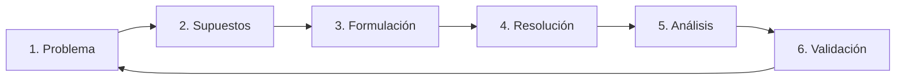
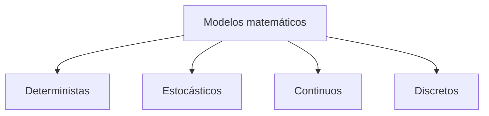

# Definición de problemas y ciclo de modelación

## Pregunta central

¿Cómo se transforma una pregunta sobre un fenómeno en un modelo matemático que pueda resolverse, analizarse y validarse?

## Ejemplo: crecimiento de una población

Consideremos una población inicial de 1000 bacterias:

$$
P(0)=1000,
$$

donde $P(t)$ representa el número de individuos en el tiempo $t$. Sus unidades son:

$$
[P]=\text{individuos}, \qquad [t]=\text{horas}.
$$

Si suponemos que una población mayor produce más nacimientos por unidad de tiempo y que la tasa de cambio es proporcional a la población, obtenemos:

$$
\frac{dP}{dt}=kP,
$$

donde $k$ es una constante de proporcionalidad. Este modelo produce [[Crecimiento exponencial|crecimiento exponencial]] y puede resolverse mediante separación de variables.

> [!important]
> El comportamiento del modelo depende de sus supuestos. En este caso se supone una tasa de crecimiento constante y no se incorporan límites de recursos.

Una alternativa que introduce una capacidad de carga es el modelo de [[Crecimiento logístico|crecimiento logístico]]:

$$
\frac{dP}{dt}=rP\left(1-\frac{P}{K}\right),
$$

donde $r$ es la tasa de crecimiento y $K$ la capacidad de carga.

Resolver este modelo una sola vez puede ser barato. Resolverlo para miles de combinaciones de parámetros puede convertirse en un [[Experimento computacional|experimento computacional]] costoso.

> [!note]
> Un modelo es adecuado cuando responde la pregunta dentro del contexto para el que fue formulado.

## Ciclo de modelación

### 1. Plantear el problema

Una [[Pregunta modelable|pregunta modelable]] debe ser específica. Ejemplos:

- ¿Cuántos contagios esperamos en 30 días?
- ¿Qué ocurre si reducimos la tasa de contagio en 20 %?
- ¿En qué momento se alcanza el máximo de personas infectadas?

**Ejercicio:** tomar el fenómeno del tráfico en una avenida y formular una pregunta modelable. Una posible formulación es:

> ¿Cómo cambia el tiempo promedio de recorrido de los automóviles en una avenida de 3 km, entre las 7:00 y las 9:00, si la duración de la luz verde aumenta de 45 a 60 segundos y se mantiene la misma tasa de llegada de vehículos?

Esta pregunta identifica el sistema, el intervalo de observación, la magnitud que se quiere estimar y una intervención concreta. Para responderla todavía habría que medir o estimar la tasa de llegada, la capacidad de cada carril, los tiempos de los semáforos y la distribución actual de los recorridos. También habría que declarar supuestos, por ejemplo que no ocurren accidentes ni cierres de carril durante el periodo estudiado.

### 2. Elegir supuestos

Un buen supuesto:

- es explícito;
- se justifica mediante la escala del problema o los datos;
- simplifica sin destruir los aspectos esenciales del fenómeno;
- puede revisarse posteriormente;
- permite reproducir el razonamiento del modelo.

Supuestos peligrosos:

- permanecen ocultos;
- son imposibles de verificar;
- contradicen datos básicos;
- se utilizan únicamente porque facilitan una fórmula.

### 3. Formular el modelo

La formulación depende del fenómeno:

- **Ecuaciones algebraicas:** equilibrios o relaciones instantáneas.
- **Ecuaciones diferenciales:** cambio continuo en el tiempo o el espacio.
- **Ecuaciones en diferencias:** actualización por pasos.
- **Modelos probabilísticos:** incertidumbre representada explícitamente.

Por ejemplo:

$$
P_{n+1}=1.05P_n
\qquad \text{y} \qquad
\frac{dP}{dt}=0.05P
$$

representan crecimiento, pero el primero actualiza la población por pasos y el segundo modela un cambio continuo.

### 4. Resolver

#### Solución analítica

- Produce una fórmula cerrada cuando existe.
- Puede facilitar la interpretación.
- No siempre existe o resulta sencilla.

#### Solución numérica

- Produce una aproximación computacional.
- Permite estudiar modelos más realistas o complejos.
- Requiere examinar error, estabilidad y costo computacional.

En el curso interesan ambas: comprender la estructura matemática y simularla con herramientas computacionales.

### 5. Analizar los resultados

Después de resolver, debemos preguntar:

- ¿Tienen sentido el signo y la escala de la solución?
- ¿Qué ocurre cuando cambian los parámetros?
- ¿Existen equilibrios o límites?
- ¿La predicción es sensible a las condiciones iniciales?

**Ejercicio:** si una simulación de poblaciones produce valores negativos, determinar si el problema procede de las matemáticas, la implementación computacional, el modelo o la interpretación.

La respuesta no puede decidirse mirando únicamente la gráfica. Conviene revisar las posibilidades en este orden:

1. **Modelo matemático.** Hay que comprobar si la ecuación conserva la no negatividad. En el crecimiento exponencial continuo,

   $$
   P(t)=P_0e^{kt},
   $$

   una condición inicial $P_0\geq0$ nunca produce una población negativa. Si la solución analítica es negativa, entonces se aplicó mal la fórmula o se eligió un modelo inadecuado.

2. **Método numérico.** Una aproximación puede violar una propiedad que sí conserva la solución exacta. Para el decaimiento

   $$
   \frac{dP}{dt}=-\lambda P,
   $$

   Euler explícito produce

   $$
   P_{n+1}=(1-\lambda h)P_n.
   $$

   Si $h>1/\lambda$, el factor $1-\lambda h$ es negativo y la aproximación cambia de signo. En ese caso el problema es un tamaño de paso demasiado grande, no una población realmente negativa.

3. **Implementación.** Deben revisarse signos, unidades, índices, condiciones iniciales y orden de actualización. Por ejemplo, confundir horas con minutos multiplica de manera implícita el tamaño de paso por 60.

4. **Interpretación.** Valores negativos muy pequeños, como $-10^{-12}$, pueden deberse al redondeo de punto flotante; no deben interpretarse como individuos. Truncarlos a cero puede ser razonable para presentar el resultado, pero no sustituye el diagnóstico.

5. **Supuestos.** Si el método y el código son correctos, un valor no físico indica que el modelo se está usando fuera del contexto para el que fue formulado. Entonces hay que modificar los supuestos o elegir otra formulación.

### 6. Validar

[[Validación de un modelo|Validar un modelo]] implica contrastarlo con:

- datos observados;
- conocimiento físico, biológico o social previo;
- casos límite conocidos;
- otras simulaciones o modelos de referencia.

Una curva visualmente convincente no constituye una buena validación si no se compara con datos ni se reporta el error.

Además de preguntar si el modelo describe el fenómeno, debemos evaluar:

- ¿Cuánto cuesta simularlo?
- ¿Puede paralelizarse?
- ¿Cómo crece el costo al aumentar la resolución?

## Clasificación inicial de modelos

### Deterministas y estocásticos

Un modelo determinista produce la misma salida cuando se repiten exactamente las mismas condiciones iniciales y los mismos parámetros.

Ejemplos mencionados:

- Movimiento ideal de un proyectil sin viento.
- Crecimiento exponencial con tasa fija.
- Enfriamiento de Newton con temperatura ambiente constante.

Un **modelo estocástico** incorpora una o más variables aleatorias, por lo que las mismas condiciones iniciales y los mismos parámetros pueden producir realizaciones distintas. Su resultado no es una sola trayectoria predeterminada, sino una distribución de posibles resultados o cantidades que la resumen, como la media y la varianza.

Por ejemplo, si $Q_n$ es la cantidad de automóviles que esperan en un semáforo al inicio del minuto $n$, puede modelarse la fila mediante

$$
Q_{n+1}=\max\{0,Q_n+A_n-c\},
$$

donde $c$ es la cantidad de automóviles que alcanza a cruzar durante ese minuto y

$$
A_n\sim\operatorname{Poisson}(\lambda)
$$

representa las llegadas aleatorias con un promedio de $\lambda$ vehículos por minuto. Aunque $Q_0$, $c$ y $\lambda$ no cambien, cada simulación puede generar una fila distinta. El modelo es discreto y estocástico.

Los modelos deterministas suelen ser más fáciles de analizar, pero pueden ocultar variabilidad real o incertidumbre de medición. Los modelos estocásticos permiten representar esa variabilidad, aunque requieren múltiples realizaciones y análisis estadístico.

### Continuos y discretos

- En un **modelo continuo**, la variable puede cambiar en todo instante; suele representarse mediante ecuaciones diferenciales.
- En un **modelo discreto**, la variable se actualiza por pasos; puede representarse mediante ecuaciones en diferencias.

## Modelos y paralelismo

### Muchos escenarios independientes

- Barridos de parámetros.
- Simulaciones de Monte Carlo.
- Validación con muchas condiciones iniciales.

### Problemas acoplados

- Mallas espaciales.
- Sistemas grandes de ecuaciones.
- Comunicación entre procesos.

En esta unidad se utilizará principalmente la primera estrategia: ejecutar muchos casos pequeños, independientes y reproducibles.

## Dudas y ejercicios resueltos

- [x] Formular una pregunta modelable sobre tráfico en una avenida.
- [x] Resolver el tiempo de duplicación del modelo exponencial.
- [x] Analizar el origen de valores poblacionales negativos en una simulación.
- [x] Completar la definición y un ejemplo de modelo estocástico.
- [x] Precisar qué medidas de error y validación se utilizarán en el curso.

### Tiempo de duplicación

Para el modelo

$$
P(t)=P_0e^{kt},
$$

el tiempo de duplicación $t_d$ satisface $P(t_d)=2P_0$. Por lo tanto,

$$
2P_0=P_0e^{kt_d}
\quad\Longrightarrow\quad
2=e^{kt_d}
\quad\Longrightarrow\quad
t_d=\frac{\ln 2}{k},
$$

siempre que $k>0$. Por ejemplo, si $k=0.05\ \text{h}^{-1}$,

$$
t_d=\frac{\ln 2}{0.05}\approx13.86\ \text{h}.
$$

El tiempo de duplicación no depende de $P_0$, pero sí de que la tasa relativa $k$ permanezca constante.

### Medidas de error y estrategia de validación

No existe una única medida adecuada para todos los modelos. Para los ejercicios del curso se puede usar el siguiente conjunto mínimo:

- **Error absoluto puntual:**

  $$
  E_i=|y_i-\widehat y_i|.
  $$

  Conserva las unidades de la variable y permite interpretar directamente cuánto se aparta una predicción.

- **Error relativo puntual:**

  $$
  E_{r,i}=\frac{|y_i-\widehat y_i|}{|y_i|},
  $$

  siempre que $y_i\neq0$. Facilita comparar errores entre escalas distintas.

- **Error absoluto medio (MAE):**

  $$
  \operatorname{MAE}=\frac{1}{N}\sum_{i=1}^N|y_i-\widehat y_i|.
  $$

- **Raíz del error cuadrático medio (RMSE):**

  $$
  \operatorname{RMSE}=\sqrt{\frac{1}{N}\sum_{i=1}^N(y_i-\widehat y_i)^2}.
  $$

  Penaliza más los errores grandes que el MAE.

La validación debe incluir también comprobaciones cualitativas: unidades consistentes, signos y cotas físicas, comportamiento en casos límite y comparación con datos que no se hayan usado para ajustar los parámetros. En modelos numéricos, además, se debe repetir el cálculo con una resolución mayor o un paso menor; si el resultado cambia de forma importante, todavía no hay evidencia de convergencia.

> [!important]
> Estas medidas forman una guía inicial. La métrica principal debe elegirse según la pregunta: para una población interesa respetar la no negatividad; para tráfico pueden importar el tiempo medio, la variabilidad y los retrasos extremos; en un modelo estocástico se comparan distribuciones o sus resúmenes, no únicamente una trayectoria.

## Conceptos extraídos

- [[Ciclo de modelación|Ciclo de modelación]]
- [[Pregunta modelable|Pregunta modelable]]
- [[Crecimiento exponencial|Crecimiento exponencial]]
- [[Crecimiento logístico|Crecimiento logístico]]
- [[Solución analítica y solución numérica|Solución analítica y solución numérica]]
- [[Validación de un modelo|Validación de un modelo]]
- [[Clasificación de modelos matemáticos|Clasificación de modelos matemáticos]]

## Referencias mencionadas

- No se registró bibliografía externa durante la clase; las formulaciones se reconstruyeron a partir de los apuntes.
- La formulación del crecimiento exponencial y el análisis del error numérico se conectan con [[2026-08-17 ModMat - Modelos de cambio y método de Euler|Modelos de cambio y método de Euler]].

## Resumen después de clase

Modelar comienza por convertir una inquietud amplia en una pregunta específica, definir las variables y hacer explícitos los supuestos. Después se formula y resuelve el modelo, pero el proceso no termina ahí: hay que analizar si los resultados tienen sentido y compararlos con datos o casos conocidos. Un modelo puede ser determinista o estocástico, continuo o discreto; estas clasificaciones describen aspectos distintos y pueden combinarse. La solución analítica ayuda a entender la estructura del problema, mientras que la solución numérica permite estudiar modelos más complejos a cambio de controlar el error, la estabilidad y el costo computacional. Si el resultado contradice una restricción física, primero hay que averiguar si falla el modelo, el método numérico, la implementación o la interpretación.
