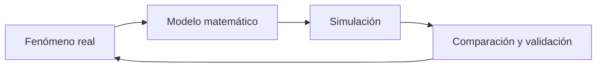

# Introducción al modelado matemático

## Pregunta central

¿Qué significa modelar un fenómeno y cómo se transforma un modelo matemático en un experimento computacional?

## ¿Qué es modelar?

Modelar consiste en abstraer un fenómeno real mediante una representación matemática que pueda analizarse o resolverse con ayuda de una simulación y compararse posteriormente con la realidad.

> [!important]
> Un modelo conserva lo importante para una pregunta concreta y descarta los detalles que no son esenciales para responderla.

## Partes de un modelo

- **Variables:** magnitudes que cambian o se calculan, por ejemplo $P(t)$.
- **Parámetros:** cantidades que caracterizan el fenómeno, por ejemplo $r$ o $K$.
- **Relaciones:** reglas que conectan variables y parámetros, por ejemplo:

$$
\frac{dP}{dt}=rP.
$$

Una misma cantidad puede funcionar como variable o parámetro según la escala y la pregunta del problema.

## Supuestos: el corazón del modelo

Un supuesto es una decisión explícita acerca de qué se considera válido dentro del modelo. Ejemplos:

- La población tiene recursos ilimitados.
- La temperatura ambiente se mantiene constante.
- La tasa de contacto entre individuos es homogénea.
- El error de medición es pequeño.

> [!note]
> Un modelo no se evalúa simplemente por ser “verdadero”, sino por ser útil para una pregunta y suficientemente consistente con los datos disponibles.

## Del modelo al experimento computacional

El proceso puede distinguirse en tres niveles:

1. **Modelo matemático:** ecuaciones, variables, parámetros y supuestos.
2. **Algoritmo:** procedimiento para aproximar, simular o evaluar el modelo.
3. **Ejecución computacional:** tamaño del problema, tiempo de cómputo, memoria y paralelismo.

Resolver una ecuación logística una vez es barato. Resolverla para miles de combinaciones de $r$, $K$ y $P_0$ se aproxima a un experimento computacional y puede justificar el uso de HPC.

## Conceptos extraídos

- [[03_Conceptos/Modelo matemático|Modelo matemático]]
- [[03_Conceptos/Variable y parámetro de un modelo|Variable y parámetro de un modelo]]
- [[03_Conceptos/Supuesto de modelación|Supuesto de modelación]]
- [[03_Conceptos/Experimento computacional|Experimento computacional]]

## Dudas

- [ ] Precisar los criterios de validación que se usarán en el curso.
- [ ] Identificar los benchmarks y recursos de HPC disponibles.

## Resumen después de clase

Un modelo es una abstracción orientada a una pregunta, no una reproducción total de la realidad. Su utilidad depende de variables, parámetros, relaciones y supuestos explícitos. Para estudiar el modelo computacionalmente es necesario traducirlo a un algoritmo y considerar el costo de ejecución. La cantidad de escenarios, parámetros o datos puede convertir una simulación sencilla en un experimento que requiera HPC.

