![[Programación Avanzada Notas 3.pdf]]
# Ocho reinas y cuadros mágicos

## Pregunta central

¿Cómo se construyen soluciones combinatorias mediante **backtracking** y cuándo conviene reemplazar la exploración exhaustiva por una **regla de construcción**?

## Mapa de la clase

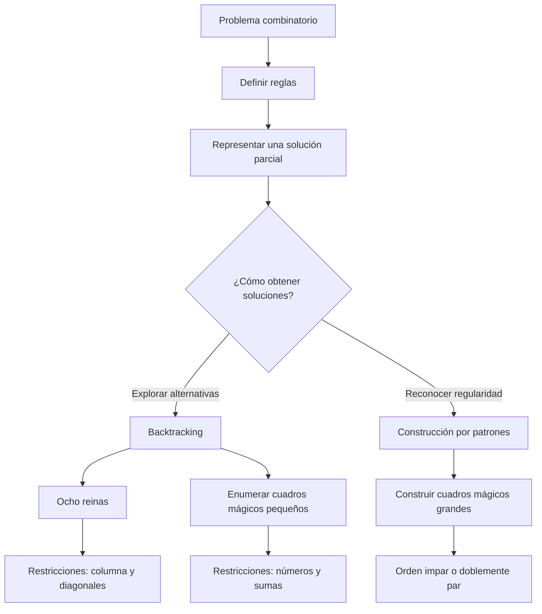

La clase continúa [[Backtracking|backtracking]], visto en la sesión anterior, y lo aterriza en dos problemas. En ambos se construye una solución parcial colocando una pieza o un número. La diferencia importante es que las ocho reinas se resuelven naturalmente explorando un árbol con poda, mientras que ciertos cuadros mágicos admiten patrones que producen una solución directamente.

---

## 1. Esquema general de backtracking

Backtracking recorre en profundidad un árbol de decisiones. En cada nivel:

1. elige un candidato;
2. comprueba si conserva las restricciones;
3. avanza si el estado parcial sigue siendo válido;
4. registra el estado si ya es una solución completa;
5. deshace la elección para probar la siguiente alternativa.

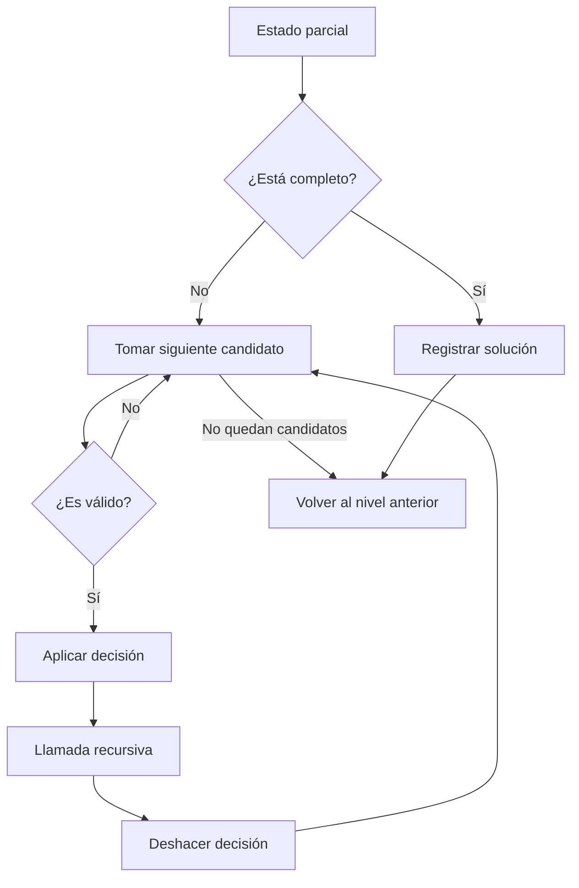

```text
buscar(estado, nivel):
    si estado está completo:
        registrar(estado)
        regresar

    para cada candidato del nivel:
        si candidato es compatible con estado:
            aplicar(candidato)
            buscar(estado, nivel + 1)
            deshacer(candidato)
```

> [!important]
> La validez se comprueba sobre la **solución parcial**, no solo al final. Rechazar temprano una rama imposible es la [[Poda del espacio de búsqueda|poda del espacio de búsqueda]].

---

## 2. Problema de las ocho reinas

### Enunciado y objetivo

Se deben colocar ocho reinas en un tablero de $8\times 8$ sin que ninguna ataque a otra. Una reina ataca a cualquier distancia en su fila, columna y diagonales.

La presentación distingue tres preguntas:

- **Primera solución:** detener la búsqueda al encontrar una configuración válida.
- **Todas las soluciones:** registrar una solución y continuar.
- **Mejor solución:** exigiría definir primero un criterio de calidad; el enunciado clásico solo distingue configuraciones válidas e inválidas.

El programa visto en clase enumera **92 soluciones**. Si se consideran equivalentes las configuraciones obtenidas mediante las simetrías del cuadrado —rotaciones y reflexiones— quedan **12 soluciones fundamentales**.

> [!note]
> La diapositiva menciona “rotaciones y traslaciones”. En un tablero fijo, la equivalencia habitual de las 92 soluciones usa rotaciones y reflexiones; una traslación generalmente saca piezas del tablero o cambia la configuración de una forma que no es una simetría del cuadrado.

![[Eight-queens-animation.gif]]

### Reducción del problema: una reina por fila

En vez de probar 64 casillas para cada reina, el algoritmo fija una reina en cada fila. En el nivel recursivo $k$ solo decide su columna $j$. Así, dos reinas nunca comparten fila por construcción.

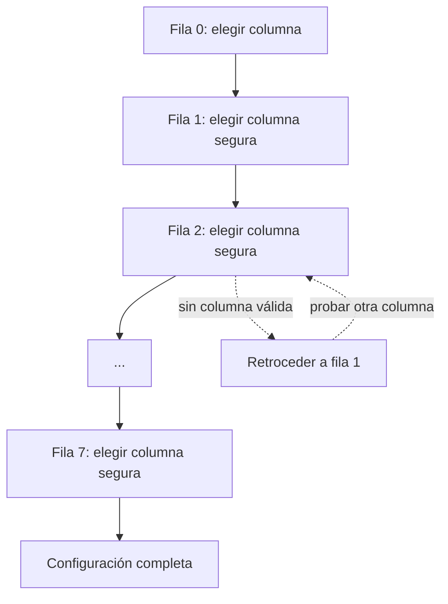

La solución se representa con un vector:

$$
\texttt{sol}[k]=j,
$$

donde $k$ es la fila y $j$ la columna elegida. El código usa filas internas $0,\ldots,7$ y columnas $1,\ldots,8$.

### Cómo detectar ataques en tiempo constante conceptual

Para una casilla $(k,j)$ basta vigilar tres identificadores:

| Restricción | Identificador guardado | Razón |
|---|---:|---|
| columna | $j$ | dos reinas se atacan si comparten columna |
| diagonal de $45^\circ$ | $j-k$ | la diferencia es constante sobre esa diagonal |
| diagonal de $135^\circ$ | $j+k$ | la suma es constante sobre esa diagonal |

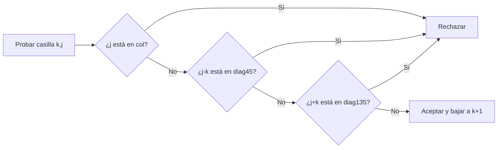

Ejemplo: $(k,j)=(2,5)$ y $(4,7)$ comparten diagonal porque $5-2=7-4=3$. En cambio, $(2,5)$ y $(4,3)$ comparten la otra diagonal porque $5+2=3+4=7$.

### Traza paso a paso del estado

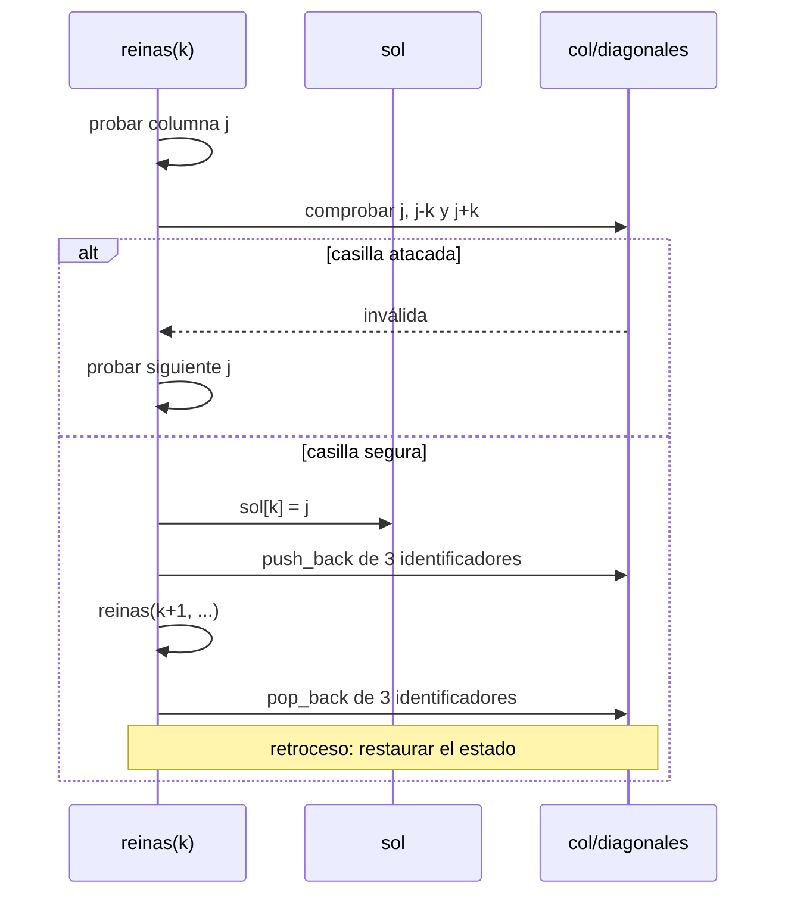

Un fragmento del árbol deja ver la poda. Los números son columnas:

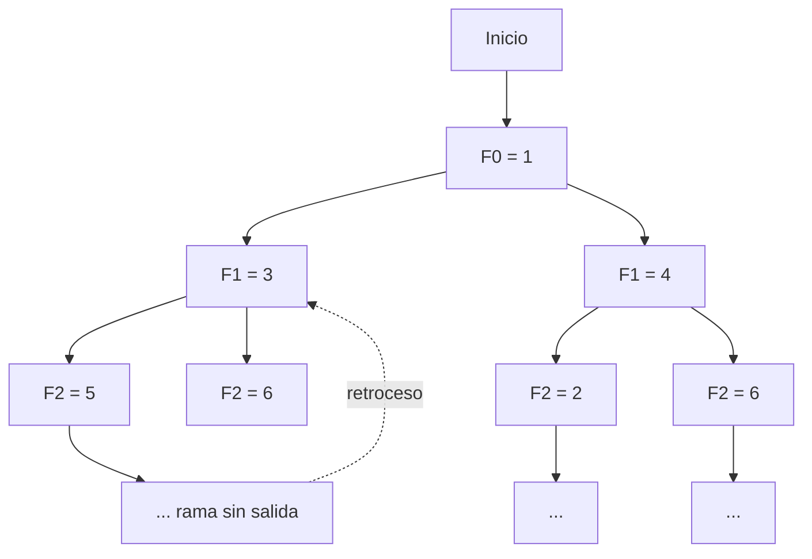

No se generan hijos para columnas o diagonales ocupadas: esos subárboles se eliminan antes de explorarlos.

### Código visto en clase

El archivo se llama `Ocho reinas.c`, pero contiene C++: usa `iostream`, `vector`, `algorithm` y `cout`. Por ello debe compilarse como C++.

```cpp
#include <iostream>
#include <sstream>
#include <cstdio>
#include <vector>
#include <algorithm>
#define NREINAS 8
using namespace std;

vector<int> sol;
int nro_sol = 1;

inline bool contiene(const vector<int>& v, const int val)
{
    return find(v.begin(), v.end(), val) != v.end();
}

void reinas(int k, vector<int> col,
            vector<int> diag45, vector<int> diag135)
{
    if (k == NREINAS)
    {
        printf("%3d:", nro_sol++);
        for (int j = 0; j < NREINAS; j++)
            cout << " (" << j + 1 << "," << sol[j] << ")";
        cout << endl;
    }
    else
    {
        for (int j = 1; j <= NREINAS; j++)
            if (!contiene(col, j) &&
                !contiene(diag45, j - k) &&
                !contiene(diag135, j + k))
            {
                sol[k] = j;

                col.push_back(j);
                diag45.push_back(j - k);
                diag135.push_back(j + k);

                reinas(k + 1, col, diag45, diag135);

                col.pop_back();
                diag45.pop_back();
                diag135.pop_back();
            }
    }
}

int main()
{
    cout << "SOLUCIONES AL PROBLEMA DE LAS "
         << NREINAS << " REINAS";
    sol.resize(NREINAS);
    reinas(0, vector<int>(), vector<int>(), vector<int>());
    return 0;
}
```

#### Lectura del programa

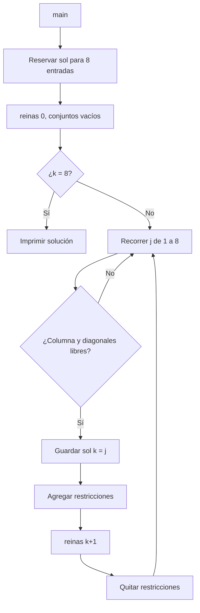

- `contiene` comprueba si un identificador ya está ocupado.
- `k == NREINAS` significa que se colocaron las ocho reinas.
- Los vectores de restricciones se pasan **por valor**. Cada llamada recibe copias; aun así el código hace `pop_back()` al volver. Esos `pop_back()` expresan el retroceso, aunque no son necesarios para proteger al nivel llamador porque las copias son locales.
- `sol` sí es global y se modifica por nivel. No necesita “borrarse”: al explorar otra rama, cada posición relevante se sobrescribe antes de imprimir una nueva solución completa.
- `find` hace una búsqueda lineal. Para $N=8$ es suficiente; para $n$ grande podrían usarse arreglos booleanos o conjuntos para consultar ocupación en $O(1)$ esperado.

### Costo

La estrategia de una reina por fila parte de hasta $8^8$ asignaciones, pero la restricción de columnas reduce el universo a $8!$ permutaciones y las diagonales podan muchas más ramas. Para $n$ reinas, el tiempo sigue siendo exponencial en el peor caso; la memoria de la búsqueda es $O(n)$, sin contar las soluciones almacenadas o impresas.

---

## 3. Cuadros mágicos

### Definición

Un [[Cuadro mágico|cuadro mágico]] normal de orden $n$ coloca una vez cada entero de $1$ a $n^2$ en una matriz $n\times n$, de modo que todas las filas, columnas y las dos diagonales principales sumen lo mismo.

La constante mágica se deduce sin buscar:

$$
1+2+\cdots+n^2=\frac{n^2(n^2+1)}{2}.
$$

Como las $n$ filas tienen suma común $M_n$,

$$
nM_n=\frac{n^2(n^2+1)}{2}
\quad\Longrightarrow\quad
\boxed{M_n=\frac{n(n^2+1)}{2}}.
$$

| Orden $n$ | Constante $M_n$ |
|---:|---:|
| 1 | 1 |
| 3 | 15 |
| 4 | 34 |
| 5 | 65 |
| 6 | 111 |
| 7 | 175 |
| 8 | 260 |
| 9 | 369 |

### Formulación como backtracking

Una solución parcial coloca un número no usado en una casilla vacía. La búsqueda debe impedir números repetidos y podar cuando una suma parcial supera $M_n$ o cuando una línea completa no suma exactamente $M_n$.

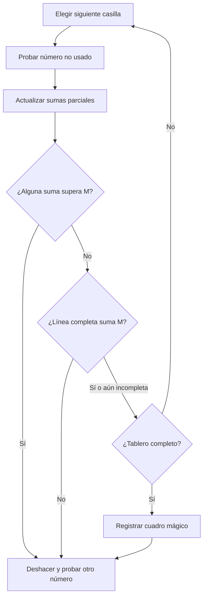

Este enfoque sirve para **enumerar** soluciones, pero crece con enorme rapidez. La presentación señala como tarea escribir un programa imperativo que muestre todos los cuadros de orden leído por el programa, limitándose en la práctica a $n=3,4$ o $5$ por el tiempo de ejecución.

Para orden 3 existe una solución fundamental, cuyas rotaciones y reflexiones producen las demás orientaciones. La presentación reporta 880 cuadros de orden 4 y 275,305,224 de orden 5.

---

## 4. Solución por patrones

La [[Construcción por patrones|construcción por patrones]] observa soluciones conocidas, identifica una regla y la replica. No enumera candidatos: genera directamente un cuadro válido. Por eso puede construir órdenes mayores con mucha más rapidez que backtracking.

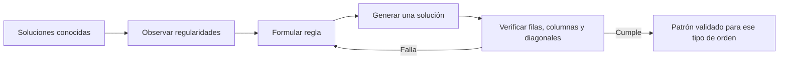

### Órdenes impares: método siamés

Los ejemplos de $7\times7$ y $9\times9$ siguen el patrón para órdenes impares:

1. colocar el 1 en el centro de la fila superior;
2. para el siguiente número, intentar subir una fila y avanzar una columna a la derecha;
3. si se sale del tablero, reaparecer por el borde contrario;
4. si la casilla destino ya está ocupada, bajar una fila desde la posición actual;
5. repetir hasta colocar $n^2$.

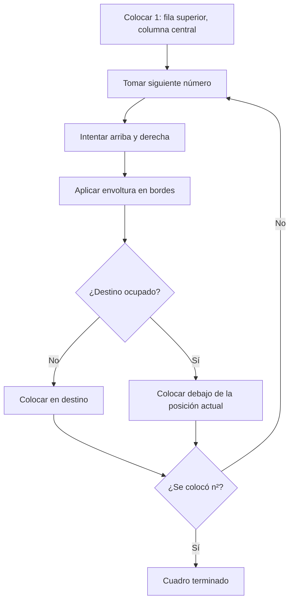

En forma modular, desde $(f,c)$ se propone

$$
(f',c')=((f-1)\bmod n,(c+1)\bmod n).
$$

Si $(f',c')$ está ocupada, se usa $((f+1)\bmod n,c)$. El cuadro de $9\times9$ del material suma $369$ en cada fila, columna y diagonal.

![[Cuadro Mágico 9x9.jpg]]

### Órdenes doblemente pares: $n\equiv0\pmod4$

Los ejemplos $4\times4$ y $8\times8$ pueden construirse llenando primero la matriz en orden con $1,2,\ldots,n^2$ y sustituyendo ciertas casillas por su complemento

$$
x\longmapsto n^2+1-x.
$$

En cada bloque $4\times4$ se conservan las casillas de sus dos diagonales y se complementan las restantes —o se usa la convención inversa; ambas producen una orientación válida—. Para decidir si una casilla local $(i,j)$ pertenece a esas diagonales:

$$
i\bmod4=j\bmod4
\quad\text{o}\quad
(i\bmod4)+(j\bmod4)=3.
$$

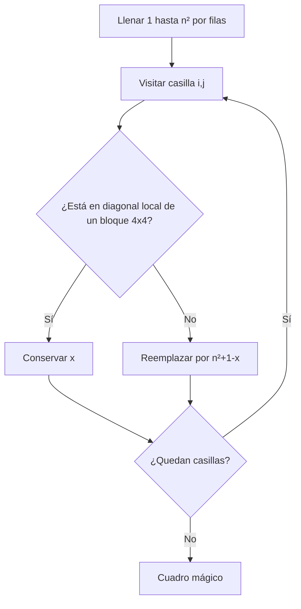

> [!warning]
> Estos patrones no son intercambiables: el método siamés requiere $n$ impar y el método de complementos descrito requiere $n$ múltiplo de 4. Los órdenes pares que no son múltiplos de 4, como $6$, necesitan otra construcción.

---

## 5. Comparación de las técnicas

| Aspecto            | Backtracking                            | Construcción por patrones              |
| ------------------ | --------------------------------------- | -------------------------------------- |
| Propósito          | explorar una, todas o la mejor solución | producir directamente una solución     |
| Espacio conceptual | árbol de decisiones                     | secuencia determinista                 |
| Mecanismo clave    | poda y retroceso                        | regla según el tipo de orden           |
| Ventaja            | generalidad y enumeración               | rapidez y escalabilidad                |
| Desventaja         | costo exponencial frecuente             | exige descubrir y justificar un patrón |
| Ejemplo central    | ocho reinas                             | cuadros mágicos 4×4, 7×7, 8×8 y 9×9    |

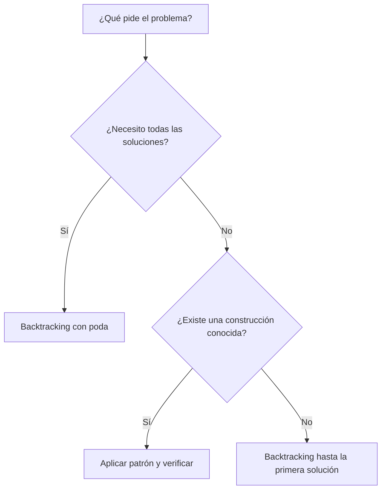

## Errores conceptuales que conviene evitar

- Una solución parcial no tiene que ser completa, pero sí debe respetar todas las restricciones que ya pueden comprobarse.
- `push_back` representa aplicar una decisión y `pop_back` deshacerla; la llamada recursiva ocurre entre ambas operaciones.
- Las diagonales no se comparan recorriendo todo el tablero: $j-k$ y $j+k$ las identifican.
- Las 12 soluciones fundamentales de las ocho reinas no significan que el programa imprima solo 12; el programa imprime 92 porque no elimina simetrías.
- Un patrón que funciona para orden impar no necesariamente funciona para orden par.
- Construir un cuadro mágico y enumerar todos los cuadros mágicos son problemas computacionales distintos.

## Preguntas de recuperación activa

1. ¿Por qué colocar exactamente una reina por fila elimina una restricción sin comprobarla?
2. ¿Qué representan $j-k$ y $j+k$ en el programa?
3. ¿En qué orden ocurren elegir, validar, avanzar y deshacer?
4. ¿Por qué el caso `k == NREINAS` representa una solución completa?
5. ¿Cómo se obtiene $M_n=\frac{n(n^2+1)}2$?
6. ¿Qué hace el método siamés cuando la casilla arriba-derecha está ocupada?
7. ¿Cuál es la diferencia entre enumerar cuadros con backtracking y construir uno por patrón?

## Conceptos atómicos

- [[Backtracking|Backtracking]]
- [[Problema de las ocho reinas|Problema de las ocho reinas]]
- [[Poda del espacio de búsqueda|Poda del espacio de búsqueda]]
- [[Cuadro mágico|Cuadro mágico]]
- [[Construcción por patrones|Construcción por patrones]]

## Material de la clase

- ![[Programación Avanzada Notas 3.pdf]]
- ![[Cuadros mágicos.pdf]]
- [[Ocho reinas.c|Código de ocho reinas]]
- ![[Eight-queens-animation.gif]]
- ![[Cuadro Mágico 9x9.jpg]]

## Resumen después de clase

Las ocho reinas muestran cómo backtracking convierte un problema en un árbol de soluciones parciales: cada nivel asigna una columna a una fila, las columnas y diagonales ocupadas podan decisiones inválidas y el retroceso permite continuar con la siguiente alternativa. Los cuadros mágicos pueden formularse del mismo modo para enumerar soluciones, pero su crecimiento hace atractiva otra técnica: reconocer patrones. El método siamés construye órdenes impares y el método de complementos construye órdenes múltiplos de cuatro, ilustrando que una regla especializada puede superar ampliamente a una búsqueda general cuando solo se necesita una solución.
