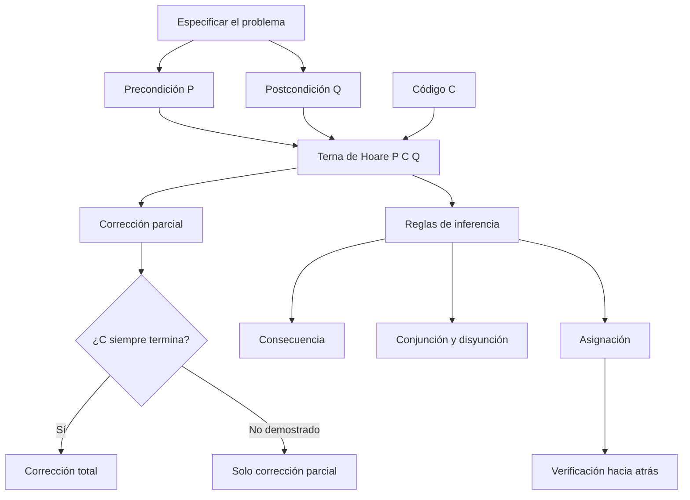
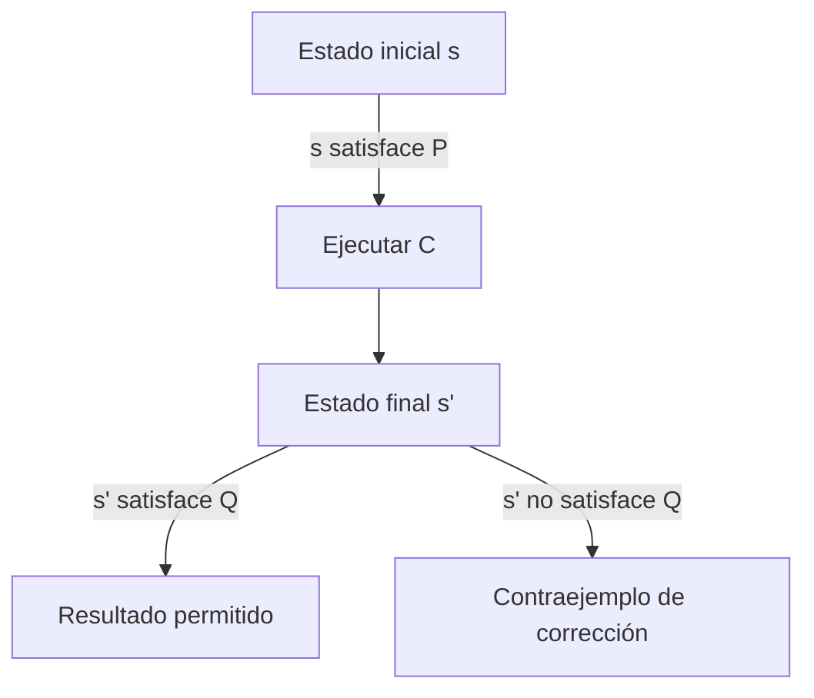
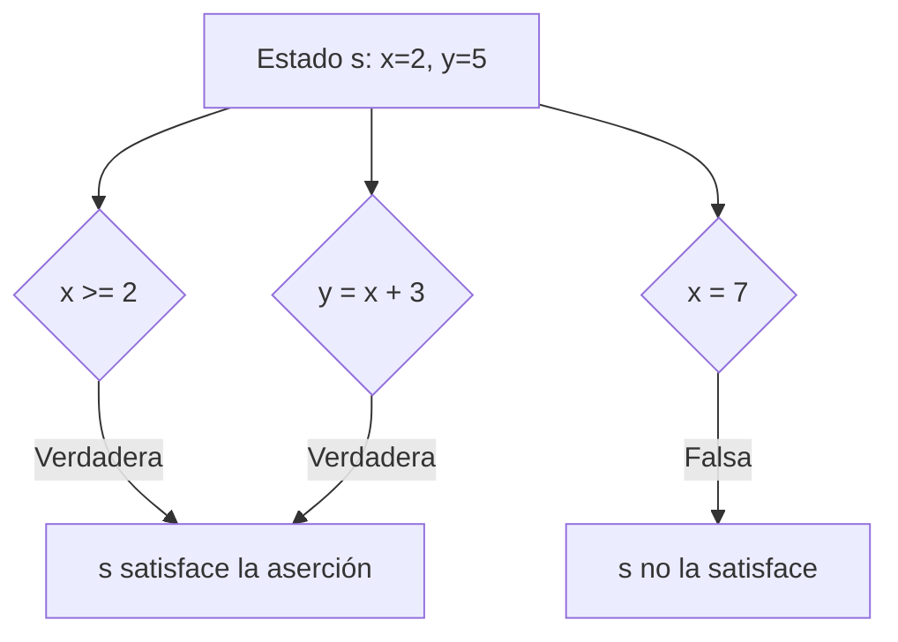
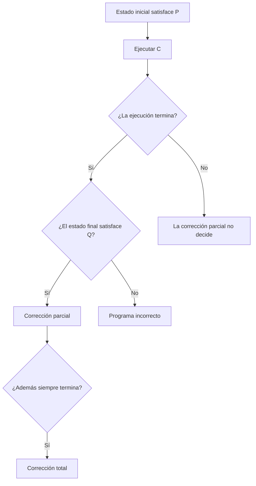
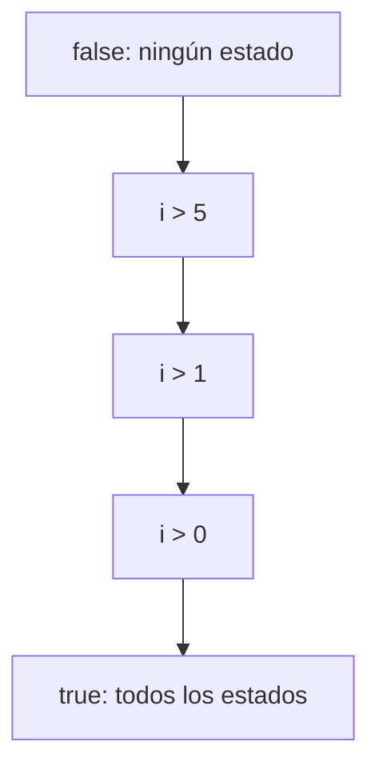
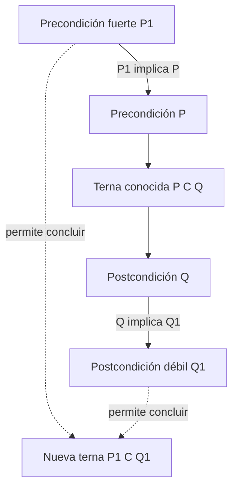
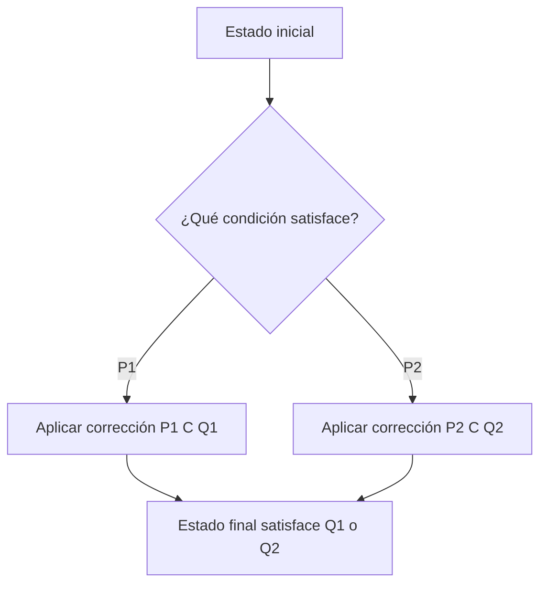
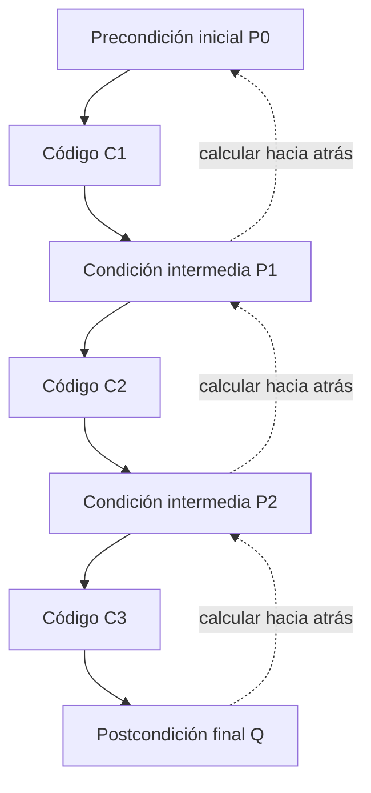
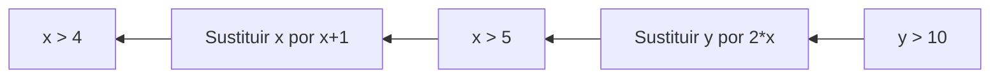

![[Programación Avanzada Notas 4 2027.pdf]]
# Ternas de Hoare y demostración formal

Recursos útiles:
- https://www.cl.cam.ac.uk/archive/mjcg/HoareLogic/Lectures/AllLectures.pdf


## Pregunta central

¿Cómo se demuestra, mediante lógica, que un programa transforma todo estado de entrada permitido en un estado de salida que cumple su especificación?

## Mapa de la clase



La clase introduce la [[Verificación formal de programas|verificación formal]] mediante [[Terna de Hoare|ternas de Hoare]]. El punto central es separar tres piezas: qué estados iniciales son válidos, qué código se ejecuta y qué estados finales se aceptan. Después se estudian reglas para transformar especificaciones y, finalmente, la regla de asignación que permite razonar desde la salida deseada hacia la entrada necesaria. *(Diap. 1–27; láminas 55–81.)*

---

## 1. Qué significa que un programa sea correcto

Un programa es correcto respecto de una especificación cuando, para toda entrada admitida, produce la salida esperada. Esta noción se concentra en el comportamiento funcional; por sí sola no afirma que el programa sea rápido, use poca memoria o tenga código optimizado. *(Diap. 1.)*

La demostración formal aplica reglas lógicas al código en lugar de depender únicamente de ejecuciones de prueba. Las pruebas siguen siendo útiles para encontrar fallos, pero solo cubren casos concretos; una demostración pretende abarcar todos los estados que satisfacen la especificación. Las ternas fueron propuestas por C. A. R. Hoare, también creador de QuickSort. *(Diap. 2.)*



Ejemplo: para un procedimiento que calcula una raíz cuadrada real puede especificarse:

$$
P(n): n\ge 0,
\qquad
Q(n,r): r\ge 0\land r^2=n.
$$

La precondición excluye entradas fuera del dominio real y la postcondición describe exactamente qué salida se considera correcta. *(Diap. 6.)*

```text
raiz(n):
    requiere n >= 0
    r <- calcular_raiz(n)
    asegura r >= 0 y r*r = n
    devolver r
```

> [!important]
> La corrección siempre es relativa a una especificación. Un programa no es “correcto en abstracto”: es correcto con respecto a una precondición y una postcondición determinadas.

---

## 2. Aserciones, precondiciones, postcondiciones y estados

Una [[Aserción de programa|aserción]] es una fórmula lógica sobre las variables del programa. Puede aparecer antes de un fragmento como **precondición** $P$ o después como **postcondición** $Q$. Las reglas de inferencia parten de aserciones conocidas y obtienen otras aserciones válidas. *(Diap. 3–4.)*

Ejemplos:

$$
x=3\land y\le z\land z>4,
\qquad x^2\ne 3,
\qquad a=b\land i\ge j.
$$

Un [[Estado de programa|estado]] es una asignación de valores a todas las variables relevantes. Se escribe $s\models P$ cuando el estado $s$ satisface la aserción $P$. El código transforma un estado inicial en uno final; la concatenación $C_1;C_2$ ejecuta primero $C_1$ y luego $C_2$. *(Diap. 5 y 7.)*

Ejemplos de satisfacción:

- $\{x=2\}\models x\ge 2$.
- Un estado descrito solo por $x\ge2$ no garantiza $x=2$: podría tener $x=5$.



### La aserción vacía

Las diapositivas escriben `{ }` para la aserción que no restringe ningún estado. Para evitar confundirla con un conjunto vacío, aquí también se denota por $\top$ (*true*):

$$
\{\}\equiv\top,
\qquad
\top\land P\equiv P,
\qquad
\top\lor P\equiv\top.
$$

También son equivalentes a $\top$ las tautologías $k=k$ o $(a+b)=(a+b)$. *(Diap. 8–9.)*

```python
def satisface(estado, asercion):
    """Una aserción se interpreta como un predicado del estado."""
    return asercion(estado)

estado = {"x": 2, "y": 5}
assert satisface(estado, lambda s: s["x"] >= 2)
assert satisface(estado, lambda s: s["y"] == s["x"] + 3)
```

---

## 3. Terna de Hoare

Una terna tiene la forma:

$$
\{P\}\ C\ \{Q\}.
$$

Su lectura es: si la ejecución de $C$ comienza en un estado que satisface $P$ y termina, el estado final satisface $Q$. *(Diap. 8 y 10.)*. 

Una manera intuitiva de entender esta  tripleta  es como: 
$$
 \underbrace{P}_{\text{estado antes}} \quad \xrightarrow{\quad C\quad} \quad \underbrace{Q}_{\text{estado después}}. 
$$
Donde en lenguaje coloquial podemos decir que:

Si  $P$ es verdadera **antes** de ejecutar  $C$ , y $C$ termina, entonces $Q$ será verdadera **después**.

Ejemplo de la presentación:

$$
\{y\ne0\}\ x:=1/y\ \{x=1/y\}.
$$

Para evitar ambigüedad cuando una variable cambia, es preferible distinguir el valor inicial $y_0$:

$$
\{y_0\ne0\}\ x:=1/y_0\ \{x=1/y_0\}.
$$

### Corrección parcial y total

La [[Corrección parcial y corrección total|corrección parcial]] afirma que, **si el programa termina**, su resultado cumple $Q$. La corrección total añade una demostración de que el programa termina para todas las entradas permitidas por $P$. *(Diap. 10–11.)*

$$
\text{corrección total}
=
\text{corrección parcial}
+
\text{terminación}.
$$



Un fragmento finito sin ciclos ni recursión termina si sus instrucciones primitivas terminan; en ese caso, demostrar corrección parcial basta para obtener corrección total.

Formalmente la regla de fortalecimiento cumple:
$$
R \implies S \quad \text{and} \quad K \text{ es una aseveracion cualquiera }
$$
Entonces se cumple:
$$
\{R,K\} \implies \{S,K\}
$$

Que en lenguaje formal se traduce a:
$$
R\Rightarrow S  \Rightarrow (R\land K\Rightarrow S\land K)
$$


---

## 4. Fortaleza lógica de las aserciones

La aserción $R$ es **más fuerte** que $S$ cuando todo estado que satisface $R$ también satisface $S$:

$$
R\Rightarrow S.
$$

Fortalecer reduce el conjunto de estados admitidos; debilitar lo amplía. Por ejemplo, $i>1\Rightarrow i>0$, pero la implicación inversa es falsa. *(Diap. 11–12.)*

| Aserción | Estados admitidos | Fuerza relativa |
|---|---:|---|
| $\bot$ (*false*) | ninguno | la más fuerte |
| $i>5$ | pocos | más fuerte que $i>0$ |
| $i>0$ | más | más débil que $i>5$ |
| $\top$ o `{ }` | todos | la más débil |

*(Diap. 12–13.)*



Cada flecha representa implicación. Cuanto más arriba, más restrictiva es la condición.

Propiedades usadas en las diapositivas: *(Diap. 13–15.)*

$$
\begin{aligned}
A&\Rightarrow A &&\text{reflexividad},\\
(R\Rightarrow S)\land(S\Rightarrow T)&\Rightarrow(R\Rightarrow T) &&\text{transitividad},\\
R\Rightarrow S&\Rightarrow(R\land K\Rightarrow S\land K),\\
p&\Rightarrow\neg\neg p.
\end{aligned}
$$

Que $A\Rightarrow B$ no obliga a que $B\Rightarrow A$. Por ejemplo, $y=4\Rightarrow y\ne0$, pero $y\ne0\not\Rightarrow y=4$. Solo cuando ambas implicaciones son válidas, $A$ y $B$ son lógicamente equivalentes.

### Notación de Inferencia

A lo largo de las notas se empleará la convención siguiente, partiendo del esquemátco:
$$
 \frac{ \text{premisa 1} \qquad \text{premisa 2} }{ \text{conclusión} }
$$

El cual se lee como :

> **Si puedo demostrar las dos cosas que están arriba de la línea, entonces puedo concluir lo que está debajo de la línea.**

## 5. Regla de consecuencia

La [[Regla de consecuencia de Hoare|regla de consecuencia]] permite reforzar la precondición o debilitar la postcondición sin cambiar el código. *(Diap. 16–19.)*

### Fortalecimiento de la precondición

$$
\frac{P_1\Rightarrow P \qquad \{P\}\ C\ \{Q\}}
     {\{P_1\}\ C\ \{Q\}}.
$$

Si el código funciona para todos los estados de $P$, también funciona para el subconjunto descrito por $P_1$.

Ejemplo: como $y=4\Rightarrow y\ne0$,

$$
\frac{y=4\Rightarrow y\ne0 \qquad
\{y\ne0\}\ x:=1/y\ \{x=1/y\}}
{\{y=4\}\ x:=1/y\ \{x=1/y\}}.
$$

*(Diap. 17.)*

Como cualquier $P$ implica $\top$, la precondición vacía puede reforzarse con cualquier aserción:

$$
\frac{P\Rightarrow\top \qquad \{\top\}\ a:=b\ \{a=b\}}
{\{P\}\ a:=b\ \{a=b\}}.
$$

*(Diap. 18.)*

### Debilitamiento de la postcondición

$$
\frac{\{P\}\ C\ \{Q\} \qquad Q\Rightarrow Q_1}
     {\{P\}\ C\ \{Q_1\}}.
$$

Si el resultado cumple una propiedad específica, también cumple cualquier consecuencia más general. Como $max=b\Rightarrow max\ge b$:

$$
\{\top\}\ max:=b\ \{max=b\}
\quad\Longrightarrow\quad
\{\top\}\ max:=b\ \{max\ge b\}.
$$

*(Diap. 19.)*



---

## 6. Reglas de conjunción y disyunción

Cuando ya existen dos demostraciones para el mismo código $C$, pueden combinarse. *(Diap. 20–22.)*

### Conjunción

$$
\frac{\{P_1\}\ C\ \{Q_1\}\qquad\{P_2\}\ C\ \{Q_2\}}
{\{P_1\land P_2\}\ C\ \{Q_1\land Q_2\}}.
$$

La entrada debe satisfacer ambas precondiciones y, por ello, el resultado satisface ambas postcondiciones. *(Diap. 20.)*

La diapositiva 21 aplica esta regla a `i := i + 1`. Con notación explícita para el valor previo $i_0$:

$$
\begin{aligned}
&\{\top\}\ i:=i+1\ \{i=i_0+1\},\\
&\{i_0>0\}\ i:=i+1\ \{i>0\}.
\end{aligned}
$$

Por conjunción se obtiene $i=i_0+1\land i>0$; como $i_0>0$ implica $i_0+1>1$, se concluye $i>1$ mediante debilitamiento de la postcondición:

$$
\{i_0>0\}\ i:=i+1\ \{i>1\}.
$$

### Disyunción

$$
\frac{\{P_1\}\ C\ \{Q_1\}\qquad\{P_2\}\ C\ \{Q_2\}}
{\{P_1\lor P_2\}\ C\ \{Q_1\lor Q_2\}}.
$$

Si el estado inicial cae en cualquiera de los dos casos demostrados, el estado final cumple la postcondición correspondiente y, por tanto, su disyunción. *(Diap. 22.)*



---

## 7. Verificación hacia atrás y asignación

Para demostrar un programa secuencial se parte de la postcondición final y se calculan, en orden inverso, las condiciones necesarias antes de cada instrucción. El código se **ejecuta hacia adelante**, pero se **verifica hacia atrás**. *(Diap. 23.)*



### Axioma de asignación

Para una asignación $V:=E$ y una postcondición $Q$, se sustituye en $Q$ cada aparición libre de $V$ por $E$:

$$
\boxed{\{Q^{V}_{E}\}\ V:=E\ \{Q\}}.
$$

La notación adoptada en estas notas es:

$$
Q^{V}_{E}\equiv Q[E/V],
$$

y se lee **“$Q$ con $V$ sustituida por $E$”**. Por tanto,

$$
P=Q^{V}_{E}.
$$

Las diapositivas escriben el esquema auxiliar $\{V=E,Q\}$ para indicar que se usa $V=E$ como regla de reemplazo dentro de $Q$. No debe interpretarse como la conjunción $V=E\land Q$ en el estado inicial. El resultado $Q^{V}_{E}$ es la [[Precondición más débil|precondición más débil]] que garantiza $Q$ para esa asignación. *(Diap. 24–25.)*

#### Ejemplo 1: `k := 4*a`

Buscamos responder:
$$
\{a=?\}\ k:=4a\ \{k=12\}
$$

Es decir, se desea $k=12$ al final:

$$
Q:k=12.
$$

Sustituir $k$ por $4a$ produce la precondición:

$$
P=(k=12)^{k}_{4a}\equiv4a=12\iff a=3.
$$

Por tanto:

$$
\{a=3\}\ k:=4a\ \{k=12\}.
$$

*(Diap. 25.)*

#### Ejemplo 2: `i := 2*i`

Determinar la precondición para que la siguiente terna sea correcta:

$$
\{P\}\ i:=2i\ \{i<6\}
$$
Para obtener $i<6$ después de la asignación:

$$
P=Q^{V}_{E}=(i<6)^i_{2i}\equiv2i<6\equiv i<3.
$$

Luego:

$$
\{i<3\}\ i:=2i\ \{i<6\}.
$$

*(Diap. 26.)*

#### Cálculo hacia adelante de una postcondición

Las diapositivas 26–27 presentan también el caso en que se conoce una precondición $P$ que fija los valores usados por la expresión $E$. Si $C$ denota la igualdad producida por la asignación, $C\equiv(V=E)$, se usa la notación:

$$
\boxed{\{P\}\ V:=E\ \left\{C^{E}_{\{P\}}\right\}}.
$$

Por tanto, en esta convención:

$$
Q=C^{E}_{\{P\}}.
$$

$C^{E}_{\{P\}}$ se lee **“$C$ con los valores dados por $P$ sustituidos en $E$”**. Por ejemplo, si $P\equiv(a=3)$ y $C\equiv(k=4a)$:

$$
C^{4a}_{\{a=3\}}\equiv(k=4a)^{4a}_{\{a=3\}}\equiv k=4(3)\equiv k=12.
$$

Así se obtiene:

$$
\boxed{\{a=3\}\ k:=4a\ \{k=12\}}.
$$

> [!important] Alcance de esta notación
> Las diapositivas representan el reemplazo mediante el esquema auxiliar $\{E=\{P\},C\}$. Se trata de una instrucción de sustitución, no de una conjunción lógica. Este cálculo directo funciona cuando $P$ proporciona valores suficientes para evaluar $E$, como en el ejemplo de las diapositivas. Para una precondición arbitraria, la postcondición más fuerte puede necesitar conservar valores anteriores mediante una variable fresca o un cuantificador existencial; no se obtiene aplicando mecánicamente $P^{V}_{E}$.

#### Ejemplo 3: varias instrucciones

```text
x := x + 1
y := 2 * x
```

Queremos la postcondición $y>10$:

1. Antes de `y := 2*x` se necesita $2x>10$, es decir, $x>5$.
2. Antes de `x := x+1` se necesita $x+1>5$, es decir, $x>4$.

$$
\{x>4\}\ x:=x+1;\ y:=2x\ \{y>10\}.
$$



Un esquema para un verificador simbólico de asignaciones y secuencias sería:

```text
wp(código, Q):
    si código es asignación V := E:
        devolver sustituir(Q, V, E)

    si código es secuencia C1 ; C2:
        condición_intermedia <- wp(C2, Q)
        devolver wp(C1, condición_intermedia)
```

Las diapositivas 26–27 también ilustran este razonamiento hacia adelante con $a=3$ y `k := 4*a`, que permite concluir $k=12$. En general, el cálculo hacia atrás mediante $Q^{V}_{E}$ es la regla básica del axioma de asignación y evita confundir valores anteriores y posteriores.

---

## 8. Precisiones de notación y correcciones

> [!warning] Diapositiva 11
> Dice que la distinción entre corrección parcial y total es esencial para programas que “no incluyan” ciclos o recursión. Por el contexto debe decir **que incluyan** ciclos o recursión: ahí es donde la terminación deja de ser inmediata.

> [!note] Aserción vacía, diapositivas 4, 8, 9, 12 y 18
> `{ }` significa $\top$, una fórmula verdadera en todos los estados; no significa “falso” ni el conjunto matemático sin elementos. La aserción más fuerte es $\bot$, porque ningún estado la satisface.

> [!warning] Valores viejos y nuevos, diapositiva 21
> La expresión posterior `i = i + 1` es ambigua si ambos `i` designan el estado final. Debe escribirse $i_{nuevo}=i_{viejo}+1$, o evitar variables históricas usando directamente el axioma de asignación.

> [!note] Condición inicial, diapositiva 24
> No es necesario que la precondición declarada sea literalmente igual a la calculada. Basta que sea suficientemente fuerte: si $P_{inicial}\Rightarrow wp(C,Q)$, entonces $\{P_{inicial}\}C\{Q\}$ es válida por la regla de consecuencia.

> [!note] Cálculo hacia adelante, diapositivas 26–27
> Sustituir directamente valores conocidos funciona en el ejemplo `a=3; k:=4*a`, escrito como $C^{4a}_{\{a=3\}}$. Para programas generales, la postcondición más fuerte puede requerir conservar el valor anterior mediante una variable fresca o un cuantificador existencial.

---

## 9. Referencia diapositiva por diapositiva

La numeración “diap.” cuenta las 27 páginas del PDF; “lámina” conserva el número impreso por la presentación.

| Diap. | Lámina | Contenido principal | Sección del apunte |
|---:|---:|---|---|
| 1 | 55 | Demostración formal y sentido funcional de corrección | §1 |
| 2 | 56 | Ternas de Hoare y nota biográfica | §1 |
| 3 | 57 | Inferencia, precondiciones y postcondiciones | §2 |
| 4 | 58 | Aserciones y notación $P,Q$ | §2 |
| 5 | 59 | Código, composición secuencial y estado | §2 |
| 6 | 60 | Condiciones de entrada/salida; raíz cuadrada | §1 |
| 7 | 61 | Satisfacción de una aserción por un estado | §2 |
| 8 | 62 | Forma $\{P\}C\{Q\}$ y aserción vacía | §2–3 |
| 9 | 63 | Propiedades de la aserción vacía | §2 |
| 10 | 64 | Corrección parcial y total | §3 |
| 11 | 65 | Terminación sin ciclos; relación de fortalecimiento | §3–4 y precisiones |
| 12 | 66 | Aserciones fuertes/débiles y conjuntos de estados | §4 |
| 13 | 67 | $\bot$, transitividad y conjunción contextual | §4 |
| 14 | 68 | Reflexividad y ausencia de implicación inversa | §4 |
| 15 | 69 | Negación, equivalencia y preservación por conjunción | §4 |
| 16 | 70 | Fortalecimiento de precondiciones | §5 |
| 17 | 71 | Ejemplo $y=4\Rightarrow y\ne0$ | §5 |
| 18 | 72 | Reforzar la precondición vacía | §5 |
| 19 | 73 | Debilitamiento de postcondiciones | §5 |
| 20 | 74 | Regla de conjunción | §6 |
| 21 | 75 | Ejercicio de incremento y conjunción | §6 y precisiones |
| 22 | 76 | Regla de disyunción | §6 |
| 23 | 77 | Verificación en sentido inverso a la ejecución | §7 |
| 24 | 78 | Asignación y comienzo de la regla de sustitución | §7 y precisiones |
| 25 | 79 | Sustitución; ejemplo `k := 4*a` | §7 |
| 26 | 80 | Ejemplo `i := 2*i`; cálculo hacia adelante | §7 y precisiones |
| 27 | 81 | Ejemplo de postcondición `k=12` | §7 y precisiones |

---

## Complemento de `AllLectures`: la sustitución sin atajos

Las diapositivas nuevas distinguen dos afirmaciones que conviene no mezclar:

- $\models\{P\}C\{Q\}$: la terna es **válida** según la semántica.
- $\vdash\{P\}C\{Q\}$: la terna es **demostrable** con las reglas de Hoare.

Un sistema correcto (*sound*) no permite demostrar ternas inválidas. Esta distinción explica por qué no basta que una regla “parezca intuitiva”.

### Ejercicio guiado: detectar la falacia hacia adelante

Se propone erróneamente:

\[
\{P\}\ V:=E\ \{P^{V}_{E}\}.
\]

Toma $P\equiv x=0$, $V=x$ y $E=1$:

1. La supuesta regla produciría $\{x=0\}\ x:=1\ \{1=0\}$.
2. La postcondición es falsa en todo estado.
3. Por tanto, la regla propuesta no puede ser correcta.
4. La regla válida parte de la meta $Q$ y calcula $Q^{V}_{E}\equiv Q[E/V]$ **antes** de la asignación.

![[slide-16.png]]

> [!example] Práctica inmediata
> Para $z:=3x-2$ y meta $z>7$, sustituye $z$: $3x-2>7$, luego $x>3$. Comprueba con $x=4$ y con el valor frontera $x=3$.

Continúa con ejercicios graduados en [[Guía paso a paso - Lógica de Hoare#8. Ejercicios graduados|la guía paso a paso]].

<iframe src="hoare-paso-a-paso.htm" style="width:100%;height:600px;border:1px solid var(--lightgray);border-radius:4px;" loading="lazy"></iframe>

## Conceptos atómicos

- [[Verificación formal de programas|Verificación formal de programas]]
- [[Aserción de programa|Aserción de programa]]
- [[Estado de programa|Estado de programa]]
- [[Terna de Hoare|Terna de Hoare]]
- [[Corrección parcial y corrección total|Corrección parcial y corrección total]]
- [[Fortaleza lógica de una aserción|Fortaleza lógica de una aserción]]
- [[Regla de consecuencia de Hoare|Regla de consecuencia de Hoare]]
- [[Reglas de conjunción y disyunción de Hoare|Reglas de conjunción y disyunción de Hoare]]
- [[Precondición más débil|Precondición más débil]]
- [[Axioma de asignación de Hoare|Axioma de asignación de Hoare]]

## Dudas para revisar

- [x] ¿Qué reglas de Hoare se usarán después para condicionales y ciclos? Véanse [[Guía paso a paso - Lógica de Hoare#4. Condicionales demostrar todos los caminos|condicionales]] y [[Guía paso a paso - Lógica de Hoare#5. Ciclos invariante salida y variante|ciclos]].
- [x] ¿Cómo se construye un invariante de ciclo y una función variante para demostrar terminación? Véase [[Función variante|Función variante]].
- [ ] ¿El curso empleará $\{\}$ o $\top$ para la aserción verdadera en ejercicios futuros?

## Resumen después de clase

Una terna de Hoare relaciona una precondición, un fragmento de código y una postcondición. La corrección parcial garantiza el resultado cuando el código termina; la total agrega terminación. La implicación entre aserciones permite reforzar entradas y debilitar salidas, mientras que las reglas de conjunción y disyunción combinan demostraciones. Para asignaciones, la precondición se calcula sustituyendo hacia atrás desde la postcondición, lo que convierte la verificación de una secuencia en una cadena de obligaciones lógicas.

## Referencia

- [[Programación Avanzada Notas 4 2027.pdf|Programación Avanzada Notas 4 2027]], diapositivas 1–27 (láminas 55–81).
- `/Users/diegovillalba/Downloads/AllLectures.pdf`, páginas PDF 4–23; capturas en [[slide-15.png|axioma de asignación]] y [[slide-16.png|falacia hacia atrás]].
