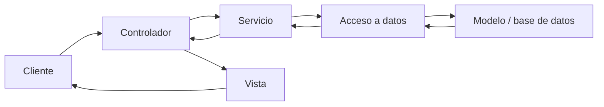

# Material Central
![[99_Adjuntos/Programación Avanzada Notas 1.pdf]] 
# Definiciones básicas y técnicas de programación

## Pregunta central

¿Cómo se expresa un algoritmo en un lenguaje de programación y qué técnicas permiten convertirlo en un programa comprensible, verificable y mantenible?

## De algoritmo a programa

Un [[03_Conceptos/Algoritmo|algoritmo]] es un método de solución formado por una cantidad finita de pasos definidos. Puede recibir datos, produce al menos un resultado y su ejecución debe terminar en tiempo finito.

Un [[03_Conceptos/Lenguaje de programación|lenguaje de programación]] permite expresar ese método de manera que una computadora pueda ejecutarlo. El texto escrito por la persona programadora es el **código fuente**; cuando respeta la sintaxis del lenguaje constituye un programa sintácticamente válido.

La relación puede resumirse con la idea de Niklaus Wirth:

> Algoritmos + estructuras de datos = programas.

Esta fórmula recuerda que solucionar un problema no consiste únicamente en describir pasos: también hay que decidir cómo representar y organizar la información sobre la que operan.

## Gramáticas y lenguajes formales

Una [[03_Conceptos/Gramática formal|gramática formal]] describe cómo construir las cadenas válidas de un lenguaje. Para evitar ambigüedad con la notación de las diapositivas, puede escribirse como

$$
G=(V,T,S,P),
$$

donde:

- $V$ es un vocabulario finito;
- $T\subseteq V$ es el conjunto de símbolos terminales;
- $N=V\setminus T$ es el conjunto de no terminales;
- $S\in N$ es el símbolo inicial;
- $P$ es el conjunto finito de reglas de producción.

El lenguaje generado por $G$ es

$$
L(G)=\{w\in T^*\mid S\Rightarrow^* w\}.
$$

Es decir, contiene las cadenas formadas solo por terminales que pueden derivarse desde el símbolo inicial aplicando las reglas.

### Jerarquía de Chomsky

La [[03_Conceptos/Jerarquía de Chomsky|jerarquía de Chomsky]] clasifica las gramáticas según las restricciones impuestas a sus producciones:

| Tipo | Nombre | Forma general |
|---:|---|---|
| 0 | Irrestricta | Sin una restricción estructural específica |
| 1 | Sensible al contexto | Las producciones no reducen la longitud de la cadena, salvo casos controlados |
| 2 | Libre de contexto | Un único no terminal aparece a la izquierda |
| 3 | Regular | Producciones lineales, por ejemplo $A\to aB$ o $A\to a$ |

La sintaxis principal de muchos lenguajes de programación se describe mediante gramáticas libres de contexto. Sin embargo, algunas restricciones —como comprobar que una variable fue declarada o que los tipos son compatibles— requieren análisis adicional y no quedan resueltas únicamente por la gramática.

## Clasificación de los lenguajes de programación

Un lenguaje puede clasificarse desde varios ejes; estas categorías no son mutuamente excluyentes.

### Por nivel de abstracción

- **Bajo nivel:** lenguaje de máquina y ensamblador; mantiene una relación cercana con la arquitectura del equipo.
- **Alto nivel:** oculta detalles de la máquina y permite expresar soluciones con construcciones más cercanas al problema.

### Por paradigma

Un [[03_Conceptos/Paradigma de programación|paradigma de programación]] propone una manera de organizar el cómputo:

- Los [[03_Conceptos/Lenguajes imperativos|lenguajes imperativos]] describen **cómo** transformar el estado mediante instrucciones. En las diapositivas aparecen Fortran, COBOL, C, BASIC, Java, Pascal y C++.
- Los [[03_Conceptos/Lenguajes declarativos|lenguajes declarativos]] expresan principalmente **qué** resultado o relación se busca. Incluyen lenguajes funcionales como Lisp, Haskell, Miranda, Scheme y ML, y lenguajes lógicos como Prolog.
- También se mencionaron programación orientada a objetos, concurrente, paralela y visual.

### Por manera de ejecutarse

- En los [[03_Conceptos/Lenguajes compilados|lenguajes compilados]], una traducción previa produce código ejecutable o una representación intermedia.
- En los [[03_Conceptos/Lenguajes interpretados|lenguajes interpretados]], otro programa analiza y ejecuta el código durante la ejecución.

La separación no es absoluta: un mismo lenguaje puede combinar compilación, interpretación y compilación justo a tiempo según su implementación.

## Técnicas clásicas de programación

Las técnicas de programación son métodos para diseñar algoritmos eficientes y expresarlos de forma comprensible en un lenguaje.

### Programación estructurada

La [[03_Conceptos/Programación estructurada|programación estructurada]] organiza el flujo de control con estructuras claras. El [[03_Conceptos/Teorema de Böhm-Jacopini|teorema de Böhm-Jacopini]] establece, bajo su modelo, que cualquier algoritmo puede expresarse combinando:

1. **Secuencia:** ejecutar una instrucción después de otra.
2. **Selección:** elegir una rama según una condición.
3. **Iteración:** repetir instrucciones mientras se cumpla una condición.

El resultado no afirma que todos los programas construidos así sean automáticamente fáciles de entender; la organización, los nombres y la división de responsabilidades siguen siendo importantes.

### Diseño descendente y programación modular

El diseño descendente divide un problema grande en subproblemas cada vez más concretos. La [[03_Conceptos/Programación modular|programación modular]] agrupa instrucciones bajo un nombre para realizar una tarea específica.

Un módulo útil:

- tiene una responsabilidad identificable;
- puede probarse de manera independiente;
- se comunica mediante parámetros o interfaces;
- puede devolver un valor o modificar resultados explícitamente acordados.

### Cohesión y acoplamiento

La [[03_Conceptos/Cohesión|cohesión]] mide qué tan relacionadas están las responsabilidades internas de un módulo. Una cohesión alta facilita nombrarlo, comprenderlo, probarlo y reutilizarlo.

El [[03_Conceptos/Acoplamiento|acoplamiento]] mide cuánto depende un módulo de otros. Un acoplamiento bajo permite cambiar una parte sin producir efectos innecesarios en las demás.

> [!important]
> Alta cohesión no implica necesariamente alto acoplamiento. El objetivo de diseño presentado es combinar **alta cohesión y bajo acoplamiento**, aunque separar responsabilidades puede requerir interfaces y comunicación entre componentes.

## Técnicas modernas y arquitectura

Las diapositivas sitúan las técnicas clásicas dentro de sistemas cada vez más grandes y mencionan abstracción, programación orientada a objetos, programación orientada a aspectos y [[03_Conceptos/Arquitectura de software|arquitectura de software]].

La arquitectura describe los elementos fundamentales de un sistema, sus relaciones y los principios que guían su diseño y evolución. Sobre esa estructura pueden aplicarse [[03_Conceptos/Patrón de diseño|patrones de diseño]], soluciones reutilizables para problemas recurrentes.

Se mencionaron las siguientes familias:

- patrones de creación;
- patrones estructurales;
- patrones de comportamiento;
- patrones de sistema o arquitectura;
- patrones de concurrencia.

Entre los patrones de creación aparecen Abstract Factory, Builder, Factory Method, Prototype y Singleton. Entre los patrones de sistema se mencionan MVC, Session, Worker Thread, Callback, Successive Update, Router y Transaction.

## Ejemplo: arquitectura MVC para una aplicación web

En [[03_Conceptos/Arquitectura MVC (Model-View-Controller)|Modelo–Vista–Controlador]] se separan tres responsabilidades:

- **Controlador:** recibe la solicitud y coordina las acciones.
- **Modelo:** representa los datos y la lógica del dominio.
- **Vista:** presenta el resultado al usuario.

El ejemplo de las diapositivas utiliza un controlador basado en servlets, un modelo con JavaBeans o EJB y una vista con JSP y bibliotecas de etiquetas. Una versión empresarial añade capas de servicio, transferencia de datos y acceso a datos antes de llegar a la base de datos.

La separación busca que la presentación pueda cambiar sin mezclar sus detalles con las reglas del dominio o el almacenamiento.

## Conceptos atómicos creados como semillas

- [[03_Conceptos/Lenguaje de programación|Lenguaje de programación]]
- [[03_Conceptos/Gramática formal|Gramática formal]]
- [[03_Conceptos/Jerarquía de Chomsky|Jerarquía de Chomsky]]
- [[03_Conceptos/Paradigma de programación|Paradigma de programación]]
- [[03_Conceptos/Lenguajes compilados|Lenguajes compilados]]
- [[03_Conceptos/Lenguajes interpretados|Lenguajes interpretados]]
- [[03_Conceptos/Lenguajes declarativos|Lenguajes declarativos]]
- [[03_Conceptos/Lenguajes imperativos|Lenguajes imperativos]]
- [[03_Conceptos/Programación estructurada|Programación estructurada]]
- [[03_Conceptos/Teorema de Böhm-Jacopini|Teorema de Böhm-Jacopini]]
- [[03_Conceptos/Programación modular|Programación modular]]
- [[03_Conceptos/Cohesión|Cohesión]]
- [[03_Conceptos/Acoplamiento|Acoplamiento]]
- [[03_Conceptos/Arquitectura de software|Arquitectura de software]]
- [[03_Conceptos/Patrón de diseño|Patrón de diseño]]
- [[03_Conceptos/Arquitectura MVC (Model-View-Controller)|Arquitectura MVC]]

## Referencias mencionadas

- [[01_Materias/Prog_Avanzada/Recursos/Programación Avanzada Notas 1.pdf|Programación Avanzada Notas 1]], diapositivas 1–21.
- ISO/IEC/IEEE 42010:2011, definición de arquitectura de sistemas.
- *Core J2EE Patterns*, referencia enlazada en la diapositiva 21.

## Resumen después de clase

Un programa combina un algoritmo con estructuras de datos y lo expresa mediante un lenguaje definido por reglas sintácticas. Los lenguajes pueden clasificarse por nivel, paradigma y forma de ejecución. La programación estructurada y modular busca controlar la complejidad mediante estructuras claras, responsabilidades bien definidas, alta cohesión y bajo acoplamiento. En sistemas grandes, la arquitectura y los patrones permiten organizar componentes reutilizables; MVC aplica esta idea al separar solicitudes, lógica y presentación en una aplicación web.
